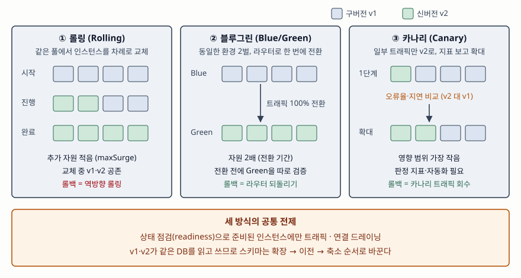

기출문제에서 소프트웨어 무중단 배포 방식을 묻는다. 방식 이름 세 개를 적는 것은
누구나 한다. 점수가 갈리는 곳은 **트래픽을 어떤 단위로 옮기는지, 그 동안 자원이
얼마나 더 드는지, 문제가 생기면 무엇을 되돌리는지**를 한 표로 대비하는 데와,
세 방식이 모두 **같은 데이터베이스를 구버전과 신버전이 함께 쓴다는 전제**를
깔고 있다는 점을 짚는 데다.

> 실행 검증 없음. Kubernetes 공식 문서(v1.37), Google SRE Workbook, AWS 블루/그린
> 배포 백서, Martin Fowler 사이트의 원 글을 근거로 정리했다.

---

## Ⅰ. 정의

**무중단 배포(Zero-Downtime Deployment)** 는 새 버전을 운영 환경에 올리는 동안
**사용자 요청을 받는 인스턴스가 항상 남아 있도록** 교체 순서와 트래픽 경로를
제어해, 서비스 중단 없이 버전을 바꾸는 배포 방식이다.

기존 방식은 구버전을 모두 내리고 신버전을 올리는 **재생성(Recreate)** 이다.
Kubernetes Deployment 명세도 `Recreate`를 "새 파드를 만들기 전에 기존 파드를 모두
종료한다"로 정의하므로, 그 사이 요청을 받을 인스턴스가 없다. AWS 블루/그린 백서는
이 방식의 롤백이 이전 버전을 처음부터 다시 배포하는 일이라 시간이 걸리고, 그동안
서비스가 멈출 수 있다고 지적한다. 무중단 배포는 **배포와 롤백을 트래픽 경로의
변경으로 바꿔** 이 시간을 없앤다.

## Ⅱ. 구성요소 — 방식 3가지와 공통 전제 3가지

> **출처**: [Kubernetes API Reference — Deployment v1 apps, DeploymentStrategy](https://kubernetes.io/docs/reference/kubernetes-api/workload-resources/deployment-v1/) · [Martin Fowler, BlueGreenDeployment (2010-03-01)](https://martinfowler.com/bliki/BlueGreenDeployment.html) · [Google SRE Workbook, Ch.16 Canarying Releases (2018)](https://sre.google/workbook/canarying-releases/)

### 방식 3가지

**① 롤링(Rolling Update)** — 같은 인스턴스 풀 안에서 구버전을 몇 개씩 내리고
신버전을 올리기를 반복한다. Kubernetes Deployment의 **기본 전략**이며 두 값으로
속도와 여유를 정한다.

| 파라미터 | 뜻 | 기본값 | 반올림 |
|---|---|---|---|
| `maxSurge` | 원하는 개수보다 **더 띄울 수 있는** 파드 수 | 25% | 올림 |
| `maxUnavailable` | 교체 중 **준비 안 된 상태로 둘 수 있는** 파드 수 | 25% | 내림 |

문서의 반올림 규칙대로 계산하면, 레플리카 10개일 때 `maxSurge`는 2.5를 올린 3,
`maxUnavailable`은 2.5를 내린 2가 되어 **교체 중 최대 13개, 최소 8개가 요청을
받는다.** 두 값을 동시에 0으로 둘 수 없다는 제약도 명세에 있다. 추가 자원이 적은
대신 교체 동안 **구버전과 신버전이 함께 요청을 받는다.**

**② 블루그린(Blue/Green)** — 동일한 운영 환경을 두 벌 두고, 현재 서비스 중인
Blue 옆에 신버전 Green을 띄워 검증한 뒤 **라우터를 돌려 트래픽을 한 번에 옮긴다.**
문제가 생기면 라우터를 Blue로 되돌린다(Fowler, 2010). AWS 백서는 이를 거의 무중단에
가까운 배포와 롤백 능력을 주는 방식으로 설명하며, 전환 기간에는 **자원이 두 벌**
필요하다.

**③ 카나리(Canary)** — 신버전을 운영 트래픽의 **일부에만** 노출하고, 나머지
트래픽을 받는 구버전(대조군)과 지표를 비교해 이상이 없으면 비율을 넓혀 간다.
SRE Workbook은 카나리를 운영 배포에 대한 A/B 시험처럼 다루고, 판정 지표로는 CPU
사용률 같은 간접 신호보다 **오류율·지연처럼 사용자 영향을 바로 나타내는 지표**를
열 개 안팎으로 고르라고 권한다. Kubernetes 튜토리얼은 공통 레이블을 가진 안정판
3개와 카나리 1개를 하나의 Service 뒤에 두어 트래픽을 대략 75 대 25로 나눈다.

| 구분 | 재생성 (비교용) | ① 롤링 | ② 블루그린 | ③ 카나리 |
|---|---|---|---|---|
| 전환 단위 | 전체 일괄 | 인스턴스 몇 개씩 | 환경 전체, 한 번에 | 트래픽 비율 단계별 |
| 서비스 중단 | 있음 | 없음 | 없음 | 없음 |
| 추가 자원 | 없음 | `maxSurge` 만큼 | 환경 1벌 (전환 기간) | 카나리 인스턴스 |
| v1·v2 동시 응답 | 없음 | 있음 (교체 중) | 전환 시점 외 없음 | 있음 (의도적) |
| 롤백 | 재배포 | 역방향 롤링 (느림) | 라우터 되돌리기 (빠름) | 카나리 트래픽 회수 |
| 장애 영향 범위 | 전체 | 교체된 비율만큼 | 전환 후 전체 | 카나리 비율만큼 |
| 맞는 곳 | 개발·점검 시간 확보 가능 | 상태 없는 일반 서비스 | 즉시 롤백이 중요한 서비스 | 대규모 트래픽, 지표 자동 판정 가능 |

AWS 백서가 적듯 블루그린도 Green에 소량의 운영 트래픽을 먼저 보내면 카나리처럼
쓸 수 있다. 세 방식은 배타적이지 않고 조합된다.

### 공통 전제 3가지

- **상태 점검과 연결 드레이닝** — 준비(readiness) 검사를 통과한 인스턴스에만
  트래픽을 보내고, 내릴 인스턴스는 처리 중인 요청을 끝낸 뒤 종료한다. 이것이 없으면
  어느 방식이든 교체 순간에 요청이 실패한다.
- **하위 호환되는 데이터 변경** — 구버전과 신버전이 같은 데이터베이스를 쓴다.
  Fowler는 스키마 변경을 애플리케이션 배포와 떼어, 먼저 두 버전을 모두 지원하는
  스키마로 바꾸고 애플리케이션을 올린 뒤 옛 구조를 지우라고 한다. 이를 일반화한 것이
  **확장(Expand) → 이전(Migrate) → 축소(Contract)** 3단계의 병행 변경(Sato, 2014)이다.
- **배포와 출시의 분리** — 기능 토글로 코드를 꺼진 상태로 배포해 두고 기능 노출은
  따로 켠다(Hodgson, 2017). 배포가 실패해도 기능 노출 범위는 그대로 둘 수 있다.

## Ⅲ. 활용과 고려사항 — 3가지

- **롤백할 수 없는 변경을 섞지 않는다.** 컬럼 삭제나 의미 변경이 신버전 배포와 같이
  나가면 라우터를 되돌려도 구버전이 데이터를 읽지 못한다. 블루그린의 빠른 롤백은
  **데이터가 양쪽 버전과 호환될 때만** 성립한다.
- **세션과 장기 연결을 처리한다.** 서버 메모리에 세션을 두거나 웹소켓처럼 오래 붙는
  연결이 있으면, 교체된 인스턴스에서 사용자가 끊긴다. 세션은 외부 저장소로 빼고,
  드레이닝 대기 시간을 연결 특성에 맞춰 잡는다.
- **판정을 자동화한다.** 카나리 비율을 사람이 보고 넓히면 판단이 늦고 기준이 흔들린다.
  SRE Workbook의 권고처럼 사용자 영향 지표로 대조군과 비교해 자동으로 확대·중단하게
  하고, 카나리 기간은 대표적인 트래픽 패턴을 담을 만큼 잡는다.

> 개념 정리: [DevOps 파이프라인 구성요소와 DORA 지표 — 지표마다 재는 구간](../../software-engineering/2026-10-03-devops-pipeline-dora-metrics/index.md)

> 개념 정리: [무중단 배포 전략 — 롤링·블루그린·카나리와 확장-축소 스키마 변경](../../software-engineering/2026-10-09-zero-downtime-deployment-expand-contract/index.md)

끝

## 답안 작성 메모

- **먼저 쓸 것**: 정의 한 줄과 "재생성과의 차이". 그 다음 비교표. 표의 행을
  **전환 단위·추가 자원·롤백 경로·영향 범위** 네 개만 남겨도 답안이 선다.
- **점수가 갈리는 지점**: 세 방식의 공통 전제 — 특히 **DB 스키마 하위 호환(확장-축소)**.
  블루그린을 "롤백이 즉시 된다"로만 쓰면, 데이터가 바뀐 경우 롤백이 안 된다는 점을
  놓친다. 롤링의 `maxSurge`·`maxUnavailable` 두 파라미터를 적으면 구체성이 붙는다.
- **빠지기 쉬운 함정**: 카나리와 A/B 테스트를 같은 것으로 쓰는 것. 카나리는 **신버전이
  안전한가**를 보고, A/B 테스트는 **어느 기능이 사업 지표에 나은가**를 본다.
  기능 토글을 배포 방식으로 분류하는 것도 틀린다 — 출시 제어 기법이다.
- **시간이 모자라면**: 공통 전제의 기능 토글을 버리고, 고려사항을 두 개로 줄인다.
  모식도는 세 칸(롤링·블루그린·카나리)과 아래 전제 띠만 그려도 된다.
- 개수를 붙인다 — 방식 3가지, 공통 전제 3가지, 고려사항 3가지.

## 참고 자료

- [Kubernetes Documentation — Deployments, Strategy (v1.37)](https://kubernetes.io/docs/concepts/workloads/controllers/deployment/#strategy)
- [Kubernetes API Reference — Deployment v1 apps](https://kubernetes.io/docs/reference/kubernetes-api/workload-resources/deployment-v1/) — `Recreate`·`RollingUpdate` 정의, `maxSurge`·`maxUnavailable` 기본값 25%와 반올림 규칙
- [Kubernetes Tutorial — Deploy a Release Using a Canary Deployment](https://kubernetes.io/docs/tutorials/stateless-application/canary-deployment/) — 안정판 3개·카나리 1개로 트래픽을 나누는 구성
- [Google SRE Workbook, Ch.16 Canarying Releases (O'Reilly, 2018)](https://sre.google/workbook/canarying-releases/) — 카나리 정의, 블루그린과의 관계, 판정 지표 선택
- [AWS Whitepaper, Blue/Green Deployments on AWS — Introduction](https://docs.aws.amazon.com/whitepapers/latest/blue-green-deployments/introduction.html) — 기존 재배포 롤백의 한계, 블루그린의 이점 (AWS가 보관용으로 표시한 문서)
- [Martin Fowler, BlueGreenDeployment (2010-03-01)](https://martinfowler.com/bliki/BlueGreenDeployment.html) — 라우터 전환, 스키마 변경을 배포와 분리
- [Danilo Sato, ParallelChange (2014-05-13)](https://martinfowler.com/bliki/ParallelChange.html) — 확장·이전·축소 3단계
- [Pete Hodgson, Feature Toggles (aka Feature Flags) (2017-10-09)](https://martinfowler.com/articles/feature-toggles.html) — 배포와 출시의 분리
