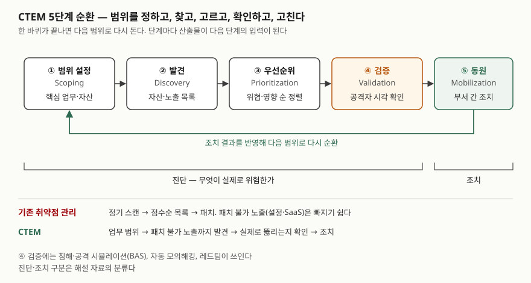

기출문제에서 CTEM(Continuous Threat Exposure Management)을 묻는다. "취약점을 계속
스캔한다"로 쓰면 기존 취약점 관리와 구분되지 않아 점수가 나지 않는다. 점수는 **5단계를
순서대로 쓰고**, 그중 **범위 설정(업무 기준)·검증(공격자 시각)·동원(부서 간 조치)** 이
기존 방식에 없던 단계라는 것을 짚는 데서 난다.

> 실행 검증 없음. 개념 문제이므로 문서 근거만으로 정리했다.
>
> **1차 자료 없음.** CTEM을 정의한 표준이나 공공기관 문서는 찾지 못했다. 용어를 만든
> Gartner의 리포트(Top Strategic Technology Trends for 2024: CTEM, 2023-10-16)를 기준으로 삼고,
> 그와 독립된 해설 3건(IBM Think, 2026-06-05 / HackerOne, 2026-07-02 / Infosecurity Europe,
> 2026-08-14)으로 5단계와 기존 취약점 관리와의 차이를 교차 확인했다. 해설 3건은 모두
> Gartner 틀을 설명하는 글이므로 **정의의 원천은 하나**다. (§10)

---

## Ⅰ. 정의

**CTEM**은 공격자가 실제로 이용할 수 있는 노출(exposure)을 **범위 설정 → 발견 → 우선순위
→ 검증 → 동원의 5단계로 반복 관리**해, 경영진이 이해하고 실무 조직이 실행할 수 있는 개선
계획을 만드는 **보안 프로그램**이다. 2022년 Gartner가 이름 붙였다.

Gartner는 CTEM을 도구가 아니라 **"사이버보안 최적화 우선순위를 지속적으로 다듬는 체계적
접근"** 으로 설명한다. 해설 자료들도 같은 점을 강조한다 — 제품 하나가 아니라 운영 틀이다.

**등장 배경 — 2가지**

- **전부 패치할 수 없다.** 큰 조직도 발견된 취약점을 다 고치지 못하고, 무엇을 먼저 고칠지
  정하는 데서 막힌다
- **패치로 해결되지 않는 노출이 늘었다.** SaaS 설정, IT 공급망 의존성, 운영기술(OT) 취약점,
  자산과 보안 통제의 잘못된 설정은 패치 대상 목록에 잡히지 않는다

## Ⅱ. 구성요소 — 5단계

> **출처**: Gartner, Top Strategic Technology Trends for 2024: Continuous Threat Exposure Management (G00796532, 2023-10-16) — What You Need to Know, Profile · [Gartner 보도자료, Top 10 Strategic Technology Trends for 2024 (2023-10-16)](https://www.gartner.com/en/newsroom/press-releases/2023-10-16-gartner-identifies-the-top-10-strategic-technology-trends-for-2024) · [IBM Think, What is CTEM (2026-06-05)](https://www.ibm.com/topics/ctem) · [HackerOne, The Complete Guide to CTEM (2026-07-02)](https://www.hackerone.com/blog/complete-guide-to-ctem) (2차 자료 기반)

| 단계 | 하는 일 | 산출물 |
|---|---|---|
| ① **범위 설정** (Scoping) | 보안 조직과 업무 부서가 지킬 업무·핵심 자산과 그 공격 표면을 정한다 | 이번 순환의 대상 범위 |
| ② **발견** (Discovery) | 범위 안의 자산과 노출을 찾는다. 취약점뿐 아니라 잘못된 설정, 보안 통제의 약점까지 포함한다 | 자산·노출 목록 |
| ③ **우선순위** (Prioritization) | 악용 가능성, 자산 중요도, 업무 영향, 위협 정보로 순서를 매긴다 | 정렬된 노출 목록 |
| ④ **검증** (Validation) | 공격자 시각에서 실제로 뚫리는지, 기존 방어와 대응 절차가 막는지 시험한다 | 확인된 공격 경로 |
| ⑤ **동원** (Mobilization) | 확인된 노출을 고칠 책임 조직과 절차를 정하고 실행시킨다 | 조치 계획과 결과 |

해설 자료는 ①~④를 **진단**("무엇이 실제로 위험한가"), ⑤를 **조치**로 나눠 설명한다.
Gartner는 ⑤ 동원을 **팀 간 협업으로 초점을 옮기는 단계**로 두고, 보안 운영 조직과
인프라·운영 조직이 우선순위와 투자를 맞추는 자리로 설명한다.

**기존 취약점 관리와의 차이 — 6가지**

| 구분 | 기존 취약점 관리 | CTEM |
|---|---|---|
| ① 주기 | 분기·연 단위 정기 점검 | 범위별로 반복하는 순환 |
| ② 범위 기준 | 관리 중인 IT 자산 전체 | 업무 우선순위와 위협 경로로 정한 범위 |
| ③ 대상 | 패치 가능한 소프트웨어 취약점 | 패치 불가 노출 포함(설정, SaaS, 공급망) |
| ④ 우선순위 | 취약점 점수 중심 | 악용 가능성 + 업무 영향 + 위협 정보 |
| ⑤ 검증 | 스캐너 결과를 그대로 신뢰 | 공격 시뮬레이션·모의해킹으로 실제 악용 여부 확인 |
| ⑥ 결과 | 발견 건수 목록 | 실행 가능한 조치 계획과 확인된 위험 감소 |

## Ⅲ. 활용과 고려사항

### 가. 활용 — 단계별 기술 3가지

Gartner가 CTEM 단계를 받치는 기술로 드는 것들이다.

- **공격 표면 관리(ASM)** — 외부에 드러난 자산을 찾아 ② 발견을 받친다
- **보안 형상 관리(Posture Management)** — 클라우드·애플리케이션의 설정 노출을 점검한다
- **사이버보안 검증** — 침해·공격 시뮬레이션(BAS), 자동 모의해킹으로 ④ 검증을 자동화한다

### 나. 고려사항 — 4가지

① **자산 목록을 하나로 맞춘다.** 발견 단계의 결과는 자산 목록의 정확도를 넘지 못한다.
IT 부서 밖에서 쓰는 SaaS, 클라우드 계정, OT 장비까지 구성관리 DB(CMDB)와 연계해 한
목록으로 모아야 범위 설정과 발견이 같은 자산을 가리킨다.

② **흩어진 노출 데이터를 연결한다.** 취약점 스캐너, 클라우드 설정 점검, 외부 공격 표면
결과가 도구마다 따로 쌓이면 우선순위를 한 기준으로 매길 수 없다. Gartner도 CTEM을 이루는
활동이 이미 각각 존재하지만 **분리된 채 결과가 통합되지 않는 것**을 문제로 든다. 공통
자산 식별자로 결과를 묶는 데이터 통합이 먼저다.

③ **검증이 운영 서비스를 건드리지 않게 한다.** 공격 시뮬레이션은 실제 시스템을 대상으로
한다. 시험 범위·시간대·중단 기준을 사전에 정하고, 결과를 변경 관리 기록과 남긴다.

④ **동원 단계를 업무 흐름에 연결한다.** 확인된 노출이 보안 조직의 보고서로 끝나면 고쳐지지
않는다. IT 서비스 관리(ITSM) 티켓, 개발 조직의 작업 목록으로 넘기고, 조치 완료 여부를 다음
순환의 발견 단계에서 다시 확인한다.

**도입 방식.** Gartner는 처음부터 전사 범위로 시작하지 말고 **한 공격 표면이나 새 애플리케이션
한 건**으로 순환을 시작하라고 권한다. 기존 점검에 검증 단계를 덧붙이는 것이 흔한 출발점이다.

끝

## 답안 작성 메모

- **먼저 쓸 것**: Ⅰ의 정의 한 문장과 5단계 이름(영문 병기). 다섯 단계 이름만 정확해도
  기본 점수가 나온다. 이어서 기존 취약점 관리와의 비교표. 표 머리에 "6가지"를 붙인다.
- **점수가 갈리는 지점**: ① **패치 불가 노출**까지 다룬다는 것, ② **검증 단계**가 스캐너
  결과를 공격자 시각으로 다시 확인한다는 것, ③ **동원**이 단순 패치 지시가 아니라 부서 간 조치
  체계라는 것. 고려사항을 자산 목록·데이터 통합·ITSM 연계처럼 **정보시스템 쪽 요구**로
  내리면 정보관리기술사 답안이 된다.
- **시간이 모자라면**: 활용 기술 3가지를 한 줄로 줄이고, 등장 배경은 정의 문단 안에 한 문장으로 녹인다.
  모식도는 5단계 상자와 되돌아가는 화살표만 그린다.
- **쓰지 않은 것**: Gartner 리포트의 "2026년까지 침해가 3분의 2 감소한다"는 전망과 설문 비율은
  애널리스트 예측이라 §10의 수치 기준(원 출처가 1차일 때만)에 맞지 않아 쓰지 않았다.
- 1차 자료가 생기면(표준화 기구나 공공기관의 정의) 정의 문장을 그것으로 바꾼다.

## 참고 자료

- Gartner, Top Strategic Technology Trends for 2024: Continuous Threat Exposure Management (G00796532, Jeremy D'Hoinne·Pete Shoard, 2023-10-16) — 정의(Profile), 5단계, 패치 가능·불가 노출, 단계별 기술, 도입 방식. Gartner 유료 리포트라 링크를 달지 않는다 (2차 등급: 애널리스트 리포트)
- [Gartner 보도자료, Gartner Identifies the Top 10 Strategic Technology Trends for 2024 (2023-10-16)](https://www.gartner.com/en/newsroom/press-releases/2023-10-16-gartner-identifies-the-top-10-strategic-technology-trends-for-2024) — CTEM을 2024 전략 기술 동향으로 소개, 범위를 인프라 구성요소가 아니라 위협 경로·업무 과제에 맞추라는 설명
- [IBM Think, What is continuous threat exposure management (CTEM)? (Derek Robertson·Matthew Kosinski, 2026-06-05)](https://www.ibm.com/topics/ctem) — 5단계, 취약점 관리와의 차이, 단계별 도구
- [HackerOne, The Complete Guide to Continuous Threat Exposure Management (CTEM) (2026-07-02)](https://www.hackerone.com/blog/complete-guide-to-ctem) — 2022년 Gartner 명명, 5단계, 진단·조치 구분, 취약점 관리와의 차이
- [Infosecurity Europe, Understanding Continuous Threat Exposure Management (Kevin Poireault, 2026-08-14)](https://www.infosecurityeurope.com/en-gb/blog/guides-checklists/understanding-ctem-gartner-framework.html) — 운영 틀로서의 CTEM, 정기 스캔과의 차이
