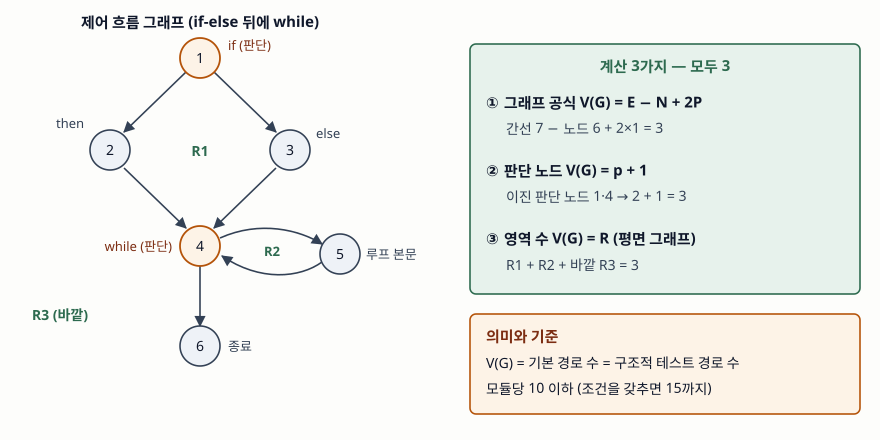

기출문제에서 맥케이브 순환복잡도를 묻는다. 공식 `E − N + 2`만 쓰면 반쪽 답안이다.
이 지표가 소프트웨어 공학에서 오래 쓰이는 이유는 **복잡도 숫자가 곧 테스트해야
할 독립 경로의 수**라는 데 있다. 그래서 답안의 축은 정의와 계산법에 더해 **그 숫자가
테스트 설계와 품질 관리에 무엇을 요구하는가**에 둔다.

> 계산법 3가지가 같은 값을 내는지, 기본 경로 수가 그 값과 같은지 파이썬으로 직접
> 검산했다. 계산 기록은 [code/output.txt](code/output.txt)에 있다. (§7)

---

## Ⅰ. 정의

**순환복잡도(Cyclomatic Complexity, V(G))** 는 모듈의 제어 흐름 그래프에서
**선형 독립인 경로의 수**를 세어 판단 논리의 양을 나타내는 정량 지표다.
T. J. McCabe가 1976년에 제안했고, NIST 문서는 이를 간선 수 e와 노드 수 n으로
`V(G) = e − n + 2`로 정의한다.

이름은 그래프 이론의 순환수(cyclomatic number) `e − n + 1`에서 왔다. 프로그램 그래프는
종료 노드에서 진입 노드로 돌아가는 가상 간선 하나를 더하면 강하게 연결된 그래프가
되므로, 그 간선의 몫으로 1을 더한 것이 `e − n + 2`다. 연결 요소(모듈)가 P개면
`E − N + 2P`로 쓴다.

## Ⅱ. 구성요소 — 계산법 3가지

> **출처**: [A. H. Watson, T. J. McCabe, NIST SP 500-235 Structured Testing §2.2 Definition of cyclomatic complexity, §4.1 Counting predicates, §4.2 Counting flow graph regions (1996)](https://www.mccabe.com/pdf/mccabe-nist235r.pdf)

| 계산법 | 식 | 쓰는 때 | 주의 |
|---|---|---|---|
| ① 그래프 공식 | `V(G) = E − N + 2P` | 도구가 그래프를 만들 때 | 손으로 세면 틀리기 쉽다 |
| ② 판단 노드 | `V(G) = p + 1` | 소스 코드를 보며 셀 때 | 이진 판단만 센다, 단락 평가 `&&`·`||`도 하나씩 |
| ③ 영역 수 | `V(G) = R` | 그래프를 그렸을 때 | 간선이 교차하지 않는 평면 그래프일 때만, 바깥 영역 포함 |

③은 평면 그래프에 대한 오일러 공식 `n − e + R = 2`를 정리한 것이므로 ①과 같은 식이다.
소스에서 셀 때는 `if`·`while`·`for`가 1씩, 단락 평가 논리 연산자가 1씩, `switch`는
`case` 레이블이 붙은 문장 수만큼 더한다.

### 검산 — 판단 4개와 `and` 1개가 있는 함수

`if` 2개·`for` 1개·`while` 1개와 `if` 조건 안의 `and` 하나를 가진 함수로 세 방법을
돌렸다. `and`는 단락 평가라 조건 노드를 둘로 나눴다.

| 방법 | 계산 | V(G) |
|---|---|---|
| ① 그래프 공식 | E = 16, N = 12, P = 1 | 6 |
| ② 판단 노드 | 출구가 2개인 노드 `[1, 4, 5, 6, 9]`, p = 5 | 6 |
| ③ 소스 구문 (ast) | `['If', 'For', 'While', 'If', 'and']` | 6 |

`and`를 세지 않으면 5가 나온다. NIST 문서도 단락 평가 연산자는 실행 여부가
갈리는 분기를 만들므로 복잡도에 1을 더한다고 정한다. 도구마다 `and`·`or`·`case`를
세는 방식이 달라 **같은 코드라도 도구에 따라 값이 다를 수 있다.**

## Ⅲ. 활용과 고려사항 — 활용 3가지, 고려사항 3가지

**활용 3가지**

- **구조적 테스트(기본 경로 테스트)의 경로 수** — V(G)는 기본 경로 집합의 크기다.
  검산에서 루프를 최대 1회 도는 진입-종료 경로 10개의 간선 벡터 랭크가 6으로,
  V(G)와 같았다. 그중 독립인 6개(B1~B6)가 테스트 경로가 된다.
- **모듈 복잡도 상한** — NIST 문서는 McCabe가 처음 제안한 **10**을 기본 상한으로 두고,
  숙련된 인력·정형 설계·코드 워크스루·포괄적 테스트 계획을 갖춘 조직에 한해
  **15**까지 성공 사례가 있다고 적는다. 정적 분석 도구의 품질 게이트로 쓴다.
- **유지보수·리팩터링 대상 선정** — 복잡도가 높은 모듈일수록 오류가 많고 이해·수정이
  어렵다. 상한을 넘는 모듈을 분해 대상으로 뽑는다.

**고려사항 3가지**

- **V(G)는 전체 경로 수가 아니다.** `if` 문을 이어 붙이면 V(G)는 k + 1로 늘지만
  전체 경로 수는 2^k로 는다. 검산에서 k = 20일 때 V(G)는 21, 전체 경로는
  1,048,576개였다. V(G)는 모든 경로가 아니라 **판단 결과를 각각 독립적으로 시험하는
  최소한**을 말한다.
- **구조의 질은 재지 못한다.** 같은 V(G)라도 구조화되지 않은 분기(루프 중간 탈출 등)가
  섞이면 이해하기 어렵다. 이것은 구조적 프로그래밍 기본 구조를 걷어 낸 뒤의 복잡도인
  **본질 복잡도 ev(G)** 로 따로 잰다. `1 ≤ ev(G) ≤ v(G)`다.
- **`switch` 예외를 지표 조작에 쓰지 않는다.** McCabe는 단일 다중 분기만으로 이뤄진
  모듈을 상한에서 면제하자고 했지만, 이를 계산에서 아예 빼거나 분기 수로 나누면
  복잡한 모듈이 상한 아래로 숨는다. NIST 문서는 복잡도 90짜리 모듈이 빈 10갈래
  분기 하나로 10이 되는 예를 든다.

> 개념 정리: [기본 경로 테스트 — 순환복잡도로 테스트 경로를 고르는 절차](../../software-engineering/2026-10-10-basis-path-testing-baseline-method/index.md)

끝

## 답안 작성 메모

- **먼저 쓸 것**: "선형 독립 경로의 수"라는 정의와 `E − N + 2P`. 그 다음 모식도 —
  노드 6개짜리 if-else + while 그래프 하나에 계산 3가지를 다 적으면 1분이면 그린다.
- **점수가 갈리는 지점**: V(G)가 **기본 경로 테스트의 경로 수**라는 연결, 그리고 상한
  10. 이 둘이 없으면 공식만 외운 답안이 된다. `&&`·`||`를 판단으로 센다는 한 줄이
  계산 문제가 섞여 나올 때 차이를 만든다.
- **빠지기 쉬운 함정**: `E − N + 2`에서 P를 빼먹고 여러 모듈 그래프에 그대로 쓰는 것,
  영역 수를 셀 때 바깥 영역을 빼는 것, V(G)를 "전체 경로 수"로 쓰는 것.
- **시간이 모자라면**: 본질 복잡도와 `switch` 예외를 버린다. 정의 → 계산법 표 →
  활용(테스트 경로 수, 상한 10) 순서를 지킨다.
- 개수를 붙인다 — 계산법 3가지, 활용 3가지, 고려사항 3가지.

## 참고 자료

- [A. H. Watson, T. J. McCabe, NIST Special Publication 500-235, Structured Testing: A Testing Methodology Using the Cyclomatic Complexity Metric (1996)](https://www.mccabe.com/pdf/mccabe-nist235r.pdf) — §2.2 순환복잡도 정의, §2.3 기본 경로 집합, §2.5 상한 10, §4.1 판단 노드 세기(소스 코드에서 세기·단락 평가·다중 분기 포함), §4.2 영역 세기, §10.2 본질 복잡도
- [T. J. McCabe, A Complexity Measure, IEEE Transactions on Software Engineering SE-2(4), pp. 308–320 (1976)](https://doi.org/10.1109/TSE.1976.233837) — 원 논문
