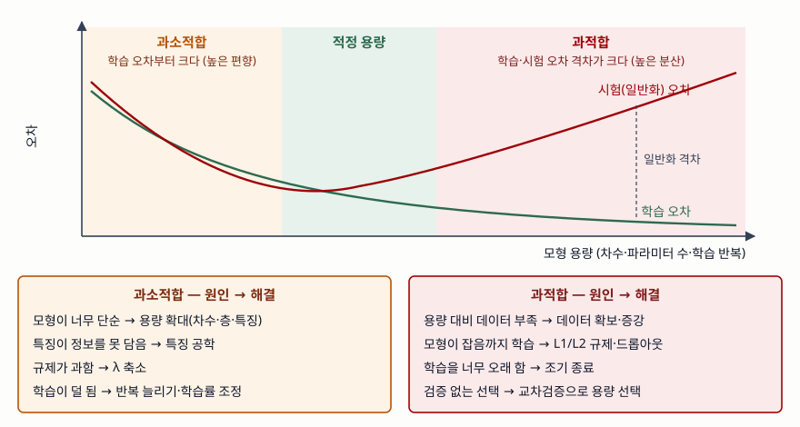

기출문제에서 과적합과 과소적합의 발생 원인과 해결 방안을 묻는다. 두 용어는 흔히
"너무 외웠다 / 덜 배웠다"로 설명되지만, 답안에서 점수를 받는 축은 **모형 용량과
데이터 양의 균형**, 그리고 그것을 **학습 오차와 시험 오차 두 숫자로 진단하는 법**이다.
원인을 그 두 숫자에 대응시키면 해결 방안이 자연히 짝지어진다.

> 답안의 원인과 해결 방안을 다항 회귀로 직접 검산했다. 계산 기록은
> [code/output.txt](code/output.txt)에 있다. (§7)

---

## Ⅰ. 정의

Goodfellow 등의 교재는 학습 알고리즘의 성능을 **두 가지**로 판정한다. ① 학습 오차를
작게 만드는가, ② 학습 오차와 시험 오차의 격차를 작게 만드는가. 이 기준에서

- **과소적합(Underfitting)** 은 ①에 실패한 상태다. 모형이 **학습 데이터에서조차**
  충분히 낮은 오차를 얻지 못한다.
- **과적합(Overfitting)** 은 ②에 실패한 상태다. 학습 오차는 낮지만 **처음 보는
  데이터에서의 오차(일반화 오차)와 격차가 크다.** 모형이 신호뿐 아니라 학습
  표본의 잡음까지 맞춘 결과다.

둘을 가르는 변수는 **모형 용량(capacity)**, 곧 모형이 맞출 수 있는 함수의 폭이다.
용량이 과제와 데이터 양에 비해 작으면 과소적합, 크면 과적합으로 간다. 통계학의
말로는 과소적합이 **높은 편향**, 과적합이 **높은 분산**에 해당한다.

## Ⅱ. 발생 원인 — 과소적합 4가지, 과적합 4가지

> **출처**: [I. Goodfellow, Y. Bengio, A. Courville, Deep Learning §5.2 Capacity, Overfitting and Underfitting (MIT Press, 2016)](https://www.deeplearningbook.org/contents/ml.html)

| 구분 | 과소적합 | 과적합 |
|---|---|---|
| 증상 | 학습 오차·시험 오차 모두 큼 | 학습 오차 작음, 시험 오차 큼 |
| 오차 성분 | 편향 큼 | 분산 큼 |
| 원인 ① | 모형이 너무 단순 (용량 부족) | 데이터 양에 비해 용량 과다 |
| 원인 ② | 특징이 목표를 설명할 정보를 못 담음 | 학습 데이터가 모집단을 대표하지 못함 |
| 원인 ③ | 규제가 지나치게 강함 | 학습을 지나치게 오래 함 |
| 원인 ④ | 학습이 수렴 전에 멈춤 | 잡음·이상치까지 맞춤 |

Google 머신러닝 교육 과정도 과적합의 주원인으로 **대표성 없는 학습 데이터**와
**지나치게 복잡한 모형** 두 가지를 들고, 일반화의 전제로 독립·동일분포, 시간에
따른 정상성, 학습·검증·시험 분할 간 분포 일치를 든다.

### 검산 — 참 함수 sin(πx)에 잡음 σ = 0.2, 학습 표본 20개

잡음 분산 0.04가 어떤 모형으로도 줄일 수 없는 시험 오차의 하한이다.

| 차수 | 학습 MSE | 시험 MSE | 격차 | 상태 |
|---|---|---|---|---|
| 1 | 0.1921 | 0.2366 | 0.0445 | 과소적합 — 학습 오차부터 큼 |
| 3 | 0.0229 | 0.0453 | 0.0224 | 적정 — 시험 오차가 하한 근처 |
| 15 | 0.0046 | 1.5435 | 1.5389 | 과적합 — 격차가 폭증 |
| 19 | 0.0000 | 603947.1638 | 603947.1638 | 표본 20개를 그대로 통과 |

학습 오차는 차수와 함께 **단조 감소**하는데 시험 오차는 **U자**를 그린다. 학습
오차만 보고 모형을 고르면 차수 19가 뽑힌다는 것이 이 표의 요점이다. 같은 조건에서
학습 표본만 새로 뽑아 다섯 번 맞추면 차수 3의 시험 MSE는 0.0439~0.0501에 머물지만
차수 15는 5.5781~96.8874로 흩어진다. **과적합이 곧 높은 분산**이라는 말이 이 흩어짐이다.

## Ⅲ. 해결 방안 — 과적합 5가지, 과소적합 3가지

**과적합 해결 5가지**

| 방안 | 작용 | 검산 결과 (차수 15) |
|---|---|---|
| ① 데이터 확보·증강 | 같은 용량에서 잡음의 비중을 낮춤 | 표본 20 → 40개에서 시험 MSE 1.5435 → 0.0575 |
| ② L1/L2 규제 | 손실에 가중치 크기 벌점을 더해 용량을 줄임 | λ = 0.1에서 0.0543, 계수 크기 4.52 → 1.44 |
| ③ 조기 종료 | 검증 오차가 오르기 시작하면 학습 중단 | — |
| ④ 드롭아웃·앙상블 | 여러 모형의 평균으로 분산을 낮춤 | — |
| ⑤ 교차검증으로 용량 선택 | 시험 표본 없이 적정 차수를 고름 | 5-겹 CV가 차수 6 선택, 시험 MSE 0.0476 |

L2 규제는 양쪽으로 넘칠 수 있다. λ를 100까지 올리면 학습 MSE가 0.4215로 올라가
**과소적합으로 넘어간다.** 규제 강도 자체가 교차검증으로 골라야 하는 하이퍼파라미터다.

**과소적합 해결 3가지** — ① 용량 확대(차수·층·파라미터 수), ② 특징 공학으로 목표를
설명할 정보 추가, ③ 규제 완화와 학습 반복 증가. 검산에서 차수를 1에서 3으로
올리자 학습 MSE가 0.1921에서 0.0229로 떨어졌다.

**고려사항 3가지**

- **시험 데이터는 마지막에 한 번만 본다.** 시험 오차를 보며 하이퍼파라미터를 고치면
  시험 세트에 과적합한다. 선택은 검증 세트나 교차검증으로 한다.
- **데이터 누수를 먼저 의심한다.** 시험 성능이 비정상적으로 좋으면 미래 정보나 같은
  개체가 학습·시험에 섞였을 수 있다. 정상성이 깨지는 시계열은 시간 순으로 나눈다.
- **배포 후 분포 변화를 감시한다.** 학습 시점에 적정했던 모형도 입력 분포가 바뀌면
  일반화 오차가 커진다. 운영 지표로 예측 오차를 계속 추적한다.

> 개념 정리: [데이터 누수 — 학습·평가 분할에서 묶음·시간 단위를 지키는 이유](../../data-analysis/2026-10-06-data-leakage-group-time-split/index.md)

끝

## 답안 작성 메모

- **먼저 쓸 것**: 성능을 판정하는 두 기준(학습 오차, 일반화 격차)과 그 위에 올린 두 정의.
  모식도의 U자 곡선 하나로 정의·원인·진단이 한꺼번에 설명된다.
- **점수가 갈리는 지점**: 원인과 해결을 **짝지어** 쓰는가. "규제, 드롭아웃, 데이터 증강"을
  나열만 하면 어느 원인을 푸는지가 안 보인다. 과적합 해결책이 과하면 과소적합이
  된다는 양방향성(λ)을 한 줄 쓰면 차별화된다.
- **빠지기 쉬운 함정**: 과소적합 해결책을 빼먹는 것. 문제는 두 현상을 다 물었다.
  그리고 "학습 오차가 0이면 좋은 모형"으로 읽힐 문장을 쓰지 않는다 — 차수 19가 반례다.
- **시간이 모자라면**: 고려사항을 2개로 줄이고 비교표를 증상·원인 두 줄만 남긴다.
  모식도는 U자 곡선과 세 구간 이름만 그려도 된다.
- 개수를 붙인다 — 판정 기준 2가지, 원인 4+4가지, 해결 5+3가지, 고려사항 3가지.

## 참고 자료

- [I. Goodfellow, Y. Bengio, A. Courville, Deep Learning (MIT Press, 2016)](https://www.deeplearningbook.org/) — §5.2 Capacity, Overfitting and Underfitting, §5.3 Hyperparameters and Validation Sets, §7 Regularization for Deep Learning
- [Google for Developers, Machine Learning Crash Course — Overfitting](https://developers.google.com/machine-learning/crash-course/overfitting/overfitting) — 과적합의 원인 2가지와 일반화의 전제 3가지, 일반화 곡선
- [Google for Developers, Machine Learning Crash Course — Overfitting: L2 regularization](https://developers.google.com/machine-learning/crash-course/overfitting/regularization) — 규제율 λ의 양방향 효과, 조기 종료
