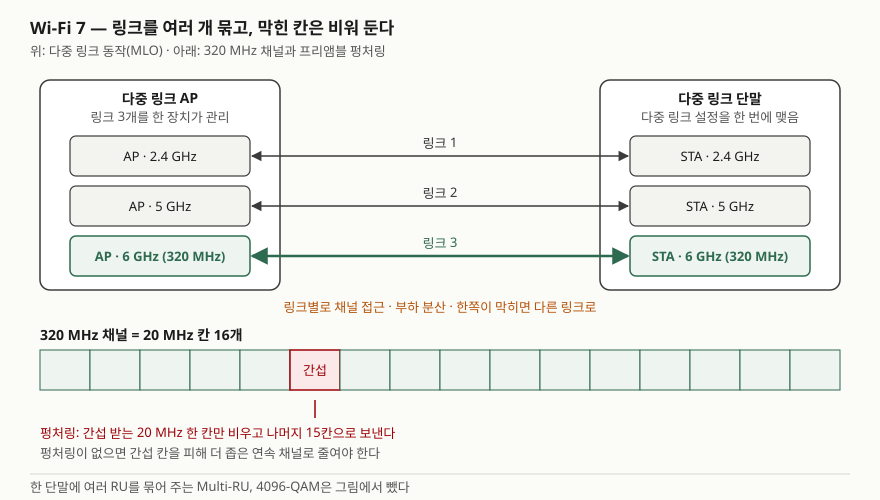

기출문제에서 Wi-Fi 7을 묻는다. "Wi-Fi 6보다 빠른 차세대 무선랜"이라고만 쓰면 점수가
나지 않는다. 점수는 **표준 이름(IEEE 802.11be, EHT)과 인증 이름(Wi-Fi CERTIFIED 7)을
구분하고**, 빨라진 이유를 **기술 항목 개수로** 보이고, 그중 **다중 링크 동작(MLO)이 지연과
신뢰성까지 겨냥한 변화**라는 점을 짚는 데서 난다.

> 실행 검증 없음. 개념 문제이므로 IEEE 802.11be-2024 표준 정보, Wi-Fi Alliance 인증 프로그램
> 문서, EHT 기술 서베이 논문(Deng et al.)을 근거로 정리했다.

---

## Ⅰ. 정의

**Wi-Fi 7**은 IEEE가 2024년 9월 승인한 무선랜 개정 표준 **IEEE 802.11be-2024
(Extremely High Throughput, EHT)** 와, Wi-Fi Alliance가 2024년 1월 시작한 상호운용성 인증
**Wi-Fi CERTIFIED 7**을 함께 부르는 이름이다.

IEEE 802.11be의 범위는 두 가지 목표로 적혀 있다.

- 1~7.250 GHz 대역에서 **최대 처리량 30 Gbit/s 이상**을 내는 동작 모드를 최소 하나 둔다
- **최악 지연(worst-case latency)과 지터를 개선**한 동작 모드를 최소 하나 둔다

2.4·5·6 GHz 대역의 기존 802.11 장치와 하위 호환과 공존을 유지하는 것도 범위에 들어 있다.
처리량만이 아니라 **지연의 상한**을 표준 목표로 올린 것이 이전 세대와 다른 점이다.

## Ⅱ. 핵심 기술 — 6가지

> **출처**: [Wi-Fi Alliance, Wi-Fi CERTIFIED 7 — Key features (2024)](https://www.wi-fi.org/discover-wi-fi/wi-fi-certified-7) · [Deng et al., IEEE 802.11be – Wi-Fi 7: New Challenges and Opportunities §II-A 대역폭 모드, §II-B Multi-RU, §II-C 프리앰블 설계·펑처링, §III 다중 링크 동작 (arXiv:2007.13401v3, 2020)](https://arxiv.org/abs/2007.13401)

| 구분 | 기술 | 무엇이 달라지나 |
|---|---|---|
| PHY | ① **320 MHz 채널** | 6 GHz 대역에서 320 MHz 채널을 쓴다. Wi-Fi Alliance는 Wi-Fi 6 대비 처리량 2배로 설명한다 |
| PHY | ② **4096-QAM (4K-QAM)** | 심볼당 12비트를 싣는다. 1024-QAM(10비트)보다 전송률이 20% 높다 |
| PHY | ③ **Multi-RU** | 한 단말에 자원 단위(RU) 여러 개를 묶어 할당한다. 비어 있는 RU 조각을 버리지 않는다 |
| PHY | ④ **프리앰블 펑처링** | 넓은 채널 안의 간섭 받는 20 MHz 칸만 비우고 나머지로 전송한다 |
| MAC | ⑤ **다중 링크 동작(MLO)** | 2.4·5·6 GHz의 링크 여러 개를 한 연결로 묶어 동시에 또는 골라 쓴다 |
| MAC | ⑥ **512 압축 블록 ACK** | 한 번의 블록 확인 응답이 덮는 프레임 수를 늘려 확인 응답 오버헤드를 줄인다 |

①②③⑤⑥은 Wi-Fi CERTIFIED 7 문서가 드는 기능이고, ④는 EHT 서베이 논문이 PHY 개선 항목으로
드는 것이다. 802.11ax의 프리앰블 펑처링은 다중 사용자 프레임에만 쓸 수 있었고, 단일 사용자
프레임은 연속된 채널 폭 전체를 써야 했다. EHT는 이 제약을 푸는 방향으로 논의됐다.

**MLO가 핵심인 이유.** ①②는 링크 하나의 속도를 올리는 것이고, ⑤는 **링크를 여러 개 쓰는
구조**로 바꾸는 것이다. 한 대역이 붐비거나 간섭을 받아도 다른 링크로 보낼 수 있어
처리량과 함께 **지연의 상한과 연결 안정성**이 좋아진다. EHT 서베이는 다중 링크 전송을 두
갈래로 나눈다.

| 방식 | 송수신 능력 | 링크별 채널 접근 | 특징 |
|---|---|---|---|
| 비동기 다중 링크 | 링크 간 동시 송신·수신 가능 | 링크마다 독립 | 스펙트럼 이용률이 높다. 링크 간 전력 누설을 막을 주파수 격리가 필요하다 |
| 동기 다중 링크 | 동시 송신·수신 불가 | 링크끼리 맞춘다 | 전송 시작을 맞춰야 해 먼저 빈 링크가 기다린다. 이용률이 낮다 |

**Wi-Fi 6(802.11ax)와 비교**

| 항목 | Wi-Fi 6 (802.11ax) | Wi-Fi 7 (802.11be) |
|---|---|---|
| 최대 채널 폭 | 160 MHz | 320 MHz (6 GHz 대역) |
| 최고 변조 | 1024-QAM | 4096-QAM |
| 단말당 RU | RU 하나 | 여러 RU 묶음(Multi-RU) |
| 링크 | 한 번에 한 대역 | 여러 대역 동시 사용(MLO) |
| 표준 목표 | 밀집 환경 효율 | 30 Gbit/s 이상 + 최악 지연·지터 개선 |

## Ⅲ. 활용과 고려사항

### 가. 활용 — 3가지

- **AR·VR, 클라우드 게임** — 높은 처리량과 낮은 지연을 함께 요구한다. EHT 서베이가 표준화 동기로 드는 응용이다
- **4K·8K 영상 전송** — 같은 논문이 비압축 고해상도 영상의 처리량 요구를 표준화 배경으로 든다
- **산업 현장의 무선 제어** — 표준 범위에 최악 지연·지터 개선이 들어 있어 유선 대체 후보가 된다

### 나. 고려사항 — 4가지

① **유선 구간이 먼저 막히지 않는지 본다.** AP의 무선 처리량이 오르면 AP 업링크 포트와
스위치·백홀이 병목이 된다. 무선 규격만 바꾸고 유선을 그대로 두면 ①②의 이득이 사라진다.

② **6 GHz 대역 사용 조건을 확인한다.** 320 MHz 채널은 6 GHz 대역에서만 쓸 수 있고, 6 GHz
대역의 허용 폭과 출력은 나라별 전파 규정이 정한다. 6 GHz는 주파수가 높아 같은 출력에서
도달 거리가 짧으므로 AP 배치 밀도를 다시 설계한다.

③ **단말 능력이 섞인 환경을 전제한다.** MLO의 이득은 단말도 다중 링크를 지원해야 나온다.
동시 송수신이 안 되는 단말은 동기 방식으로만 링크를 묶을 수 있고, 같은 채널의 레거시
단말이 다중 링크 이득을 깎는다(EHT 서베이 §III). 단말 구성비를 조사하고 기대 성능을 잡는다.

④ **최대 전송률을 성능 목표로 쓰지 않는다.** 30 Gbit/s는 표준이 정한 동작 모드의 목표치다.
실제 처리량은 채널 폭, 공간 스트림 수, 신호 품질, 경쟁 단말 수에 따라 갈린다. 도입 효과는
현장에서 측정한 처리량과 지연 분포로 판단한다.

> 개념 정리: [IEEE 802.11 DCF와 CSMA/CA — IFS·백오프·RTS/CTS](../../network/2026-10-04-ieee-802-11-dcf-csma-ca/index.md) · [무선 다중 접속 방식 — FDMA·TDMA·CDMA·OFDMA](../../network/2026-10-04-wireless-multiple-access-fdma-tdma-cdma-ofdma/index.md) · [Wi-Fi 7 다중 링크 동작(MLO) — 동기·비동기 다중 링크와 링크 간 간섭](../../network/2026-10-10-wi-fi-7-multi-link-operation-str-nstr/index.md)

끝

## 답안 작성 메모

- **먼저 쓸 것**: Ⅰ의 정의 두 줄(802.11be EHT, Wi-Fi CERTIFIED 7)과 표준 목표 두 가지
  (30 Gbit/s 이상, 최악 지연·지터 개선). 이어서 핵심 기술 표. 표 머리에 "6가지"를 붙인다.
- **점수가 갈리는 지점**: ① 표준(IEEE)과 인증(Wi-Fi Alliance)을 구분하는지, ② MLO를
  "대역을 여러 개 쓴다"에서 멈추지 않고 **지연·신뢰성 개선**과 이어 쓰는지,
  ③ 고려사항을 무선 규격 안에서 끝내지 않고 **유선 백홀·단말 구성·주파수 규정**까지 내려가는지.
- **시간이 모자라면**: 비동기·동기 다중 링크 표와 활용 항목을 버린다. 모식도는 AP와 단말 사이
  선 세 개(2.4·5·6 GHz)와 320 MHz 칸에서 한 칸을 비운 막대만 그려도 된다.
- **쓰지 않은 것**: 자주 인용되는 "최대 46 Gbps"는 초안 단계에서 논의된 공간 스트림 16개를
  전제로 한 계산이라 최종 표준 기준으로 확인하지 못해 쓰지 않았다. 표준 범위의 30 Gbit/s만 쓴다.
  출하 대수 전망 같은 시장 수치도 쓰지 않는다.

## 참고 자료

- [IEEE 802.11be-2024 — Amendment 2: Enhancements for Extremely High Throughput (EHT) (2024-09-26 승인, 2025-07-22 발행)](https://standards.ieee.org/ieee/802.11be/7516/) — 범위(30 Gbit/s 이상 동작 모드, 최악 지연·지터 개선 동작 모드, 1~7.250 GHz, 하위 호환)
- [Wi-Fi Alliance, Wi-Fi CERTIFIED 7 (2024)](https://www.wi-fi.org/discover-wi-fi/wi-fi-certified-7) — 320 MHz 채널, MLO, 4K QAM, 512 압축 블록 ACK, 단일 단말 Multi-RU
- [Wi-Fi Alliance, Wi-Fi Alliance introduces Wi-Fi CERTIFIED 7 (2024-01-08)](https://wi-fi.org/news-events/newsroom/wi-fi-alliance-introduces-wi-fi-certified-7) — 인증 프로그램 시작
- [Deng et al., IEEE 802.11be – Wi-Fi 7: New Challenges and Opportunities, arXiv:2007.13401v3 (2020-08)](https://arxiv.org/abs/2007.13401) — 표준화 배경(§I), 대역폭 모드·Multi-RU·프리앰블 펑처링(§II), 비동기·동기 다중 링크 전송(§III-B, 표 IV)
