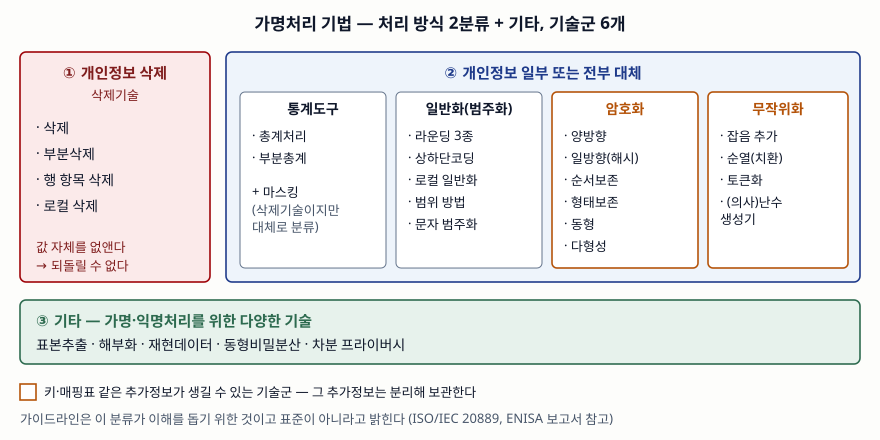

기출문제에서 개인정보보호를 위한 가명처리 기법을 묻는다. 기법 이름을 늘어놓는 것만으로는
점수 차이가 나지 않는다. 갈리는 곳은 두 가지다. 기법을 **처리 방식(삭제·대체)과 기술군으로
묶어 개수를 세는가**, 그리고 **대체 기법이 만들어 내는 추가정보(키·매핑표)를 어떻게
관리해야 가명정보로 남는가**를 쓰는가다.

> 기법 분류는 개인정보보호위원회 가명정보 처리 가이드라인(2022.4)의 부록을 따랐다.
> Ⅲ의 해시·키·토큰 관련 고려사항은 가상 데이터로 직접 확인했고 기록은
> [code/output.txt](code/output.txt)에 있다.

---

## Ⅰ. 정의

**가명처리**는 개인정보의 일부를 삭제하거나 일부 또는 전부를 대체하는 등의 방법으로
**추가정보 없이는** 특정 개인을 알아볼 수 없도록 처리하는 것이다(개인정보 보호법 제2조).
그 결과물인 **가명정보**는 추가정보와 합치면 다시 개인을 알아볼 수 있으므로 여전히
개인정보이고, 그래서 법은 추가정보를 **별도로 분리하여 보관·관리**하도록 요구한다
(같은 법의 가명정보 안전조치 의무 조항, 제28조의4).

정의에 이미 기법의 두 갈래가 들어 있다. **삭제**와 **대체**다. 가이드라인 부록은 이 두
갈래 아래 기술군을 나누고, 어느 쪽에도 넣기 어려운 기술을 **기타**로 따로 묶는다.

## Ⅱ. 구성요소 — 2분류 + 기타, 기술군 6개, 세부기술 29개

> **출처**: [가명정보 처리 가이드라인(2022.4, 개인정보보호위원회) 부록1 참고1 개인정보 가명처리 기술 및 예시](https://data.gangwon.kr/images/%EA%B0%80%EB%AA%85%EC%A0%95%EB%B3%B4%EC%B2%98%EB%A6%AC%EA%B0%80%EC%9D%B4%EB%93%9C%EB%9D%BC%EC%9D%B8_2022_04_29.pdf)(제3자 전재, 67~69쪽 분류표)

| 분류 | 기술군 | 세부기술 | 개수 | 남는 것 |
|---|---|---|---|---|
| 삭제 | 삭제기술 | 삭제, 부분삭제, 행 항목 삭제, 로컬 삭제 | 4 | 없음 — 되돌릴 수 없다 |
| 대체 | 삭제기술 | 마스킹 | 1 | 없음 |
| 대체 | 통계도구 | 총계처리, 부분총계 | 2 | 없음 |
| 대체 | 일반화(범주화) | 일반·랜덤·제어 라운딩, 상하단코딩, 로컬 일반화, 범위 방법, 문자데이터 범주화 | 7 | 없음 |
| 대체 | 암호화 | 양방향, 일방향(암호학적 해시), 순서보존, 형태보존, 동형, 다형성 | 6 | **키** |
| 대체 | 무작위화 | 잡음 추가, 순열(치환), 토큰화, (의사)난수생성기 | 4 | 토큰화·난수 대체는 **매핑표** |
| 기타 | 다양한 기술 | 표본추출, 해부화, 재현데이터, 동형비밀분산, 차분 프라이버시 | 5 | 기술마다 다름 |

"남는 것" 열은 가이드라인 분류표에 없는 열이다. 답안에서 이 열을 덧붙이는 이유는 Ⅲ에
있다. **삭제·통계·일반화는 정보를 줄여서 식별성을 낮추고, 암호화·토큰화는 값을 바꿔
끼워서 식별성을 낮춘다.** 뒤쪽은 분석 유용성을 덜 잃는 대신 되돌리는 열쇠가 생긴다.

암호화 6종은 분석 요구로 고른다. 크기 비교가 필요하면 **순서보존**, 기존 스키마를
바꿀 수 없으면 **형태보존**, 암호문 상태로 연산해야 하면 **동형**, 제공처마다 다른
가명을 줘서 부정한 결합을 막으려면 **다형성**이다. 일방향 해시는 다시 키 없는 해시(MDC),
솔트가 있는 해시, 키가 있는 해시(MAC)로 나뉜다.

가이드라인은 이 분류가 ISO/IEC 20889와 ENISA 보고서를 참고해 **이해를 돕기 위해 만든 것이며
표준이 아니라고** 밝힌다. 답안에 "가이드라인 분류 기준"이라고 붙여 두면 출처가 선다.

## Ⅲ. 활용 / 고려사항

**활용** — 가이드라인의 항목별 처리 예시는 열 항목마다 기법을 다르게 고른다. 고객 ID는
일련번호로 **대체**, 나이는 **범주화**와 **상하단코딩**(양 끝단 경계치 처리), 주소는
동 단위 이하 **부분삭제**, 구매액은 상단 경계치 처리 뒤 **라운딩**이다. 한 데이터셋에
기법 하나를 일괄 적용하는 것이 아니라 **항목의 식별 위험과 분석 목적으로 항목별로 고른다.**

**고려사항 4가지**

**① 키 없는 해시는 식별자 범위가 좁으면 되돌아간다.** 해시는 복호화가 불가능하다는
설명만 보고 고르기 쉽지만, 전화번호처럼 형식이 정해진 값은 후보를 전부 해시해 맞춰 보면
된다. ENISA 보고서도 가명처리 공격 기법으로 무차별 대입·사전 탐색을 든다.

| 가명 방식 | 공격 | 결과 |
|---|---|---|
| SHA-256 (키 없음) | 010-00xx-xxxx 후보 1,000,000개 열거 | 5명 중 **5명 복원**, 0.79초 |
| HMAC-SHA256 (키 모름) | 같은 열거 | **0명** |
| HMAC-SHA256 (키 유출) | 같은 열거 | 5명 |

측정 속도(약 127만 건/초, 단일 스레드)로 환산하면 010 번호 전체 1억 개도 약 1.3분이다.
**안전성은 해시 함수가 아니라 키의 비밀성에서 나온다.** 그래서 키 있는 해시를 쓰고,
그 키를 추가정보로 분리 보관한다.

**② 같은 키를 여러 곳에 쓰면 가명이 결합키가 된다.** 같은 사람이 같은 가명으로 나가면
받은 쪽끼리 가명만으로 묶을 수 있다. 검산에서 두 제공처가 4명씩 받았을 때 같은 키면
3명이 가명으로 연결됐고, **제공처별로 키를 다르게 하자 0명**이었다. 가이드라인의
다형성 암호화가 노리는 것이 이 차단이다. 내부 결합에 쓴 결합키·매핑테이블은 추가정보로
분리 보관하고, 결합 뒤에는 특별한 사유가 없으면 삭제하도록 가이드라인이 정한다.

**③ 토큰화는 매핑표 자체가 추가정보다.** 난수로 만든 토큰은 원래 값의 함수가 아니라서
같은 번호도 다시 발급하면 다른 토큰이 나온다(검산 `[4]`). 열거할 대상이 없는 대신
**매핑표가 유출되면 전부 복원된다.** 매핑표의 접근 권한을 가명정보 처리자와 분리한다.

**④ 기법 적용이 곧 적정성은 아니다.** 직접 식별자를 대체해도 나이·지역·성별 같은
준식별자 조합으로 사람이 좁혀진다. 가명처리 뒤에는 k-익명성 등으로 **적정성 검토**를
거치고, 처리 후에도 재식별 가능성을 계속 모니터링한다(가이드라인 5단계 사후관리).

> 개념 정리: [개인정보 비식별·가명처리 절차와 적정성 평가 — k-익명성·ℓ-다양성·t-근접성이 막는 공격과 못 막는 공격](../../security/2026-10-08-pseudonymization-steps-k-anonymity-limits/index.md)

끝

## 답안 작성 메모

- **먼저 쓸 것**: 법 정의 한 줄과, 정의 안의 "삭제·대체"를 그대로 분류축으로 쓰는 연결.
  그 다음 분류표. 표는 기술군 6개 행만 있어도 되고 세부기술은 대표 2~3개씩만 적어도 된다.
- **점수가 갈리는 지점**: 기법을 **추가정보가 생기는가**로 나누는 시각. 암호화·토큰화를
  쓰면 키·매핑표가 생기고, 그것을 분리 보관해야 가명정보라는 법 요건(제28조의4)까지
  이어 쓰면 나열형 답안과 차이가 난다.
- **차별화 한 줄**: "해시는 복호화 불가라 안전하다"를 반박하는 문장 — 값의 범위가
  좁으면 열거로 복원되므로 키 있는 해시를 쓴다. 검산 숫자(1억 개 약 1.3분)는 답안에
  옮기지 말고 "짧은 시간에 열거 가능" 정도로 쓴다. 환경마다 다른 값이다.
- **빠지기 쉬운 함정**: 가명정보와 익명정보를 섞는 것. 가명정보는 개인정보다.
  차분 프라이버시·재현데이터는 가이드라인이 "가명·익명처리를 위한" 기타 기술로
  묶었다는 점을 그대로 쓴다.
- **시간이 모자라면**: 활용 문단을 버리고 고려사항을 ①②④ 세 개로 줄인다.
  모식도는 세 덩어리(삭제 / 대체 5개 기술군 / 기타)만 그려도 된다.
- 개수를 붙인다 — 2분류 + 기타, 기술군 6개, 세부기술 29개, 암호화 6종, 고려사항 4가지.

## 참고 자료

- [개인정보보호위원회 — 안내서: 가명정보 처리 가이드라인(2026.3. 개정)](https://www.pipc.go.kr/np/cop/bbs/selectBoardArticle.do?bbsId=BS217&mCode=D010030000&nttId=11931) — 현행판 게시글.
  본문은 [2022.4판 PDF](https://data.gangwon.kr/images/%EA%B0%80%EB%AA%85%EC%A0%95%EB%B3%B4%EC%B2%98%EB%A6%AC%EA%B0%80%EC%9D%B4%EB%93%9C%EB%9D%BC%EC%9D%B8_2022_04_29.pdf)(제3자 전재)로 읽었다 — 32쪽 항목별 가명처리 계획 예시, 37~38쪽 안전조치·내부 결합, 67~69쪽 기법 분류표, 77~79쪽 암호화·토큰화 설명.
  이 답안의 분류와 개수는 **2022.4판 기준**이며 2026.3판 본문은 확인하지 못했다
- [ENISA — Pseudonymisation techniques and best practices (2019.12)](https://www.enisa.europa.eu/publications/pseudonymisation-techniques-and-best-practices) — 가명처리 공격 모델(무차별 대입, 사전 탐색, 추측)
- [ISO/IEC 20889:2018 — Privacy enhancing data de-identification terminology and classification of techniques](https://www.iso.org/standard/69373.html) — 가이드라인 분류표가 참고한 국제 표준. 본문은 확인하지 못했고 가이드라인의 인용을 따라 적었다
