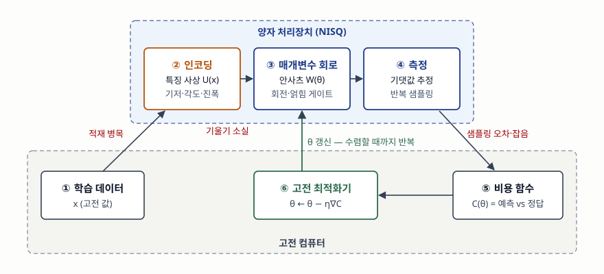

기출문제에서 양자머신러닝을 단답형으로 묻는다. "양자 컴퓨터로 머신러닝을 빠르게
한다"로 쓰면 점수가 낮다. 갈리는 곳은 두 가지다. **고전 데이터가 양자 회로에 어떻게
들어가고 학습이 어디서 일어나는지**(하이브리드 루프)를 그리는가, 그리고 **지수적 가속
주장에 어떤 전제가 붙는지**를 쓰는가다.

> 실행 검증 없음. 양자 하드웨어나 시뮬레이터로 돌린 결과는 싣지 않았다. 정의와 구조는
> 원 논문(Nature, Nature Reviews Physics, Nature Communications 등)과 PennyLane 공식 문서를
> 근거로 정리했다.

---

## Ⅰ. 정의

Biamonte 등은 양자머신러닝을 **고전 방식보다 계산상 이점을 주는 양자 소프트웨어를
머신러닝 과제에 맞게 설계·구현하는 분야**로 정의한다. 근거는 양자 시스템이 고전
시스템으로는 효율적으로 만들기 어렵다고 여겨지는 통계 패턴을 만들어 낸다는 점이다.

현재 하드웨어(NISQ, 잡음이 있는 중규모 양자 장치)에서 실제로 돌릴 수 있는 형태는
**변분 양자 알고리즘(VQA)** 이다. Cerezo 등의 리뷰는 VQA를 **매개변수가 있는 양자
회로를 고전 최적화기로 학습시키는 하이브리드 방식**으로 정리하고, 같은 리뷰가 QML을
이 틀로 구현되는 대표 응용(분류기, 오토인코더 등)으로 다룬다.

## Ⅱ. 구성요소 — 하이브리드 루프 6단계, 알고리즘 계열 3가지

> **출처**: [M. Cerezo et al., Variational Quantum Algorithms, Nature Reviews Physics 3 (2021) — Fig. 1, §II Basic Concepts and Tools, §III.F Machine learning and data science](https://arxiv.org/abs/2012.09265), 인코딩 방식은 [PennyLane 0.45.1 문서 — BasisEmbedding·AngleEmbedding·AmplitudeEmbedding](https://docs.pennylane.ai/en/stable/code/api/pennylane.AmplitudeEmbedding.html)

**하이브리드 루프 6단계**

| 단계 | 어디서 | 하는 일 |
|---|---|---|
| ① 학습 데이터 | 고전 | 입력 x와 정답 y를 준비 |
| ② 인코딩(특징 사상) | 양자 | x를 양자 상태로 올린다. 아래 3방식 |
| ③ 매개변수 회로(안사츠) | 양자 | 학습 가능한 회전 각 θ를 가진 게이트열을 적용 |
| ④ 측정 | 양자 | 관측량의 기댓값을 반복 측정으로 추정 |
| ⑤ 비용 함수 | 고전 | 측정값과 정답의 오차 C(θ)를 계산 |
| ⑥ 고전 최적화기 | 고전 | 기울기로 θ를 갱신하고 ③으로 돌아간다 |

리뷰는 VQA의 공통 구성요소를 **비용 함수, 안사츠, 기울기, 최적화기** 네 가지로 든다.
양자 장치는 비용(또는 기울기)을 **추정**하는 데만 쓰이고, 학습 자체는 고전 컴퓨터가 한다.

**인코딩 3방식** — 큐비트 수와 회로 깊이를 맞바꾼다.

| 방식 | 담는 양 | 특징 |
|---|---|---|
| 기저 인코딩 | 이진 특징 n개 → 큐비트 n개 | 계산 기저 상태 하나로 표현 |
| 각도 인코딩 | 특징 N개 → 큐비트 n개 (N ≤ n) | 특징값을 회전 게이트의 각으로 사용 |
| 진폭 인코딩 | 특징 2ⁿ개 → 큐비트 n개 | 큐비트는 적게 들지만 상태 준비 회로가 깊어진다 |

**알고리즘 계열 3가지**

| 계열 | 원리 | 필요한 장치 | 걸림돌 |
|---|---|---|---|
| HHL 계열 (선형대수 가속) | 선형 연립방정식을 큐비트 수 log n 규모로 푼다 | 오류 정정된 양자 컴퓨터 | Aaronson의 4가지 전제 (Ⅲ ①) |
| 변분 분류기 | ②→⑥ 루프로 회로 매개변수를 학습 | NISQ | 기울기 소실, 잡음 |
| 양자 커널 | 두 입력의 양자 상태 겹침을 측정해 커널 값으로 쓰고 분류기는 고전 SVM | NISQ | 커널 추정의 측정 횟수 |

Havlíček 등은 뒤의 두 계열을 같은 논문에서 제안했다. 둘 다 분류 문제의 특징 공간을
**지수적으로 큰 힐베르트 공간의 양자 상태**로 표현한다는 점이 같고, 학습을 회로 안에서
하는가(변분 분류기) 커널만 양자로 구하는가(커널 추정)가 다르다.

## Ⅲ. 활용 / 고려사항

**활용** — 리뷰가 QML 응용으로 드는 것은 분류기, 양자 데이터 압축용 오토인코더 등이다.
분류기는 고전 데이터를 인코딩해 쓰지만, 오토인코더 예는 처음부터 **양자 데이터**(양자
상태의 앙상블)를 압축한다. 데이터가 원래 양자 상태로 주어지는 문제일수록 ② 인코딩
병목이 없다는 점을 함께 쓴다.

**고려사항 4가지**

**① 가속 주장의 전제를 확인한다.** Aaronson은 HHL이 "로그 시간에 푼다"는 주장에 붙는
단서 4가지를 든다. 입력 벡터를 양자 메모리에 빠르게 적재해야 하고(양자 RAM), 행렬이
희소하거나 효율적으로 다룰 수 있어야 하며, 조건수가 작아야 하고, 출력이 해 벡터가 아니라
**양자 상태**라서 원소를 전부 읽으려면 그만큼 반복 측정이 필요하다. 단서 하나만 깨져도
가속이 사라질 수 있다.

**② 고전 알고리즘과 같은 조건에서 비교한다(탈양자화).** Tang은 양자 추천 알고리즘이
전제한 데이터 접근(ℓ² 노름 표본 추출)을 고전 쪽에도 허용하면 **고전 알고리즘도
다항식 차이로 따라온다**는 것을 보였다. 양자 쪽만 강한 입력 모델을 가정한 비교는
가속의 근거가 되지 않는다.

**③ 학습 가능성 — 기울기 소실 고원(barren plateau).** McClean 등은 무작위로 초기화한
매개변수 회로에서 기울기가 0이 아닐 확률이 **큐비트 수에 대해 지수적으로 작아진다**는
것을 보였다. 큐비트를 늘리면 비용 지형이 평평해져 ⑥이 방향을 못 잡는다. 회로 구조와
초기화 전략을 문제에 맞게 고르는 것이 대응이다.

**④ 측정 비용과 잡음.** 리뷰는 VQA의 과제를 학습 가능성, **효율**(비용 추정에 드는
측정 횟수), **정확도**(하드웨어 잡음) 세 가지로 나눈다. ④ 측정은 기댓값을 표본으로
추정하므로 정밀도를 올릴수록 반복 횟수가 늘고, 잡음은 비용 지형 자체를 왜곡한다.

끝

## 답안 작성 메모

- **먼저 쓸 것**: 정의 한 줄 다음에 바로 하이브리드 루프 모식도. "양자는 비용 추정,
  학습은 고전"이라는 분업이 보이면 정의·구성요소가 한 번에 설명된다.
- **점수가 갈리는 지점**: 가속 주장의 **전제**를 쓰는가. 데이터 적재(양자 RAM)와 출력
  판독 두 가지만 써도 "양자라서 빠르다"는 답안과 차이가 난다. 탈양자화는 한 줄로
  "고전 쪽에 같은 입력 모델을 주면 격차가 줄어든다"로 쓴다.
- **빠지기 쉬운 함정**: 진폭 인코딩의 "2ⁿ개를 n큐비트에"만 쓰고 상태 준비 비용을 빼는
  것. 큐비트 수 절감과 회로 깊이 증가는 같이 써야 맞는 문장이다.
- **쓰지 않을 것**: 근거 없는 "n배 빠르다", 시장 규모, 특정 기업의 큐비트 수.
  이 답안의 근거 자료 어디에도 일반적 성능 배수는 없다.
- **시간이 모자라면**: 인코딩 표를 한 줄("기저·각도·진폭 3방식")로 줄이고 계열 비교표를
  버린다. 루프 6단계와 고려사항 ①③은 남긴다.
- 개수를 붙인다 — 루프 6단계, VQA 구성요소 4가지, 인코딩 3방식, 계열 3가지,
  HHL 단서 4가지, 고려사항 4가지.

## 참고 자료

- [J. Biamonte, P. Wittek, N. Pancotti, P. Rebentrost, N. Wiebe, S. Lloyd — Quantum Machine Learning, Nature 549, 195–202 (2017)](https://arxiv.org/abs/1611.09347) — 정의
- [M. Cerezo et al. — Variational Quantum Algorithms, Nature Reviews Physics 3, 625–644 (2021)](https://arxiv.org/abs/2012.09265) — Fig. 1 VQA 구성, §II 구성요소 4가지, §III.F 분류기·오토인코더, §IV 학습 가능성·효율·정확도
- [V. Havlíček et al. — Supervised learning with quantum-enhanced feature spaces, Nature 567, 209–212 (2019)](https://arxiv.org/abs/1804.11326) — 변분 분류기와 양자 커널 추정
- [J. R. McClean et al. — Barren plateaus in quantum neural network training landscapes, Nature Communications 9, 4812 (2018)](https://arxiv.org/abs/1803.11173) — 기울기 소실 고원
- [S. Aaronson — Read the fine print, Nature Physics 11, 291–293 (2015)](https://www.scottaaronson.com/papers/qml.pdf) — HHL 가속의 단서 4가지
- [E. Tang — A quantum-inspired classical algorithm for recommendation systems (arXiv:1807.04271)](https://arxiv.org/abs/1807.04271) — 탈양자화
- [PennyLane 0.45.1 문서 — BasisEmbedding](https://docs.pennylane.ai/en/stable/code/api/pennylane.BasisEmbedding.html), [AngleEmbedding](https://docs.pennylane.ai/en/stable/code/api/pennylane.AngleEmbedding.html), [AmplitudeEmbedding](https://docs.pennylane.ai/en/stable/code/api/pennylane.AmplitudeEmbedding.html) — 인코딩 3방식의 큐비트 수
