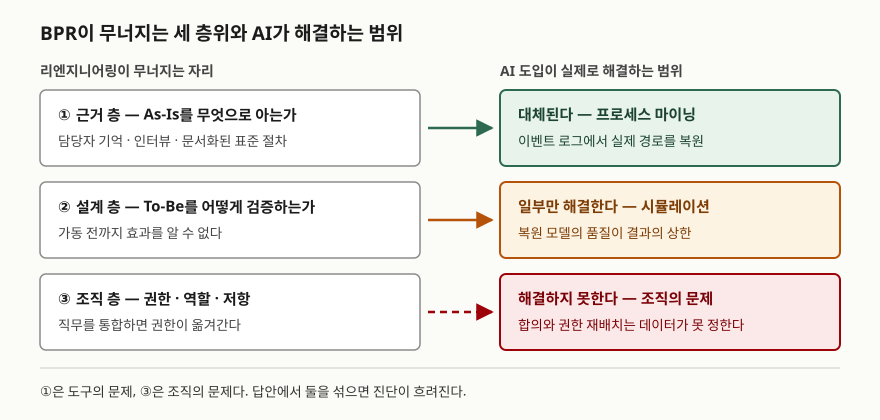

> **실행 검증 없음.** 이 글은 원 논문·원 저작과 표준 문서의 정의를 정리한 개념 글이다.
> 성공률·절감률 같은 수치는 원 출처가 1차 자료인 것만 실었고, 널리 인용되지만
> 근거가 약한 수치는 왜 약한지를 적었다.

## 들어가며

BPR은 30년이 넘은 주제인데 최근 시험에서 다시 나온다. 앞에 "AI 기반"이 붙어서다.
문제는 답안 대부분이 정의를 옮긴 뒤 "생산성이 향상된다"로 끝난다는 점이다.
채점자가 보고 싶은 것은 그게 아니다. 1990년대에 이 방법론이 왜 유행했고 왜 사그라들었는지,
그 사그라든 원인 중 어디까지를 AI가 건드리는지를 구분할 수 있느냐가 변별점이 된다.

실무에서도 같은 구분이 필요하다. "프로세스 개선"이라 부르는 작업 대부분은 BPR이 아니다.
원 정의에 있는 네 단어를 하나라도 만족하지 못하면 그것은 개선이지 재설계가 아니다.

## 정의

**BPR(Business Process Reengineering)**: 비용·품질·서비스·속도 같은 핵심 성과 척도에서
**극적인 개선**을 얻기 위해 업무 프로세스를 **근본적으로 다시 생각하고 급진적으로
다시 설계**하는 것. (Hammer & Champy, 1993)

이 한 문장을 지탱하는 핵심어는 **4개**다 — 근본적(fundamental), 급진적(radical),
극적(dramatic), 프로세스(process). 답안 첫 줄은 정의를 쓰고 이 네 단어를 괄호로
박아 넣는 것으로 시작한다. 네 단어 가운데 "극적"은 정도의 문제가 아니라 기준의 문제다.
10~20% 개선을 목표로 잡았다면 원 정의상 BPR이 아니라는 뜻이다.

**AI 기반 BPR**은 여기에 한 가지를 더한다. 재설계의 근거를 담당자의 기억과 인터뷰가
아니라 **시스템이 남긴 실행 데이터**에서 뽑고, 재설계된 프로세스의 판단 단계를 학습
모델이 수행하게 하는 것이다. 정의 자체가 바뀌는 것은 아니고, 정의를 실현하는 수단이 바뀐다.

## 등장 배경

1990년 Hammer가 HBR에 쓴 논문의 제목이 배경을 그대로 말한다 —
"Don't Automate, Obliterate". 당시 기업들은 전산화에 큰 돈을 쓰고도 성과가 나오지 않는다고
호소하고 있었다. Hammer의 진단은 단순했다. 전산화가 **기존 프로세스를 그대로 굳혔기**
때문이라는 것이다. 서류를 돌리던 절차를 화면으로 옮기면 서류가 화면이 될 뿐 결재 단계는
그대로 남는다. 잘못된 프로세스를 자동화하면 잘못을 더 빨리 반복하게 된다.

그래서 Hammer는 부분 개선을 버리고 프로세스를 백지에서 다시 그리자고 했고,
그 논문에서 재설계의 **7원칙**을 제시했다.

## 구성요소 — 재설계 7원칙과 AI 기반 4단계

Hammer(1990)의 **재설계 7원칙**은 답안에서 개수를 세기 좋은 항목이다.

| # | 원칙 | 노리는 것 |
|---|---|---|
| 1 | 과업이 아니라 결과를 중심으로 조직한다 | 직무 통합, 인계 지점 제거 |
| 2 | 산출물을 쓰는 사람이 그 프로세스를 수행한다 | 부서 간 요청·대기 제거 |
| 3 | 정보를 만드는 일에 정보 처리를 흡수시킨다 | 별도 입력 조직 폐지 |
| 4 | 분산된 자원을 집중된 것처럼 다룬다 | 규모의 경제와 현장성 동시 확보 |
| 5 | 병렬 활동을 결과가 아니라 과정에서 연결한다 | 통합 시점의 재작업 제거 |
| 6 | 판단은 일이 수행되는 자리에서 하고 통제를 프로세스에 내장한다 | 결재 계층 축소 |
| 7 | 정보는 발생 원천에서 한 번만 수집한다 | 중복 입력과 불일치 제거 |

AI가 들어오면 여기에 실행 절차 **4단계**가 얹힌다.

1. **As-Is 가시화** — 정보시스템의 이벤트 로그를 표준 형식(IEEE 1849 XES)으로 모아
   실제 수행된 경로를 복원한다. 프로세스 마이닝이 담당하는 단계다.
2. **To-Be 재설계** — 복원된 모델에서 병목·재작업·우회 경로를 찾아 7원칙을 적용한다.
3. **실행 자동화** — 규칙과 학습 모델이 판단 단계를 수행하고 사람은 예외를 처리한다.
4. **감시·통제** — 설계 모델과 실제 실행의 차이를 계속 측정하고 AI 위험을 평가한다.

프로세스 마이닝 자체는 **3종**으로 나뉜다. 로그에서 모델을 만드는 **발견(discovery)**,
모델과 로그를 대조하는 **적합성 검사(conformance checking)**, 로그의 정보로 기존 모델을
보강하는 **향상(enhancement)**이다. ①이 발견, ④가 적합성 검사에 해당한다고 보면
4단계와 3종이 한 그림에 들어온다.

## 도식

> **출처**: 층위 구분은 [Michael Hammer, "Reengineering Work: Don't Automate,
> Obliterate", HBR 1990](https://hbr.org/1990/07/reengineering-work-dont-automate-obliterate)의
> 논지와 [Thomas H. Davenport, "The Fad That Forgot People", Fast Company, 1995-11](https://www.fastcompany.com/26310/fad-forgot-people)의
> 비판을 대비시킨 것이다. ① 층에 프로세스 마이닝을 대응시킨 근거는
> [Process Mining Manifesto §1 (three main types of process mining)](https://www.tf-pm.org/resources/manifesto),
> ③ 층을 AI가 해결하지 못하는 영역으로 둔 근거는 Davenport(1995)가 지목한 조직·인력 문제다.

답안지에는 왼쪽 세 칸, 오른쪽 세 칸, 가운데 화살표 셋이면 된다. 오른쪽 칸의 색만
다르게 칠해도 "해결한다 / 일부 / 해결하지 못한다"가 전달된다.

## 비교

### 개선 계열과의 대비

| 항목 | BPR | BPM | TQM·Kaizen |
|---|---|---|---|
| 변화 폭 | 급진적, 백지 재설계 | 점진 + 필요 시 재설계 | 점진적 개선 |
| 목표 수준 | 극적 개선 | 지속 가능한 관리 | 소폭 누적 개선 |
| 주기 | 일회성 프로젝트 | 상시 순환 | 상시 |
| 주도 | 경영진 하향 | 프로세스 오너 | 현장 중심 |
| 위험 | 실패 시 손실이 크다 | 변화 폭이 작다 | 구조적 문제는 남는다 |

BPR이 사그라든 뒤 그 자리를 BPM이 가져갔다는 점을 함께 적으면 흐름이 드러난다.
AI 기반 BPR은 ④의 산출물이 다시 ①의 입력이 되므로, 형태로는 BPR의 목표 수준을
BPM의 주기로 돌리는 절충에 가깝다.

### 원안과 AI 도입 이후

| 구분 | 1990년대 원안 | AI 도입 이후 |
|---|---|---|
| As-Is 파악 | 인터뷰·워크숍·문서화된 표준 | 이벤트 로그에서 실제 경로 복원 |
| 재설계 근거 | 경험과 합의 | 측정된 대기·재작업 지점 |
| 판단 수행 | 사람 | 규칙·학습 모델, 사람은 예외 처리 |
| 효과 확인 | 사후 보고 | 같은 지표로 전후 비교 |
| 새로 생기는 위험 | — | 모델 편향, 설명 책임, 학습 데이터 개인정보 |

## 적용 시 고려사항

- **널리 인용되는 "BPR 실패율 70%"를 단정적으로 쓰지 않는다.** 이 숫자의 출처는
  Hammer & Champy(1993) 본문인데, 저자들 스스로 **비과학적 추정(unscientific estimate)**이라고
  밝히면서 적은 문장이다. 답안에 쓸 거라면 "저자들의 비과학적 추정으로 50~70%"처럼
  단서를 함께 적는다. 근거 없이 단정하면 오히려 감점 요인이 된다.
- **로그 품질이 AI 기반 BPR의 상한을 정한다.** Process Mining Manifesto는 이벤트 로그
  성숙도를 **5단계**(★~★★★★★)로 나누고, ★★★ 이상에서만 프로세스 마이닝이
  의미 있다고 본다. 타임스탬프가 배치로 한꺼번에 찍히거나 사례 ID가 끊기면 복원된
  프로세스가 실제와 달라진다. 자동화 투자보다 로그 설계가 먼저다.
- **자동화 대상과 재설계 대상을 구분한다.** 1990년 원 논문의 논지가 정확히 이것이다.
  잘못된 프로세스에 모델을 얹으면 잘못을 더 빨리 반복한다. 먼저 없앨 단계를 정하고
  남은 단계에 자동화를 붙인다.
- **AI 도입이 없던 위험을 새로 만든다.** 모델 편향, 설명 책임, 학습 데이터의 개인정보는
  기존 BPR 체크리스트에 없던 항목이다. ISO/IEC 42001의 AI 경영시스템과 NIST AI RMF의
  **4개 기능**(GOVERN·MAP·MEASURE·MANAGE)을 통제 장치로 함께 세운다.
- **조직 층은 도구로 풀리지 않는다.** Davenport(1995)는 리엔지니어링이 사람을 잊었다고
  비판했다. 직무를 통합하면 권한이 옮겨가고, 옮겨간 권한을 누가 갖느냐는 데이터가
  결정해 주지 않는다. 답안에서 기술적 성공 요인만 나열하면 절반만 쓴 것이 된다.

## 정리

- 정의는 네 단어로 외운다 — **근본적·급진적·극적·프로세스**. 개선과 재설계를 가르는 기준이다.
- Hammer의 재설계 원칙은 **7개**, AI 기반 실행 절차는 **4단계**, 프로세스 마이닝은 **3종**,
  이벤트 로그 성숙도는 **5단계**, NIST AI RMF는 **4개 기능**이다. 개수를 먼저 적고 시작한다.
- 실패 층위는 세 개로 잡는다. **① 근거 층 → AI가 대체, ② 설계 층 → 일부, ③ 조직 층 → 해결 못 함.**
- 70%라는 숫자는 저자 본인이 비과학적 추정이라고 적은 값이다. 단서 없이 쓰지 않는다.
- 원안은 일회성 프로젝트였지만 AI 기반은 ④가 ①로 되먹임되는 **순환 구조**라는 점이
  두 시대를 가르는 한 줄이다.

> 기출 답안: [기출문제 — AI 기반 업무 프로세스 재설계(BPR) 도입 효과](../../exam/2026-09-21-ai-driven-bpr/index.md)

## 참고 자료

- Michael Hammer, ["Reengineering Work: Don't Automate, Obliterate", *Harvard Business Review*, July–August 1990](https://hbr.org/1990/07/reengineering-work-dont-automate-obliterate)
- Michael Hammer, James Champy, *Reengineering the Corporation: A Manifesto for Business Revolution*, HarperBusiness, 1993 — 정의는 서두, 50~70% 추정은 p. 200
- Thomas H. Davenport, ["The Fad That Forgot People", *Fast Company*, Issue 1, 1995-11](https://www.fastcompany.com/26310/fad-forgot-people)
- IEEE Task Force on Process Mining, ["Process Mining Manifesto"](https://www.tf-pm.org/resources/manifesto), in *BPM 2011 Workshops Part I*, LNBIP 99, Springer, 2012
- [IEEE 1849-2016 — eXtensible Event Stream (XES) for Achieving Interoperability in Event Logs](https://ieeexplore.ieee.org/document/7740858/)
- [ISO/IEC 42001:2023 — Information technology, Artificial intelligence, Management system](https://www.iso.org/standard/42001)
- [NIST AI Risk Management Framework (AI RMF 1.0), 2023-01-26](https://www.nist.gov/itl/ai-risk-management-framework)
