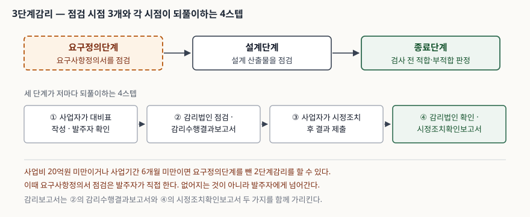
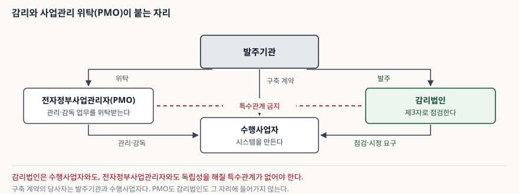

> **실행 검증 없음.** 이 글은 법령과 행정규칙의 조문을 정리한 개념 글이다. 조문 번호와
> 항목 개수는 2026년 9월 기준 시행 중인 판본을 확인해 적었고, 수치나 통계는 싣지 않았다.

## 들어가며

발주기관이 정보화사업을 계약대로 받았는지 스스로 판정하기는 어렵다. 다리나 건물과 달리
정보시스템은 눈으로 확인되지 않고, 과업을 이행했는지 여부는 산출물 안에만 남는다.
그런데 그 산출물을 만든 쪽은 수행사업자다. 만든 쪽이 맞다고 말하는 것을 발주기관이
반박할 근거가 없으면 검수는 형식만 남는다. 정보시스템 감리는 이 자리를 메우려고 법으로
정해 둔 제3자 점검이다. 시험에서는 사업관리 위탁(PMO)과 묶여 나오므로 둘이 어디서
갈라지는지까지 함께 정리해야 한다.

## 정의

「전자정부법」제2조제14호는 정보시스템 감리를 **감리발주자 및 피감리인의 이해관계로부터
독립된 자가 정보시스템의 효율성을 향상시키고 안전성을 확보하기 위하여 제3자의 관점에서
정보시스템의 구축 및 운영 등에 관한 사항을 종합적으로 점검하고 문제점을 개선하도록
하는 것**으로 정의한다. 답안 첫 줄에 그대로 쓸 수 있는 문장이다.

**두 근거의 문구가 조금 다르다.** 「정보시스템 감리기준」제2조제1호는 같은 개념을
"발주자와 사업자 등의 이해관계로부터 독립된 자"로 적는다. 법은 감리발주자와 피감리인을
들고, 고시는 발주자와 사업자를 든다. 뜻은 같지만 답안에 출처를 적을 때는 인용한 쪽의
문구를 쓰는 편이 정확하다.

정의에서 점수가 걸리는 낱말은 **독립**, **제3자의 관점**, **종합적 점검**,
**문제점 개선** 넷이다. 감리는 보는 데서 끝나지 않고 고치게 하는 데까지 간다.

## 등장 배경

법이 무엇을 금지하는지를 보면 그 이전에 무엇이 되풀이됐는지가 드러난다.

제57조제2항은 발주기관 소속 직원과 수행사업자가 정당한 사유 없이 감리원의 업무에
개입하거나 간섭하지 못하게 한다. 점검하는 쪽을 양쪽에서 누르는 일이 있었다는 뜻이다.
제57조제3항은 발주기관이 사업자로 하여금 감리결과를 반영하게 하도록 정한다. 지적은
남고 조치는 없는 경우를 막는 조항이다. 감리기준 제6조제4항은 감리법인이 수행사업자
및 전자정부사업관리자와 독립성을 해칠 특수관계를 갖지 못하게 한다.

세 조항 모두 같은 것을 지킨다. 점검하는 사람이 점검받는 일에 이해관계를 갖지 않아야
점검 결과가 값을 가진다는 것이다.

## 구성요소와 절차

**감리 대상은 3가지**다(시행령 제71조제1항). 첫째, 대국민 행정·민원 업무용이거나 여러
기관이 공동으로 구축·사용하는 정보시스템. 둘째, 사업비 5억원 이상인 정보시스템 구축사업.
셋째, 정보기술아키텍처나 정보화전략계획 수립처럼 기관장이 감리가 필요하다고 인정한 사업이다.
첫째 유형에는 단서가 붙는다. 사업비 1억원 미만 소규모이고 비용 대비 효과가 낮다고
기관장이 인정하면 뺄 수 있다.

**감리법인의 업무범위는 4가지**에 위임 1호를 더한 형태다(시행령 제72조제1항).
사업수행계획이 계약내용을 반영했는지와 일정·산출물 작성계획이 적정한지 검토·확인,
과업범위와 요구사항이 설계에 반영·구체화됐는지 검토·확인, 과업 이행 여부 점검,
관련 법령·규정·지침 준수 여부 검토·확인이다. 다섯째 호는 감리기준이 정하는 사항이다.

**감리 절차는 7단계**다(시행령 제72조제2항). 감리계약 체결 → 예비조사 및 감리계획 수립
→ 착수회의 → 감리 시행과 감리보고서 작성 → 종료회의 → 감리보고서 통보 →
시정조치 결과 확인·통보 순이다. 수행 형태에 따라 일부를 변경하거나 생략할 수 있다.

**감리 시점은 3단계**다(감리기준 제2조제12호, 제3조제1항). 요구정의·설계·종료 단계이며,
사업비 20억원 미만이거나 사업기간 6개월 미만이면 요구정의단계를 뺀 2단계감리를 할 수 있다.
**감리보고서는 2종**으로, 감리수행결과보고서와 시정조치확인보고서다(제2조제11호).

> **출처**: [정보시스템 감리기준(행정안전부고시 제2024-53호) 제2조제11호·제12호, 제3조, 제8조~제10조](https://www.law.go.kr/%ED%96%89%EC%A0%95%EA%B7%9C%EC%B9%99/%EC%A0%95%EB%B3%B4%EC%8B%9C%EC%8A%A4%ED%85%9C%EA%B0%90%EB%A6%AC%EA%B8%B0%EC%A4%80)

상주감리를 추가로 둘 수도 있다(제3조제2항). 대기업 참여가 제한되는 사업이거나 위험도·난이도가
높다고 판단되는 사업이 대상이고, **상주감리원의 업무는 8가지**로 정해져 있다(제10조의2제1항).

## 비교 — 감리와 사업관리 위탁(PMO)

> **출처**: [전자정부법 제57조·제64조의2](https://www.law.go.kr/%EB%B2%95%EB%A0%B9/%EC%A0%84%EC%9E%90%EC%A0%95%EB%B6%80%EB%B2%95) · [정보시스템 감리기준 제6조제4항](https://www.law.go.kr/%ED%96%89%EC%A0%95%EA%B7%9C%EC%B9%99/%EC%A0%95%EB%B3%B4%EC%8B%9C%EC%8A%A4%ED%85%9C%EA%B0%90%EB%A6%AC%EA%B8%B0%EC%A4%80)

| 구분 | 정보시스템 감리 | 전자정부사업관리 위탁(PMO) |
|---|---|---|
| 근거 | 전자정부법 제57조 | 전자정부법 제64조의2 |
| 성격 | 이해관계에서 독립된 제3자의 점검 | 발주기관의 관리·감독 업무를 맡기는 위탁 |
| 투입 | 요구정의·설계·종료 시점에 끊어서 | 사업 기간에 걸쳐 |
| 산출 | 감리수행결과보고서 · 시정조치확인보고서 | 관리·감독 수행 결과 |
| 독립성 | 수행사업자·PMO 모두와 특수관계 금지 | 발주기관에서 권한을 받은 당사자 |

둘의 관계는 법에 명시돼 있다. 제57조제1항 단서는 PMO에 사업관리를 위탁한 경우 일정
사업을 감리 의무에서 뺀다. 시행령 제71조제2항이 그 범위를 사업비 1억원 이상 5억원 미만
전자정부사업과 사업기간 5개월 미만 구축사업으로 정한다. 관리를 맡긴 사업까지 모두 감리를
걸면 작은 사업에서 비용이 겹치기 때문이다. 큰 사업에서는 둘이 함께 간다.

## 적용 시 고려사항

- **대비표가 감리의 실질이다.** 제8조~제10조가 매 단계 요구하는 것은 과업내용과 산출물을
  세부항목별로 맞댄 대비표이고, 이것을 만드는 쪽은 사업자이며 발주자가 확인한다.
  종료단계의 적합·부적합 판정은 설계단계에서 구체화한 세부 검사항목을 근거로 내려간다.
  즉 감리 결과의 수준은 감리 착수 전에 상당 부분 정해진다.
- **2단계감리를 고르면 점검이 사라지는 것이 아니라 발주자에게 넘어간다.** 제3조제1항 단서는
  요구정의단계를 생략하는 대신 발주자가 요구사항정의서의 과업내용 반영 여부를 직접
  점검하도록 정한다. 발주기관에 그럴 인력이 있는지를 먼저 본다.
- **상주감리원은 단계별 감리에 들어갈 수 없다**(제10조의2제3항). 자문한 산출물을 자기가
  판정하면 제3자 점검이 성립하지 않는다. 같은 이유로 감리법인과 PMO 사업자의 특수관계를
  막는다. 관리·자문하는 자리와 판정하는 자리를 겹치지 않게 두는 것이 이 제도의 전제다.
- **감리결과 반영은 권고가 아니라 의무다**(제57조제3항). 반대로 발주기관 직원도 정당한
  사유 없이 감리원 업무에 개입할 수 없다(제57조제2항). 양쪽에 의무가 걸려 있다.
- **적용되는 판본을 먼저 확인한다.** 감리기준 부칙은 2008년 이후 열두 차례 쌓여 있다.
  인력 배치 비율이나 상주감리 요건처럼 답안에 쓰기 쉬운 수치가 개정으로 움직인 항목이다.

## 정리

- 정의의 낱말 넷: **독립 · 제3자의 관점 · 종합적 점검 · 문제점 개선**.
- 개수로 묶는다. 대상 **3가지**, 업무범위 **4가지**(+위임 1호), 절차 **7단계**,
  시점 **3단계**, 보고서 **2종**, 상주감리원 업무 **8가지**.
- 금액·기간 셋만 외운다. 대상은 **5억원**, 2단계감리는 **20억원 미만 또는 6개월 미만**,
  소규모 제외 단서는 **1억원 미만**.
- 근거 조문 셋. 정의는 **법 제2조제14호**, 의무는 **법 제57조**, 절차는
  **시행령 제72조**, 시점과 단계는 **감리기준 제3조·제8조~제10조**.
- PMO와의 구분은 한 줄로 쓴다. **PMO는 발주기관의 일을 대신하고, 감리는 그 일에서
  독립해 점검한다.** 그래서 감리법인은 PMO와도 특수관계를 가질 수 없다.

> 기출 답안: [기출문제 — PMC와 PMO 비교](../../exam/2026-09-21-pmc-pmo/index.md)

## 참고 자료

- [전자정부법(법률 제21394호, 2026.2.27. 일부개정) 제2조제14호·제57조·제64조의2 — 국가법령정보센터](https://www.law.go.kr/%EB%B2%95%EB%A0%B9/%EC%A0%84%EC%9E%90%EC%A0%95%EB%B6%80%EB%B2%95)
- [전자정부법 시행령(대통령령 제36605호, 2026.8.25. 일부개정) 제71조 감리 대상·제72조 업무범위와 절차 — 국가법령정보센터](https://www.law.go.kr/%EB%B2%95%EB%A0%B9/%EC%A0%84%EC%9E%90%EC%A0%95%EB%B6%80%EB%B2%95%EC%8B%9C%ED%96%89%EB%A0%B9)
- [정보시스템 감리기준(행정안전부고시 제2024-53호, 2024.6.27. 일부개정) — 국가법령정보센터](https://www.law.go.kr/%ED%96%89%EC%A0%95%EA%B7%9C%EC%B9%99/%EC%A0%95%EB%B3%B4%EC%8B%9C%EC%8A%A4%ED%85%9C%EA%B0%90%EB%A6%AC%EA%B8%B0%EC%A4%80)
- [전자정부사업관리 위탁에 관한 규정(행정안전부고시) — 국가법령정보센터](https://www.law.go.kr/%ED%96%89%EC%A0%95%EA%B7%9C%EC%B9%99/%EC%A0%84%EC%9E%90%EC%A0%95%EB%B6%80%EC%82%AC%EC%97%85%EA%B4%80%EB%A6%AC%EC%9C%84%ED%83%81%EC%97%90%EA%B4%80%ED%95%9C%EA%B7%9C%EC%A0%95)
