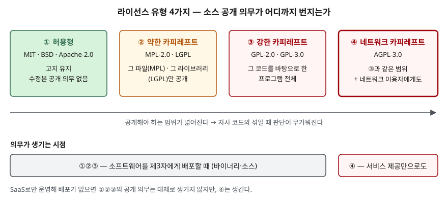
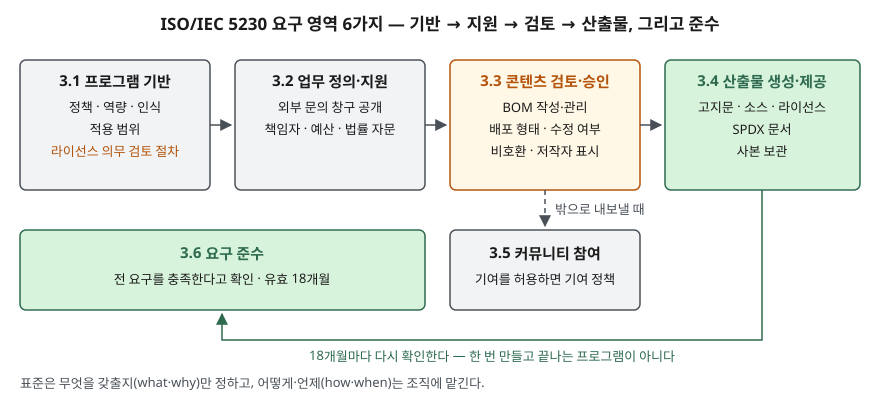

> **실행 검증 없음.** 국제표준, OpenChain 공식 문서, 라이선스 원문과 공식 FAQ를 근거로 정리한 개념 글이다. 실행 예제와 측정값은 없다.
> 라이선스 해석은 관할과 사안마다 다를 수 있으므로, 이 글은 **정보시스템과 조직이 무엇을 갖춰야 하는가**에 초점을 둔다.

## 들어가며

오픈소스 문제는 두 층으로 나온다. 하나는 **라이선스마다 의무가 어떻게 다른가**이고, 다른 하나는 **조직이 그 의무를 어떻게 빠짐없이 지키는가**다.
앞쪽만 쓰면 라이선스 목록이 되고, 뒤쪽만 쓰면 표준 요약이 된다. 실무에서는 제품 하나에 수백 개의 오픈소스 부품이 들어오는데,
그중 하나의 의무를 놓쳐도 배포를 멈추거나 소스를 공개해야 하는 상황이 생긴다. ISO/IEC 5230은 이 관리를 사람의 기억이 아니라
**정책·절차·산출물을 갖춘 프로그램**으로 운영하라고 요구하는 표준이다.

## 정의

- **오픈소스 라이선스 컴플라이언스**: 조직이 쓰고 배포하는 소프트웨어에 든 오픈소스 부품과 그 라이선스를 식별하고,
  라이선스가 정한 의무·제한·권리를 검토해 이행하는 활동이다. ISO/IEC 5230은 이 활동을 운영하는 **프로그램의 핵심 요구사항**을 정한다.
- **ISO/IEC 5230**: 오픈소스 라이선스 컴플라이언스 프로그램이 갖출 요구사항을 정한 국제표준이다. OpenChain 명세 2.1이 2020년 12월
  ISO/IEC 5230:2020으로 채택되었다. 표준은 프로그램의 **무엇(what)과 왜(why)** 를 정하고, **어떻게(how)와 언제(when)** 는 조직에 맡긴다.
- **오픈소스**: ISO/IEC 5230은 OSI의 오픈소스 정의 또는 FSF의 자유 소프트웨어 정의를 만족하는 라이선스가 적용된 소프트웨어로 정의한다.
- **카피레프트**: FSF는 프로그램을 자유 소프트웨어로 만들고, **수정·확장한 판도 모두 자유 소프트웨어이도록 요구하는** 일반적 방법으로 정의한다.

## 등장 배경

오픈소스는 무료로 받지만 조건 없이 받는 것이 아니다. 라이선스는 저작권 허락이고, 허락의 조건을 어기면 허락이 성립하지 않는다.
예전에는 이 판단을 개발자가 패키지를 들일 때 각자 했다. 부품 수가 적을 때는 그래도 됐지만, 공급망이 길어지면서 두 가지 문제가 생겼다.

1. **누가 무엇을 들였는지 조직이 모른다** — 부품 목록(BOM)이 없으면 어떤 의무가 걸려 있는지 셀 수 없다
2. **공급사마다 기준이 다르다** — 부품을 받는 쪽이 공급사의 관리 수준을 믿을 근거가 없다

OpenChain 프로젝트는 두 번째 문제를 **공급망 전체가 같은 요구사항을 쓰는 방식**으로 풀려고 했다. 모든 공급사가 같은 표준을
충족했다고 밝히면 받는 쪽이 따로 심사하지 않아도 된다. 2016년 10월 명세 1.0을 낸 뒤 2.1이 국제표준이 된 것도 이 목적 때문이다.

## 구성요소 / 절차

### 라이선스 유형 — 4가지

라이선스는 **수정본과 결합물의 소스를 어디까지 공개해야 하는가**로 나눈다.

| 유형 | 대표 라이선스 | 소스 공개 범위 | 의무가 생기는 시점 |
|---|---|---|---|
| ① 허용형 | MIT, BSD, Apache-2.0 | 수정본 공개 의무 없음. 저작권 고지와 라이선스 문구를 유지한다 | 배포 |
| ② 약한 카피레프트 | MPL-2.0, LGPL | MPL은 **그 파일**, LGPL은 **그 라이브러리**만 | 배포 |
| ③ 강한 카피레프트 | GPL-2.0, GPL-3.0 | 그 코드를 바탕으로 한 **프로그램 전체** | 배포 |
| ④ 네트워크 카피레프트 | AGPL-3.0 | ③과 같은 범위 | 배포 + **네트워크로 서비스 제공** |

①의 Apache-2.0은 고지 외에 라이선스 사본 제공, 변경한 파일 표시, NOTICE 파일 유지를 요구하고, 특허 소송을 걸면 특허 허락이 끝나는 조항이 있다.
②는 MPL FAQ가 설명하듯 **MPL 코드가 든 파일**에만 카피레프트가 걸리므로, MPL 코드가 없는 새 파일은 다른 라이선스로 둘 수 있다.
④가 따로 있는 이유는 ③의 의무가 "배포"에서 생기기 때문이다. 서버에서 돌리기만 하는 소프트웨어는 배포되지 않으므로 GPL의 공개 의무가 생기지 않는다.
AGPL-3.0은 제13조에서 수정한 프로그램을 **네트워크로 이용하는 사람에게도** 소스를 받을 기회를 주라고 정해 이 틈을 막았다.

### ISO/IEC 5230 요구 영역 — 6가지

| 영역 | 요구 항목 | 내용 |
|---|---|---|
| 프로그램 기반 | 정책, 역량, 인식, 적용 범위, 라이선스 의무 검토 | 문서화된 정책을 알리고, 역할별 역량을 정하고, 적용 범위를 서면으로 밝히고, 식별된 라이선스의 의무·제한·권리를 검토하는 절차를 둔다 |
| 업무 정의·지원 | 외부 문의 창구, 충분한 자원 | 제3자가 컴플라이언스를 문의할 수단을 **공개**하고, 책임자·시간·예산·법률 자문을 배정한다 |
| 콘텐츠 검토·승인 | BOM, 라이선스 컴플라이언스 | 부품과 라이선스의 목록을 만들고 관리하며, 바이너리·소스 배포, 수정, **라이선스 비호환**, 저작자 표시 같은 흔한 경우를 처리하는 절차를 둔다 |
| 산출물 생성·제공 | 컴플라이언스 산출물 | 고지문·소스·라이선스 사본·SPDX 문서를 준비해 배포물과 함께 제공하고 사본을 일정 기간 보관한다 |
| 커뮤니티 참여 이해 | 기여 | 외부 프로젝트 기여를 허용하면 기여 정책과 절차를 둔다 |
| 요구 준수 | 적합성, 유효 기간 | 모든 요구를 충족한다는 확인 문서를 만들고, 그 확인은 **18개월** 동안 유효하다 |

적합성 확인은 표준 본문상 조직이 스스로 확인하는 방식이다. OpenChain은 온라인 자체 점검표 외에 공식 파트너를 통한
독립 평가와 제3자 인증 경로도 안내한다.

## 도식

> **출처**: [MPL 2.0 FAQ](https://www.mozilla.org/en-US/MPL/2.0/FAQ/)(MPL·LGPL·GPL·Apache의 공개 범위 비교), [GNU — What is Copyleft?](https://www.gnu.org/licenses/copyleft.html), [GNU AGPL-3.0 §13 Remote Network Interaction](https://www.gnu.org/licenses/agpl-3.0.html#section13)

> **출처**: [OpenChain Specification 2.1 (ISO/IEC 5230:2020) §3 Requirements](https://github.com/OpenChain-Project/License-Compliance-Specification/blob/master/Official/en/2.1/openchainspec-2.1.md), 영역 사이 화살표는 산출물이 만들어지는 순서를 보이려고 글쓴이가 붙였다

답안지에는 첫 도식을 가로 4칸과 아래 "배포 / 서비스 제공" 띠로, 둘째 도식을 가로 4칸과 아래 2칸으로 옮긴다.

## 비교

### 비슷한 표준·체계와의 차이

| 구분 | ISO/IEC 5230 | ISO/IEC 18974 | SPDX (ISO/IEC 5962) | SCA 도구 |
|---|---|---|---|---|
| 다루는 것 | 라이선스 컴플라이언스 **프로그램** | 오픈소스 **보안 보증** 프로그램 | 부품·라이선스를 기술하는 **데이터 형식** | 부품·라이선스를 찾아내는 **기술 수단** |
| 성격 | 조직 요구사항 | 조직 요구사항 | 교환 형식 | 구현 도구 |
| 5230과의 관계 | — | 5230의 원 자료로 만든 보안 쪽 짝. 알려진 취약점(CVE 등) 점검 절차를 요구한다 | 산출물 요구가 드는 형식의 하나(SPDX 문서) | BOM 작성과 콘텐츠 검토를 자동화 |

### 의무를 판단하는 두 축

| 질문 | 확인할 것 | 틀리기 쉬운 곳 |
|---|---|---|
| 무엇이 섞였는가 | 라이선스 유형, 결합 방식(파일·라이브러리·프로그램) | 약한 카피레프트를 허용형처럼 다룬다 |
| 어떻게 내보내는가 | 바이너리 배포, 소스 배포, SaaS | SaaS면 의무가 없다고 보고 AGPL을 놓친다 |

ISO/IEC 5230의 라이선스 컴플라이언스 요구가 배포 형태, 수정 여부, 비호환을 한데 묶어 절차로 요구하는 이유가 이 두 축이다.
같은 GPL 부품이라도 내보내는 방식에 따라 의무가 달라진다.

## 적용 시 고려사항

- **적용 범위부터 서면으로 정한다.** 표준은 범위를 제품 하나부터 조직 전체까지 유연하게 두라고 한다. 처음부터 전사로 잡으면
  BOM을 채우지 못해 확인 문서가 형식에 그친다. 외부 배포가 있는 제품부터 잡고 넓힌다.
- **BOM은 빌드 파이프라인에서 만든다.** 부품 목록을 사람이 엑셀로 관리하면 배포판과 목록이 어긋난다. SCA 도구로 빌드마다
  BOM을 뽑고 SPDX 같은 표준 형식으로 남겨야, 산출물 요구(3.4)의 고지문·소스 제공물을 같은 목록에서 만들 수 있다.
- **배포 형태를 라이선스 판정의 입력으로 넣는다.** 같은 부품도 설치형 제품이면 GPL 의무가 생기고 SaaS면 AGPL만 문제가 된다.
  판정 규칙에 제품별 배포 형태를 속성으로 넣어 두지 않으면 서비스 형태를 바꿀 때 재검토가 빠진다.
- **외부 문의 창구를 실제로 운영한다.** 표준은 문의 수단을 **공개**하고 응답 절차를 문서로 두라고 요구한다. 고지문에 연락처를 넣고
  받은 문의를 추적하는 담당을 지정한다.
- **18개월 주기와 공급망 요구를 맞춘다.** 적합성 확인은 유효 기간이 있으므로 재확인 일정을 두고, 협력사에 부품을 받을 때는
  5230 적합성 또는 SPDX 형식 BOM을 계약 조건으로 요구한다. 그래야 표준이 노린 공급망 단위의 신뢰가 성립한다.

> 기출 답안: [기출문제 — AI 생성 코드와 오픈웨이트 모델의 오픈소스 라이선스 컴플라이언스](../../exam/2026-09-29-ai-code-open-weight-license-compliance/index.md)

## 정리

- 라이선스 유형 **4가지**: 허용형 / 약한 카피레프트(파일·라이브러리) / 강한 카피레프트(프로그램 전체) / 네트워크 카피레프트(서비스 제공까지).
- 의무 판단 **2축**: 무엇이 섞였는가 × 어떻게 내보내는가. **SaaS라도 AGPL은 의무가 생긴다.**
- ISO/IEC 5230 요구 영역 **6가지**: **기**반 · **지**원 · **검**토 · **산**출물 · **커**뮤니티 · **준**수 → "기·지·검·산·커·준".
- 5230은 **what·why만** 정한다. 적합성 확인은 **18개월** 유효.
- 짝 표준: 보안은 ISO/IEC 18974, 데이터 형식은 SPDX(ISO/IEC 5962).

## 참고 자료

- [OpenChain Specification 2.1 (ISO/IEC 5230:2020)](https://github.com/OpenChain-Project/License-Compliance-Specification/blob/master/Official/en/2.1/openchainspec-2.1.md) — §1 범위, §2 정의(오픈소스·컴플라이언스 산출물·BOM), §3 요구사항 3.1~3.6
- [OpenChain Project — License Compliance](https://www.openchainproject.org/license-compliance) — ISO/IEC 5230 채택 경위(2020-12), 자체 확인·독립 평가·제3자 인증
- [ISO/IEC 5230:2020 — Information technology — OpenChain Specification](https://www.iso.org/standard/81039.html)
- [OpenChain Project — Security Assurance (ISO/IEC 18974)](https://www.openchainproject.org/security-assurance) — 5230의 원 자료로 만든 보안 보증 명세
- [ISO/IEC 5962:2021 — SPDX Specification V2.2.1](https://www.iso.org/standard/81870.html)
- [GNU — What is Copyleft?](https://www.gnu.org/licenses/copyleft.html)
- [GNU General Public License v3.0](https://www.gnu.org/licenses/gpl-3.0.html) · [GNU Affero General Public License v3.0](https://www.gnu.org/licenses/agpl-3.0.html) — AGPL §13
- [Mozilla Public License 2.0 FAQ](https://www.mozilla.org/en-US/MPL/2.0/FAQ/) — 파일 단위 카피레프트, LGPL·GPL·Apache와의 범위 비교
- [Apache License 2.0](https://www.apache.org/licenses/LICENSE-2.0) — §3 특허 허락과 종료, §4 재배포 조건
- [OSI — The Open Source Definition](https://opensource.org/osd)
