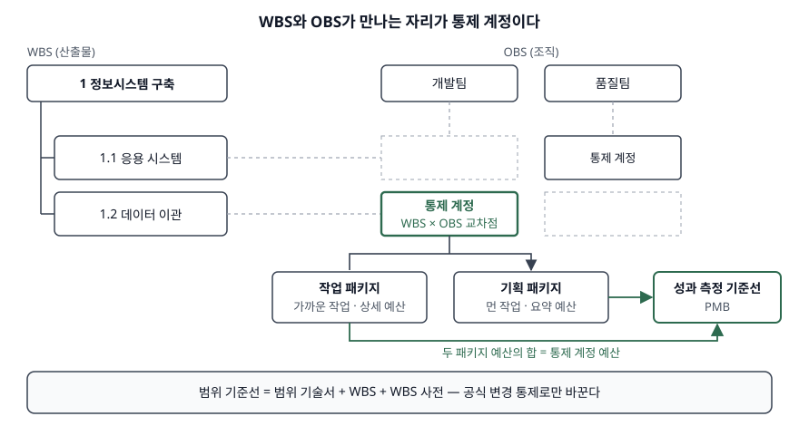

> **실행 검증 없음.** 표준·공공기관 문서의 정의와 구조를 정리한 개념 글이다. 출력·측정값은 싣지 않는다.

## 들어가며

정보시스템 구축사업에서 "범위가 어디까지냐"는 다툼은 대개 착수 몇 달 뒤에 터진다. 그때 기준이 되는
문서가 범위 기준선이고, 그 뼈대가 WBS다. 시험은 WBS를 트리 그림으로 묻지 않고 **WBS가 일정·원가·조직
데이터와 어떻게 이어지는가** — 통제 계정과 작업 패키지 — 를 쓸 수 있는지를 묻는다. 이 연결이 없으면
진척률도 원가 차이도 WBS 요소 단위로 모이지 않는다.

## 정의

**WBS(작업 분할 구조)**: 프로젝트의 정의된 범위를 점점 낮은 수준의 작업 요소로 분해한 구조다(ISO 21511:2018).
NASA WBS Handbook은 여기에 **산출물 중심**을 붙여, 만들 하드웨어·소프트웨어·서비스를 계층으로 나누고
각 요소를 최종 산출물과 잇는 구조로 정의한다.

**범위 기준선(scope baseline)**: 공식 변경 통제로만 바꿀 수 있고, 실제 결과와 비교하는 기준으로 쓰는
**승인된 범위 문서**다(PMI 용어집 4.0). PMBOK 6판은 그 구성을 **범위 기술서 + WBS + WBS 사전**으로 든다.

**통제 계정(control account)**: WBS 요소 중 책임 조직이 지정된 자리로, 책임 배정 매트릭스(RAM)에서
**WBS와 조직 분해 구조(OBS)의 교차점**이다(NASA Handbook 용어집). PMI 용어집은 범위·예산·실제 원가·일정이
통합돼 획득가치와 비교되는 관리 통제점으로 정의한다.

## 등장 배경

WBS 없이 사업을 관리할 때 생기는 문제는 **세 가지**다.

- **범위의 경계가 없다.** 활동 목록이나 조직별 업무 분장은 무엇이 빠졌는지 검사할 수 없다. NASA Handbook은
  완료 기준으로 검증할 수 있는 WBS 요소만큼 성과 평가의 근거가 되는 다른 구조(회계 계정, 기능 조직, 원가 요소)가
  없다고 적는다.
- **데이터가 위로 모이지 않는다.** 한 작업이 두 요소에 나뉘어 잡히면 원가·일정을 합산할 수 없다. 핸드북은
  제대로 만든 WBS를 **한 작업 범위를 두 요소에 배분하지 않고** 사업 수준까지 집계되는 구조로 본다.
- **책임과 측정 단위가 어긋난다.** 조직은 부서로, 예산은 계정으로, 일정은 활동으로 따로 관리하면 차이가
  생겨도 어디서 생겼는지 추적할 수 없다. 그래서 WBS와 OBS를 교차시킨 통제 계정이 필요해졌다.

## 구성요소 / 절차

### 범위 기준선의 구성 — 3가지 (PMBOK 6판)

1. **범위 기술서** — 산출물·인수 기준·제외 범위
2. **WBS** — 산출물 중심의 계층 분해. 하위 요소의 합이 상위 요소의 100%(100% 규칙)
3. **WBS 사전** — 요소마다 작업 내용을 기술한 통제 문서

### WBS 사전의 기재 항목 — 8가지 (NASA Handbook 3.4.4)

| 항목 | 항목 |
|---|---|
| ① 요소 이름 | ⑤ 범위 정의 문단 번호 |
| ② 요소 코드 | ⑥ 관련 규격서 번호·제목 |
| ③ 작업 내용 기술(수량, 계약 인도 품목) | ⑦ 작성일·개정 번호·승인된 변경 |
| ④ WBS 색인(계층 들여쓰기) | ⑧ 예산·보고 번호(비용 청구 코드) |

계약 WBS 사전이면 **계약 품목 번호와 계약 식별 번호 2가지**를 더한다. 핸드북은 WBS 사전을 기준선 문서로
두고 형상 통제 절차에 따라 개정하게 한다.

### 통제 계정 아래의 분해 — 2가지 패키지 (DoD EVMSIG 지침 10·11)

- **작업 패키지(WP)** — 가까운 기간의 작업. 측정 가능한 단위로 예산을 잡는다
- **기획 패키지(PP)** — 현재 계획 기간 밖의 작업. 요약 수준으로 예산과 일정만 둔다

**작업 패키지와 기획 패키지 예산의 합은 통제 계정 예산과 같아야 한다**(지침 11). 100% 규칙이 범위에서
예산으로 이어지는 자리다. 통제 계정조차 정할 수 없는 먼 작업은 통제 계정 위에 **요약 기획 패키지(SLPP)** 로
둔다(지침 8).

### 작업 패키지의 특성 — 7가지 (NASA Handbook 용어집)

실제 작업이 수행되는 수준, 다른 패키지와 구분, 단일 조직 배정, 시작·완료일과 중간 마일스톤, 금액·공수 예산,
짧은 기간 또는 측정 가능한 마일스톤, 상세 일정과의 통합.

## 도식

> **출처**: [NASA WBS Handbook REV1 §3.3.4 Number of Levels (Figure 3-7), Appendix B Glossary](https://ntrs.nasa.gov/api/citations/20160014629/downloads/20160014629.pdf) · [DoD EVMSIG Guideline 5, 8, 10, 11](https://www.acq.osd.mil/asda/dpc/api/ipm/docs/dod_evmsig_14mar2019.pdf)

답안지에는 왼쪽에 WBS 트리, 위에 OBS를 그리고 둘이 만나는 칸을 통제 계정으로 표시한다. 그 칸 아래에
작업 패키지(가까운 작업)와 기획 패키지(먼 작업)를 나누고, 오른쪽에 **예산을 시간에 배분한 성과 측정 기준선(PMB)**
으로 올라가는 화살표를 그린다.

## 비교

### 기준선 4가지 (PMI 용어집 4.0)

| 기준선 | 무엇의 승인본인가 | 비교 대상 |
|---|---|---|
| 범위 기준선 | 범위 문서(범위 기술서·WBS·WBS 사전) | 실제 산출물 |
| 일정 기준선 | 일정 모델 | 실제 일정 |
| 원가 기준선 | 시간 배분된 예산(관리 예비비 제외) | 실제 원가 |
| 성과 측정 기준선 | 범위·일정·원가 기준선의 통합 | 획득가치 |

### 통제 계정·작업 패키지·기획 패키지

| 구분 | 통제 계정 | 작업 패키지 | 기획 패키지 |
|---|---|---|---|
| 위치 | WBS × OBS 교차점 | 통제 계정 아래 | 통제 계정 아래 |
| 대상 기간 | 전체 | 가까운 작업 | 먼 작업 |
| 상세도 | 책임자(CAM)·범위·예산 | 일정·예산·측정 기법까지 | 요약 예산·일정 |
| 성과 측정 | 이 단위에서 집계 | 획득가치를 잡는 단위 | 작업 패키지로 바뀐 뒤 |

### WBS와 활동 목록

WBS는 **무엇을 만드는가**, 활동 목록은 **어떻게·언제 하는가**다. WBS 요소는 명사(산출물)로, 활동은 동사로 쓴다.
활동은 작업 패키지 아래에서 일정 모델로 넘어간다.

## 적용 시 고려사항

- **WBS 코드를 정보시스템 간 공통 키로 설계한다.** NASA Handbook은 요소 번호가 그 요소의 수준과 상위 요소를
  드러내야 한다고 적고, NASA 재무 시스템은 원가를 7레벨까지만 잡는다. DoD EVMSIG는 직접비를 WBS 요소별(지침 17)과
  조직별(지침 18)로 각각 집계하게 한다. 일정 도구·회계·위험 관리 시스템이 같은 코드를 쓰지 않으면 집계가 사람 손으로 된다.
- **통제 계정의 수준을 먼저 정한다.** 핸드북은 통제 계정을 모든 가지에서 같은 레벨에 둘 필요가 없다고 적는다.
  너무 위에 두면 차이의 원인이 가려지고, 너무 아래에 두면 책임자와 보고서가 늘어난다. 사업 규모와 관리 범위(span of control)로 정한다.
- **변경은 기준선 개정으로 다룬다.** 핸드북 변경 통제 절(3.3.6)은 기준선 WBS를 고칠 때마다 변경 근거와 사업
  관리자 승인을 형상·데이터 관리 절차로 남기게 한다. WBS 사전과 예산 코드도 같이 바뀌어야 한다.
- **기획 패키지를 제때 작업 패키지로 바꾼다.** 먼 작업을 요약으로 두는 연동 기획은 허용되지만, 전환이 늦으면
  성과를 측정할 단위가 없다. EVMSIG는 계획 기간을 정해 요약 기획 패키지를 통제 계정으로 옮기게 한다.
- **계약 WBS는 사업 WBS의 연장으로만 만든다.** 핸드북은 수행사의 계약 WBS를 상위 요소의 확장으로 보고, 상위 요소
  범위를 벗어나는 작업을 넣지 못하게 한다. 수행사 시스템의 코드가 발주자 WBS로 그대로 올라와야 한다.

> 기출 답안: [기출문제 — WBS 작성 방법](../../exam/2026-09-28-wbs-construction/index.md)
>
> 관련 개념: [형상관리와 기준선](../../software-engineering/2026-09-22-configuration-management-baseline/index.md)

## 정리

- 범위 기준선 **3구성** — 범위 기술서 · WBS · WBS 사전. "기·W·사".
- 통제 계정 = **WBS × OBS 교차점**. 범위·예산·실제 원가·일정이 한 곳에서 만난다.
- 통제 계정 아래 **2패키지** — 작업 패키지(가까운 작업) · 기획 패키지(먼 작업). 예산 합 = 통제 계정 예산.
- WBS 사전 **8항목**, 작업 패키지 **7특성**(NASA).
- 기준선 **4가지** — 범위 · 일정 · 원가 · 성과 측정(앞의 셋의 통합).

## 참고 자료

- [ISO 21511:2018 Work breakdown structures for project and programme management](https://www.iso.org/standard/69702.html) — WBS 정의, 100% 규칙
- [NASA/SP-2016-3404/REV1, NASA Work Breakdown Structure (WBS) Handbook (2018-01)](https://ntrs.nasa.gov/api/citations/20160014629/downloads/20160014629.pdf) — §2.2 WBS Hierarchy, §3.3.4 Number of Levels (Figure 3-7), §3.3.6 Change Control, §3.4.4 Preparing a WBS Dictionary, Appendix B Glossary
- [DoD Earned Value Management System Interpretation Guide (2019-03-14)](https://www.acq.osd.mil/asda/dpc/api/ipm/docs/dod_evmsig_14mar2019.pdf) — Guideline 5 (Control Accounts), 8 (PMB), 10 (WP/PP), 11 (Sum WP/PP Budgets), 17·18 (Summarize Direct Costs)
- [PMI Lexicon of Project Management Terms, Version 4.0 (2024)](https://www.pmi.org/pmbok-guide-standards/lexicon) — control account, scope baseline, schedule baseline, cost baseline, performance measurement baseline
- PMI, A Guide to the Project Management Body of Knowledge (PMBOK Guide) 6th Edition (2017) — §5.4 Create WBS, 범위 기준선 구성
