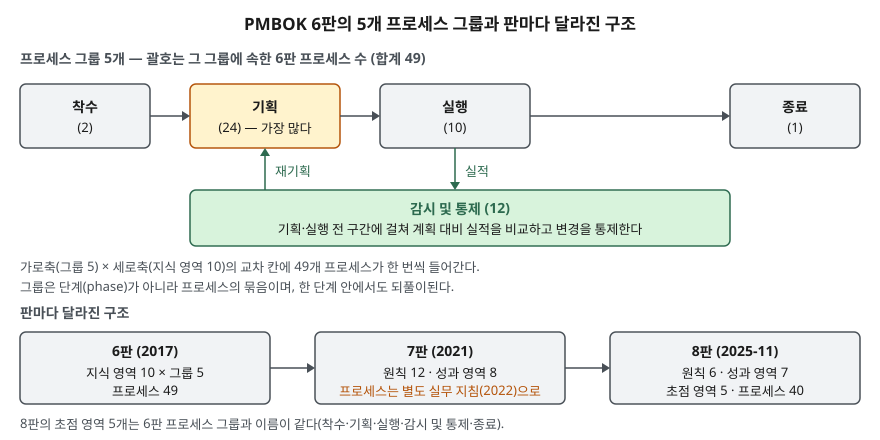

> **실행 검증 없음.** 개념 정리 글이며 출력·측정값은 싣지 않는다.
>
> 1차 자료 없음 — PMBOK 가이드 원문은 PMI 유료 간행물이라 이 글에서 직접 열람하지 못했다. 2차 자료 3건 이상을 교차 확인해 정리했고, 출처마다 발행일을 적었다.

## 들어가며

정보시스템 구축사업의 수행계획서 목차를 범위·일정·원가·품질·위험·의사소통 관리로 나눠 본 적이 있다면, 그 구분은 PMBOK 6판의
지식 영역 이름과 같다. 시험은 이 틀을 **지식 영역과 프로세스 그룹의 매트릭스**로 묻고, 최근에는 7판·8판에서
구조가 어떻게 바뀌었는지까지 묻는다. 칸을 채울 수 있어야 "위험 대응 실행은 어느 그룹인가" 같은 문항에서 점수가 난다.

## 정의

**PMBOK 가이드**: 미국 PMI가 발행하는 프로젝트 관리 지식 체계 가이드다. 1996년 초판 이후 2000·2004·2008·2013·2017·2021년에 판을 바꿨고 8판이 2025년 11월에 나왔다(Wikipedia, 2026-10-01 열람).

**프로세스 그룹**: 프로젝트 관리 프로세스를 목적에 따라 묶은 논리적 묶음이다. 착수·기획·실행·감시 및 통제·종료의 5개이며,
**프로젝트 단계(phase)가 아니다.** 한 단계 안에서도 다섯 그룹이 모두 되풀이된다(MPUG — 6판 표 1-3을 근거로 든다, BrainBOK 학습 가이드).

**지식 영역**: 관리 대상 분야별로 프로세스를 묶은 축이다. 6판은 10개다.

## 등장 배경

"일정 관리"라는 말 하나로는 일정을 세우는 일인지, 실적과 비교해 바로잡는 일인지 구분되지 않는다. 6판은 관리 활동을
**두 축으로 나눠** 이 모호함을 없앴다. 무엇을 관리하는가(지식 영역)와 무슨 목적의 활동인가(프로세스 그룹)다.
그래서 "일정 개발"은 일정×기획, "일정 통제"는 일정×감시 및 통제 칸에 따로 놓인다. 각 프로세스는 입력·도구 및 기법·산출물(ITTO)로 정의된다.

7판(2021)은 애자일 실무를 더 넓게 담으면서 지식 영역과 프로세스 그룹을 본문에서 빼고 원칙과 성과 영역으로 바꿨다(Wikipedia).
49개 프로세스는 PMI가 따로 낸 『Process Groups: A Practice Guide』(2022)로 옮겨 갔다. 8판(2025)은 7판의 원칙 기반을 유지하면서
40개 프로세스를 본문에 되살렸다. 두 2차 자료는 이를 7판의 유연성과 이전 판의 구조를 합친 것으로 설명한다(PM Study Circle 2026-02-28, BrainBOK 2026-04-04).

## 구성요소 / 절차

### 6판 매트릭스 — 지식 영역 10 × 프로세스 그룹 5 = 프로세스 49

| 지식 영역 | 착수 | 기획 | 실행 | 감시 및 통제 | 종료 | 계 |
|---|---|---|---|---|---|---|
| ① 통합 | 헌장 개발 | 관리계획서 개발 | 작업 지휘·관리, **지식 관리** | 작업 감시·통제, 통합 변경통제 | 프로젝트·단계 종료 | 7 |
| ② 범위 | | 범위관리 계획, 요구사항 수집, 범위 정의, WBS 작성 | | 범위 확인, 범위 통제 | | 6 |
| ③ 일정 | | 일정관리 계획, 활동 정의, 순서 배열, 기간 산정, 일정 개발 | | 일정 통제 | | 6 |
| ④ 원가 | | 원가관리 계획, 원가 산정, 예산 결정 | | 원가 통제 | | 4 |
| ⑤ 품질 | | 품질관리 계획 | 품질 관리(Manage) | 품질 통제 | | 3 |
| ⑥ 자원 | | 자원관리 계획, 활동자원 산정 | 자원 확보, 팀 개발, 팀 관리 | **자원 통제** | | 6 |
| ⑦ 의사소통 | | 의사소통관리 계획 | 의사소통 관리 | 의사소통 감시 | | 3 |
| ⑧ 위험 | | 위험관리 계획, 식별, 정성 분석, 정량 분석, 대응 계획 | **위험 대응 실행** | 위험 감시 | | 7 |
| ⑨ 조달 | | 조달관리 계획 | 조달 수행 | 조달 통제 | | 3 |
| ⑩ 이해관계자 | 이해관계자 식별 | 참여 계획 | 참여 관리 | 참여 감시 | | 4 |
| **계** | **2** | **24** | **10** | **12** | **1** | **49** |

굵게 쓴 3개(지식 관리·자원 통제·위험 대응 실행)는 6판에서 새로 생긴 프로세스다(Ricardo Vargas).
두 2차 자료의 표가 **자원 확보** 칸에서 갈렸다(기획 대 실행). 그룹별 합계 2·24·10·12·1이 맞는 쪽은 실행이므로 실행으로 적었다.

### 착수 그룹 2개, 종료 그룹 1개

착수는 **헌장 개발**과 **이해관계자 식별** 둘뿐이다. 종료는 통합 영역의 **프로젝트·단계 종료** 하나다.
6판에서 조달 종료는 별도 프로세스가 아니므로 "종료 2개"로 쓰면 틀린다.

## 도식

> **출처**: 그룹별 프로세스 수는 [PM Playbook — The 49 Project Management Processes (PMBOK 6)](https://pmplaybook.pro/processes/)와 [Visual Paradigm — PMBOK 6: 10 Knowledge Areas & 49 Processes](https://www.visual-paradigm.com/guide/pmbok/pmbok-6-10-knowledge-areas-and-49-processes/)의 합계, 7판·8판 구성은 [BrainBOK — PMBOK Guide 7th vs 8th Edition](https://www.brainbok.com/blog/pmp/pmbok-guide-7th-vs-8th-edition-what-has-changed) (2차 자료 기반)

답안지에는 위에 착수 → 기획 → 실행 → 종료를 한 줄로 긋고, 아래에 감시 및 통제를 길게 깐 뒤 실행에서 내려가는 화살표(실적)와
기획으로 올라가는 화살표(재기획)를 그린다. 각 상자 옆에 2·24·10·12·1을 적으면 개수가 한눈에 보인다.

## 비교

### 6판 → 7판 → 8판

| 구분 | 6판 (2017) | 7판 (2021) | 8판 (2025-11) |
|---|---|---|---|
| 중심 구조 | 지식 영역 10 × 프로세스 그룹 5 | 원칙 12 · 성과 영역 8 | 원칙 6 · 성과 영역 7 · 초점 영역 5 |
| 프로세스 | 49 (ITTO 포함) | 본문에서 뺌 → 『Process Groups: A Practice Guide』(2022)가 49개를 이어받음 | 40 (비규범적 — 조정해 쓴다) |
| 시간 축 | 프로세스 그룹 | 없음 | 초점 영역 — 이름은 6판 그룹과 같다 |

### 6판 지식 영역 → 8판 성과 영역 대응 (BrainBOK·ProjInsights 기준)

| 8판 성과 영역 | 프로세스 수 | 흡수한 6판 지식 영역 |
|---|---|---|
| 거버넌스 | 9 | 통합, 품질 일부 |
| 범위 | 6 | 범위, 품질 일부 |
| 일정 | 3 | 일정 |
| 재무 | 4 | 원가 |
| 이해관계자 | 7 | 이해관계자, 의사소통 |
| 자원 | 5 | 자원 |
| 위험 | 6 | 위험 |

조달은 성과 영역으로 남지 않고 부록으로 옮겨졌고(BrainBOK), 거버넌스 영역에 조달 전략 수립(Plan Sourcing Strategy) 프로세스가 들어갔다(ProjInsights). 일정 영역은 6판의 6개가
계획·개발·감시 통제 3개로 줄었다. 두 2차 자료의 영역별 프로세스 수(9·6·3·4·7·5·6, 합계 40)는 일치했다.

## 적용 시 고려사항

- **판을 밝히고 쓴다.** "PMBOK 10대 지식 영역"은 6판 기준이다. 8판 기준으로 쓰면 7개 성과 영역이다. 답안 첫 줄에 판을 적어 두면
  둘을 섞어 쓴 것으로 감점될 일이 없다.
- **공공 SI 산출물과의 대응을 정한다.** 수행계획서·WBS·위험관리대장·변경요청서 같은 산출물이 어느 프로세스의 산출물인지 맞춰 두면
  PMO가 산출물 누락을 칸 단위로 점검할 수 있다. 사업관리 시스템(PMIS)의 메뉴도 같은 구분으로 설계하면 데이터가 한 체계로 모인다.
- **49칸을 다 채우지 않는다.** 8판이 프로세스를 "비규범적"으로 되살린 것은 사업 규모에 맞춰 줄여 쓰라는 뜻이다. 소규모 사업에서
  정량 위험 분석이나 조달 통제를 형식으로만 채우면 문서만 늘고 관리 정보는 늘지 않는다. 무엇을 뺐는지와 이유를 관리계획서에 남긴다.
- **감시 및 통제는 시스템으로 받쳐야 한다.** 12개 통제 프로세스는 계획 대비 실적 데이터를 전제로 한다. 진척·원가·결함 데이터가
  WBS 코드로 모이지 않으면 통제 프로세스는 회의록만 남는다.

> 기출 답안: [기출문제 — WBS 작성 방법](../../exam/2026-09-28-wbs-construction/index.md) · [기출문제 — PMC와 PMO](../../exam/2026-09-21-pmc-pmo/index.md)
>
> 관련 개념: [WBS와 범위 기준선](../2026-09-29-wbs-scope-baseline-control-account/index.md)

## 정리

- 6판 = **지식 영역 10 × 프로세스 그룹 5 = 49**. 그룹별 **2·24·10·12·1**. 착수 2개는 헌장·이해관계자 식별, 종료 1개는 프로젝트·단계 종료.
- 지식 영역 10개 암기: **통·범·일·원·품·자·의·위·조·이**. 프로세스가 가장 많은 영역은 통합·위험(7개씩).
- 6판 신설 3개 — 지식 관리 · 자원 통제 · 위험 대응 실행.
- 7판(2021)은 원칙 12·성과 영역 8, 8판(2025-11)은 **원칙 6 · 성과 영역 7 · 초점 영역 5 · 프로세스 40**.
- 프로세스 그룹은 단계가 아니다. 한 단계 안에서 다섯 그룹이 되풀이된다.

## 참고 자료

- PMI, A Guide to the Project Management Body of Knowledge (PMBOK Guide) 6th Edition (2017) · 7th Edition (2021) · 8th Edition (2025) — 원문. 유료 간행물이라 이 글에서는 직접 열람하지 못했다
- PMI, Process Groups: A Practice Guide (2022-11) — 6판의 49개 프로세스를 이어받은 실무 지침. 원문 미열람
- [PM Playbook — The 49 Project Management Processes (PMBOK 6)](https://pmplaybook.pro/processes/) — 영역별·그룹별 프로세스 목록 (발행일 표기 없음, 2026-10-01 열람)
- [Visual Paradigm — PMBOK 6: The 10 Knowledge Areas & 49 Processes](https://www.visual-paradigm.com/guide/pmbok/pmbok-6-10-knowledge-areas-and-49-processes/) — 매트릭스 (발행일 표기 없음, 자원 확보 칸이 합계와 맞지 않는다)
- [Ricardo Vargas — PMBOK Guide 6th Edition Processes Flow](https://ricardo-vargas.com/pmbok6-processes-flow/) — 6판 신설 프로세스 3개
- [BrainBOK — PMBOK Guide 7th vs 8th Edition (2026-04-04)](https://www.brainbok.com/blog/pmp/pmbok-guide-7th-vs-8th-edition-what-has-changed) — 8판 원칙·성과 영역·영역별 프로세스 수, 7판 영역의 재배치
- [ProjInsights — PMBOK 8th Edition Performance Domains and Processes](https://www.projinsights.com/pmbok-8th-edition-performance-domains-and-processes/) — 8판 40개 프로세스 이름 (발행일 표기 없음)
- [PM Study Circle — What is New in the PMBOK Guide 8th Edition? (2026-02-28)](https://pmstudycircle.com/pmbok-guide-8th-edition/) — 8판 발행 시기, 원칙 6·성과 영역 7·초점 영역 5
- [MPUG — What is the Difference between Process Groups and Phases?](https://mpug.com/back-to-basics-what-is-the-difference-between-process-group-and-phases) — 프로세스 그룹과 단계의 구분, 6판 표 1-3 인용 (발행일 표기 없음, 약 4년 전 게재·8개월 전 갱신으로 표시)
- [BrainBOK — Project Management Processes Overview](https://www.brainbok.com/guide/pm-fundamentals/project-management-processes/overview) — 프로세스는 단계마다 되풀이된다 (발행일 표기 없음)
- [Wikipedia — Project Management Body of Knowledge](https://en.wikipedia.org/wiki/Project_Management_Body_of_Knowledge) — 판별 발행 연도
