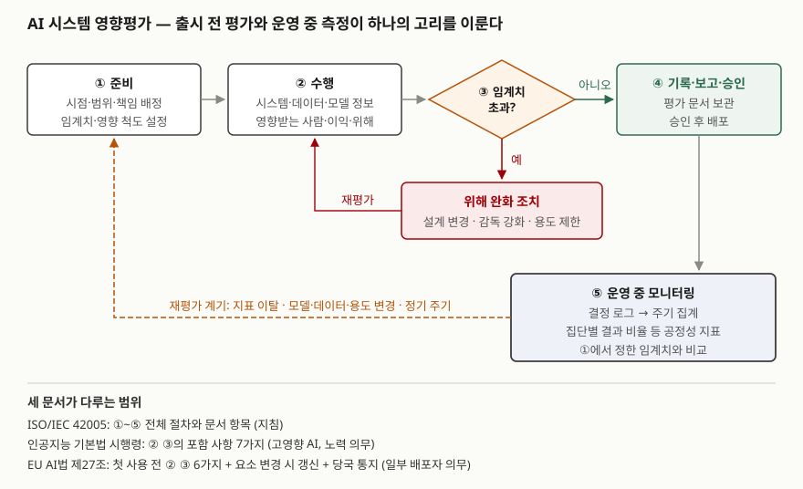

> 실행 검증 없음. 표준 원문과 법령 조문만 근거로 정리했다. ISO/IEC 42005는 유료 표준이라
> 공개된 미리보기의 목차·서문까지만 확인했고, 절 본문의 세부 문장은 옮기지 않았다.
> 절 이름에서 확인되지 않는 내용은 쓰지 않았다.

## 들어가며

고영향 AI 문항에서 영향평가는 "노력 의무"라는 한마디로 넘어가기 쉽다. 그러나 EU AI법은 공공기관 등
일부 배포자에게 기본권 영향평가를 **의무**로 지우고, 국내법은 영향평가를 거친 제품을 국가기관이
**우선 고려**하게 해 공공 조달에서 사실상 요건으로 만든다. 실무에서는 출시 전에 문서 한 벌을 만들고
끝내는 경우가 많은데, 그러면 운영 중 결과가 특정 집단에 기울어도 아무도 알아채지 못한다.
평가를 **운영 지표와 잇는 구조**까지 써야 정보관리 답안이 된다.

## 정의

**AI 시스템 영향평가(AI system impact assessment)**: AI 시스템의 개발·제공·사용이 **개인, 개인의 집단,
사회**에 미칠 수 있는 결과를 식별·평가하고 문서화하는 활동이다.

ISO/IEC 42001:2023은 조직이 이 평가 **과정을 수립**하도록 요구하고(6.1.4), 계획한 주기 또는 중대한 변경이
있을 때 평가를 **수행하고 결과를 문서로 유지**하도록 요구한다(8.4). ISO/IEC 42005:2025는 그 과정을 어떻게
만들고 무엇을 문서에 담을지 안내하는 **지침 표준**이다. 요구사항(shall)이 아니라 권고(should)로 쓰였다.

법은 범위를 좁힌다. EU AI법의 **기본권 영향평가(FRIA, Fundamental Rights Impact Assessment)** 는 고위험 AI가
기본권에 주는 영향을, 인공지능 기본법의 영향평가는 고영향 AI가 **기본권**에 주는 영향을 다룬다.

## 등장 배경

AI 이전에도 영향평가는 있었다. 개인정보 영향평가(국내 개인정보 보호법 제33조, EU GDPR 제35조)는
개인정보 처리가 정보주체에게 주는 위험을 본다. 그러나 AI의 피해는 개인정보 침해에 그치지 않는다.
채용 모델이 특정 성별의 합격률을 낮추면 개인정보는 한 건도 새지 않았어도 차별이 생긴다.

조직의 위험관리(ISO/IEC 23894)로도 부족했다. 위험관리는 **조직의 목표**에 대한 불확실성을 다루므로
조직에 손해가 없는 피해는 우선순위에서 밀린다. ISO/IEC 42005 서문은 거버넌스(ISO/IEC 38507)·
위험관리(ISO/IEC 23894)·경영시스템(ISO/IEC 42001)이 모두 개인과 사회에 대한 영향을 고려할 필요를 짚는다고
적고, 영향평가를 이 체계를 잇는 조각으로 놓는다. **누가 피해를 입는가**를 조직 바깥의 관점에서 따로
묻는 절차가 필요했던 것이다.

## 구성요소 / 절차

### ISO/IEC 42005 — 절차 요소 11가지 (5장)

5장은 일반(5.1)에 이어 영향평가 과정을 이루는 요소를 절마다 하나씩, 모두 11개 절(5.2~5.12)로 둔다.
성격에 따라 준비 6 · 수행 1 · 분석 1 · 기록·승인 2 · 운영 1로 묶인다.

| 절 | 요소 | 묶음 |
|---|---|---|
| 5.2 | 과정의 문서화 | 준비 |
| 5.3 | 다른 조직 관리 과정과의 통합 | 준비 |
| 5.4 | 영향평가 시점 | 준비 |
| 5.5 | 영향평가 범위 | 준비 |
| 5.6 | 책임 배정 | 준비 |
| 5.7 | 민감 용도·제한 용도·영향 척도의 임계치 설정 | 준비 |
| 5.8 | 영향평가 수행 | 수행 |
| 5.9 | 결과 분석 | 분석 |
| 5.10 | 기록과 보고 | 기록·승인 |
| 5.11 | 승인 과정 | 기록·승인 |
| 5.12 | 모니터링과 검토 | 운영 |

5.7이 이 표준의 특징이다. 어떤 용도를 민감하다고 볼지, 어느 정도의 영향을 받아들이지 않을지를 **평가 전에**
정해 두게 한다. 기준을 평가 뒤에 정하면 결과에 맞춰 기준이 움직인다.

### ISO/IEC 42005 — 문서 항목 8가지 (6장)

| 절 | 항목 | 담는 것 (하위 절 제목 기준) |
|---|---|---|
| 6.2 | 평가 범위 | — |
| 6.3 | AI 시스템 정보 | 설명, 기능·역량, 목적, 의도된 용도, **의도하지 않은 용도** |
| 6.4 | 데이터 정보와 품질 | 데이터 정보, 데이터 품질 문서 |
| 6.5 | 알고리즘·모델 정보 | 알고리즘과 그 개발, 모델과 그 개발 |
| 6.6 | 배포 환경 | 지역·언어, 환경의 복잡도와 제약 |
| 6.7 | 관련 이해관계자 | **직접 영향받는** 이해관계자, 그 밖의 이해관계자 |
| 6.8 | 실제·합리적으로 예견 가능한 영향 | 이익과 위해, 시스템 고장과 예견 가능한 오용 |
| 6.9 | 이익·위해 대응 조치 | — |

부속서는 **5개**다. 42001과 함께 쓰는 법(A), 23894와 함께 쓰는 법(B), 이익·위해 분류 체계(C),
다른 평가와 맞추는 법(D), 평가 양식 예시(E).

### 법이 요구하는 포함 사항 — 7가지 대 6가지

| 인공지능 기본법 시행령 (7가지) | EU AI법 제27조 제1항 (6가지) |
|---|---|
| ① 영향받을 개인·집단 식별 (취약계층 특성 반영) | (c) 영향받을 자연인·집단의 범주 |
| ② 영향받는 기본권 유형 식별 | (d) 그 범주에 대한 구체적 위해 위험 |
| ③ 기본권에 대한 사회적·경제적 영향 | (d)에 포함 |
| ④ 고영향 AI의 사용 행태 | (a) 배포자의 업무 절차와 의도된 목적 내 사용, (b) 사용 기간과 빈도 |
| ⑤ 정량·정성 평가지표와 결과 산출 방식 | — |
| ⑥ 위험 예방·완화·손실 복구 조치 | (f) 위험 현실화 시 조치, 내부 거버넌스·민원 처리 |
| ⑦ 개선이 필요하면 이행계획 | — |
| — | (e) 사용 설명서에 따른 인적 감독 조치 |

국내 ⑤가 눈에 띈다. 평가지표와 **결과를 산출하는 방식**까지 적게 하므로, 같은 평가를 다시 돌렸을 때 같은
값이 나와야 한다. EU는 대신 인적 감독(e)을 별도 항목으로 두고, 결과를 시장감시당국에 **통지**하게 한다(제3항).

## 도식

> **출처**: [ISO/IEC 42005:2025 — Contents, 5.4~5.12, 6.3~6.9 (iTeh 미리보기)](https://cdn.standards.iteh.ai/samples/iso/iso-iec-42005-2025/08d7e571c9c3429d82aceca0b4746d01/iso-iec-42005-2025.pdf) · [EUR-Lex, Regulation (EU) 2024/1689 — Article 27](https://eur-lex.europa.eu/eli/reg/2024/1689/oj) · [국가법령정보센터, 인공지능 기본법 시행령 — 제28조](https://www.law.go.kr/법령/인공지능발전과신뢰기반조성등에관한기본법시행령)

답안지에는 ①준비 → ②수행 → ③임계치 판정 → ④기록·승인의 가로 줄과, ④에서 내려와 ①로 돌아가는
점선 고리(⑤ 운영 측정) 하나를 그린다. 고리가 없으면 평가는 출시 시점의 사진 한 장이다.

### 운영 중 공정성 지표를 계속 재는 구조

도식의 ⑤는 정보시스템이 맡는다.

1. **결정 로그**: 결과마다 입력, 모델 버전, 결과값, 시각을 남긴다. EU 배포자는 자동 생성 로그를 최소
   6개월 보관해야 한다(제26조 제6항)
2. **집단 속성 연결**: 집단별로 나누려면 성별·연령 같은 속성이 필요하다. 이것이 민감정보에 해당하면 처리
   근거가 따로 있어야 한다(개인정보 보호법 제23조). EU AI법은 고위험 AI 제공자가 편향 탐지·교정에 꼭 필요한
   범위에서 특수 범주 개인정보를 예외적으로 처리할 수 있게 한다(제10조 제5항)
3. **주기 집계와 비교**: 집단별 승인율·합격률 같은 결과 비율을 주기마다 계산해 5.7에서 정한 임계치와
   비교한다. 공개된 기준선의 예로 미국 고용 선발 지침의 4/5 규칙이 있다. 어떤 집단의 선발률이 가장 높은
   집단의 80% 미만이면 불리한 영향의 증거로 본다(29 CFR 1607.4(D)). 국내법은 수치 기준을 정하지 않았다
4. **재평가 계기**: 임계치를 벗어나거나, 모델·학습 데이터·용도가 바뀌면 ①로 돌아간다. EU는 평가 요소가
   바뀌면 갱신하게 하고(제27조 제2항), 42001은 중대한 변경 시 재수행을 요구한다

공정성 지표를 무엇으로 고를지는 ISO/IEC TR 24027:2021이 지표와 측정 기법을 정리해 둔다. 어떤 지표를
고르든 **선택한 이유와 계산 방식**을 평가 문서에 남겨야 국내 ⑤를 충족한다.

## 비교

| 비교 축 | AI 시스템 영향평가 (ISO/IEC 42005) | 기본권 영향평가 (EU AI법 제27조) | 영향평가 (인공지능 기본법 제35조) | 개인정보 영향평가 (개인정보 보호법 제33조) | AI 위험평가 (ISO/IEC 23894) |
|---|---|---|---|---|---|
| 성격 | 지침 (권고) | 법적 의무 | 노력 의무 | 공공기관 법적 의무 | 지침 (권고) |
| 누가 | AI를 개발·제공·사용하는 모든 조직 | 공공기관·공공서비스 제공 민간 배포자, 신용평가·생명·건강보험 가격 산정 배포자 | 고영향 AI 이용 제품·서비스 제공 사업자 | 일정 규모 이상 개인정보파일을 운용하는 공공기관 | AI를 다루는 조직 |
| 무엇에 대한 영향 | 개인·집단·사회 (이익과 위해 모두) | 자연인의 기본권 | 기본권 (취약계층 반영) | 정보주체의 개인정보 | **조직의 목표** |
| 언제 | 수명주기 전반 (시점 기준을 조직이 정함) | 첫 사용 전, 요소 변경 시 갱신 | 사전 | 개인정보파일 구축·변경 전 | 수명주기 전반 |
| 결과 처리 | 기록·보고·승인 | 시장감시당국 통지 | 국가기관등 우선 고려 근거 | 보호위원회 제출 | 위험 처리 계획 |

42005는 **이익도 평가한다**는 점이 법정 평가와 다르다. 위해만 세면 어떤 AI든 도입하지 말아야 한다는 결론에
가까워지므로, 이익과 위해를 함께 놓고 대응 조치(6.9)를 정한다. EU AI법은 개인정보 영향평가로 이미 충족한
부분을 기본권 영향평가가 **보완**하도록 정해(제27조 제4항) 두 평가를 겹쳐 쓰게 하고, 42005 부속서 D도 다른
평가와의 정렬을 다룬다.

## 적용 시 고려사항

- **기준을 먼저 정한다.** 민감 용도와 받아들일 수 없는 영향의 기준(5.7)을 평가 전에 문서로 확정한다.
  결과를 보고 기준을 정하면 평가가 정당화 문서가 된다.
- **한 번 쓰고 덮는 문서로 만들지 않는다.** 운영 로그와 공정성 지표 집계를 평가 문서의 ⑤ 항목에 연결해,
  지표가 임계치를 벗어나면 재평가 작업이 자동으로 열리게 한다. 모델 재학습·데이터 교체 배포 파이프라인에도
  재평가 확인을 관문으로 둔다.
- **집단 속성을 모을 근거를 먼저 확보한다.** 공정성을 재려면 속성이 필요하지만 그 속성이 민감정보일 수 있다.
  개인정보 영향평가와 함께 설계해 수집 근거·보관 기간·접근 통제를 정하고, 지표 집계는 가명 처리된 데이터로 한다.
- **평가를 하나로 합친다.** 같은 시스템에 대해 개인정보 영향평가·기본권 영향평가·AI 영향평가를 따로 쓰면
  같은 사실을 세 번 적고 서로 어긋난다. 42005 양식(부속서 E)을 바탕으로 국내 7가지와 EU 6가지를 열로 붙인
  통합 양식을 쓰고, 42001 경영시스템의 문서 관리에 넣는다.
- **공급망의 정보를 받아 둔다.** 배포자는 모델 내부를 모른다. EU는 배포자가 제공자의 정보를 근거로 위험을
  식별하게 하므로(제27조 제1항 (d)), 데이터·모델 정보(6.4·6.5)는 공급사에게 받아야 채울 수 있다. 도입 계약에
  제공 의무를 넣는다.

## 정리

- **정의 1줄**: AI의 개발·제공·사용이 개인·집단·사회에 미칠 결과를 식별·평가·문서화하는 활동. 위험평가는 조직, 영향평가는 **바깥**을 본다.
- **42005 숫자**: 절차 요소 11(5.2~5.12, 준비 6·수행 1·분석 1·기록·승인 2·운영 1) · 문서 항목 8(6.2~6.9) · 부속서 5(A~E). 핵심은 5.7 **임계치 선설정**.
- **법정 항목**: 국내 시행령 7가지(대상·권리·영향·사용 행태·**지표**·조치·개선계획), EU 제27조 6가지(절차·기간·대상·위해·**인적 감독**·조치).
- **강도 사다리**: 42005 권고 → 국내 노력 의무(공공 우선 고려) → EU 일부 배포자 의무(당국 통지).
- **고리 4단계**: 결정 로그 → 집단 속성 연결 → 주기 집계·임계치 비교 → 재평가.

> 기출 답안: [기출문제 — 인공지능 기본법의 고영향 인공지능: 정의, 활용 영역, 사업자의 안전성·신뢰성 확보 활동](../../exam/2026-10-05-high-impact-ai-basic-act/index.md)

> 함께 볼 글: [인공지능 기본법과 EU AI법 — 위험 기반 규제 구조 비교](../2026-10-05-korea-ai-basic-act-vs-eu-ai-act/index.md)

## 참고 자료

- [ISO/IEC 42005:2025 Information technology — Artificial intelligence (AI) — AI system impact assessment](https://www.iso.org/standard/42005) — 제1판 2025-05, ISO/IEC JTC 1/SC 42
- [iTeh Standards, ISO/IEC 42005:2025 미리보기 (목차·서문)](https://cdn.standards.iteh.ai/samples/iso/iso-iec-42005-2025/08d7e571c9c3429d82aceca0b4746d01/iso-iec-42005-2025.pdf)
- [ISO/IEC 42001:2023 Information technology — Artificial intelligence — Management system](https://www.iso.org/standard/81230.html) — 6.1.4, 8.4
- [ISO/IEC 23894:2023 Information technology — Artificial intelligence — Guidance on risk management](https://www.iso.org/standard/77304.html)
- [ISO/IEC TR 24027:2021 Information technology — Artificial intelligence (AI) — Bias in AI systems and AI aided decision making](https://www.iso.org/standard/77607.html)
- [EUR-Lex, Regulation (EU) 2024/1689 (Artificial Intelligence Act)](https://eur-lex.europa.eu/eli/reg/2024/1689/oj) — 제10조 제5항, 제26조, 제27조
- [Future of Life Institute, EU AI Act Article 27 (제3자 전재)](https://artificialintelligenceact.eu/article/27/) — 개정 규정 (EU) 2026/1744 반영본, 적용일 2027-12-02(부속서 III)
- [국가법령정보센터, 인공지능 발전과 신뢰 기반 조성 등에 관한 기본법 — 제35조](https://www.law.go.kr/법령/인공지능발전과신뢰기반조성등에관한기본법)
- [국가법령정보센터, 같은 법 시행령 — 제28조](https://www.law.go.kr/법령/인공지능발전과신뢰기반조성등에관한기본법시행령)
- [국가법령정보센터, 개인정보 보호법 — 제23조, 제33조](https://www.law.go.kr/법령/개인정보보호법)
- [Cornell LII, 29 CFR § 1607.4 Information on impact — (D) four-fifths rule](https://www.law.cornell.edu/cfr/text/29/1607.4)
