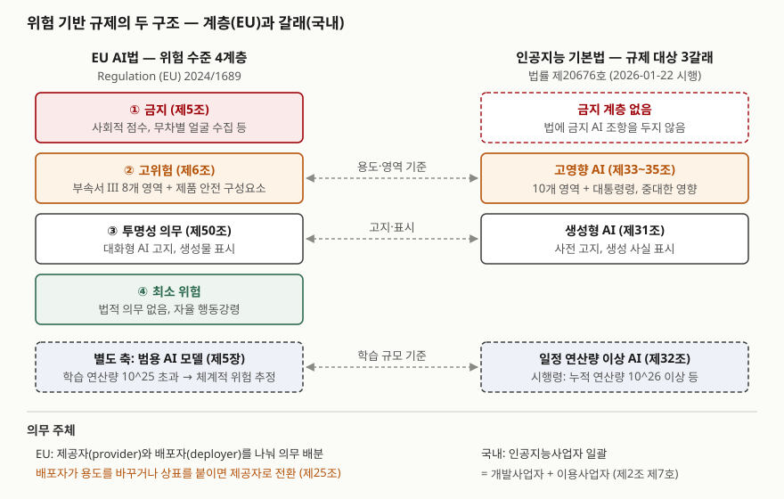

> 실행 검증 없음. 두 법의 조문과 집행기관 공개 자료만 근거로 정리했다. EU AI법은 EUR-Lex 원문을
> 기준으로 하되 조문별 대조는 조문 단위로 열리는 제3자 전재본으로 했고, 2026-07-27 발효한 개정
> 규정(EU) 2026/1744의 일정 변경을 반영했다.

## 들어가며

AI 규제 문항은 거의 언제나 "국내법과 EU AI법을 비교하라"는 꼴로 나온다. 두 법 모두 위험 기반이라는
같은 말을 쓰지만, 위험을 **어떤 단위로 나누는지**와 **누구에게 의무를 지우는지**가 다르다.
실무에서는 이 차이가 해외 AI 모델이나 솔루션을 들여올 때 계약서의 조항으로 나타난다.
어느 쪽 법을 따르느냐에 따라 공급사에게 받아야 할 문서와 우리가 직접 남겨야 할 기록이 달라진다.

## 정의

**위험 기반 규제(risk-based approach)**: AI 시스템이 만들 수 있는 위험의 **강도와 범위에 맞춰** 규칙의
종류와 내용을 달리 정하는 규제 방식이다. EU AI법 전문 제26항이 이 원칙을 명시한다.

두 법은 이 원칙을 다르게 구현한다.

- **EU AI법(Regulation (EU) 2024/1689)**: 위험 수준에 따라 **4계층**(수용 불가·고위험·투명성·최소 또는 무위험)으로
  나누고, 범용 AI 모델을 별도 축으로 규율한다. 4계층 표현은 집행기관인 유럽연합 집행위원회의 설명이다
- **인공지능 기본법**: 계층을 두지 않고 규제 대상을 **3갈래**(고영향·생성형·일정 연산량 이상)로 지정한다.
  진흥 조항과 규제 조항을 한 법에 함께 둔다

## 등장 배경

기존 규제는 둘 중 하나였다. 제품 안전법처럼 **물건의 종류**로 규제하거나, 개인정보 보호법처럼
**처리 행위**로 규제했다. AI는 두 틀에 모두 잘 맞지 않는다. 같은 모델이 영화 추천에 쓰이면 위험이 거의
없고 대출 심사에 쓰이면 신청인의 권리를 가른다. 모델 자체를 기준으로 일괄 규제하면 저위험 용도까지
막히고, 사후 개별 법령으로만 다루면 피해가 난 뒤에야 대응하게 된다. 그래서 두 법 모두 **용도와 영향**을
기준으로 대상을 고르고 그 대상에만 사전 의무를 지우는 방식을 택했다.

차이는 범용 AI를 다루는 방식에서 생겼다. EU 집행위원회의 2021년 제안서(COM(2021) 206)는 용도 기반
계층만 두었고, 범용 AI 모델 장(제5장)은 입법 과정에서 별도 축으로 더해졌다. 국내법은 2025-01 제정
때부터 생성형(결과물 종류)과 연산량(학습 규모)을 고영향(용도)과 같은 층위의 갈래로 두었다.

## 구성요소

### EU AI법 — 4계층 + 1축

| 계층 | 근거 | 대상 | 핵심 의무 |
|---|---|---|---|
| ① 수용 불가(금지) | 제5조 | 잠재의식 조작, 취약성 악용, 사회적 점수, 프로파일링만으로 한 범죄 예측, 무차별 얼굴 이미지 수집, 직장·교육 감정 추론, 민감 특성 생체 분류, 공공장소 실시간 원격 생체 식별 — **8가지**(가~아목) | 출시·사용 금지 |
| ② 고위험 | 제6조, 부속서 I·III | 제품 안전 법령의 안전 구성요소(부속서 I), 또는 부속서 III의 **8개 영역** | 위험관리·데이터 거버넌스·기술 문서·로그·인적 감독 등 + 적합성 평가 |
| ③ 투명성 위험 | 제50조 | 사람과 대화하는 AI, 합성 콘텐츠 생성, 감정 인식·생체 분류, 딥페이크 — **4개 항** | 고지·표시 |
| ④ 최소 | — | 나머지 | 의무 없음, 자율 행동강령(제95조) |
| 별도 축: 범용 AI 모델 | 제51~55조 | 범용 AI 모델, 학습 연산량 **10^25 FLOP 초과**면 체계적 위험 추정 | 기술 문서·저작권 정책, 체계적 위험이면 평가·사고 보고·보안 |

부속서 III 영역이라도 좁은 절차적 작업, 사람이 끝낸 결과의 보완 같은 **4가지 경우**에는 고위험에서
빠질 수 있다(제6조 제3항). 단 자연인을 프로파일링하면 이 예외가 적용되지 않는다.

2026-07-27 발효한 개정 규정(EU) 2026/1744는 금지 목록에 **동의 없는 성적 이미지 생성**과 **아동 성착취물
생성** 2가지를 더해 2026-12-02부터 적용하고, 고위험 의무 적용일을 부속서 III은 2027-12-02, 부속서 I은
2028-08-02로 미뤘다.

### 인공지능 기본법 — 3갈래

| 갈래 | 근거 | 무엇으로 고르나 | 핵심 의무 |
|---|---|---|---|
| ① 고영향 AI | 제2조 제4호, 제33~35조 | 활용 **영역**(법정 10개 + 대통령령)과 **중대한 영향** | 사전 검토, 사전 고지, 6가지 조치, 영향평가(노력) |
| ② 생성형 AI | 제31조 | 결과물 **종류** | 사전 고지, 생성 사실 표시, 실제와 구분 어려운 결과물의 명확한 고지·표시 |
| ③ 일정 연산량 이상 AI | 제32조 | 학습 **규모**(시행령: 누적 연산량 10^26 이상 등) | 수명주기 위험 식별·평가·완화, 위험관리체계, 결과 제출 |

갈래는 겹칠 수 있다. 대형 생성 모델을 채용 평가에 붙이면 ①②③이 모두 걸린다.

### 의무 주체 — 2개 대 1개

EU는 AI 시스템을 개발해 자기 이름으로 시장에 내놓는 **제공자(provider)** 와 그것을 자기 권한으로 쓰는
**배포자(deployer)** 를 정의(제3조 제3호·제4호)하고 의무를 나눈다. 배포자 의무는 제26조에 **12개 항**으로
있다. 사용 설명서에 따른 사용, 역량 있는 사람의 인적 감독, 입력 데이터의 적합성, 운영 모니터링과 사고
보고, **자동 생성 로그 최소 6개월 보관**, 근로자 사전 고지 등이다.

국내법은 **인공지능사업자** 하나로 묶는다. 인공지능을 개발해 제공하는 개발사업자와, 그것을 이용해
제품·서비스를 제공하는 이용사업자가 모두 여기에 든다(제2조 제7호). 의무는 사업자 전체에 걸리고,
시행령이 상위 단계 사업자가 이행한 조치를 하위 단계 사업자가 이행한 것으로 **간주**해 중복을 줄인다.

## 도식

> **출처**: [EUR-Lex, Regulation (EU) 2024/1689 — Article 5, 6, 25, 50, 51, Annex III](https://eur-lex.europa.eu/eli/reg/2024/1689/oj) · [European Commission, AI Act — Regulatory framework (4 levels of risk)](https://digital-strategy.ec.europa.eu/en/policies/regulatory-framework-ai) · [국가법령정보센터, 인공지능 발전과 신뢰 기반 조성 등에 관한 기본법 — 제2조, 제31조~제35조](https://www.law.go.kr/법령/인공지능발전과신뢰기반조성등에관한기본법)

답안지에는 왼쪽에 4층 사다리, 오른쪽에 갈래 3개를 그리고 가로 점선 3개로 대응을 잇는다.
핵심은 **국내에는 맨 위 칸(금지)이 비어 있다**는 점과, 아래 줄의 **주체 2개 대 1개**다.

## 비교

| 비교 축 | EU AI법 | 인공지능 기본법 |
|---|---|---|
| 분류 방식 | 위험 수준 **계층** (4계층 + 범용 AI 축) | 규제 대상 **갈래** (3갈래, 중복 가능) |
| 금지 AI | 있음 (8가지, 개정으로 10가지) | 없음 |
| 용도 기반 대상 | 고위험: 부속서 III 8개 영역 + 안전 구성요소 | 고영향: 법정 10개 영역 + 대통령령, 중대한 영향 요건 |
| 규모 기반 대상 | 범용 AI 모델 10^25 FLOP 초과 | 누적 연산량 10^26 이상 등 |
| 의무 주체 | 제공자·배포자 분리, 수입자·유통자 별도 | 인공지능사업자 일괄 |
| 공급망 처리 | 용도 변경·상표 부착 시 배포자가 **제공자로 전환**(제25조) | 상위 사업자 이행을 하위 사업자 이행으로 **간주**(시행령) |
| 영향평가 | 공공기관 등 일부 배포자의 기본권 영향평가 **의무**(제27조) | 사업자의 **노력 의무**(제35조) |
| 제재 | 과징금. 금지 위반 최대 3,500만 유로 또는 전 세계 매출 7%, 그 밖의 의무 위반 1,500만 유로 또는 3% | 과태료 3천만 원 이하. 고지 불이행, 국내대리인 미지정, 시정명령 불이행 3가지 |
| 역외 사업자 | EU 시장에 내놓거나 결과물이 EU에서 쓰이면 적용 | 매출·이용자 수 기준 이상이면 **국내대리인** 지정(제36조) |

설계 선택이 다르다. EU는 단일 시장의 **제품 규제** 틀을 빌려 와 적합성 평가와 CE 표시로 시장 진입을
통제하므로, 누가 시장에 내놓았는지(제공자)가 의무의 중심이 된다. 국내법은 **진흥 법**에 규제 조항을
얹은 구조라 금지 계층을 두지 않고, 정부가 확인·조사·시정명령으로 관리한다. 정부는 시행령 입법예고 때
과태료에 **최소 1년의 계도기간**을 두겠다고 밝혔다.

## 적용 시 고려사항

- **도입 계약에 용도 제한 조항을 넣는다.** EU에서는 배포자가 고위험이 아니던 AI의 용도를 바꿔
  고위험으로 만들면 그 배포자가 제공자가 된다(제25조 제1항 (c)). 국내에서도 이행 간주는
  **본래 목적을 바꾸지 않을 때만** 성립한다. 범용 모델을 받아 신용 평가에 붙이는 순간 상위 사업자의
  이행을 넘겨받지 못하므로, 계약서에 허용 용도를 적고 그 밖의 용도는 별도 평가를 거치게 한다.
- **공급사에게 받을 문서를 계약으로 정한다.** EU는 고위험 AI 제공자와 부품·도구 공급자가 필요한 정보와
  기술적 접근을 **서면 합의**로 정하게 한다(제25조 제4항). 국내 이행 간주를 쓰려면 상위 사업자의
  위험관리·설명 방안 이행 근거를 받아 두어야 하고, 이 근거는 5년 보관 대상이다.
- **로그 보존은 더 긴 쪽에 맞춘다.** EU 배포자는 자동 생성 로그를 최소 6개월, 국내 사업자는 조치 이행
  근거 문서를 5년 보관한다. 두 시장에 함께 서비스하면 로그 저장소를 한 번 설계해 긴 쪽 기준으로 둔다.
- **통제 항목을 하나로 맞춘다.** 두 법을 각각 대응하면 같은 위험관리·인적 감독 증빙을 두 벌 만든다.
  ISO/IEC 42001 AI 경영시스템의 통제 항목에 두 법의 요구를 매핑해 한 체계로 운영하는 편이 낫다.
- **개정을 추적한다.** EU는 발효 2년 만에 개정 규정으로 고위험 적용일을 미뤘고, 국내 시행령도 2026년
  안에 개정됐다. 적용일과 기준값(연산량, 국내대리인 기준)은 답안과 계약서에 "시행령으로 정하는"처럼
  근거 조문으로 적는다.

## 정리

- **정의 1줄**: 위험의 강도와 범위에 맞춰 의무를 달리 정하는 규제. EU는 **계층**, 국내는 **갈래**.
- **EU 4+1**: 금지(8, 개정 후 10) · 고위험(부속서 III 8영역) · 투명성(제50조 4개 항) · 최소 + 범용 AI(10^25).
- **국내 3**: 고영향(10영역 + 대통령령) · 생성형 · 일정 연산량 이상(10^26). 금지 계층 없음.
- **주체 2 대 1**: 제공자·배포자(용도 바꾸면 전환) 대 인공지능사업자(이행 간주).
- **계약 3조항**: 허용 용도 제한, 이행 근거 문서 수령, 로그·문서 보존 기간.

> 기출 답안: [기출문제 — 인공지능 기본법의 고영향 인공지능: 정의, 활용 영역, 사업자의 안전성·신뢰성 확보 활동](../../exam/2026-10-05-high-impact-ai-basic-act/index.md)

> 함께 볼 글: [AI 시스템 영향평가 — ISO/IEC 42005와 기본권 영향평가](../2026-10-05-ai-system-impact-assessment-iso-42005/index.md)

## 참고 자료

- [EUR-Lex, Regulation (EU) 2024/1689 (Artificial Intelligence Act)](https://eur-lex.europa.eu/eli/reg/2024/1689/oj) — 전문 제26항, 제3조, 제5조, 제6조, 제25조, 제26조, 제27조, 제50조, 제51조, 제95조, 제99조, 제113조, 부속서 III
- [EUR-Lex, Regulation (EU) 2026/1744 (Digital Omnibus on AI)](https://eur-lex.europa.eu/eli/reg/2026/1744/oj/eng) — 2026-07-24 관보 게재, 2026-07-27 발효
- [European Commission, AI Act — Shaping Europe's digital future](https://digital-strategy.ec.europa.eu/en/policies/regulatory-framework-ai) — 위험 4계층 설명
- [EUR-Lex, COM(2021) 206 final — Proposal for a Regulation laying down harmonised rules on artificial intelligence (2021-04-21)](https://eur-lex.europa.eu/legal-content/EN/TXT/?uri=CELEX:52021PC0206)
- [Future of Life Institute, EU Artificial Intelligence Act — 조문별 본문 (제3자 전재)](https://artificialintelligenceact.eu/article/5/) — 제5·6·25·26·27·50·51·99조 대조에 사용, 개정 반영본
- [Orrick, EU AI Act Update: Digital Omnibus Finalizes 8 Compliance Changes (2026-07)](https://www.orrick.com/en/Insights/2026/07/EU-AI-Act-Update-Digital-Omnibus-Finalizes-8-Compliance-Changes) — 개정 일정 대조용 2차 자료
- [국가법령정보센터, 인공지능 발전과 신뢰 기반 조성 등에 관한 기본법 (법률 제20676호 제정, 2026-01-22 시행 / 법률 제21311호 일부개정)](https://www.law.go.kr/법령/인공지능발전과신뢰기반조성등에관한기본법) — 제2조, 제31조~제36조, 제43조
- [국가법령정보센터, 같은 법 시행령](https://www.law.go.kr/법령/인공지능발전과신뢰기반조성등에관한기본법시행령) — 제27조 이행 간주
- [CaseNote, 인공지능 발전과 신뢰 기반 조성 등에 관한 기본법 (제3자 전재)](https://casenote.kr/법령/인공지능_발전과_신뢰_기반_조성_등에_관한_기본법)
- [대한민국 정책브리핑, AI기본법 시행령 입법예고 (2025-11-12)](https://www.korea.kr/news/policyNewsView.do?newsId=148954629) — 10^26 기준, 과태료 계도기간 1년 이상
- [ISO/IEC 42001:2023 Information technology — Artificial intelligence — Management system](https://www.iso.org/standard/81230.html)
