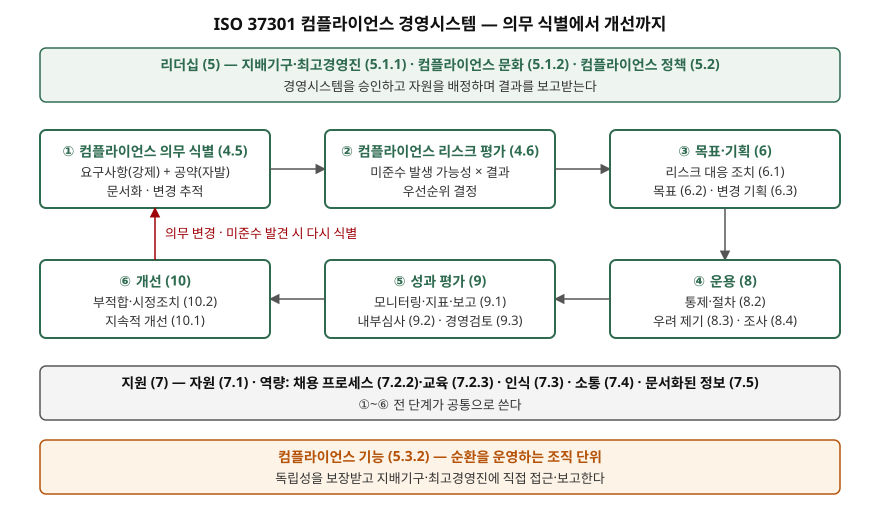

> 실행 검증 없음. 경영시스템 표준의 개념 글이므로 공개 문서 근거만으로 정리했다.
>
> ISO 37301:2021 본문은 유료이고 발행처 사이트가 자동 수집을 막아 조문을 직접 열지 못했다.
> 표준의 목적·발행일·원칙·적용 범위는 ISO/TC 309 위원회 페이지(1차)에서, 조항 번호와
> 용어 정의의 구성은 인증기관·점검표·컨설팅 자료 4건(PECB, Quentic, GoAudits, SmartSuite)을
> 교차 확인해 썼다. 정의 문장은 원문을 옮긴 것이 아니라 교차 확인한 뜻을 한국어로 다시 쓴 것이다.

## 들어가며

정보보호 컴플라이언스 기출에서 대응 방안을 쓰면 "법령을 식별하고 통제를 만들고 증적을
남긴다"까지는 누구나 쓴다. 채점자가 보는 것은 그 순서가 **어느 표준의 구조에서 나온
것인지**다. ISO 37301은 그 구조를 요구사항으로 적어 둔 유일한 국제표준이고, 2021년부터
인증까지 받을 수 있다. 실무에서는 정보통신망법·개인정보 보호법·전자금융거래법처럼 여러
법이 겹치는 조직이 법마다 따로 대응하다가 같은 통제를 세 번 만드는 일을 막는 틀이 된다.

## 정의

**ISO 37301:2021 컴플라이언스 경영시스템**은 조직이 컴플라이언스 의무를 식별하고
리스크를 평가해, 이를 충족하는 통제를 운영하고 성과를 평가·개선하는 경영시스템을
수립·운영·유지·개선하기 위한 **요구사항**과 사용 지침을 정한 국제표준이다. 2021년 4월
13일 발행됐고, 공공·민간·비영리를 가리지 않고 모든 유형·규모의 조직에 적용된다.

표준의 용어 정의 절(3)은 개념을 다음 순서로 쌓는다. 답안에서는 이 네 줄을 그대로 쓴다.

| 용어 | 뜻 | 비고 |
|---|---|---|
| 컴플라이언스 요구사항 | 조직이 **반드시** 지켜야 하는 요구사항 | 법령, 인허가, 법원 명령 |
| 컴플라이언스 공약 | 조직이 **자발적으로** 지키기로 선택한 요구사항 | 산업 규범, 계약, 내부 방침, 표준 |
| 컴플라이언스 의무 | 요구사항과 공약을 합친 것 | 의무 = 강제 + 자발 |
| 컴플라이언스 | 조직의 모든 컴플라이언스 의무를 충족하는 것 | 결과이지 활동이 아니다 |

**컴플라이언스 리스크**는 컴플라이언스 목표에 대한 불확실성의 영향으로, 미준수가 일어날
가능성과 그 결과로 특징지어진다. 리스크를 "위반 가능성 × 결과"로 보는 이 정의가 의무 식별
다음 단계인 리스크 평가의 기준이 된다.

## 등장 배경

전신은 2014년 발행된 ISO 19600이다. 이 표준은 **지침(Type B)** 이라 "~하는 것이 좋다"로
쓰였고, 조직이 따랐는지를 제3자가 인증할 길이 없었다. 조직마다 컴플라이언스 프로그램을
운영한다고 주장했지만 그 수준을 비교할 기준이 없었다. ISO 37301은 같은 뼈대를
**요구사항(Type A)** 으로 바꿔 "~해야 한다"로 쓰고 인증을 가능하게 했다. 발행과 함께
ISO 19600은 철회됐다.

내용도 네 곳이 추가됐다. 변경 기획(6.3), 채용 프로세스(7.2.2), 우려 제기(8.3), 조사
프로세스(8.4)다. 위반을 제보할 통로와 제보 뒤 조사 절차를 요구사항으로 넣은 것이
2010년대 후반 각국 내부고발자 보호 입법의 흐름을 반영한다. 구조는 ISO 경영시스템
표준의 공통 구조(HLS)를 따르므로 ISO/IEC 27001, ISO 9001, ISO 37001(반부패)과
통합 운영이 된다.

## 구성요소와 절차

### 원칙 — 4가지

ISO/TC 309는 이 표준이 **굿 거버넌스, 비례성, 투명성, 지속가능성**의 4가지 원칙 위에
있다고 밝힌다. 비례성은 조직의 규모·업종·리스크 수준에 맞는 만큼만 체계를 갖추라는
뜻이다. 소규모 조직에 대기업의 컴플라이언스 조직을 요구하지 않는다.

### 조항 — 7개, 순환 구조

경영시스템 요구사항은 4절부터 10절까지 7개 조항에 있다. 이 가운데 4절의 두 하위 조항이
다른 경영시스템 표준에는 없는 이 표준만의 출발점이다.

| 조항 | 이름 | 핵심 요구 |
|---|---|---|
| 4 | 조직 상황 | 이해관계자 파악, 적용 범위, **컴플라이언스 의무 식별(4.5)**, **컴플라이언스 리스크 평가(4.6)** |
| 5 | 리더십 | 지배기구·최고경영진의 책임(5.1.1), 컴플라이언스 문화(5.1.2), 정책(5.2), 역할(5.3) |
| 6 | 기획 | 리스크 대응 조치(6.1), 컴플라이언스 목표(6.2), 변경 기획(6.3) |
| 7 | 지원 | 자원, 역량(채용·교육), 인식, 소통, 문서화된 정보 |
| 8 | 운용 | 통제·절차 수립(8.2), 우려 제기(8.3), 조사 프로세스(8.4) |
| 9 | 성과 평가 | 모니터링·지표·보고(9.1), 내부심사(9.2), 경영검토(9.3) |
| 10 | 개선 | 지속적 개선(10.1), 부적합·시정조치(10.2) |

실무에서는 이것을 **6단계 순환**으로 읽는다. 의무 식별 → 리스크 평가 → 목표·기획 →
운용 → 성과 평가 → 개선이고, 법령이 바뀌거나 미준수가 발견되면 첫 단계로 돌아간다.
의무 식별 단계는 의무를 찾는 데서 끝나지 않고 **새로 생기거나 바뀐 의무를 추적**하는
것까지 요구한다. 레지스터를 한 번 만들고 방치하면 이 조항을 충족하지 못한다.

### 역할 — 4계층

역할·책임·권한 조항(5.3)은 책임을 네 층으로 나눈다. 지배기구와 최고경영진(5.3.1),
컴플라이언스 기능(5.3.2), 관리자(5.3.3), 인원(5.3.4)이다. 컴플라이언스 기능은
독립성을 보장받고 지배기구·최고경영진에 직접 접근할 수 있어야 한다. 정보보호 조직에
빗대면 CISO가 이사회에 직접 보고하는 구조와 같은 자리다.

## 도식

> **출처**: [ISO/TC 309, ISO 37301:2021 Compliance management systems — Requirements with guidance for use (발행 2021-04-13)](https://committee.iso.org/sites/tc309/home/projects/published/iso-37301-compliance-management.html) · 조항 번호는 [GoAudits ISO 37301 Checklist](https://goaudits.com/checklist/iso-37301-checklist/920/31/)와 [Quentic, ISO 37301 set to replace ISO 19600 (2021-07-13)](https://www.quentic.com/articles/iso-37301-set-to-replace-iso-19600/)로 교차 확인 (2차 자료 기반)

답안지에는 위에 리더십 한 줄, 가운데 여섯 상자를 두 줄로, 아래 지원 한 줄을 그리고
개선에서 의무 식별로 돌아가는 화살표 하나를 더하면 된다. 그 화살표가 "일회성 점검"과
"경영시스템"을 가르는 표시다.

## 비교

### ISO 19600 · ISO 37301 · ISO/IEC 27001

| 구분 | ISO 19600:2014 | ISO 37301:2021 | ISO/IEC 27001:2022 |
|---|---|---|---|
| 성격 | 지침 (Type B) | 요구사항 (Type A) | 요구사항 (Type A) |
| 인증 | 불가 | 가능 | 가능 |
| 출발점 | 컴플라이언스 의무 | 컴플라이언스 의무 | 정보보안 **위험** |
| 판단 기준 | 의무를 충족했는가 | 의무를 충족했는가 | 위험이 수용 수준 이하인가 |
| 고유 조항 | 의무 식별·리스크 평가 | 의무 식별(4.5)·리스크 평가(4.6)·우려 제기(8.3)·조사(8.4) | 위험 평가·처리(6.1.2~3), 부속서 A 통제 |
| 상태 | 철회 | 현행 | 현행 |

출발점의 차이가 핵심이다. ISO/IEC 27001은 자산의 위험에서 출발해 통제를 고르고, 법적
요구사항은 부속서 A의 통제 하나(5.31)로 다룬다. ISO 37301은 외부에서 주어진 의무에서
출발해 그 의무를 어기는 리스크를 평가한다. 보안을 잘해도 접속기록 보관 기간 같은 형식
요건을 놓치면 위반이 되는 간극을 ISO 37301 쪽이 메운다. 둘은 대체 관계가 아니라
**같은 통제를 두 기준으로 보는** 관계다.

### GRC와의 관계

GRC(거버넌스·리스크·컴플라이언스)는 비영리 단체 OCEG가 만든 용어로, 조직이 목표를
신뢰성 있게 달성하고 불확실성에 대응하며 정직하게 행동하게 하는 **통합 역량**을 가리킨다.
OCEG는 이를 GRC 역량 모델(2023년 3.5판)로 정리했다. ISO 쪽에서는 세 글자가 각각
다른 표준에 대응한다. 거버넌스는 ISO 37000, 리스크는 ISO 31000, 컴플라이언스는
ISO 37301이다. GRC가 세 기능을 한 조직 역량으로 묶는 개념이라면, ISO 37301은 그중
C의 경영시스템을 인증 가능한 요구사항으로 적어 둔 것이다.

## 적용 시 고려사항

- **의무는 법률 이름이 아니라 조항 단위로 등록한다.** 의무 식별 조항은 의무를 문서화하고
  변경을 추적하라고 요구한다. "개인정보 보호법 준수"라고 적으면 무엇이 바뀌었는지 알 수
  없다. 조항마다 시행일·담당·대응 통제·증적 위치를 붙여야 개정 시 영향받는 통제가 조회된다.
- **리스크 평가 결과가 통제의 깊이를 정한다.** 비례성 원칙에 따라 모든 의무를 같은 강도로
  다루지 않는다. 위반 가능성과 결과가 큰 의무부터 자동화된 통제와 증적을 붙이고, 나머지는
  주기 점검으로 둔다. 평가 없이 통제를 늘리면 비용만 든다.
- **컴플라이언스 기능의 보고선을 먼저 정한다.** 독립성과 지배기구 접근권은 조직도에서
  보인다. 정보보호 조직 안에 두면 정보보호 자체의 미준수를 보고하기 어렵고, 법무에 두면
  기술 통제의 증적을 읽기 어렵다. 어디에 두든 이사회에 직접 보고할 수 있어야 한다.
- **우려 제기 채널은 보복 금지와 함께 설계한다.** 제보 통로를 열어 두는 것만으로는
  요구사항을 채우지 못한다. 익명성, 보복 금지, 접수 뒤 조사 절차가 함께 있어야 한다.
  국내 정보보호 규제에서는 침해사고 신고 체계와 이어진다.
- **ISO/IEC 27001과 함께 운영하면 통제는 한 벌로 둔다.** 두 표준 모두 공통 구조를
  따르므로 내부심사·경영검토·시정조치는 하나로 돌릴 수 있다. 다른 것은 출발점이다.
  보안 위험 평가와 컴플라이언스 리스크 평가를 따로 하되, 그 결과가 가리키는 통제는 같은
  목록에서 고른다.

> 기출 답안: [기출문제 — 국내 규제에 따른 정보보호 컴플라이언스의 개념, 필요성, 대응 방안](../../exam/2026-10-07-information-security-compliance-korea/index.md)
>
> 함께 볼 개념: [ISMS-P 인증 — 3개 영역 인증기준과 의무 대상](../../security/2026-10-07-isms-p-certification-three-domains/index.md)

## 정리

- ISO 37301:2021 = **컴플라이언스 의무를 식별·평가·통제·평가·개선하는 경영시스템 요구사항.** 2021-04-13 발행, ISO 19600(지침) 철회, 인증 가능.
- 의무 **2유형**: 요구사항(강제) + 공약(자발). 컴플라이언스 = 모든 의무의 충족. 리스크 = 미준수 가능성 × 결과.
- 조항 **7개**(4~10), 순환 **6단계**: 식별(4.5) → 평가(4.6) → 기획(6) → 운용(8) → 성과 평가(9) → 개선(10). 암기 단서는 **"식-평-기-운-성-개"**.
- 원칙 **4가지**: 굿 거버넌스·비례성·투명성·지속가능성. 역할 **4계층**: 지배기구·최고경영진 / 컴플라이언스 기능 / 관리자 / 인원.
- 신설 **4곳**: 변경 기획(6.3)·채용(7.2.2)·우려 제기(8.3)·조사(8.4). 27001과의 차이는 **출발점**(의무 대 위험).

## 참고 자료

- [ISO/TC 309, ISO 37301:2021 Compliance management systems — Requirements with guidance for use](https://committee.iso.org/sites/tc309/home/projects/published/iso-37301-compliance-management.html) — 발행일 2021-04-13, Type A, 4가지 원칙, 적용 범위, ISO 19600 철회 (1차)
- [ISO, ISO 37301:2021 카탈로그](https://www.iso.org/standard/75080.html) — 표준 본문 구매처. 본문은 열람하지 못했다
- [ISO/IEC 27001:2022 Information security management systems — Requirements](https://www.iso.org/standard/27001) — 6.1.2 정보보안 위험 평가, Annex A 5.31 (1차)
- [PECB, Whitepaper on ISO 37301:2021 (2025)](https://pecb.com/en/whitepaper/whitepaper-on-iso-373012021) — 용어 구성, 신설 조항(6.3·7.2.2·8.3·8.4), Type A/B 차이 (2차)
- [Quentic, ISO 37301 set to replace ISO 19600 (2021-07-13)](https://www.quentic.com/articles/iso-37301-set-to-replace-iso-19600/) — 8.3·8.4 신설, 2021-04 대체 (2차)
- [GoAudits, ISO 37301 Checklist](https://goaudits.com/checklist/iso-37301-checklist/920/31/) — 4.1~10.2 하위 조항 제목 (2차)
- [SmartSuite, ISO 37301:2021 Compliance Management Systems (2026-09-26 갱신)](https://www.smartsuite.com/frameworks/iso-37301-2021-compliance-management-systems-cms) — 조항별 요지, 리스크의 가능성·결과 정의 (2차)
- [OCEG, The GRC Capability Model 3.5 (2023)](https://www.oceg.org/grccapabilitymodel35/) — GRC 용어의 출처, Principled Performance 정의
