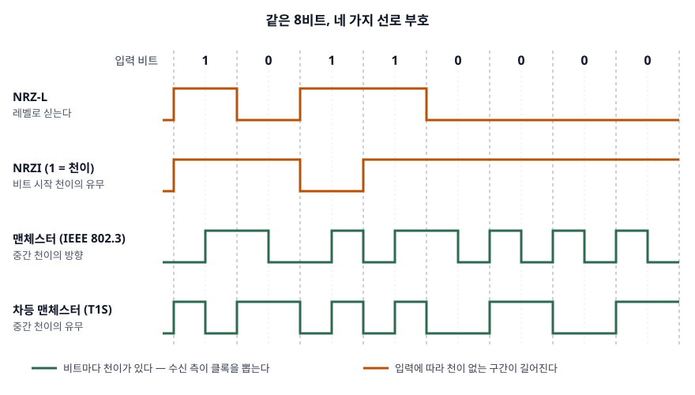

> 부호화 규칙은 표준 문서로 확인했고, 비교표의 천이 수·DC 쏠림·4B5B 성질은 같은 16비트를
> 다섯 방식으로 직접 부호화해 검산했다. 기록은 [code/output.txt](code/output.txt)에 있다. (§7)
>
> 맨체스터 부호의 0·1 방향 규약은 IEEE 802.3 원문을 열람하지 못해 2차 자료 3건(Wikipedia,
> DigiKey 2022-04, Pico Technology 2025-01)을 교차 확인했다. 10BASE-T1S는 최종 표준이 아니라
> 공개된 작업반 초안(D2.0)을 근거로 했으므로 최종판과 세부가 다를 수 있다.

## 들어가며

물리 계층 문항은 "비트를 선로에 어떻게 싣는가"를 묻는다. 부호 이름과 파형만 외우면
점수가 나지 않고, **왜 그 부호를 골랐는지** — 클록을 어디서 얻고, 직류 성분을 어떻게
없애고, 그 대가로 대역폭을 얼마나 쓰는지 — 를 적어야 한다. 실무에서도 같은 질문이
남아 있다. 10 Mb/s 차량용 이더넷(10BASE-T1S)은 차등 맨체스터 위에 4B5B를 한 번 더
얹는데, 두 부호가 각각 무엇을 맡는지 모르면 이 구성이 중복처럼 보인다.

## 정의

**선로 부호화(line coding)** 는 디지털 비트열을 전송 매체의 신호 레벨과 그 변화(천이)로
바꾸는 물리 계층의 부호화로, 수신 측이 **신호만으로 비트 경계(클록)를 찾고 직류 성분
없이 받을 수 있도록** 비트와 파형의 대응 규칙을 정한 것이다.

여기서 확인한 표준 초안은 이 용어를 따로 정의하지 않고 부호의 성질로 설명한다.
10BASE-T1S 초안의 동작 개요(147.1.2)는 차등 맨체스터를 "자기 동기식이고 본질적으로
균형 잡힌 선로 부호"로 기술하고, 그 결과로 DC 기준선 흔들림이 매우 작고 잡음 환경에서도
클록·데이터 복원이 된다고 적는다. 위 정의는 이 설명의 두 요소(자기 동기, DC 균형)를
문장으로 묶은 것이다.

## 등장 배경

가장 단순한 방법은 1을 높은 레벨, 0을 낮은 레벨로 보내는 것(NRZ-L)이다. 이 방식은
두 가지 문제를 남긴다.

- **클록을 잃는다.** 같은 비트가 이어지면 레벨이 변하지 않는다. 검산에서 `1011000000111111`
  16비트를 NRZ-L로 보내면 천이가 5번뿐이고, 6비트 동안 천이 없이 같은 레벨이 이어졌다.
  수신 측은 그동안 비트를 몇 개 받았는지 자기 발진기에만 기대어 센다.
- **직류가 쌓인다.** 같은 레벨이 이어지면 평균 전압이 한쪽으로 쏠린다. 같은 입력에서
  레벨 누적 합이 최대 8칸(반 비트 단위)까지 한쪽으로 치우쳤다. 변압기·커패시터로 교류
  결합한 선로는 직류를 통과시키지 못하므로 이 쏠림이 기준선을 흘러가게 만든다.

선로 부호는 이 두 문제를 **천이를 일부러 넣어서** 푼다. 천이를 얼마나, 어떤 규칙으로
넣느냐에 따라 부호가 갈리고, 넣은 만큼 대역폭을 더 쓴다.

## 구성요소 — 비트를 싣는 축 3가지, 평가 기준 4가지

### 비트를 무엇에 싣는가 — 3가지 축, 5가지 방식

| 축 | 방식 | 규칙 | 근거 |
|---|---|---|---|
| ① 레벨 | NRZ-L | 1 = 높음, 0 = 낮음. 비트 안에서 변하지 않는다 | 기준 방식 |
| ② 천이 유무 | NRZI | 한 값에서만 레벨을 뒤집는다. 어느 값인지는 규격마다 다르다 | USB: 0에서 뒤집는다 (UTMI 5.11) |
| ② 천이 유무 | 차등 맨체스터 | 비트 시작은 항상 천이, **중간 천이 유무**가 비트 값 | 10BASE-T1S (147.1.2) |
| ③ 천이 방향 | 맨체스터 | 비트 중간에 반드시 천이, **상승·하강 방향**이 비트 값 | IEEE 802.3 10 Mb/s (2차 자료) |
| (선행) 블록 | 4B5B | 4비트를 5비트 부호로 바꾼 뒤 위 선로 부호로 보낸다 | 10BASE-T1S Table 147–1 |

4B5B는 파형을 정하지 않으므로 엄밀히는 선로 부호가 아니라 **선로 부호 앞에 두는
블록 부호**다. 그래서 반드시 NRZI나 차등 맨체스터 같은 선로 부호와 짝을 이룬다.

USB NRZI가 0에서 뒤집는다는 것은 UTMI 명세의 비트 스터핑 규칙(5.11)에서 읽힌다.
**1이 여섯 번 이어지면 0을 끼워 넣어 NRZI 데이터 흐름에 천이를 강제한다**고 적는다.
0을 넣어 천이가 생기려면 0이 천이여야 한다.

### 무엇으로 평가하는가 — 4가지 기준

1. **클록 복원** — 천이가 얼마나 자주, 얼마나 확실하게 생기는가
2. **DC 균형** — 레벨의 누적 합이 한쪽으로 쏠리지 않는가
3. **대역폭 비용** — 비트 하나에 천이가 몇 번 필요한가 (신호율 ÷ 비트율)
4. **극성 무관** — 선로 두 가닥을 바꿔 꽂아도 복호되는가

## 도식

> **출처**: 파형은 [code/output.txt](code/output.txt)의 실제 부호화 결과 앞 8비트. 차등 맨체스터 규약은 [IEEE 802.3cg Draft D2.0 §147.3 PCS (2018-09)](https://grouper.ieee.org/groups/802/3/cg/public/Sept2018/beruto_03_Cl_147_d2p0_proposed.pdf) · [IEEE 802.3cg Draft D0.3 §147.1.2 Operation of 10BASE-T1S](https://www.ieee802.org/3/cg/public/Nov2017/8023cg_D0p3_T1S_revB.PDF), 맨체스터 방향 규약은 [DigiKey, Old, but Still Useful: The Manchester Code (2022-04-22)](https://www.digikey.com/en/blog/old-but-still-useful-the-manchester-code) (2차 자료 기반)

답안지에는 비트 경계를 점선으로 먼저 긋고 입력 비트를 위에 적은 뒤, 네 줄을 그린다.
뒤 네 비트 `0000` 구간만 보면 된다. NRZ-L과 NRZI는 평평하고, 맨체스터와 차등 맨체스터는
비트마다 꺾인다. 이 한 구간이 등장 배경의 두 문제와 해법을 전부 보여 준다.

## 비교

### 같은 16비트를 부호별로 — 검산 결과

입력은 `1011000000111111`이다. 0과 1이 여섯 번씩 이어지는 구간을 일부러 넣었다.

| 방식 | 천이 수 / 16비트 | 최장 무천이 | 누적 합 최대 | 극성 반전 후 복호 |
|---|---|---|---|---|
| NRZ-L | 5 | 6비트 | 8 | — |
| NRZI (1 = 천이) | 9 | 7비트 | 16 | 된다 (규칙상) |
| 맨체스터 (IEEE 802.3) | 27 | 1비트 | 1 | **틀린다** |
| 차등 맨체스터 (T1S) | 25 | 1비트 | 2 | **된다** |
| 4B5B + NRZI | 15 / 20부호비트 | 2비트 | 4 | 된다 (규칙상) |

누적 합은 반 비트 한 칸을 ±1로 센 값이다. 극성 반전 복호는 맨체스터·차등 맨체스터만
직접 돌렸고(`[2]`), NRZI는 천이 유무만 보므로 규칙상 극성과 무관하다.

표에서 세 가지가 읽힌다.

- **맨체스터 계열은 천이를 비트당 최대 2번 쓴다.** 16비트에 25~28번이다. 클록과 DC 균형을
  얻는 대가로 같은 비트율에 신호 변화가 NRZ의 최대 2배 필요하다.
- **NRZI는 한쪽 값의 연속만 고친다.** 1=천이 규약에서 1이 이어지면 천이가 생기지만 0이
  이어지면 NRZ-L과 똑같이 평평하다. USB가 1 여섯 개 뒤에 0을 끼우는 것도, 4B5B가 앞에
  붙는 것도 이 빈자리를 메우려는 것이다.
- **방향으로 싣느냐 유무로 싣느냐가 극성 무관을 가른다.** 맨체스터는 상승·하강을 보므로
  선을 바꿔 꽂으면 0과 1이 뒤바뀐다. 차등 맨체스터는 유무만 보므로 그대로 복호된다.

### 4B5B는 무엇을 보장하나

IEEE 802.3cg 초안 Table 147–1의 데이터 부호 16개를 전수 검사했다(`[3]`).

| 성질 | 값 | 뜻 |
|---|---|---|
| 부호당 1의 개수 | 2~4 | 1=천이 NRZI와 짝지으면 부호 하나에 천이가 최소 2번 |
| 부호 두 개를 이었을 때 0의 최대 연속 | 3 | 1=천이 NRZI에서 천이 간격이 최대 4부호비트 |
| 부호율 | 4/5 = 80% | 10 Mb/s를 12.5 MBd로 보낸다 |

1의 개수가 부호마다 2~4개로 다르므로 **표 자체에 DC 균형 조건은 없다.** 4B5B가 주는 것은
천이 밀도의 하한이다. 대신 16개 데이터 부호 밖의 5비트 조합이 남는데, 10BASE-T1S 초안은
이것을 제어 심벌로 쓴다. `J`(SYNC), `H`(프레임 시작), `T`(프레임 끝), `R`·`K`(끝 상태 정상·오류),
`I`(SILENCE, `11111`), `N`(BEACON)이다(147.3.2.2, Table 147–1).

### 10BASE-T1S가 두 부호를 겹쳐 쓰는 이유

| 층 | 부호 | 맡는 일 (초안 근거) |
|---|---|---|
| PMA | 차등 맨체스터 | 자기 동기, DC 균형, 기준선 흔들림 억제 (147.1.2) |
| PCS | 4B5B | EMC 성능 개선, PHY 사이의 대역 외 신호 전달 (147.1.2) |

차등 맨체스터가 이미 클록과 DC 균형을 주므로, 여기서 4B5B의 몫은 천이 밀도가 아니라
**데이터와 구별되는 제어 심벌**이다. D2.0 초안은 4비트를 부호화하기 전에 스크램블한다고
적는다(ENCODE 함수 정의, 147.3.2.3). 같은 데이터가 반복돼 스펙트럼이 한 주파수에 몰리는
것을 막는 장치로, EMC 개선이라는 목적과 이어진다.

## 적용 시 고려사항

- **규약 방향부터 밝힌다.** 맨체스터는 IEEE 802.3과 G.E. Thomas 규약이 0·1 방향이 반대이고,
  NRZI도 USB(0 = 천이)와 1 = 천이 규약이 있다. 검산에서 두 맨체스터 규약은 같은 입력에
  완전히 다른 파형을 냈다. 답안에 파형만 그리면 채점자가 어느 규약으로 읽느냐에 따라
  오답이 된다.
- **대역폭 예산.** 맨체스터 계열은 천이가 비트당 최대 2번이라 같은 선로 대역에서 낼 수 있는
  비트율이 낮다. 4B5B는 25%의 부호 비트를 더 쓴다. 10BASE-T1S가 10 Mb/s 데이터를
  12.5 MBd로 보내는 것이 그 값이다. 고속 링크일수록 이 비용이 커서 부호 선택이 달라진다.
- **오류 전파.** 차등 맨체스터는 앞 심벌과 비교해 비트를 정하므로 심벌 하나를 잘못 읽으면
  비트 두 개가 틀릴 수 있다. IEEE 802.3dm 작업반 발표(Sedarat, 2024-11)는 이 때문에
  차등 맨체스터의 비트 오류율이 맨체스터의 두 배로 알려져 있다고 적는다. 극성 무관을
  얻는 대가다.
- **정보시스템 관점.** 산업·차량 네트워크처럼 배선을 현장에서 잇는 환경은 극성 오배선이
  잦으므로 극성 무관 부호가 유지보수 비용을 줄인다. 반대로 대역이 귀한 장거리 구간은
  천이를 덜 쓰는 부호와 블록 부호 조합이 맞다.

> 기출 답안: [기출문제 — 차등 맨체스터(Differential Manchester) 부호화](../../exam/2026-09-23-differential-manchester-encoding/index.md)

## 정리

- 선로 부호의 목표 **2가지** — 클록 복원(천이 넣기), DC 균형(쏠림 없애기).
- 비트를 싣는 축 **3가지** — **레벨**(NRZ-L), **천이 유무**(NRZI·차등 맨체스터), **천이 방향**(맨체스터).
  "레·유·방"으로 외운다.
- 평가 기준 **4가지** — 클록, DC, 대역폭, 극성. "클·디·대·극".
- 4B5B는 선로 부호 앞의 **블록 부호** — 1이 부호당 2개 이상, 0 연속 최대 3, 부호율 80%,
  남는 조합은 제어 심벌.
- 10BASE-T1S = 4B5B(PCS, 제어 심벌·EMC) + 차등 맨체스터(PMA, 클록·DC).

## 참고 자료

- [IEEE 802.3cg Task Force, Clause 147 D2.0 proposed text (2018-09)](https://grouper.ieee.org/groups/802/3/cg/public/Sept2018/beruto_03_Cl_147_d2p0_proposed.pdf) — 147.3.2.2 제어 심벌 변수, 147.3.2.3 ENCODE(스크램블 후 4B5B), Table 147–1 4B/5B Encoding. 작업반 초안이며 최종 표준과 다를 수 있다
- [IEEE 802.3cg Task Force, Draft D0.3 Clause 147 (2017-11)](https://www.ieee802.org/3/cg/public/Nov2017/8023cg_D0p3_T1S_revB.PDF) — 147.1.2 Operation of 10BASE-T1S(12.5 MBd DME, 4B5B의 목적, DME의 자기 동기·균형 성질)
- [Intel, USB 2.0 Transceiver Macrocell Interface (UTMI) Specification Version 1.05 (2001)](https://www.intel.com/content/dam/www/public/us/en/documents/technical-specifications/usb2-transceiver-macrocell-interface-specification.pdf) — 5.11 Bitstuff Logic
- [H. Sedarat, Differential Manchester Encoding, Frequency Spreading, and Precoding, IEEE 802.3dm (2024-11)](https://www.ieee802.org/3/dm/public/1124/sedarat_3dm_02_202411.pdf) — 작업반 발표 자료. 맨체스터의 DC 널, 차등 맨체스터의 오류 전파
- 2차 자료 (맨체스터 방향 규약 교차 확인)
  - [DigiKey, Old, but Still Useful: The Manchester Code (2022-04-22)](https://www.digikey.com/en/blog/old-but-still-useful-the-manchester-code)
  - [Pico Technology, Manchester encoded signals — serial protocol decoding (2025-01-21 갱신)](https://www.picotech.com/library/knowledge-bases/oscilloscopes/manchester-encoded-signals-serial-protocol-decoding)
  - [Wikipedia, Manchester code](https://en.wikipedia.org/wiki/Manchester_code)
