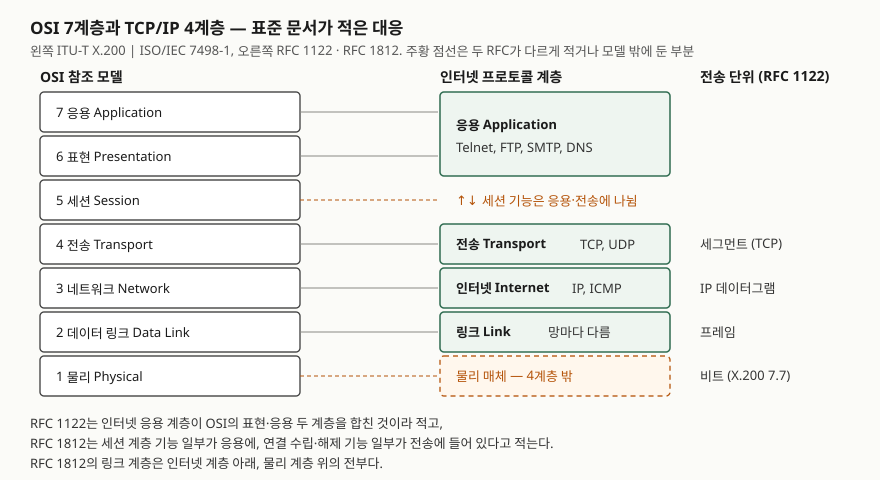

> **실행 검증 없음.** 표준 문서의 정의를 정리한 개념 글이다. 출력·측정값은 싣지 않는다.

## 들어가며

계층 모델은 네트워크 문항 전체의 좌표다. "이 장비는 몇 계층에서 동작하는가", "이 공격은 어느
계층을 노리는가", "TLS는 어디에 끼는가"를 물으면 답안은 계층 이름부터 댄다. 문제는 OSI와
TCP/IP가 계층 수부터 달라 대응을 어떻게 긋느냐에 따라 답이 갈린다는 것이다. 실무에서도
"L4 로드밸런서", "L7 방화벽"처럼 OSI 번호가 제품 이름에 붙어 있어, 대응을 모르면 제품이 무엇을
보는지 읽을 수 없다.

## 정의

**OSI 참조 모델**: 개방형 시스템 사이의 통신 기능을 **7개 계층**으로 나누고, 각 계층이 위 계층에
제공하는 서비스와 계층 안의 기능을 정한 기본 참조 모델이다. ITU-T X.200(1994)으로 발간되며,
머리말에 같은 본문이 ISO/IEC 7498-1로도 발간된다고 적혀 있다.

**TCP/IP 계층 모델**: 인터넷 호스트가 쓰는 프로토콜을 **응용·전송·인터넷·링크 4개 계층**으로
나눈 구조다. RFC 1122(인터넷 호스트 요구사항, STD 3)의 인터넷 프로토콜 모음 절(§1.1.3)이 이
네 계층을 나열한다.

두 정의의 결이 다르다. OSI는 **모델**이 먼저고 그 위에 프로토콜 표준을 얹는다. X.200은 경계를 정한
뒤 경계마다 서비스 표준을, 계층 동작에는 프로토콜 표준을 둔다고 적는다(§6.1.5). RFC 1122는
**이미 쓰이는 프로토콜**을 계층별로 나열하고 호스트가 지킬 요구사항을 정한다.

## 등장 배경

X.200의 계층 결정 원칙 절(§6.2)은 7계층을 정할 때 쓴 원칙을 **13개**(계층 10개 + 부계층 3개) 든다.
핵심은 세 가지로 묶인다.

- 계층을 너무 많이 만들지 않는다 — 기술하고 통합하는 일이 필요 이상 어려워진다
- 경계를 넘나드는 상호작용이 적은 자리에 경계를 둔다
- 한 계층을 통째로 다시 설계해도 인접 계층이 받는 서비스는 바뀌지 않게 한다

마지막 원칙이 계층화의 이유다. 전송 매체가 구리선에서 광섬유로 바뀌어도 위 계층은 몰라도 된다.
X.200은 스스로 "특정 계층 분할이 최선임을 증명하기는 어렵다"는 취지의 주석을 붙였다. 7이라는 수는
원칙을 적용한 결과이지 도출된 정답이 아니라는 뜻이다.

## 구성요소 — OSI 7계층, TCP/IP 4계층

**OSI 7계층** — X.200 7절이 계층마다 목적을 정한다.

| 계층 | 목적 (X.200 원문 요지) | 절 |
|---|---|---|
| 7 응용 | 응용 프로세스가 OSI 환경에 접근하는 유일한 수단 | 7.1 |
| 6 표현 | 주고받는 데이터의 공통 표현. 응용 개체에 구문 독립성을 준다 | 7.2 |
| 5 세션 | 대화를 조직·동기화하고 데이터 교환을 관리. 세션 연결 수립·해제 | 7.3 |
| 4 전송 | 세션 개체 사이의 투명한 데이터 전송. 종단 시스템 사이에서만 동작 | 7.4 |
| 3 네트워크 | 전송 개체에 경로 선택·중계를 신경 쓰지 않게 해 준다 | 7.5 |
| 2 데이터 링크 | 데이터 링크 연결 관리. 물리 계층에서 생긴 오류를 검출하고 정정할 수 있다 | 7.6 |
| 1 물리 | 비트 전송을 위한 물리적 연결의 기계적·전기적·기능적·절차적 수단 | 7.7 |

**TCP/IP 4계층** — RFC 1122의 인터넷 프로토콜 모음 절(§1.1.3)이 나열한 순서와 대표 프로토콜이다.

| 계층 | 하는 일 | 대표 프로토콜 |
|---|---|---|
| 응용 | 사용자 프로토콜과 지원 프로토콜 | Telnet, FTP, SMTP / DNS, SNMP |
| 전송 | 종단 간 통신 | TCP(신뢰성·연결형), UDP(데이터그램) |
| 인터넷 | 출발지에서 목적지 호스트까지 데이터그램 전달 | IP, ICMP, IGMP |
| 링크 | 직접 연결된 망과의 통신 | 망마다 다름 |

## 도식

> **출처**: OSI 계층 이름과 목적은 [ITU-T X.200 (07/1994) §7 Detailed description of the resulting OSI architecture](https://www.itu.int/rec/T-REC-X.200-199407-I/en),
> 인터넷 4계층과 전송 단위 이름은 [RFC 1122 §1.1.3 Internet Protocol Suite · §1.3.3 Terminology](https://www.rfc-editor.org/rfc/rfc1122.html#page-8),
> 세션 기능의 배치와 물리 계층을 링크 계층 아래에 둔 것은 [RFC 1812 §2.2.1 Protocol Layering](https://www.rfc-editor.org/rfc/rfc1812#section-2.2.1)을 따랐다.

답안지에는 왼쪽에 7칸, 오른쪽에 4칸을 그리고 가로선을 긋는다. 세션 줄과 물리 줄만 점선으로
남겨 두면 아래 비교의 요점이 그림에 들어간다.

## 비교

### 세션 계층은 어디로 갔나 — 문서마다 다르다

| 출처 | TCP/IP 응용 계층이 맡는 OSI 계층 | 세션 기능 |
|---|---|---|
| RFC 1122 §1.1.3 | 표현 + 응용 (위 두 계층) | 언급 없음 |
| RFC 1812 §2.2.1 | 응용 계층이 세션 기능 일부도 포함 | 연결 수립·해제 기능 일부는 전송 계층(TCP)에 |
| 흔한 암기법 | 세션 + 표현 + 응용 | 전부 응용에 |

"5·6·7계층이 응용 계층"은 이해를 돕는 단순화이고, 두 RFC 어느 쪽도 그렇게 적지 않는다.
**TCP의 연결 수립·해제는 OSI 기준으로 세션 계층 기능을 일부 가져간 것**이다. 답안에서는
"세션 계층 기능은 응용과 전송에 나뉘어 흡수된다"고 쓰고 RFC 1812를 근거로 댄다.

### 두 모델의 구조 차이

| 구분 | OSI 7계층 | TCP/IP 4계층 |
|---|---|---|
| 문서 | ITU-T X.200 = ISO/IEC 7498-1 | RFC 1122 (STD 3), RFC 1812 |
| 성격 | 계층과 서비스를 먼저 정한 참조 모델 | 쓰이는 프로토콜의 계층 구조와 요구사항 |
| 네트워크/인터넷 계층 | 연결형·비연결형 둘 다 정의 (7.5) | IP 비연결형 데이터그램만 |
| 물리 계층 | 1계층으로 포함 | RFC 1812는 링크 계층 아래, 모델 밖에 둔다 |
| 전송 단위 | (N)-PDU로 계층마다 일반화 | 세그먼트, IP 데이터그램, 패킷, 프레임 |

### PDU와 SDU

X.200은 데이터 단위를 두 가지로 가른다. **(N)-PDU**는 (N)-프로토콜이 정한 단위로 제어 정보와
사용자 데이터로 이뤄진다(§5.6.1.3). **(N)-SDU**는 위 계층 개체 사이에서 전달될 때 정체성이 보존되고
(N)-계층이 해석하지 않는 정보다(§5.6.1.4). 위 계층의 PDU가 아래 계층에서는 SDU가 되고, 아래 계층이
헤더를 붙여 자기 PDU를 만든다. 이것이 **캡슐화**다. RFC 1122의 용어 정의에서 프레임은 링크 헤더 +
패킷, IP 데이터그램은 IP 헤더 + 전송 계층 데이터로 정의되는 것도 같은 구조다.

## 적용 시 고려사항

- **장비의 계층은 "무엇을 보고 전달하는가"로 정한다.** RFC 1812는 라우터를 다른 전달 장치와 가르는
  기준으로 전달 과정에서 IP 헤더를 검사한다는 점을 들고(서론 §1), 링크 계층에서 동작하는 패킷 전달
  장치를 브리지라 부른다(링크 계층 절, §2.2.3). OSI도 데이터를 넘겨주기만 하는 중계 개방형 시스템의
  기능을 아래 계층에 둔다(§6.1.6). 제품 이름의 L4·L7은 전송 헤더, 응용 데이터까지 보고 판단한다는
  뜻으로 읽는다.
- **"네트워크 계층"이라는 말이 두 모델에서 다르다.** RFC 1812는 옛 인터넷 문서가 링크 계층을
  네트워크 계층이라 불렀지만 OSI의 네트워크 계층과 같지 않다고 적는다. TCP/IP 문맥의 "네트워크 액세스
  계층"을 OSI 3계층으로 옮겨 적지 않는다.
- **TLS는 번호보다 위치로 쓴다.** RFC 8446은 TLS가 아래 전송에 요구하는 것이 신뢰성 있고 순서가
  보장된 데이터 흐름뿐이고, 위 프로토콜은 TLS 위에 투명하게 얹힌다고 적는다(§1). 표준이 OSI 번호를
  붙이지 않으므로 답안에는 "TCP 위, 응용 프로토콜 아래"로 쓴다.
- **계층 경계는 참조 모델의 경계이지 구현 인터페이스가 아니다.** X.200은 OSI 자체가 개방형 시스템
  내부 인터페이스의 표준화를 요구하지 않으며, 그런 표준을 지키는 것이 개방성의 조건도 아니라고
  적는다(§6.2 주석). 계층 사이에 표준 API가 반드시 있다고 쓰지 않는다.

## 정리

- OSI **7계층**(응·표·세·전·네·데·물) — X.200 = ISO/IEC 7498-1, 계층 결정 원칙 **13개**.
- TCP/IP **4계층**(응용·전송·인터넷·링크) — RFC 1122 §1.1.3.
- 대응: 표현+응용 → 응용, 전송 → 전송, 네트워크 → 인터넷, 데이터 링크 → 링크, 물리 → 모델 밖(RFC 1812).
- **세션 기능은 응용과 전송(TCP 연결 수립·해제)에 나뉜다** — "5·6·7 = 응용"은 단순화다.
- PDU = 제어 정보 + 사용자 데이터, SDU = 아래 계층이 해석하지 않는 위 계층 데이터. 이 관계가 캡슐화다.

## 참고 자료

- [ITU-T X.200 (07/1994) — Information technology – Open Systems Interconnection – Basic Reference Model: The basic model](https://www.itu.int/rec/T-REC-X.200-199407-I/en) — §5.6.1 데이터 단위 정의, §6.1 계층 구조, §6.2 계층 결정 원칙, §7.1~§7.7 계층별 목적. 머리말에 ISO/IEC 7498-1과 같은 본문이라고 밝힌다
- [RFC 1122 — Requirements for Internet Hosts — Communication Layers (1989)](https://www.rfc-editor.org/rfc/rfc1122) — §1.1.3 Internet Protocol Suite(4계층과 대표 프로토콜, 응용 계층이 OSI 위 두 계층을 합친다는 설명), §1.3.3 Terminology(segment·message·IP datagram·packet·frame)
- [RFC 1812 — Requirements for IP Version 4 Routers (1995)](https://www.rfc-editor.org/rfc/rfc1812) — §1 Introduction(라우터가 IP 헤더를 검사한다는 구분 기준), §2.2.1 Protocol Layering(세션 기능의 배치, 링크 계층과 물리 계층의 경계, 옛 문서의 "네트워크 계층" 용어), §2.2.3(링크 계층에서 동작하는 전달 장치 = 브리지)
- [RFC 8446 — The Transport Layer Security (TLS) Protocol Version 1.3 (2018)](https://www.rfc-editor.org/rfc/rfc8446#section-1) — §1 Introduction(아래 전송에 요구하는 조건, 위 프로토콜이 투명하게 얹힌다는 설명)
