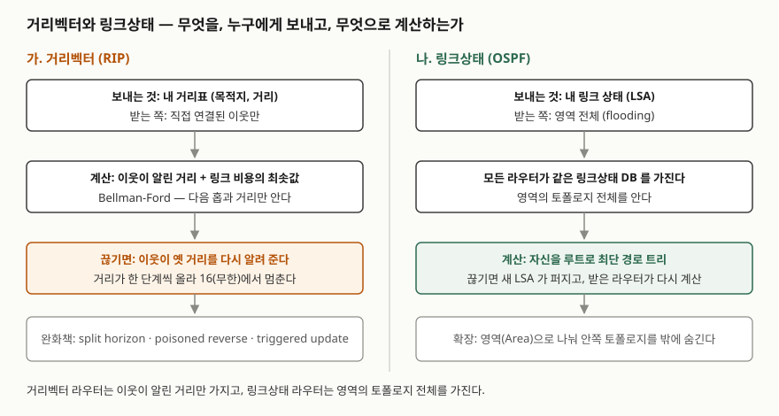

> 정의와 동작 규칙은 RFC 원문으로 확인했고, 수렴 라운드 수는 동기 라운드 모델로 직접 계산해
> 검산했다. 기록은 [code/output.txt](code/output.txt)에 있다. (§7)
> 모델에는 RIP의 타이머(30초 주기, triggered update)를 넣지 않았으므로 **라운드 수는 실제 시간이 아니다.**

## 들어가며

라우팅 문항은 "RIP와 OSPF를 비교하라"로 나오고, 답안은 대개 홉 수·주기·알고리즘 이름을 표로
나열하는 데서 끝난다. 점수가 갈리는 곳은 **왜** 거리벡터가 느리게 수렴하고 큰 망에 못 쓰는지다.
실무에서도 같은 질문이 남는다. 링크가 끊긴 뒤 한동안 패킷이 라우터 사이를 오가다 버려지는 현상은
거리벡터가 무엇을 주고받는지에서 나온다.

## 정의

**거리벡터 라우팅**: 각 라우터가 목적지별 **거리와 다음 홉**만 유지하고, 그 표를 **이웃에게** 주기적으로
보내며, 이웃이 알린 거리에 링크 비용을 더한 최솟값으로 경로를 고르는 방식이다. RFC 2453은 이 계산이
Bellman 방정식에 기반해 Bellman-Ford라고도 불린다고 적는다(RIP 소개 절, §3.1).

**링크상태 라우팅**: 각 라우터가 자기 링크 상태를 **영역 전체에 전파(flooding)**하고, 모든 라우터가
**같은 토폴로지 데이터베이스**를 가진 채 자신을 루트로 최단 경로 트리를 계산하는 방식이다. RFC 2328은
모든 라우터가 같은 알고리즘을 병렬로 돌린다고 적는다(프로토콜 개요, §1.1).

## 등장 배경

RFC 2453은 RIP의 한계를 스스로 적는다(프로토콜 한계 절, §3.2). 가장 긴 경로가 **15홉**인 망까지만 쓸 수
있고, 설계자들도 이 기본 설계가 더 큰 망에는 맞지 않는다고 본다. 이유는 무한값 16에 있다. 도달 불가를
16으로 표시하는데, 이 값은 **실제 경로보다 커야 하지만 필요 이상 크면 안 된다**(불안정 방지 절, §3.4.2).
링크가 끊기면 거리가 한 단계씩 올라가다가 16에서야 멈추기 때문이다. 무한을 크게 잡으면 망은 커지지만
그만큼 오래 센다.

OSPF는 이 구조를 바꿨다. 이웃의 계산 결과가 아니라 **링크 상태 원본**을 전파하므로, 끊긴 사실이 퍼지는
대로 각 라우터가 직접 다시 계산한다. RFC 2328 초록은 토폴로지가 바뀔 때 적은 라우팅 트래픽으로 빠르게
경로를 다시 계산한다고 적는다.

## 구성요소 / 절차

**거리벡터(RIP) 동작 4가지** — RFC 2453 거리벡터 절(§3.4)과 타이머 절(§3.8)

| 요소 | 내용 |
|---|---|
| 주기 갱신 | **30초**마다 전체 거리표를 이웃에게 보낸다 |
| 만료·삭제 | **180초** 동안 갱신이 없으면 경로 만료, 이후 **120초** 뒤 삭제 |
| 무한값 | 메트릭 **16** = 도달 불가 |
| 루프 완화 3가지 | split horizon, split horizon with poisoned reverse, triggered update |

split horizon은 **어떤 이웃에게서 배운 경로를 그 이웃에게 알리지 않는** 것이고, poisoned reverse는 알리되
**무한으로** 알리는 것이다(§3.4.3). triggered update는 메트릭이 바뀌면 30초를 기다리지 않고 바로 알린다(§3.4.4).

**링크상태(OSPF) 절차 4단계** — RFC 2328

1. 이웃과 인접 관계를 맺는다(Hello 프로토콜, §1.2 용어 정의)
2. 자기 링크 상태를 LSA로 만들어 **영역 전체에 flooding**한다(§13)
3. 모든 라우터가 **같은 링크상태 데이터베이스**를 갖는다(§2)
4. 각자 자신을 루트로 **최단 경로 트리**를 계산해 라우팅 표를 만든다(§2.2, §16)

## 도식



> **출처**: 거리벡터의 계산·무한값·완화책은 [RFC 2453 §3.4 Distance Vector Algorithms](https://www.rfc-editor.org/rfc/rfc2453.html#section-3.4),
> 링크상태의 데이터베이스·최단 경로 트리는 [RFC 2328 §2 The Link-state Database](https://www.rfc-editor.org/rfc/rfc2328.html#section-2),
> flooding은 [RFC 2328 §13 The Flooding Procedure](https://www.rfc-editor.org/rfc/rfc2328.html#section-13),
> 영역은 [RFC 2328 §3 Splitting the AS into Areas](https://www.rfc-editor.org/rfc/rfc2328.html#section-3)를 따랐다.

답안지에는 두 칸을 세로로 나누고 "보내는 것 → 받는 쪽 → 계산 → 끊기면" 네 줄을 맞춰 적는다.

## 비교

### 직접 계산 — 링크 하나가 끊기면

동기 라운드 모델로 셌다. 한 라운드에 모든 라우터가 이웃에게 한 번 알리고 다시 계산한다.
링크상태는 LSA가 한 라운드에 한 홉씩 퍼진다고 두었다.

| 망 | 끊긴 링크 | 거리벡터 (완화 없음) | split horizon | poisoned reverse | 링크상태 |
|---|---|---|---|---|---|
| 선형 A–B–D | B–D | **15라운드** | 2라운드 | 2라운드 | 1라운드 |
| 삼각형 A·B·C + C–D | C–D | — | **15라운드** | **15라운드** | 1라운드 |

선형 망의 완화 없음은 무한 카운팅을 그대로 보여 준다. A가 옛 거리 2를 B에게 알리고, B는 3, A는 4로
번갈아 오르다 16에서 멈춘다.

```text
[1-none] 거리벡터
  라운드 0 (끊긴 직후): A→D=2(B)  B→D=1(D)
  라운드  1: A→D=2(B)  B→D=3(A)
  라운드  2: A→D=4(B)  B→D=3(A)
  ...
  라운드 15: A→D=무한  B→D=무한
```

(라운드 3~14는 `...`로 줄였다. 두 블록 모두 전체는 실행 기록에 있다.)

예상과 달랐던 것은 삼각형 망이다. split horizon을 켜도, poisoned reverse로 바꿔도 **15라운드로 똑같다.**
아래는 라운드 1~4만 옮겼다.

```text
[2-poisoned-reverse] 거리벡터
  라운드  1: A→D=2(C)  B→D=2(C)  C→D=무한
  라운드  2: A→D=3(B)  B→D=3(A)  C→D=무한
  라운드  3: A→D=무한  B→D=무한  C→D=4(A)
  라운드  4: A→D=무한  B→D=5(C)  C→D=무한
```

라운드 2에서 A는 B를, B는 A를 다음 홉으로 잡았다. 둘 다 C를 거치던 경로라 서로에게 알리는 것이 split
horizon에 걸리지 않는다. 라운드 3부터는 C는 A로, A는 B로, B는 C로 보내는 경로가 번갈아 살아나며
거리가 한 라운드에 1씩 오른다(4, 5, 6, 7 …). 셋이 고리를 이루므로 어느 라우터도 "배운 곳으로 되돌려 알리는"
경우에 해당하지 않는다.
RFC 2453은 poisoned reverse가 **두 라우터 사이의 루프**만 막고, 세 라우터가 서로를 속이는 패턴은 남는다고
적는다(§3.4.4). triggered update도 무한 카운팅을 없애지는 못한다고 같은 절이 밝힌다.

링크상태는 두 망 모두 1라운드였다. 끊긴 링크 양 끝이 만든 LSA가 한 홉 퍼지자 나머지가 직접 다시 계산했다.
받은 사실이 "링크가 끊겼다"라서 다른 라우터의 옛 거리를 믿을 일이 없다.

### 두 방식의 대비

| 구분 | 거리벡터 (RIP) | 링크상태 (OSPF) |
|---|---|---|
| 보내는 것 | 목적지별 거리표 | 자기 링크 상태(LSA) |
| 받는 쪽 | 직접 연결된 이웃 | 영역 전체 |
| 아는 범위 | 다음 홉과 거리 | 영역의 토폴로지 전체 |
| 계산 | Bellman-Ford (이웃 값 + 비용) | 최단 경로 트리 |
| 링크 단절 시 | 옛 거리가 돌며 16까지 센다 | LSA가 퍼지는 대로 각자 재계산 |
| 확장 한계 | 지름 15홉 (§3.2) | 영역으로 분할 (§3) |

## 적용 시 고려사항

- **망 지름을 먼저 본다.** RIP는 15홉을 넘는 경로를 표현할 수 없다. 규모가 이보다 커질 망에는 처음부터 쓰지 않는다.
- **망에 고리(cycle)가 있으면 split horizon을 믿지 않는다.** 위 삼각형처럼 세 라우터가 고리를 이루면 완화책을
  켜도 무한 카운팅이 남는다. RFC 2453의 주기 30초를 대입하면, triggered update 없이 주기 갱신만으로 한 라운드가
  돈다고 할 때 15라운드는 7분 30초다. 이 모델의 가정 위 계산이지 측정값이 아니다.
- **링크상태는 계산과 메모리를 라우터가 진다.** 모든 라우터가 영역 전체의 데이터베이스를 갖고 최단 경로 트리를
  직접 계산한다. 영역을 나누면 영역 밖에서는 안쪽 토폴로지가 보이지 않아 라우팅 트래픽이 크게 준다고 RFC 2328이
  적는다(§3). 영역 설계가 곧 확장성 설계다.
- **완화책은 RFC가 요구하는 수준으로 켠다.** RFC 2453은 라우터 요구사항 RFC가 split horizon을 필수로, poisoned
  reverse를 권장으로 둔다고 인용한다(§3.4.3). 끄는 설정이 있더라도 기본은 켜 둔다.

## 정리

- **정의 2개**: 거리벡터 = 이웃에게 거리표, Bellman-Ford / 링크상태 = 영역 전체에 LSA, 최단 경로 트리.
- **RIP 숫자 4개**: 30초 주기, 180초 만료, 120초 삭제, 16 = 무한 → 지름 **15홉** 한계.
- **완화책 3가지**: split horizon, poisoned reverse, triggered update — 셋 다 무한 카운팅을 완전히 없애지 못한다.
- **OSPF 절차 4단계**: 인접 → flooding → 같은 DB → 최단 경로 트리. 확장은 **영역**.
- 수렴 차이의 이유는 **무엇을 보내는가**다. 계산 결과(거리)를 보내면 옛 값이 돌고, 원본(링크 상태)을 보내면 각자 다시 계산한다.

## 참고 자료

- [RFC 2453 — RIP Version 2 (1998, STD 56)](https://www.rfc-editor.org/rfc/rfc2453.html) — §3.1(Bellman-Ford 명칭), §3.2 Limitations of the Protocol(지름 15홉), §3.4 Distance Vector Algorithms, §3.4.1(무한값 16), §3.4.2 Preventing instability, §3.4.3 Split horizon, §3.4.4 Triggered updates(세 라우터 루프, triggered update의 한계), §3.8 Timers(30·180·120초)
- [RFC 2328 — OSPF Version 2 (1998, STD 54)](https://www.rfc-editor.org/rfc/rfc2328.html) — 초록(빠른 재계산), §1.1 Protocol Overview(같은 DB·병렬 계산), §1.2 용어, §2 The Link-state Database, §2.2 The Shortest-path Tree, §3 Splitting the AS into Areas, §13 The Flooding Procedure, §16 Calculation of the Routing Table
