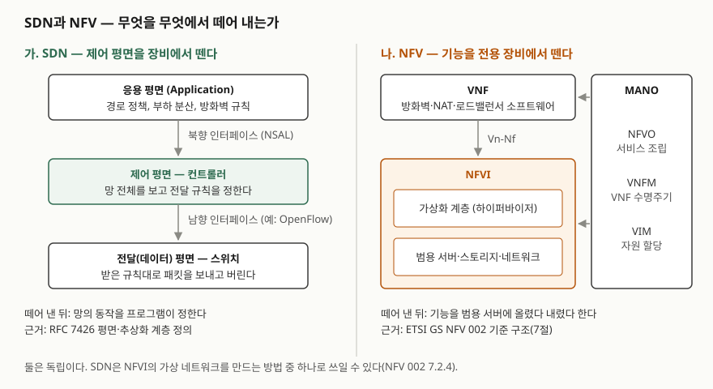

> 실행 검증 없음. 정의와 구성요소는 RFC 7426과 ETSI GS NFV 002·003 원문으로 확인했다.
> 이 글에 성능 수치는 없다. 두 문서 모두 수치를 제시하지 않는다. (§7)

## 들어가며

SDN과 NFV는 한 문항에 묶여 "둘을 비교하라"로 나오는 일이 많고, 답안이 흔히 무너지는 곳은 둘을
같은 것으로 쓰는 데서다. 둘 다 "소프트웨어로 네트워크를 다룬다"로 요약되지만 **떼어 내는 대상이 다르다.**
SDN은 장비 안에 묶여 있던 **제어 평면**을 떼어 내고, NFV는 전용 장비에 묶여 있던 **네트워크 기능 자체**를
떼어 낸다. 실무에서는 방화벽 한 대를 늘리려고 장비를 발주하던 일과, 경로 정책 하나를 바꾸려고 장비마다
접속해 설정하던 일이 각각 NFV와 SDN이 줄이려는 비용이다.

## 정의

**SDN(Software-Defined Networking)**: RFC 7426은 두 가지 정의를 싣는다. 초록에서는 **열린 인터페이스를 통해
망의 동작을 동적으로 초기화·제어·변경·관리하는 능력**, 즉 망 프로그래밍 가능성(network programmability)으로
정의한다. 용어 절(§2)에서는 **표준 인터페이스로 제어 평면과 전달 평면의 분리를 지원하는 프로그래머블 망 접근법**으로
정의한다. 앞의 것은 목적, 뒤의 것은 수단을 앞세운 정의다. 답안에는 둘을 한 문장으로 합쳐 쓸 수 있다.

**NFV(Network Functions Virtualisation)**: ETSI GS NFV 003은 **가상 하드웨어 추상화를 써서 네트워크 기능을
그것이 돌던 하드웨어에서 분리하는 원칙**으로 정의한다.

## 등장 배경

**SDN 쪽.** RFC 7426은 인터넷 라우터와 이더넷 스위치에서 제어 평면이 **장비와 밀접하게 묶여 구현돼 왔다**고
적는다(§3.1). 제어 평면은 장비마다 분산돼 돌고, 관리 평면은 원격에서 중앙 집중으로 돌았다(§3.5.3).
망 전체의 정책을 바꾸려면 장비마다 들어가 설정해야 했고, 제어 소프트웨어가 장비 제조사에 묶였다.

**NFV 쪽.** ETSI GS NFV 002는 목표 6가지를 든다(§4.2). 전용 하드웨어 대비 **범용(COTS) 서버·스토리지로 설비
효율** 향상, 기능을 하드웨어에 배치하는 **유연성**, 소프트웨어 배포로 **빠른 서비스 출시**, 공통 자동화로
**운영 효율**, 쓰지 않는 하드웨어를 끄는 **전력 절감**, 서로 다른 벤더가 공급할 수 있게 하는 **표준·개방 인터페이스**다.
뒤집어 읽으면 이전에는 기능마다 전용 장비를 사야 했고, 그 장비의 위치와 수량이 곧 서비스의 한계였다는 뜻이다.

## 구성요소 / 절차

**SDN 평면 5가지** — RFC 7426 평면 정의(§3.1)

| 평면 | 하는 일 |
|---|---|
| 전달(Forwarding) | 제어 평면의 지시에 따라 패킷을 전달·폐기·변경한다. 데이터 평면이라고도 부른다 |
| 운영(Operational) | 포트 활성 여부, 자원 상태 같은 장비의 운영 상태를 관리한다 |
| 제어(Control) | 패킷을 어떻게 전달할지 결정해 장비에 내려보낸다 |
| 관리(Management) | 장비를 감시·설정·유지한다 |
| 응용(Application) | 망의 동작을 정의하는 응용과 서비스가 올라간다 |

평면 사이에는 추상화 계층이 놓인다. 장비 쪽의 **DAL**, 제어 쪽의 **CAL**, 관리 쪽의 **MAL**, 응용에 서비스를
내주는 **NSAL**이다(§3.1). 흔히 말하는 **남향 인터페이스**는 제어·관리 평면이 장비로 내려가는 쪽(예: OpenFlow,
ForCES, NETCONF — §4), **북향 인터페이스**는 응용이 NSAL을 통해 제어 평면을 쓰는 쪽이다(§3.6).

**NFV 영역 3가지** — ETSI GS NFV 002 상위 구조(§5.2)

1. **VNF** — 네트워크 기능의 소프트웨어 구현
2. **NFVI** — 물리 자원과 그 가상화. VNF가 도는 환경
3. **NFV MANO** — 자원과 VNF의 수명주기 관리·오케스트레이션

**NFV 기능 블록 8가지** — 같은 문서의 기능 블록 개관(§7.2.1): VNF, EM(Element Management), NFVI(하드웨어·가상
자원과 가상화 계층), VIM, NFVO, VNFM, 서비스·VNF·인프라 기술서, OSS/BSS.
MANO는 이 중 **NFVO·VNFM·VIM 3개**를 묶은 것이다(NFV 003 용어 정의). NFVO는 네트워크 서비스를 조립하고,
VNFM은 VNF의 생성·갱신·확장·종료를 맡고, VIM은 VM을 하이퍼바이저에 배치하는 식으로 자원을 할당한다(§7.2.5~§7.2.7).
블록 사이의 주요 참조점은 **8개**다(§7.3): Vl-Ha, Vn-Nf, Or-Vnfm, Vi-Vnfm, Or-Vi, Nf-Vi, Os-Ma, Ve-Vnfm.

## 도식

> **출처**: SDN 평면·추상화 계층은 [RFC 7426 §3.1 Overview](https://www.rfc-editor.org/rfc/rfc7426.html#section-3.1),
> 남향 프로토콜 예는 [RFC 7426 §4 SDN Model View](https://www.rfc-editor.org/rfc/rfc7426.html#section-4),
> NFV 영역·기능 블록·참조점은 [ETSI GS NFV 002 V1.2.1 §5.2·§7.2·§7.3](https://www.etsi.org/deliver/etsi_gs/nfv/001_099/002/01.02.01_60/gs_nfv002v010201p.pdf)를 따랐다.
> NFV 쪽은 원문 그림 4에서 EM·OSS/BSS·기술서·참조점 일부를 뺐다.

답안지에는 세로선으로 둘을 나누고, 왼쪽은 3층(응용 / 컨트롤러 / 스위치)에 북향·남향 화살표, 오른쪽은
VNF 위·NFVI 아래에 MANO를 옆으로 붙인다. 맨 아래 한 줄로 "떼어 내는 대상이 다르다"를 적는다.

## 비교

| 구분 | SDN | NFV |
|---|---|---|
| 떼어 내는 것 | 제어 평면 ↔ 전달 평면 | 네트워크 기능 ↔ 전용 하드웨어 |
| 정의 출처 | IRTF RFC 7426 (2015) | ETSI NFV ISG GS NFV 003 (2014) |
| 핵심 요소 | 컨트롤러, 남향·북향 인터페이스 | VNF, NFVI, MANO |
| 프로그래밍 가능해지는 것 | **망의 전달 동작** (어느 패킷을 어디로) | **기능의 배치와 수명주기** (어디에 몇 개를 언제) |
| 대표 인터페이스 | OpenFlow, NETCONF, ForCES | Os-Ma, Or-Vnfm, Vi-Vnfm 등 참조점 8개 |
| 대체하는 것 | 장비별 분산 제어·수동 설정 | 기능별 전용 장비 |

**관계**: NFV 002는 SDN이라는 말을 쓰지 않는다. 다만 NFVI의 네트워크 가상화 방법으로 VLAN·VxLAN 같은 오버레이와
함께 **전송망의 제어 평면을 중앙에 모아 전달 평면에서 분리하는 방식**을 든다(§7.2.4). NFV 003은 망 도메인의
제어·관리를 중앙에 모으는 **네트워크 컨트롤러**를 기능 블록으로 정의한다. 즉 SDN은 NFV의 전제 조건이 아니라
NFVI 안의 가상 네트워크를 만드는 **선택지 하나**다. 반대로 SDN도 가상화 없이 물리 스위치만으로 성립한다.
RFC 7426은 두 기술에 공통 추상화 모델을 둘 가능성을 언급하는 데 그친다(관리 평면 절, §3.4).

## 적용 시 고려사항

- **컨트롤러 배치는 일관성과 가용성 사이의 선택이다.** RFC 7426은 CAP 정리를 인용해, 중앙 컨트롤러 하나는 일관된
  전역 상태를 주지만 연결이 끊기면 가용성을 잃고, 여러 곳에 컨트롤러를 두면 분할에 강해지는 대신 절대적 일관성을
  잃는다고 적는다(§3.5.4). 컨트롤러 이중화와 동기화 방식을 설계 초기에 정한다.
- **제어와 관리를 같은 것으로 보지 않는다.** 제어 평면은 밀리초 단위로 갱신되고 수명이 짧은 상태를 다루며, 관리
  평면은 분·시간·일 단위로 반응하고 오래 가는 상태를 다룬다(§3.5.1, §3.5.2). 한 시스템에 몰면 두 시간 척도의
  요구가 충돌한다.
- **NFV는 보안 경계가 늘어난다.** NFV 002는 하이퍼바이저의 추가 취약점, 공유 스토리지·네트워크, 새로 드러나는
  구성요소 간 인터페이스, VNF 간 격리 부족을 새 보안 문제로 든다(§8.7). 하이퍼바이저 보안 부팅과 VNF 격리를
  설계 요건에 넣는다.
- **가상화해도 서비스 동작은 같아야 한다.** NFV 002는 가상화 여부와 무관하게 종단 간 서비스와 전달된 동작이
  동등해야 한다고 적고(§6.3), 신뢰성도 기존 물리 기능만큼 높아야 한다고 적는다(§8.6). 전용 장비를 VNF로 옮길 때
  기존 장애 조치 수준을 기준선으로 삼아 검증한다.
- **표준 참조점을 지키는 벤더를 고른다.** 벤더 분리는 NFV 목표 중 하나(§4.2)지만, 참조점을 독자 구현하면
  하드웨어 대신 MANO에 묶인다.

## 정리

- **한 줄 대비**: SDN = 제어 평면을 **장비에서** 뗀다 / NFV = 기능을 **전용 하드웨어에서** 뗀다.
- **SDN 평면 5개**: 전달·운영·제어·관리·응용 (RFC 7426). 인터페이스는 **남향**(OpenFlow 등)·**북향**(NSAL).
- **NFV 3-8-3-8**: 영역 **3**(VNF·NFVI·MANO), 기능 블록 **8**, MANO **3**(NFVO·VNFM·VIM), 참조점 **8**.
- **관계**: 서로 독립. SDN은 NFVI 가상 네트워크를 만드는 선택지 하나(NFV 002 NFVI 절).
- **고려사항 키워드**: CAP(컨트롤러 배치), 시간 척도(제어 vs 관리), 하이퍼바이저 보안, 동작 동등성, 참조점 표준.

## 참고 자료

- [RFC 7426 — Software-Defined Networking (SDN): Layers and Architecture Terminology (2015-01, IRTF, Informational)](https://www.rfc-editor.org/rfc/rfc7426.html) — 초록(SDN 정의), §2 Terminology, §3.1 Overview(5개 평면·추상화 계층), §3.4 Management Plane, §3.5 Discussion of Control and Management Planes, §3.6 Network Services Abstraction Layer, §4 SDN Model View
- [ETSI GS NFV 002 V1.2.1 — NFV Architectural Framework (2014-12)](https://www.etsi.org/deliver/etsi_gs/nfv/001_099/002/01.02.01_60/gs_nfv002v010201p.pdf) — §4.2 Summary of Objectives, §5.2 High-Level NFV Framework, §6.3 Implications of NFV, §7.2 Architectural Functional Blocks, §7.3 Reference Points, §8.6 Reliability, §8.7 Security
- [ETSI GS NFV 003 V1.2.1 — Terminology for Main Concepts in NFV (2014-12)](https://www.etsi.org/deliver/etsi_gs/NFV/001_099/003/01.02.01_60/gs_NFV003v010201p.pdf) — NFV·NFVI·NFV-MANO·NFVO·network controller 정의
