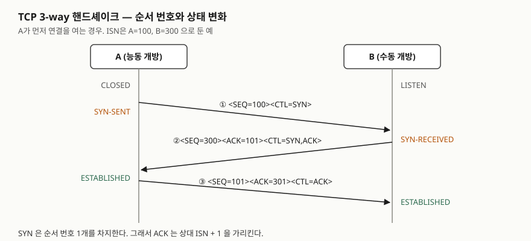
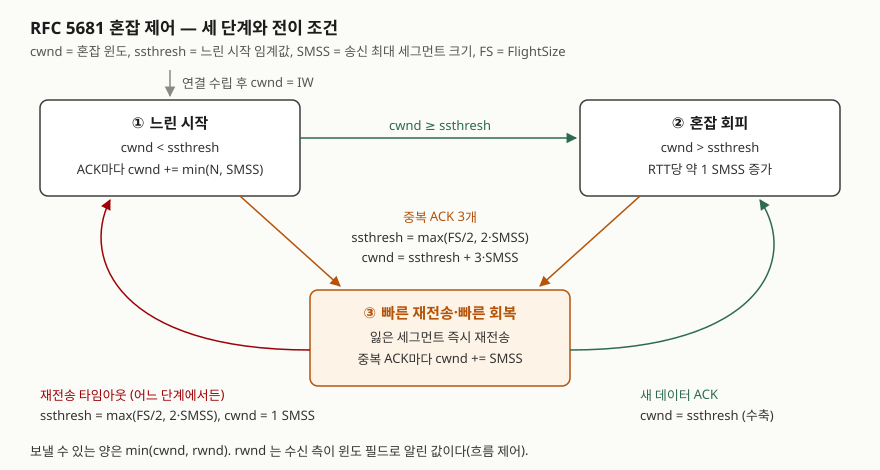

> **실행 검증 없음.** RFC의 정의와 규칙을 정리한 개념 글이다. 본문의 cwnd 값은 RFC의 식에 가정한
> 값을 넣어 직접 계산한 것이며, 패킷을 캡처한 측정값이 아니다.

## 들어가며

TCP는 네트워크 문항에서 계층 모델 다음으로 자주 나온다. 연결 수립 절차를 그리게 하거나, 흐름 제어와
혼잡 제어의 차이를 묻거나, 패킷 손실 뒤 윈도가 어떻게 줄어드는지를 묻는다. 실무에서도 "연결은 되는데
처리량이 안 나온다"는 문제는 대개 윈도 문제로 귀결된다. 두 윈도가 누구의 한계를 나타내는지 구분하지
못하면 원인을 수신 측 버퍼와 네트워크 중 어디에서 찾을지 정하지 못한다.

## 정의

**3-way 핸드셰이크**: TCP 연결을 열 때 양 끝이 SYN과 ACK를 **세 번** 주고받아 서로의 초기 순서 번호(ISN)를
알리고 확인하는 절차다. RFC 9293의 연결 수립 절(§3.5)은 세 번 주고받는 주된 이유를 **오래된 중복 연결
요청이 혼란을 일으키지 않게 하는 것**으로 든다.

**흐름 제어**: 수신 측이 받을 수 있는 양을 윈도 필드로 알려, 송신 측이 **수신 측 버퍼를 넘치게 하지 않도록**
하는 제어다. 윈도 필드는 확인 응답 번호부터 수신 측이 받을 의사가 있는 바이트 수다(RFC 9293 헤더 형식, §3.1).

**혼잡 제어**: 송신 측이 **네트워크가 감당할 수 있는 양**을 추정해 보내는 양을 제한하는 제어다.
RFC 5681이 이를 위한 4가지 알고리즘을 정한다.

## 등장 배경

- **순서 번호만으로는 옛 연결과 새 연결을 가를 수 없다.** 망에 오래 머문 이전 연결의 SYN이 뒤늦게
  도착하면 수신 측은 새 요청으로 오인할 수 있다. 세 번째 메시지로 요청자가 "그 번호는 내가 보낸 것이
  맞다"고 확인해야 이 오인을 걸러 낼 수 있다.
- **흐름 제어만으로는 망이 무너지는 것을 막지 못한다.** 수신 측 버퍼가 넉넉해도 중간 라우터가 넘치면
  패킷이 버려지고, 재전송이 다시 망을 채운다. RFC 1122가 Van Jacobson의 느린 시작·혼잡 회피를 구현
  요구사항으로 넣었고, RFC 9293의 혼잡 제어 절(§3.8.2)은 그 계보를 RFC 5681로 잇는다.

## 구성요소 / 절차

**연결 수립 3단계** (RFC 9293 §3.5)

| 단계 | 보내는 쪽 | 세그먼트 | 보낸 뒤 상태 |
|---|---|---|---|
| ① | A | SYN, SEQ = A의 ISN | A: SYN-SENT |
| ② | B | SYN + ACK, SEQ = B의 ISN, ACK = A의 ISN + 1 | B: SYN-RECEIVED |
| ③ | A | ACK, ACK = B의 ISN + 1 | 양쪽 ESTABLISHED |

TCP 연결 상태는 LISTEN부터 CLOSED까지 **11가지**다(§3.3.2). 이 중 수립에 쓰이는 것이 CLOSED·LISTEN·
SYN-SENT·SYN-RECEIVED·ESTABLISHED 5가지다. 양쪽이 동시에 SYN을 보내는 동시 개방도 지원해야 한다.

**흐름 제어 3요소**

1. **수신 윈도(rwnd)** — 수신 측이 윈도 필드로 알린 값. 송신 측은 이것을 넘겨 보내지 않는다
2. **제로 윈도 탐색** — rwnd가 0이면 송신 측이 주기적으로 탐색 세그먼트를 보내 윈도가 다시 열렸는지
   확인한다. 윈도를 여는 알림이 유실돼 양쪽이 서로 기다리는 상태를 막는다. 탐색 간격은 지수로 늘린다
   (RFC 1122 §4.2.2.17)
3. **어리석은 윈도 증후군 회피** — 수신 측은 작은 윈도 증가를 바로 알리지 않고, 송신 측은 작은 세그먼트를
   바로 보내지 않는다(RFC 1122 §4.2.3.3·§4.2.3.4, 송신 측은 Nagle 알고리즘)

**혼잡 제어 4가지 알고리즘** (RFC 5681)

| 알고리즘 | 언제 | 무엇을 |
|---|---|---|
| 느린 시작 | cwnd < ssthresh | 새 데이터 ACK마다 cwnd += min(N, SMSS) |
| 혼잡 회피 | cwnd > ssthresh | ACK마다 cwnd += SMSS × SMSS / cwnd, RTT당 약 1 SMSS |
| 빠른 재전송 | 중복 ACK 3개 | 타임아웃을 기다리지 않고 잃은 세그먼트를 재전송 |
| 빠른 회복 | 빠른 재전송 직후 | ssthresh = max(FlightSize/2, 2·SMSS), cwnd = ssthresh + 3·SMSS, 새 ACK에 cwnd = ssthresh |

재전송 타임아웃이 나면 단계와 무관하게 ssthresh를 같은 식으로 줄이고 cwnd를 1 SMSS로 내린 뒤 느린 시작으로 돌아간다.
초기 윈도(IW)는 SMSS 크기에 따라 2~4 세그먼트다.

**계산 예** — SMSS = 1,460바이트면 1,095 < SMSS ≤ 2,190 구간이라 IW = 3 × 1,460 = 4,380바이트다.
세그먼트마다 ACK가 온다고 가정하면 느린 시작에서 cwnd는 RTT마다 3 → 6 → 12 세그먼트로 늘어난다.
FlightSize가 20 SMSS일 때 중복 ACK 3개를 받으면 ssthresh = 10 SMSS, cwnd = 13 SMSS가 되고, 새 데이터
ACK가 오면 cwnd = 10 SMSS로 줄어 혼잡 회피를 이어 간다. 같은 시점에 타임아웃이 났다면 cwnd는 1 SMSS다.

## 도식

> **출처**: 세그먼트 형식과 순서 번호 예(SEQ=100, 300)·상태 이름은 [RFC 9293 §3.5 Establishing a Connection](https://www.rfc-editor.org/rfc/rfc9293#section-3.5)과 [§3.3.2 State Machine Overview](https://www.rfc-editor.org/rfc/rfc9293#section-3.3.2)를 따랐다.

> **출처**: 전이 조건과 식은 [RFC 5681 §3.1 Slow Start and Congestion Avoidance](https://www.rfc-editor.org/rfc/rfc5681#section-3.1)와 [§3.2 Fast Retransmit/Fast Recovery](https://www.rfc-editor.org/rfc/rfc5681#section-3.2), 전송량이 min(cwnd, rwnd)라는 것은 [§2 Definitions](https://www.rfc-editor.org/rfc/rfc5681#section-2)를 따랐다.

답안지에는 왼쪽에 핸드셰이크 화살표 3개를, 오른쪽에 상자 3개와 화살표 4개를 그린다. 타임아웃 화살표만
빨간 펜으로 구분하면 "손실 신호에 따라 줄이는 폭이 다르다"는 요점이 그림에 들어간다.

## 비교

### 흐름 제어와 혼잡 제어

| 구분 | 흐름 제어 | 혼잡 제어 |
|---|---|---|
| 막으려는 것 | 수신 측 버퍼 넘침 | 네트워크(라우터 큐) 넘침 |
| 한계를 정하는 쪽 | 수신 측이 알린다 | 송신 측이 추정한다 |
| 변수 | rwnd (윈도 필드) | cwnd, ssthresh |
| 근거 신호 | 수신 측 광고 값 | ACK 도착, 중복 ACK, 타임아웃 |
| 표준 | RFC 9293 §3.8.6, RFC 1122 | RFC 5681 |

보낼 수 있는 양은 **min(cwnd, rwnd)**다. 처리량이 안 나올 때 rwnd가 작으면 수신 측 문제, cwnd가 작으면
망 쪽 문제로 좁힌다.

### 손실 신호에 따른 반응

| 신호 | 뜻 | ssthresh | cwnd |
|---|---|---|---|
| 중복 ACK 3개 | 뒤 세그먼트는 도착 중, 하나만 유실 | max(FlightSize/2, 2·SMSS) | ssthresh + 3·SMSS → ssthresh |
| 재전송 타임아웃 | ACK 흐름 자체가 끊김 | max(FlightSize/2, 2·SMSS) | 1 SMSS |

### Reno 계열(RFC 5681)과 CUBIC(RFC 9438)

| 구분 | RFC 5681 | RFC 9438 CUBIC |
|---|---|---|
| 혼잡 회피 증가 | RTT당 약 1 SMSS, 선형 | 마지막 혼잡 이후 시간의 3차 함수 |
| 감소 폭 | 절반(FlightSize/2) | β = 0.7배 |
| 비고 | 기준 알고리즘 | RFC 5681을 갱신. Reno보다 느리게 늘 구간에서는 Reno 수준을 따른다 |

## 적용 시 고려사항

- **3-way 핸드셰이크는 1 RTT를 쓴다.** 짧은 요청이 많은 서비스는 연결을 재사용(keep-alive, 풀링)해야
  이 비용이 요청마다 붙지 않는다. SYN-RECEIVED 상태의 반개방 연결이 쌓이는 것이 SYN 플러딩이므로
  수신 측 대기열 크기를 함께 본다.
- **ISN은 예측할 수 없어야 한다.** RFC 9293의 ISN 선택 절(§3.4.1)은 클록에 연결 식별자와 비밀 키의 함수
  값을 더하는 방식을 정한다. 예측 가능한 ISN은 연결 가로채기로 이어진다.
- **대역폭 × 지연이 큰 경로는 rwnd가 먼저 막는다.** 윈도 필드는 16비트라 윈도 크기 조정 옵션(RFC 7323)
  없이는 65,535바이트보다 큰 값을 알릴 수 없다. 장거리 전송에서 처리량이 낮으면 cwnd보다 rwnd를 먼저 확인한다.
- **혼잡 제어 알고리즘은 송신 측 선택이다.** 같은 망이라도 송신 호스트가 Reno 계열인지 CUBIC인지에 따라
  손실 뒤 회복 속도가 다르다. 비교 시험을 할 때는 양 끝의 설정을 기록한다.

## 정리

- 핸드셰이크 **3단계**: SYN → SYN+ACK → ACK. 이유는 **오래된 중복 SYN 걸러내기**. 상태는 **11가지**.
- 흐름 제어 **3요소**: rwnd, 제로 윈도 탐색, 어리석은 윈도 증후군 회피 — **수신 측 보호**.
- 혼잡 제어 **4가지**: "느·회·재·복"(느린 시작, 혼잡 회피, 빠른 재전송, 빠른 회복) — **망 보호**.
- 중복 ACK 3개 → 절반으로, 타임아웃 → 1 SMSS로. 전송량 = **min(cwnd, rwnd)**.

## 참고 자료

- [RFC 9293 — Transmission Control Protocol (TCP) (2022, STD 7)](https://www.rfc-editor.org/rfc/rfc9293) — §3.1 헤더 형식(윈도 필드), §3.3.2 상태 11가지, §3.4.1 ISN 선택, [§3.5 연결 수립](https://www.rfc-editor.org/rfc/rfc9293#section-3.5), [§3.8.2 혼잡 제어](https://www.rfc-editor.org/rfc/rfc9293#section-3.8.2), [§3.8.6 윈도 관리](https://www.rfc-editor.org/rfc/rfc9293#section-3.8.6)
- [RFC 5681 — TCP Congestion Control (2009)](https://www.rfc-editor.org/rfc/rfc5681) — §2 용어(cwnd·rwnd·ssthresh·FlightSize), §3.1 느린 시작·혼잡 회피와 IW 식, §3.2 빠른 재전송·빠른 회복
- [RFC 9438 — CUBIC for Fast and Long-Distance Networks (2023)](https://www.rfc-editor.org/rfc/rfc9438#section-4.2) — §4.2 창 증가 함수, §4.3 Reno 친화 구간, §4.6 곱셈 감소(β = 0.7)
- [RFC 7323 — TCP Extensions for High Performance (2014)](https://www.rfc-editor.org/rfc/rfc7323#section-2) — §2 윈도 크기 조정 옵션
- [RFC 1122 — Requirements for Internet Hosts (1989)](https://www.rfc-editor.org/rfc/rfc1122.html#page-92) — §4.2.2.17 제로 윈도 탐색, §4.2.3.3·§4.2.3.4 어리석은 윈도 증후군 회피
