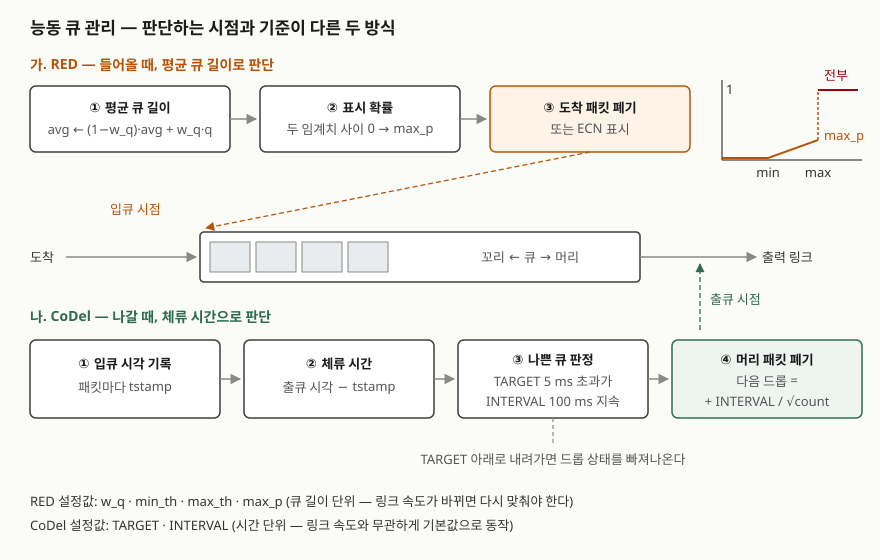

> 정의와 알고리즘은 RFC 7567·RFC 8289와 RED 원 논문으로 확인했다. RED의 표시 확률·EWMA와 CoDel의
> 제어 법칙·상태 기계는 원문의 식과 의사코드를 파이썬으로 옮겨 직접 계산했다. 기록은
> [code/output.txt](code/output.txt)에 있다. **TCP 송신원의 반응은 모델에 없다.** 판단 규칙이 언제
> 무엇을 버리는지만 계산했고, 처리량·지연 개선 폭은 계산하지 않았다.

## 들어가며

QoS 문항에서 스케줄링(어느 큐를 먼저 보낼지)과 짝을 이루는 것이 큐 관리(언제 버릴지)다. FIFO와
WFQ를 비교하는 답안에서도 RFC 7567이 둘을 **함께 써야 한다**고 권고하므로 AQM 한 줄이 따라
나온다. 실무에서는 버퍼가 큰 장비 뒤에서 대량 전송과 화상회의가 섞일 때, 링크는 꽉 차 있는데
대화형 트래픽의 지연만 수백 ms로 늘어나는 **버퍼블로트(bufferbloat)** 로 나타난다. 시험에서는
RED의 확률 곡선과 CoDel의 두 상수(5 ms, 100 ms)를 쓸 수 있는지에서 점수가 갈린다.

## 정의

**능동 큐 관리(AQM, Active Queue Management)**: 네트워크 장비가 **큐 길이 또는 패킷이 큐에 머무는
평균 시간을 제어하는 방법**이다(RFC 7567 §2). 큐가 넘치기 전에 패킷을 버리거나 ECN으로 표시해
송신원이 미리 속도를 줄이게 한다.

- **RED(Random Early Detection)**: 큐 길이의 지수 가중 이동 평균을 두 임계치와 비교해, 그 사이에서는
  평균에 비례하는 확률로 **도착하는 패킷**을 표시·폐기하는 방식이다(Floyd·Jacobson 1993 §4).
- **CoDel(Controlled Delay)**: 패킷의 **체류 시간(sojourn time)** 을 출큐 시점에 재서, 그 최솟값이
  목표치를 일정 시간 넘게 웃돌면 머리 패킷을 버리고 드롭 간격을 점점 좁히는 방식이다(RFC 8289 §1, §3).

## 등장 배경

AQM 이전의 기본값은 꼬리 폐기(tail drop)다. 큐가 가득 찼을 때만 새 패킷을 버린다. RFC 7567의 AQM 필요성 절(§2)은
이 방식의 문제를 두 가지로 정리한다.

1. **잠김(lock-out)**: 소수의 흐름이 큐 공간을 독점해 다른 연결이 버퍼에 들어오지 못한다.
2. **가득 찬 큐(full queues)**: 넘칠 때만 신호를 내므로 큐가 오랫동안 거의 찬 상태로 머문다. 버스트가
   오면 같은 흐름의 패킷이 한꺼번에 버려지고, 여러 TCP가 동시에 창을 줄이는 **전역 동기화**로
   링크 이용률이 떨어진다.

RED가 이것을 풀려고 1993년에 나왔고, 1998년 RFC 2309는 RED를 인터넷 기본 AQM으로 권고했다.
그런데 RFC 7567은 그 권고를 **명시적으로 폐기**한다(§1.4). 적절한 설정에서는 효과적이지만 그 설정을
**동적으로 예측하기 어려웠고**, 그래서 기본으로 켜지지 않아 실제 사용이 제한적이었다는 이유다. 같은
문서는 AQM이 **운영자의 튜닝을 요구해서는 안 된다**는 권고(§4.3)를 새로 넣었다. CoDel은 이 요구에
맞춰 "정상 운영에서는 조정할 손잡이가 없는" AQM을 목표로 설계됐다(RFC 8289 §1).

## 구성요소 / 절차

**RED의 설정값 4가지와 동작 3구간** — 원 논문 §4, §6, §7

| 설정값 | 역할 | 논문의 지침 |
|---|---|---|
| w_q | 평균 큐 길이 EWMA의 가중치 | 0.001 이상(§8.1). 시뮬레이션은 0.002 |
| min_th | 이 아래에서는 표시하지 않음 | 링크 이용률을 지킬 만큼 높게 |
| max_th | 이 위에서는 도착하는 패킷 전부 표시 | min_th의 **두 배 이상**(§6.3) |
| max_p | 두 임계치 사이에서 확률의 상한 | 상한일 뿐이라 넓은 범위에서 고를 수 있다 |

- 평균 < min_th: 표시하지 않는다
- min_th ≤ 평균 < max_th: `p_b = max_p × (평균 − min_th) / (max_th − min_th)`, 최종 확률은
  `p_a = p_b / (1 − count × p_b)` (count: 직전 표시 이후 표시하지 않고 보낸 패킷 수)
- 평균 ≥ max_th: 도착하는 패킷을 전부 표시한다

**CoDel의 구성요소 3가지와 상태 2개** — RFC 8289 §3, §4, §5.5

| 구성요소 | 내용 |
|---|---|
| 추정기(estimator) | 입큐 때 시각을 붙이고 출큐 때 체류 시간을 잰다 |
| 목표치(setpoint) | TARGET 5 ms. RTT의 5~10% 가운데 아래쪽 |
| 제어 루프 | INTERVAL 100 ms. 다음 드롭 시각 = 현재 + INTERVAL / √count |

체류 시간이 TARGET을 **INTERVAL 동안 계속** 넘으면 드롭 상태에 들어가 패킷 하나를 버린다. 이후
제어 법칙이 정한 시각마다 버리고 count를 올린다. 체류 시간이 TARGET 아래로 내려가면 빠져나온다.
다시 들어갈 때, 직전 드롭 상태가 잡아 둔 다음 드롭 시각에서 16 × INTERVAL이 안 지났으면 count를 1이
아니라 직전 상태에서 늘어난 만큼(count − lastcount)으로 시작한다. 드롭 속도를 처음부터 다시 올리지 않으려는 규칙이다.

INTERVAL은 버퍼를 공유하는 연결의 **최대 RTT**에 맞춘 값이다. RFC 8289의 큐 관리 구성 절(§3)은 한 RTT 안에 빠지는
버스트를 **좋은 큐**, 그 이상 서 있는 큐를 지연만 더하는 **나쁜 큐**로 나누고, INTERVAL이 그 둘을
가르는 기준이 된다. 제어 법칙이 √count 꼴인 것은 TCP 처리량이 드롭 확률의 제곱근에 반비례하기
때문이라고 RFC가 밝힌다.

## 도식



> **출처**: [Floyd & Jacobson, Random Early Detection Gateways for Congestion Avoidance, IEEE/ACM ToN 1(4), 1993 — §4 The RED algorithm, §7 Calculating the packet-marking probability](https://www.icir.org/floyd/papers/early.twocolumn.pdf) · [RFC 8289 §3 Understanding the Building Blocks of Queue Management, §5.5 Dequeue Routine](https://www.rfc-editor.org/rfc/rfc8289.html#section-3)

답안지에는 큐 하나를 가로로 그리고, 왼쪽 입구에 "RED: 평균 길이 → 확률", 오른쪽 출구에
"CoDel: 체류 시간 > 5 ms가 100 ms → 드롭"을 적는다. RED 쪽에 0 → max_p → 1로 꺾이는 곡선을
작게 붙이면 된다. 두 방식의 차이는 **어디서(입구·출구) 무엇을(길이·시간) 보는가**다.

## 비교

### 직접 계산 — 큐 길이는 링크 속도를 모른다

같은 50패킷(1500B)이 링크 속도에 따라 뜻하는 지연이다.

```text
      1 Mbps  50패킷 =   600.0 ms   CoDel TARGET 5 ms =    0.42 패킷
     10 Mbps  50패킷 =    60.0 ms   CoDel TARGET 5 ms =    4.17 패킷
    100 Mbps  50패킷 =     6.0 ms   CoDel TARGET 5 ms =   41.67 패킷
   1000 Mbps  50패킷 =     0.6 ms   CoDel TARGET 5 ms =  416.67 패킷
```

RED의 임계치는 패킷(또는 바이트) 수다. max_th를 50으로 잡으면 1 Mbps에서는 600 ms까지 허용하고,
1 Gbps에서는 0.6 ms 만에 전부 버린다. 무선처럼 속도가 수시로 바뀌는 링크에서는 맞는 값이 하나로
정해지지 않는다. CoDel의 TARGET은 시간이라 속도가 바뀌면 허용 패킷 수가 저절로 따라간다.
RFC 7567이 지적한 "설정을 예측하기 어렵다"의 한 원인이 이것이다.

### 직접 계산 — RED가 count를 쓰는 이유

평균 큐 10(p_b 0.01)에서 표시를 10,000번 일으켜 간격을 셌다.

```text
  Method 1  평균   99.7  최대 1050  5개 이내 연속 표시  487번
  Method 2  평균   50.4  최대  100  5개 이내 연속 표시  485번
```

매 패킷을 p_b로 표시하면(Method 1) 간격이 기하분포라 1,050개 동안 아무 신호가 없는 구간이 생겼다.
count를 넣으면(Method 2) 간격이 1~100의 균등분포가 돼 **최대 100을 넘지 않았다.** 논문의 표시 확률 절(§7)은 신호가
너무 오래 끊기는 것도 전역 동기화를 부른다고 보고 Method 2를 택했다. 짧은 간격의 빈도는 둘이 거의
같았으므로, count가 막는 것은 **신호가 오래 끊기는 경우**다. EWMA는 w_q 0.001·0.002·0.003에서
평균이 0.63에 닿기까지 1000·500·333개가 걸려 논문의 w_q 하한 절(§6.2)에 적힌 값과 같았다.

### 직접 계산 — CoDel의 좋은 큐와 나쁜 큐

```text
  [좋은 큐: 80 ms 안에 빠지는 버스트] 드롭 0회

  [나쁜 큐: 20 ms 체류가 서 있음, 450 ms 에 재진입] 드롭 10회
       101 ms  count  1  (진입)
       201 ms  count  2  (제어 법칙)
       272 ms  count  3  (제어 법칙)
       330 ms  count  4  (제어 법칙)
       380 ms  count  5  (제어 법칙)
       551 ms  count  4  (진입)
       601 ms  count  5  (제어 법칙)
```

(재진입 뒤 줄은 일부만 실었다.) 체류 시간이 40 ms까지 치솟은 버스트라도 100 ms 안에 빠지면 한 번도
버리지 않았다. 20 ms가 서 있는 큐는 100 ms 뒤에 첫 드롭을 하고, 간격이 100 → 70.7 → 57.7 ms로
좁아졌다. 50 ms 쉬었다 다시 들어갈 때 count는 1이 아니라 4(직전 5 − 처음 1)에서 시작했다.

### RED와 CoDel의 대비

| 구분 | 꼬리 폐기 | RED | CoDel |
|---|---|---|---|
| 판단 시점 | 입큐(넘칠 때) | 입큐 | 출큐 |
| 판단 기준 | 큐가 가득 참 | 평균 큐 **길이** | 체류 **시간** |
| 폐기 대상 | 도착 패킷 | 도착 패킷(확률) | 머리 패킷 |
| 설정값 | 버퍼 크기 | w_q·min_th·max_th·max_p | TARGET·INTERVAL(기본값 사용) |
| 링크 속도 변화 | — | 임계치를 다시 맞춰야 함 | 영향 없음 |
| 버스트 허용 | 버퍼가 남는 만큼 | EWMA가 평균을 늦게 올리는 만큼 | INTERVAL 안에 빠지면 전부 |
| 표준 상태 | — | RFC 2309 권고, RFC 7567이 기본 권고 폐기 | RFC 8289 (Experimental) |

시간을 기준으로 하는 AQM으로 PIE도 있다(RFC 8033, Experimental). 체류 지연을 목표치 15 ms에 맞추도록
드롭 확률을 비례·적분 제어로 갱신하고, 폐기는 입큐에서 한다. CoDel을 흐름별 큐마다 따로 거는
FQ-CoDel(RFC 8290)은 1024개 큐를 5-튜플 해시로 나누고 DRR 변형으로 돌린다.

## 적용 시 고려사항

- **스케줄링과 함께 설계한다.** RFC 7567의 AQM과 다중 큐 절(§2.1)은 AQM과 스케줄링이 서로를 대신하지 못한다고 본다. 큐
  하나에 CoDel만 걸면 폭주 흐름이 다른 흐름을 밀어내는 잠김은 남는다. 흐름 격리까지 필요하면
  FQ-CoDel처럼 흐름별 큐 + AQM 조합을 쓴다.
- **INTERVAL은 경로의 RTT에 맞는지 확인한다.** 100 ms는 일반 지상 인터넷 기준이다(RFC 8289 §4.2).
  데이터센터 내부처럼 RTT가 수백 μs인 구간이나 위성 링크에서는 기본값이 맞지 않으므로 그 환경의
  최대 RTT로 다시 정해야 한다.
- **ECN을 함께 켠다.** RFC 7567의 ECN 권고(§4.2.1)는 ECN을 지원하는 트래픽에는 버리지 말고 표시하라고 권고한다.
  재전송 없이 혼잡 신호만 전달된다. 단, 신호에 반응하지 않는 흐름은 표시만으로 막을 수 없으므로
  과도한 트래픽은 ECN이 있어도 버려야 한다.
- **RED를 쓰는 장비라면 임계치를 링크 속도로 환산해 본다.** 위 계산처럼 패킷 수로 정한 임계치가
  몇 ms에 해당하는지 확인하고, min_th와 max_th 간격은 논문 지침대로 두 배 이상 둔다.

## 정리

- **정의 1줄**: 큐 길이나 체류 시간을 제어하려고 넘치기 전에 버리거나 ECN으로 표시하는 방법.
- **꼬리 폐기의 문제 2가지 — 잠김·가득 찬 큐**, 그 결과가 전역 동기화와 큰 지연.
- **RED 설정 4개(w_q·min·max·max_p), 구간 3개(0 / 선형 / 전부)**, count로 간격을 균등하게.
- **CoDel 구성 3개(추정기·목표치·제어 루프), 상수 2개(5 ms·100 ms)**, 다음 드롭 = INTERVAL / √count.
- 대비의 축은 **입구에서 길이를 보느냐, 출구에서 시간을 보느냐**. RFC 7567은 튜닝이 필요 없는 쪽을 권고한다.

> 기출 답안: [기출문제 — FIFO와 WFQ(Weighted Fair Queuing) 비교](../../exam/2026-10-01-fifo-vs-weighted-fair-queuing/index.md)

## 참고 자료

- [S. Floyd, V. Jacobson, "Random Early Detection Gateways for Congestion Avoidance", IEEE/ACM Transactions on Networking 1(4), pp. 397–413, 1993-08](https://www.icir.org/floyd/papers/early.twocolumn.pdf) — §4 알고리즘, §6.2 w_q 하한, §6.3 임계치, §7 Method 1·2, §8.1 설정 지침
- [RFC 7567, IETF Recommendations Regarding Active Queue Management (BCP 197, 2015-07)](https://www.rfc-editor.org/rfc/rfc7567.html) — §1.4 RED 기본 권고 폐기, §2 잠김·가득 찬 큐, §4.2.1 ECN, §4.3 튜닝 불요
- [RFC 8289, Controlled Delay Active Queue Management (Experimental, 2018-01)](https://www.rfc-editor.org/rfc/rfc8289.html) — §3 좋은 큐·나쁜 큐, §4.2 INTERVAL, §4.3 TARGET, §5.5 Dequeue Routine, §5.6 control_law
- [RFC 8033, Proportional Integral Controller Enhanced (PIE) (Experimental, 2017-02)](https://www.rfc-editor.org/rfc/rfc8033.html)
- [RFC 8290, The Flow Queue CoDel Packet Scheduler and Active Queue Management Algorithm (Experimental, 2018-01)](https://www.rfc-editor.org/rfc/rfc8290.html)
- [RFC 2309, Recommendations on Queue Management and Congestion Avoidance in the Internet (1998-04)](https://www.rfc-editor.org/rfc/rfc2309)
