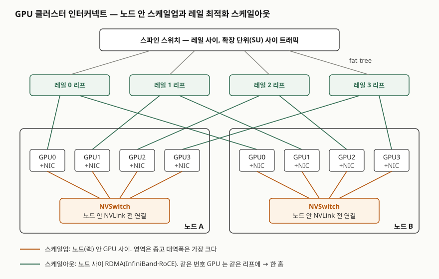

> 실행 검증 없음. 개념 글이라 공개 문서 근거만으로 정리했다.
>
> "GPU 클러스터 인터커넥트"를 정의한 표준은 없다. 구성과 용어는 NVIDIA DGX SuperPOD 참조 아키텍처(벤더 공식 문서),
> RDMA·RoCE는 IBTA 사양과 NVIDIA·Red Hat 공식 문서, 운영상의 문제는 SIGCOMM 논문을 근거로 썼다.
> 대역폭 수치는 참조 아키텍처에 적힌 값만 옮겼고 서로 나눠 배수를 만들지 않았다.

## 들어가며

AI 인프라 문항은 "GPU를 많이 모은 클러스터"에서 끝나지 않고, **GPU 사이를 무엇으로 어떻게 잇는가**를
묻는 쪽으로 옮겨 가고 있다. 수천 개 GPU가 한 모델을 함께 학습하면 연산 사이마다 기울기와 중간값을
주고받아야 하고, 이 통신이 느리면 GPU가 기다리며 논다. 답안에서 점수가 갈리는 곳은 네트워크를
**노드 안과 노드 사이 두 단으로 나누는 이유**를 병렬화 방식과 엮어 쓰는가다.

## 정의

**GPU 클러스터 인터커넥트**: 가속기 사이의 집합 통신을 위해, 노드(또는 랙) 안의 GPU를 직접 잇는
**스케일업 연결**과 노드 사이를 RDMA로 잇는 **스케일아웃 패브릭**을 계층으로 구성한 네트워크다.

NVIDIA DGX H100 SuperPOD 참조 아키텍처는 노드 안을 4세대 NVLink와 NVSwitch로 잇고, 노드 사이 컴퓨트
패브릭을 **"레일 최적화된 풀 fat-tree"** 로 구성하며 시스템당 NDR 400Gb/s 연결 8개를 둔다고 적는다.
위 정의는 이 구성을 일반 명칭으로 옮긴 것이다.

## 등장 배경

일반 데이터센터 네트워크는 서버마다 NIC 하나로 TCP/IP 통신을 한다. Red Hat 문서는 전통적 IP 통신이
**커널 개입과 여러 번의 메모리 복사**를 거친다고 설명한다. 요청·응답이 짧은 서비스에는 충분하지만,
학습은 모든 GPU가 매 단계 큰 텐서를 동시에 교환하므로 CPU와 커널이 경로에 있으면 그 자체가 병목이 된다.

두 번째 배경은 병렬화마다 통신량이 다르다는 점이다. Megatron-LM 논문은 한 층의 행렬을 나눠 계산하는
**텐서 병렬**이 층마다 all-reduce를 해야 해서, 서버 안 NVLink보다 느린 서버 간 링크로 넓히면 확장이
막힌다고 분석한다. 그래서 통신이 가장 잦은 병렬은 좁고 빠른 영역에, 덜 잦은 병렬(파이프라인·데이터)은
넓은 영역에 둬야 한다. **네트워크를 두 단으로 나누는 것은 이 배치를 가능하게 하려는 것이다.**

## 구성요소 / 절차

**DGX SuperPOD의 논리 네트워크 5가지** — GB200 참조 아키텍처 네트워크 패브릭 절

| 네트워크 | 무엇을 잇는가 | 기술 |
|---|---|---|
| ① NVLink | 랙 안 GPU 72개 | NVLink 5세대, NVSwitch |
| ② 컴퓨트 패브릭 | 노드 사이 학습 트래픽 | InfiniBand, 3계층 fat-tree |
| ③ 스토리지 패브릭 | 노드와 스토리지 | 이더넷, RoCE |
| ④ 인밴드 관리망 | 클러스터 서비스·Slurm·Kubernetes·사용자 접근 | 이더넷 |
| ⑤ 아웃오브밴드 관리망 | 장비 관리 포트, IPMI, 패브릭 관리 | 이더넷 |

①②가 GPU 사이 통신을 맡는다. ③~⑤를 따로 두는 것은 체크포인트 쓰기나 관리 트래픽이 학습 트래픽과
같은 링크에서 경합하지 않게 하려는 것이다. 이 5가지는 4개의 물리 패브릭 위에 실린다.

**스케일아웃 패브릭의 설계 요소 3가지**

1. **RDMA 전송** — 호스트 어댑터가 받은 데이터를 **애플리케이션 버퍼에 바로 놓는다**(Red Hat).
   커널과 CPU를 거치지 않는다. InfiniBand는 링크 계층부터 RDMA용으로 설계됐고, RoCE는 같은 전송 계층을
   이더넷 위에 올린다. RoCEv1은 이더타입 0x8915로 L2에서만, RoCEv2는 UDP 4791번으로 감싸 **IP 라우팅이
   되게** 했다(IBTA Annex A17, 2014).
2. **fat-tree 토폴로지** — 리프·스파인(·코어)으로 쌓고 위로 갈수록 링크를 늘려 계층 사이 대역폭이 줄지
   않게 한다. H100 참조 아키텍처의 확장 단위(SU) 하나는 노드 32개, 리프 8개, 스파인 4개다.
3. **레일 최적화 배치** — 각 노드의 **같은 번호 NIC를 같은 리프 스위치에** 연결한다. 이 묶음이 레일이다.
   참조 아키텍처는 레일 안 트래픽이 SU의 다른 31개 노드에 **항상 한 홉**이라고 적는다.

## 도식

> **출처**: [NVIDIA DGX SuperPOD H100 Reference Architecture — Key Components · Network Fabrics](https://docs.nvidia.com/dgx-superpod/reference-architecture-scalable-infrastructure-h100/latest/network-fabrics.html) · [NVIDIA DGX SuperPOD GB200 Reference Architecture — Network Fabrics](https://docs.nvidia.com/dgx-superpod/reference-architecture-scalable-infrastructure-gb200/latest/network-fabrics.html) · [NVIDIA Developer Blog, Doubling all2all Performance with NCCL 2.12 (2022-02-28) — rail-optimized topology](https://developer.nvidia.com/blog/doubling-all2all-performance-with-nvidia-collective-communication-library-2-12/). 노드당 GPU는 4개로 줄여 그렸다(H100 시스템은 8개).

답안지에는 노드 박스 2개 안에 GPU와 NVSwitch를, 위에 레일별 리프와 스파인을 그리고 **GPU0끼리, GPU1끼리
같은 리프로** 잇는 선만 긋는다. 레일이 무엇인지가 이 선으로 설명된다.

## 비교

### 세 기술의 대비

| 구분 | NVLink / NVSwitch | InfiniBand | RoCEv2 |
|---|---|---|---|
| 담당 | 스케일업 (노드·랙 안) | 스케일아웃 | 스케일아웃·스토리지 |
| 연결 범위 | H100 노드 8 GPU, GB200 NVL72 랙 72 GPU | 패브릭 전체 | IP로 라우팅되는 범위 |
| 전송 | GPU 사이 직접 연결 | 자체 링크·전송 계층, RDMA | InfiniBand 전송을 UDP/IP에 캡슐화 |
| 무손실 방식 | 노드 안 전용 연결 | 링크 계층 **크레딧 기반** 흐름 제어 | 이더넷 **PFC**(우선순위 흐름 제어) 필요 |
| 관리 주체 | 시스템 내부 | **서브넷 매니저** 필수 | 일반 이더넷·IP 운영 체계 |
| 참조 아키텍처 대역폭 | GPU당 900GB/s(H100), 1.8TB/s(GB200) | 링크당 400Gb/s(NDR) | 스토리지 링크 200GbE(GB200) |

InfiniBand는 수신 측이 버퍼 여유를 **크레딧으로 먼저 알려야** 송신하므로 혼잡으로 패킷을 버리지 않는다
(Mellanox InfiniBand FAQ). 또 Red Hat 문서는 모든 InfiniBand 망에 **서브넷 매니저가 돌아야** 망이
동작한다고 적는다. RoCE는 이더넷 장비와 운영 경험을 그대로 쓰는 대신, NVIDIA 문서가 말하듯 경로의 모든
장비에 PFC 같은 흐름 제어를 켜서 무손실을 따로 만들어야 한다.

### 레일 최적화가 유리한 통신과 불리한 통신

| 통신 패턴 | 레일 최적화에서 | 이유 |
|---|---|---|
| all-reduce (데이터 병렬) | 유리 | 같은 번호 GPU끼리 교환하므로 레일 안 한 홉에서 끝난다 |
| all-to-all (전문가 병렬 등) | 불리 | 서로 다른 번호 GPU 사이 메시지가 스파인을 지나 혼잡이 생긴다 |

NVIDIA 블로그는 all-to-all이 스파인을 거치며 혼잡을 만든다고 보고, NCCL 2.12의 **PXN**이 노드 안
NVLink로 먼저 목적지와 같은 레일의 GPU에 데이터를 옮긴 뒤 보내 **레일을 건너지 않게** 한다고 설명한다.
스케일업과 스케일아웃이 따로 있지 않고 **함께 한 경로를 만든다**는 점이 여기서 드러난다.

## 적용 시 고려사항

- **병렬화 설계와 네트워크 설계를 같이 한다.** 텐서 병렬 크기를 스케일업 영역(노드 8 GPU, NVL72 72 GPU)
  안에 맞춰야 층마다 도는 all-reduce가 느린 링크로 나가지 않는다. 영역이 크면 모델을 나누는 선택지가 넓어진다.
- **RoCE를 택하면 무손실 이더넷 운영을 책임진다.** 마이크로소프트는 RoCEv2를 대규모로 운영하며 **PFC 교착,
  NIC의 PAUSE 프레임 폭주, 전송 계층 라이브락, 느린 수신자 증상** 4가지 안전 문제를 보고했다(§4). 모니터링과
  감시 장치까지 갖출 수 있는지가 InfiniBand 대비 비용 판단에 들어간다.
- **학습·스토리지·관리 트래픽을 물리적으로 나눈다.** 참조 아키텍처가 논리망 5가지를 4개 물리 패브릭에 나눠
  싣는 이유다. 체크포인트 쓰기가 몰리는 순간 학습 통신이 같은 링크를 쓰면 전체 단계가 느려진다.
- **워크로드의 통신 패턴을 보고 토폴로지를 고른다.** 레일 최적화는 all-reduce 중심 학습에 맞고,
  all-to-all이 많은 모델은 스파인 대역폭이나 PXN 같은 라이브러리 지원을 함께 확인한다.

## 정리

- **2단 구성**: 스케일업(NVLink·NVSwitch, 노드·랙 안) + 스케일아웃(InfiniBand·RoCE, 노드 사이).
  이유는 **통신이 가장 잦은 텐서 병렬을 빠른 영역에 가두기 위해서**다.
- **논리망 5가지 — NVLink·컴퓨트·스토리지·인밴드·아웃오브밴드**.
- **스케일아웃 설계 요소 3가지 — R·F·R**: RDMA, Fat-tree, Rail 최적화.
- **InfiniBand 대 RoCE**: 크레딧 기반 무손실 + 서브넷 매니저 대 PFC 무손실 + IP 라우팅(UDP 4791).
- 레일 최적화는 all-reduce에 유리, all-to-all에 불리 → NVLink로 레일을 맞춰 보내는 방식(PXN)으로 보완.

> 기출 답안: [기출문제 — AI 슈퍼컴퓨팅 플랫폼](../../exam/2026-09-30-ai-supercomputing-platform/index.md)
>
> 함께 볼 개념: [LLM 분산 학습 병렬화 — 데이터·텐서·파이프라인 병렬](../../system/2026-09-30-llm-parallelism-data-tensor-pipeline/index.md)

## 참고 자료

- [NVIDIA DGX SuperPOD H100 Reference Architecture — Key Components](https://docs.nvidia.com/dgx-superpod/reference-architecture-scalable-infrastructure-h100/latest/dgx-superpod-components.html) · [Network Fabrics](https://docs.nvidia.com/dgx-superpod/reference-architecture-scalable-infrastructure-h100/latest/network-fabrics.html) (2025-11 갱신) — NVLink 4세대 900GB/s, ConnectX-7 400Gb/s ×8, 레일 최적화 풀 fat-tree, SU 32노드
- [NVIDIA DGX SuperPOD GB200 Reference Architecture — Network Fabrics](https://docs.nvidia.com/dgx-superpod/reference-architecture-scalable-infrastructure-gb200/latest/network-fabrics.html) (2025-11 갱신) — 논리망 5가지·물리 패브릭 4개, NVL72, 3계층 fat-tree
- [NVIDIA Developer Blog, "Doubling all2all Performance with NVIDIA Collective Communication Library 2.12" (2022-02-28)](https://developer.nvidia.com/blog/doubling-all2all-performance-with-nvidia-collective-communication-library-2-12/) — 레일 최적화 정의, PXN
- [NVIDIA MLNX_OFED Documentation — RDMA over Converged Ethernet (RoCE)](https://networking-docs.nvidia.com/mlnxofedswum/24.10-5.1.6.1lts/rdma-over-converged-ethernet-roce) — RoCEv1 이더타입 0x8915, RoCEv2 UDP 4791, PFC 요구
- [Red Hat Enterprise Linux 8, Configuring InfiniBand and RDMA networks — Understanding InfiniBand and RDMA](https://docs.redhat.com/en/documentation/red_hat_enterprise_linux/8/html-single/configuring_infiniband_and_rdma_networks/index) — RDMA 정의, 서브넷 매니저 필수
- [Mellanox, InfiniBand FAQ Rev 1.3](https://network.nvidia.com/pdf/whitepapers/InfiniBandFAQ_FQ_100.pdf) — Q3 TCP와의 차이, Q19 How Does Credit-based Flow Control Work?
- InfiniBand Trade Association, InfiniBand Architecture Specification Vol. 1, Annex A17 RoCEv2 (2014-09)
- [C. Guo et al., "RDMA over Commodity Ethernet at Scale", ACM SIGCOMM 2016](https://www.microsoft.com/en-us/research/wp-content/uploads/2016/11/rdma_sigcomm2016.pdf) — §3 DSCP 기반 PFC, §4 The Safety Challenges
- [D. Narayanan et al., "Efficient Large-Scale Language Model Training on GPU Clusters Using Megatron-LM", SC21](https://arxiv.org/abs/2104.04473)
