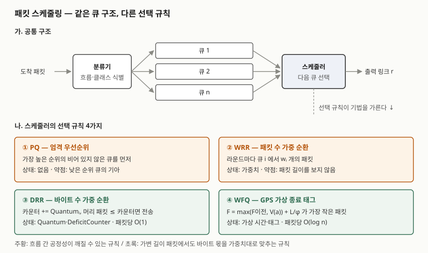

> 정의와 알고리즘은 원 논문과 Cisco 설정 가이드로 확인했고, 네 기법의 바이트 몫과 DRR 적자
> 카운터는 논문 의사코드를 파이썬으로 옮겨 직접 계산했다. 기록은 [code/output.txt](code/output.txt)에 있다.
> 모델은 모든 흐름이 계속 쌓여 있는 경우만 다루며 **시간 축은 없다.** 지연은 계산하지 않고 논문의 결과를 인용했다.

## 들어가며

QoS 문항은 "FIFO와 WFQ를 비교하라"로 나오기도 하고, "PQ·WRR·DRR·WFQ를 비교하라"처럼 넷을 한 번에
묻기도 한다. 이름과 한 줄 설명을 나열하면 네 줄이 비슷해 보여 차이가 드러나지 않는다. 점수는
**무엇을 기준으로 다음 큐를 고르는가**를 쓰고, 그 기준이 격리·지연·비용에 무엇을 남기는지를
보이는 데서 난다. 실무에서는 WAN 병목 구간에 음성과 대량 전송이 섞일 때 어느 기법을 어디에
걸지를 정하는 문제로 나타난다.

## 정의

**패킷 스케줄링**: 출력 링크 하나를 여러 큐가 나눠 쓸 때, 링크가 빌 때마다 **어느 큐의 패킷을
다음에 보낼지 정하는 규칙**이다. 이 규칙이 흐름별 대역폭 몫과 큐잉 지연을 결정한다.

네 기법의 정의는 각각 이렇다.

- **PQ(Priority Queuing)**: 큐에 순위를 매기고, 순위가 높은 큐가 비어 있지 않으면 항상 그 큐를 먼저 보낸다.
  Cisco 가이드는 높은 순위 클래스의 패킷이 **모든 낮은 순위 트래픽보다 먼저** 나간다고 적는다.
- **WRR(Weighted Round Robin)**: 큐를 순서대로 돌면서 큐 i에서 한 라운드에 가중치 wᵢ개의 **패킷**을 보낸다.
  Katevenis 등(1991)이 고정 길이 ATM 셀을 다중화하는 스위치 칩에 구현했다.
- **DRR(Deficit Round Robin)**: 큐마다 Quantum과 적자 카운터를 두고, 방문할 때 카운터에 Quantum을 더한 뒤
  머리 패킷 길이가 카운터 이하인 동안 보내고 남은 값을 다음 라운드로 넘기는 라운드 로빈이다(Shreedhar·Varghese 1995).
- **WFQ(Weighted Fair Queuing)**: 이상적 유체 모델 GPS에서 각 패킷이 끝날 가상 종료 시각을 태그로 붙이고
  태그가 가장 작은 패킷부터 보낸다(Parekh·Gallager 1993).

## 등장 배경

출발점은 FIFO다. 큐가 하나라 많이 보내는 흐름이 많이 차지하고, 한 흐름의 버스트가 모든 흐름의
지연이 된다. Nagle은 RFC 970에서 송신원별 큐를 두고 **라운드 로빈**으로 돌리자고 제안했다.

그런데 라운드 로빈은 **패킷 수**를 센다. DRR 논문은 Nagle 방식의 결함을 패킷 길이를 무시하는 데서
찾고, 최악의 경우 한 흐름이 다른 흐름의 **Max/Min배**(최대 패킷 길이 / 최소 패킷 길이) 대역폭을
가져간다고 적는다. Katevenis의 WRR이 공정했던 것은 ATM 셀 길이가 고정이었기 때문이다.

길이를 제대로 반영한 것이 Demers 등의 공정 큐잉과 그 가중 버전 WFQ다. 비트 단위 라운드 로빈을
흉내 내 공정성은 거의 완벽하지만, 태그 순으로 정렬된 큐에 넣는 데 흐름 수 n에 대해
**O(log n)** 이 든다. DRR 논문은 이것이 고속에서 비싸다고 보고, 라운드 로빈의 O(1)을 유지하면서
길이 차이만 바로잡는 방법으로 적자 카운터를 제안했다. 네 기법은 **공정성과 처리 비용 사이의 네 지점**이다.

## 구성요소 / 절차

**DRR의 구성요소 3가지** — 논문 알고리즘 절(§3)과 Figure 4

| 요소 | 역할 |
|---|---|
| Quantumᵢ | 큐 i가 한 라운드에 새로 받는 바이트 몫. 비율이 곧 가중치다 |
| DeficitCounterᵢ | 이번 라운드에 쓰지 못한 바이트. 다음 라운드로 넘어간다 |
| ActiveList | 패킷이 있는 큐의 목록. 빈 큐를 살피지 않게 해 O(1)을 지킨다 |

**DRR의 동작 4단계**

1. ActiveList 맨 앞의 큐 i를 꺼내 `DeficitCounterᵢ += Quantumᵢ`
2. 머리 패킷 길이 ≤ DeficitCounterᵢ인 동안 보내고, 보낸 길이만큼 카운터에서 뺀다
3. 큐가 비면 **카운터를 0으로** 만들고 목록에서 뺀다. 쉬던 흐름이 몫을 쌓아 두지 못하게 하는 규칙이다
4. 큐가 남았으면 카운터를 그대로 두고 목록 맨 뒤로 보낸다

논문은 라운드가 끝날 때 카운터가 항상 **0 이상 Max 미만**임을 보이고(보조정리 4.1), 계속 쌓여 있는
흐름이 K라운드 동안 보낸 양과 K·Quantum의 차이가 **Max 이하**라고 증명한다(정리 4.2). 패킷당 O(1)은
**Quantumᵢ ≥ Max**일 때 성립한다(정리 4.5).

## 도식



> **출처**: [Shreedhar & Varghese, Efficient Fair Queuing using Deficit Round Robin, SIGCOMM 1995 — §3 Deficit Round Robin, Figure 4](https://courses.cs.duke.edu/fall24/compsci514/readings/drr.pdf) · [Parekh & Gallager, GPS, IEEE/ACM ToN 1993 — §III PGPS](https://pbg.cs.illinois.edu/courses/cs598fa09/readings/pg93.pdf) · [Cisco IOS QoS Configuration Guide 12.2SR — Priority Queueing, Custom Queueing](https://www.cisco.com/c/en/us/td/docs/ios/qos/configuration/guide/12_2sr/qos_12_2sr_book/congstion_mgmt_oview.html)

답안지에는 "분류기 → 큐 n개 → 스케줄러 → 링크" 한 줄을 그리고, 스케줄러 박스 아래에 네 규칙을
한 줄씩 적는다. 큐 구조는 같고 **선택 규칙만 다르다**는 것이 이 도식이 보여 줄 전부다.

## 비교

### 직접 계산 — 패킷 길이가 다를 때

A는 1500B, B는 100B 패킷만 보내고 가중치는 1:1이다. 링크가 30,000B를 보낼 때까지 센 몫이다.

```text
  PQ (A 우선)                A  30000B (100.0%)  B      0B (  0.0%)
  WRR 1:1 (패킷 수)           A  28500B ( 94.1%)  B   1800B (  5.9%)
  DRR Quantum 1500:1500    A  15000B ( 50.0%)  B  15000B ( 50.0%)
  WFQ φ 1:1                A  15000B ( 50.0%)  B  15000B ( 50.0%)
  WRR 이론값: A:B = Max/Min = 15:1 → A 93.8%
```

WRR은 한 라운드에 A 1500B, B 100B를 보내므로 논문이 말한 Max/Min = 15배가 그대로 나온다
(94.1%는 마지막 라운드가 30,000B를 조금 넘긴 몫이다). PQ는 순위가 높은 쪽이 쌓여 있는 한
낮은 쪽이 한 바이트도 못 보낸다. Cisco 가이드가 경고하는 **기아(starvation)** 다.

길이가 같으면(1000B, 목표 3:2:1) WRR·DRR·WFQ가 모두 50.0 : 33.3 : 16.7%로 같았다. C만 3000B로
바꾸자 WRR은 C에 35.0%를 줘 목표의 두 배를 넘겼고, DRR은 14.5%, WFQ는 15.0%로 목표 근처에 머물렀다.
WRR의 불공정은 **길이 차이에서만** 생긴다.

### 직접 계산 — DRR 적자 카운터

Quantum 500에 Q3의 패킷이 1200B로 Quantum보다 크다.

```text
  라운드 1  Q1: 카운터  500 → 전송 [200] → 남은 카운터  300  대기 [750, 300]
  라운드 1  Q3: 카운터  500 → 전송 없음 → 남은 카운터  500  대기 [1200]
  라운드 2  Q1: 카운터  800 → 전송 [750] → 남은 카운터   50  대기 [300]
  라운드 2  Q3: 카운터 1000 → 전송 없음 → 남은 카운터 1000  대기 [1200]
  라운드 3  Q3: 카운터 1500 → 전송 [1200] → 남은 카운터    0  대기 비었음
```

(Q2 줄과 라운드 3의 Q1 줄은 뺐다. 전체는 실행 기록에 있다.) Q1은 750B를 첫 라운드에 못 보냈지만
남은 300이 넘어가 둘째 라운드에 나갔다. Q3는 두 라운드를 **빈손으로 방문**받았다. Quantum이
Max보다 작으면 이런 방문이 생겨 정리 4.5의 O(1) 조건이 깨진다.

### 네 기법의 대비

| 구분 | PQ | WRR | DRR | WFQ |
|---|---|---|---|---|
| 선택 기준 | 순위 | 패킷 수 순환 | 바이트 수 순환 | 가상 종료 태그 최소 |
| 흐름 간 격리 | 없음 (상위가 하위를 굶김) | 길이가 같을 때만 | 있음 (오차 Max 이하) | 있음 |
| 지연 | 최상위만 짧음, 하위는 상한 없음 | 라운드 길이에 좌우 | Quantum에 좌우 (§4) | GPS 상한 + Lmax/r |
| 패킷당 비용 | 순위 수만큼 확인 | O(1) | O(1), Quantum ≥ Max일 때 | O(log n) |
| 유지 상태 | 없음 | 가중치 | Quantum·카운터 | 가상 시간·태그 |
| 맞는 곳 | 소량의 제어·음성 | 고정 길이 셀 | 고속 링크의 공정 분배 | 지연 상한이 필요한 저속 구간 |

WFQ의 지연 상한은 Parekh·Gallager의 정리 1(WFQ 출발이 GPS보다 Lmax/r 이상 늦지 않다)에서 나온다.
DRR 논문은 저부하에서의 패킷 지연과 고부하에서의 처리량이 **Quantum 값에 달려 있다**고 적는다.
한 큐가 한 번에 최대 Quantum + Max 미만을 보내므로, 다른 큐의 패킷은 그만큼씩 흐름 수만큼 기다릴 수 있다.

## 적용 시 고려사항

- **DRR의 Quantum은 최대 패킷 길이 이상으로 잡는다.** 위 추적처럼 작으면 빈 방문이 생기고 O(1)이
  깨진다. 크게 잡으면 한 큐가 한 번에 오래 링크를 쥐어 다른 큐의 지연이 늘어난다. MTU가 기준점이다.
- **PQ는 최상위 큐의 양을 제한해야 쓸 수 있다.** 엄격 우선순위만으로는 하위 큐가 굶는다. Cisco LLQ가
  엄격 우선순위 큐를 두면서 **폴리싱으로 그 양을 묶는** 이유다.
- **WRR의 가중치는 패킷 수라는 것을 기억한다.** 흐름마다 평균 패킷 길이가 다르면 바이트 비율이 가중치와
  어긋난다. Cisco 커스텀 큐잉 가이드도 바이트 카운트를 **각 프로토콜의 패킷 크기에 맞춰** 정하라고 적는다.
- **지연 상한을 약속해야 하면 WFQ 계열을 쓴다.** DRR은 처리량 공정성은 맞추지만 지연은 Quantum과 흐름
  수에 따라 변한다. 계약된 지연이 있는 구간과 처리량 공정성만 필요한 구간을 나눠 기법을 고른다.

## 정리

- **정의 1줄**: 링크가 빌 때마다 다음에 보낼 큐를 정하는 규칙. 큐 구조는 같고 **선택 규칙이 다르다**.
- **4가지 규칙 — 순위·개수·바이트·태그**: PQ는 순위, WRR은 패킷 개수, DRR은 바이트(적자 카운터), WFQ는 가상 종료 태그.
- **비교 축 3가지**: 격리(PQ 없음 → WFQ 있음), 지연(WFQ만 상한 공식), 비용(DRR·WRR O(1), WFQ O(log n)).
- **DRR 요소 3개**: Quantum, DeficitCounter, ActiveList. 조건 **Quantum ≥ Max**, 오차 **Max 이하**.
- WRR 불공정의 크기는 **Max/Min배**. 길이가 같으면 WRR·DRR·WFQ가 같은 몫을 준다.

> 기출 답안: [기출문제 — FIFO와 WFQ(Weighted Fair Queuing) 비교](../../exam/2026-10-01-fifo-vs-weighted-fair-queuing/index.md)

## 참고 자료

- [M. Shreedhar, G. Varghese, "Efficient Fair Queuing using Deficit Round Robin", ACM SIGCOMM 1995](https://dl.acm.org/doi/10.1145/217382.217453) — §2 Nagle 방식의 Max/Min 불공정, §3 알고리즘과 Figure 4, 보조정리 4.1, 정리 4.2·4.5 ([듀크대 강의 자료 사본](https://courses.cs.duke.edu/fall24/compsci514/readings/drr.pdf))
- [A. K. Parekh, R. G. Gallager, "A Generalized Processor Sharing Approach to Flow Control in Integrated Services Networks: The Single-Node Case", IEEE/ACM ToN 1(3), 1993](https://pbg.cs.illinois.edu/courses/cs598fa09/readings/pg93.pdf) — §III PGPS, 정리 1
- [M. Katevenis, S. Sidiropoulos, C. Courcoubetis, "Weighted Round-Robin Cell Multiplexing in a General-Purpose ATM Switch Chip", IEEE JSAC 9(8), 1991-10](https://dl.acm.org/doi/10.1109/49.105173)
- [J. Nagle, RFC 970, On Packet Switches With Infinite Storage (1985-12)](https://www.rfc-editor.org/rfc/rfc970)
- [Cisco IOS QoS Configuration Guide 12.2SR — Congestion Management Overview (Priority Queueing, Custom Queueing, Low Latency Queueing)](https://www.cisco.com/c/en/us/td/docs/ios/qos/configuration/guide/12_2sr/qos_12_2sr_book/congstion_mgmt_oview.html)
