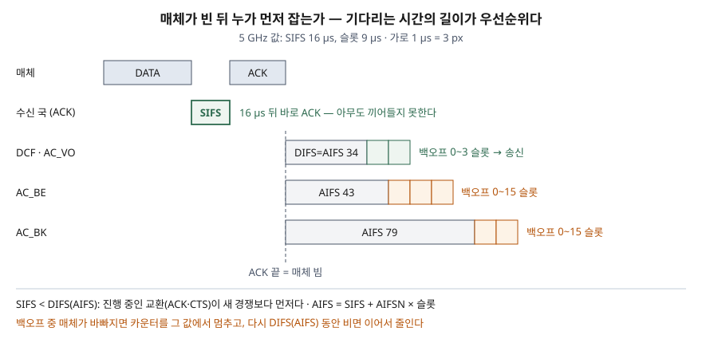

> DCF의 동작은 Bianchi(2000)의 802.11 DCF 요약 절, 5 GHz 대역의 IFS·경쟁 창 값과 EDCA 접근 범주별
> 파라미터는 RFC 8325, AIFS 식과 가상 충돌 규칙은 Inan 외(2007)로 확인했다. IEEE 802.11 표준 본문은
> 유료라 직접 인용하지 않았다. IFS·경쟁 창·충돌 확률은 파이썬으로 직접 계산했고 기록은
> [code/output.txt](code/output.txt)에 있다. **포화 상태·이상 채널 가정**이므로 실제 처리량은 계산하지 않았다.

## 들어가며

무선랜 문항은 "CSMA/CA를 CSMA/CD와 비교하라", "숨은 단말 문제와 해결책을 쓰라"처럼 동작 원리를 묻는다.
정의 한 줄로는 점수가 안 나고, **SIFS·DIFS의 길이 차이가 왜 우선순위가 되는지**, 백오프가 왜 멈췄다
이어지는지를 써야 동작을 아는 답안이 된다. 실무에서는 사무실 AP 하나에 단말이 수십 대 붙으면서 링크
속도는 높은데 체감 속도가 떨어지는 현상, 음성 통화 품질이 데이터 트래픽에 밀리는 현상으로 나타난다.

## 정의

**DCF(Distributed Coordination Function)**: IEEE 802.11의 기본 매체 접근 제어 방식으로, 이진 지수
백오프를 쓰는 CSMA/CA다(Bianchi 2000, 초록).

**CSMA/CA(Carrier Sense Multiple Access with Collision Avoidance)**: 송신 전에 매체가 비었는지 감지하고,
비어 있어도 **무작위 백오프 시간만큼 더 기다려** 충돌 확률을 낮춘 뒤 보내며, 성공 여부는 수신 측의
**ACK**로 확인하는 경쟁 기반 접근 방식이다.

**EDCA(Enhanced Distributed Channel Access)**: 802.11e가 정의한 HCF의 경쟁 기반 접근 방식으로, 트래픽을
**접근 범주(AC)** 별 큐에 나누고 범주마다 다른 AIFS·CW·TXOP 한도로 경쟁하게 해 우선순위를 준다(Inan 외 2007 §I·§II).

## 등장 배경

유선 이더넷의 CSMA/CD는 보내면서 동시에 들어 충돌을 감지한다. 무선에서는 **송신기가 자기 송신을 들어서는
수신 성공 여부를 알 수 없다**(Bianchi 2000 §I). 그래서 802.11은 두 가지를 바꿨다.

1. 충돌을 감지하는 대신 **보내기 전에 기다려 피한다** — 이것이 CA다.
2. 수신 국이 **ACK를 명시적으로** 돌려보내 성공을 확인한다.

여기에 무선만의 문제가 하나 더 있다. 두 송신 국이 서로의 신호를 못 듣는 **숨은 단말**이면 반송파 감지가
매체를 비었다고 판단해 같은 수신 국에서 충돌한다. RTS/CTS와 NAV가 이 문제를 위해 들어갔다.
이후 음성·영상 트래픽이 늘면서 모든 프레임이 같은 규칙으로 경쟁하는 DCF로는 우선순위를 줄 수 없어
802.11e가 EDCA를 더했다.

## 구성요소 / 절차

**DCF 기본 접근 5단계** — Bianchi 2000 §II

| 단계 | 동작 |
|---|---|
| ① 반송파 감지 | 보낼 프레임이 생기면 매체를 살핀다 |
| ② DIFS 대기 | 매체가 DIFS 동안 비면 보낸다. 바쁘면 DIFS 동안 빌 때까지 계속 살핀다 |
| ③ 백오프 | `0 ~ CW` 중 무작위 슬롯 수를 고르고, 빈 슬롯마다 1씩 줄인다. 다른 송신이 감지되면 **동결**, 다시 DIFS 동안 비면 **재개**. 0이 되면 보낸다 |
| ④ 전송 | 데이터 프레임을 보낸다 |
| ⑤ ACK | 수신 국이 SIFS 뒤 ACK를 보낸다. 시간 안에 ACK가 없으면 CW를 두 배로 늘려(CWmax까지) ③부터 다시 한다 |

연속 전송 사이에도 백오프를 거친다. 매체가 DIFS 동안 비어 있어도 한 국이 매체를 독점하지 못하게 하려는
것이다(Bianchi 2000 §II).

**시간 파라미터 4가지** — RFC 8325 §6.1, Inan 외 2007 §II

| 이름 | 정의 | 5 GHz 값 |
|---|---|---|
| 슬롯 시간 | 다른 국의 송신을 감지하는 데 드는 시간. 모든 타이머의 기본 단위 | 9 µs |
| SIFS | 수신 신호를 처리하는 데 드는 시간. ACK·CTS 앞에 쓴다 | 16 µs |
| DIFS | SIFS + 2 × 슬롯 | 34 µs |
| AIFS[AC] | SIFS + AIFSN[AC] × 슬롯. EDCA에서 DIFS 자리에 쓴다 | 34~79 µs |

**RTS/CTS 4방향 교환** — RTS → (SIFS) → CTS → (SIFS) → DATA → (SIFS) → ACK. RTS·CTS에는 전송 길이가 실려,
듣는 국은 **NAV**에 매체가 바쁠 시간을 적어 두고 그동안 보내지 않는다. 이것이 **가상 반송파 감지**다.
숨은 단말도 수신 국의 CTS 하나만 들으면 물러난다(Bianchi 2000 §II).

**EDCA 접근 범주 4개** — RFC 8325 §6.2.3·§6.2.4

| AC | AIFSN | CWmin | CWmax |
|---|---|---|---|
| AC_VO (음성) | 2 | 3 | 7 |
| AC_VI (영상) | 2 | 7 | 15 |
| AC_BE (최선형) | 3 | 15 | 1023 |
| AC_BK (배경) | 7 | 15 | 1023 |

한 단말 안에서 두 AC의 백오프가 동시에 0이 되면(**가상 충돌**) 우선순위가 높은 AC가 보내고, 낮은 AC는
바깥 충돌을 겪은 것처럼 CW를 늘린다. 매체를 얻은 AC는 **TXOP 한도** 안에서 SIFS 간격으로 여러 프레임을
이어 보낼 수 있다(Inan 외 2007 §II).

## 도식



> **출처**: [RFC 8325 §6.1 Distributed Coordination Function, §6.2 Hybrid Coordination Function](https://www.rfc-editor.org/rfc/rfc8325.html#section-6) · [Inan, Keceli, Ayanoglu, arXiv:0704.1838 §II EDCA Overview](https://arxiv.org/abs/0704.1838) · [Bianchi, IEEE JSAC 18(3), 2000 §II 802.11 Distributed Coordination Function](https://www.eng.buffalo.edu/~tmelodia/papers/bianchi.pdf)

답안지에는 가로 시간축 하나에 DATA·SIFS·ACK를 그리고, ACK 끝에서 세로선을 내린 뒤 아래로 DIFS,
AIFS(BE), AIFS(BK)를 길이만 다르게 그린다. **짧게 기다리는 쪽이 먼저 잡는다**는 한 줄을 붙이면 된다.

## 비교

### 직접 계산 — IFS 길이가 만드는 우선순위

```text
  SIFS 16 us, 슬롯 9 us → DIFS = SIFS + 2x슬롯 = 34 us
  AC_VO  AIFSN 2  AIFS  34 us  + 백오프 0~ 3 슬롯 → 첫 시도 대기 34~61 us
  AC_BE  AIFSN 3  AIFS  43 us  + 백오프 0~15 슬롯 → 첫 시도 대기 43~178 us
  AC_BK  AIFSN 7  AIFS  79 us  + 백오프 0~15 슬롯 → 첫 시도 대기 79~214 us
```

ACK를 보내는 수신 국은 16 µs만 기다리므로 34 µs를 기다리는 누구보다 먼저 매체를 잡는다. 진행 중인
교환이 끊기지 않는 이유다. EDCA에서는 음성이 61 µs 안에 첫 시도를 하는 동안 배경 트래픽은 아직 AIFS
79 µs도 끝나지 않는다. 우선순위를 별도 신호 없이 **기다리는 시간의 길이만으로** 만든다.

### 직접 계산 — 백오프 동결과 경쟁 창

```text
  B 백오프 8:  슬롯1:7 · 슬롯2:6 · 슬롯3:5 · A 송신 감지 → 동결 5 · A 끝 + DIFS 동안 빔 → 재개 5 · 4 · 3 · 2 · 1 · 0 · 0에서 B 송신
  AC_BE  재전송마다 CW 15 → 31 → 63 → 127 → 255 → 511 → 1023  (단계 6개)
  AC_VO  재전송마다 CW 3 → 7  (단계 1개)
```

동결된 단말은 새 값을 뽑지 않고 남은 5부터 이어서 줄인다. 앞 경쟁에서 이미 기다린 만큼이 남으므로
새로 뽑는 단말보다 평균적으로 먼저 끝난다. 최선형은 충돌할 때마다 창이 두 배씩 6번까지 커지지만,
음성은 지연을 줄이려고 창을 7에서 멈춘다.

### 직접 계산 — 창이 작으면 단말이 늘 때 충돌이 급증한다

```text
  단말수 |      AC_BE (W=16, m=6)        |      AC_VO (W=4, m=1)
         |  p(모델)  p(시뮬)  tau(모델)    |  p(모델)  p(시뮬)  tau(모델)
      2  |   0.105    0.107    0.1046   |   0.319    0.328    0.3187
      5  |   0.272    0.267    0.0761   |   0.695    0.644    0.2570
     10  |   0.384    0.366    0.0525   |   0.907    0.834    0.2318
     20  |   0.481    0.460    0.0339   |   0.992    0.912    0.2230
     50  |   0.595    0.574    0.0183   |   1.000    0.959    0.2222
```

p는 보낸 프레임이 충돌할 확률, τ는 한 단말이 임의의 슬롯에 보낼 확률이다. Bianchi 모델의 식 (7)·(9)를
풀고 같은 조건의 슬롯 시뮬레이션과 맞췄다. 최선형은 모델과 시뮬레이션이 0.02 안쪽으로 맞았고, 단말 50대에서도
창이 커지면서 τ가 0.018까지 내려가 충돌 확률이 0.6 아래에 머물렀다. 음성 범주만 경쟁하면 단말 10대에서
시뮬레이션 기준 0.83이 충돌했다. 창이 7에서 멈추므로 τ가 0.22 아래로 내려가지 못하기 때문이다. 모델이
시뮬레이션보다 크게 나온 것은 **충돌 확률이 재시도 횟수와 무관하다는 모델의 가정이 단계가 1개뿐인 작은 창에서
덜 맞기 때문**이다. Bianchi도 이 가정이 창과 단말 수가 클수록 정확하다고 밝힌다(§IV).

### CSMA/CD·DCF·EDCA 대비

| 구분 | CSMA/CD (이더넷) | DCF (802.11) | EDCA (802.11e) |
|---|---|---|---|
| 충돌 처리 | 송신 중 감지 후 중단 | 감지 불가 → **사전 회피** + ACK | DCF와 같음 |
| 송신 전 대기 | 매체가 비면 즉시 | DIFS + 백오프 | AIFS[AC] + 백오프 |
| 우선순위 | 없음 | 없음 (SIFS로 교환 보호만) | AC 4개, AIFSN·CW로 차등 |
| 한 번 잡으면 | 프레임 1개 | 프레임 1개 (+ACK) | TXOP 한도 안에서 여러 개 |
| 숨은 단말 | 해당 없음 | RTS/CTS + NAV (선택) | 같음 |

## 적용 시 고려사항

- **RTS/CTS는 길이 임계값으로 건다.** RTS/CTS는 충돌을 짧은 RTS에서만 일어나게 해 긴 프레임에서 이득이
  크지만, 짧은 프레임에는 교환 비용만 붙는다. 그래서 길이 임계값을 넘는 프레임에만 쓰는 조합 운용이
  있다(Bianchi 2000 초록·§I). 숨은 단말이 의심되는 넓은 공간이면 임계값을 낮춘다.
- **음성 단말 수를 제한한다.** 위 계산처럼 AC_VO는 창이 작아 같은 범주 단말이 늘면 충돌 확률이 빠르게
  오른다. 음성 품질이 중요하면 AP 하나에 붙는 음성 단말 수를 설계 단계에서 정하고, 모든 트래픽을
  VO로 표시하는 잘못된 QoS 매핑을 막는다. 상위 계층 표시(DSCP)와 AC의 대응은 RFC 8325가 권고한다.
- **처리량은 링크 속도가 아니다.** IFS·백오프·ACK가 매 전송마다 붙는 고정 비용이고, 단말이 늘면 충돌과
  백오프가 더해진다. Bianchi는 이것을 포화 처리량으로 따로 정의했다(§III). 용량 산정은 단말 수와 프레임
  길이를 넣어 따져야 한다.
- **지연 상한을 보장하지 않는다.** 경쟁 기반이라 접근 지연이 확률적이다. 상한이 필요한 제어 트래픽에는
  경쟁 없는 방식(HCCA 같은 폴링, 또는 유선)을 검토한다.

## 정리

- **정의 1줄**: 보내기 전에 매체를 감지하고 무작위 백오프만큼 더 기다려 충돌을 피하며, ACK로 성공을 확인하는 방식.
- **5단계 — 감지·DIFS·백오프·전송·ACK.** 백오프는 바쁘면 **동결**, 비면 **재개**.
- **IFS 순서 — SIFS(16) < DIFS(34) ≤ AIFS(34~79 µs).** 짧게 기다리는 쪽이 우선이다.
- **CD가 아닌 이유 1줄**: 자기 송신 때문에 충돌을 들을 수 없다.
- **숨은 단말 = RTS/CTS + NAV(가상 반송파 감지).** EDCA는 **AC 4개(VO·VI·BE·BK)** 를 AIFSN·CW·TXOP로 차등.

> 기출 답안: [기출문제 — 무선 매체를 나눠 쓰는 세 방식 (CSMA/CA·CDMA·TDMA)](../../exam/2026-10-04-wireless-multiple-access-csma-ca-cdma-tdma/index.md)

## 참고 자료

- [G. Bianchi, "Performance Analysis of the IEEE 802.11 Distributed Coordination Function", IEEE JSAC 18(3), pp. 535–547, 2000-03](https://www.eng.buffalo.edu/~tmelodia/papers/bianchi.pdf) — §I·§II DCF·RTS/CTS·NAV, §III 포화 처리량, §IV 식 (7)·(9)
- [RFC 8325, Mapping Diffserv to IEEE 802.11 (Proposed Standard, 2018-02)](https://www.rfc-editor.org/rfc/rfc8325.html) — §6.1 DCF(슬롯·SIFS·DIFS·CW), §6.2 HCF(AIFS·AC별 CW)
- [I. Inan, F. Keceli, E. Ayanoglu, "Performance Analysis of the IEEE 802.11e Enhanced Distributed Coordination Function using Cycle Time Approach", arXiv:0704.1838, 2007-04](https://arxiv.org/abs/0704.1838) — §I HCF(EDCA·HCCA), §II AIFS 식·TXOP·가상 충돌
- [IEEE Std 802.11-2020, Wireless LAN Medium Access Control (MAC) and Physical Layer (PHY) Specifications](https://standards.ieee.org/ieee/802.11/7028/) — DCF·EDCA의 원 규격. 본문은 직접 인용하지 않았다
