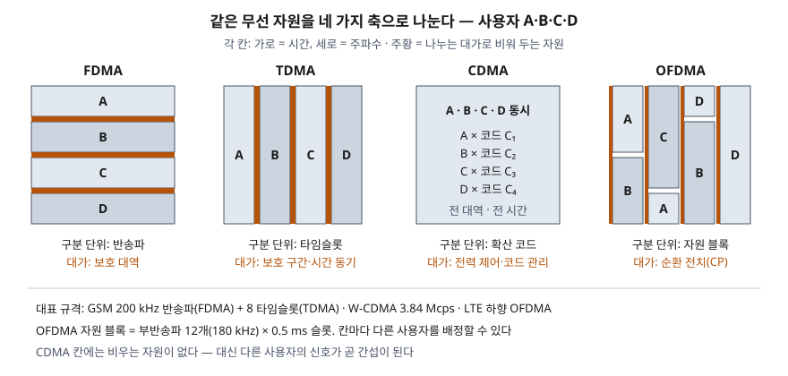

> 정의와 수치는 3GPP 규격(GSM TS 45.005·45.002, W-CDMA TS 25.213, LTE TS 36.211·36.300)으로 확인했다.
> 반송파 수, 타임슬롯 길이, OVSF 코드 직교성, LTE 순환 전치 길이와 그 비중은 규격의 식을 파이썬으로
> 옮겨 직접 계산했고 기록은 [code/output.txt](code/output.txt)에 있다. **잡음·페이딩·간섭은 모델에 없다.**
> 각 방식의 수용량이나 스펙트럼 효율은 계산하지 않았다.

## 들어가며

무선 구간의 문항은 "CSMA/CA·CDMA·TDMA를 설명하라"처럼 접근 방식 여럿을 한꺼번에 묻는 형태가 많다.
이때 네 방식을 각각 외운 정의로 나열하면 차별점이 없다. 점수는 **무엇으로 사용자를 가르고, 그 대가로
무엇을 관리해야 하는가**를 같은 틀로 비교하는 데서 난다. 실무에서도 이동통신이 FDMA·TDMA(2G)에서
CDMA(3G)를 거쳐 OFDMA(4G 하향)로 옮겨 간 이유가 이 대가의 크기 차이로 설명된다.

## 정의

**다중 접속(multiple access)**: 여러 단말이 하나의 무선 자원을 동시에 쓰도록, 자원을 서로 겹치지 않는
몫으로 나눠 단말마다 배정하는 방식이다. 나누는 축에 따라 4가지로 구분한다.

- **FDMA**: 대역을 **반송파**로 나눈다. GSM은 채널 간격을 200 kHz로 정한다(TS 45.005 §2).
- **TDMA**: 반송파 하나를 주기적으로 반복되는 **타임슬롯**으로 나눈다. GSM은 슬롯 8개로 TDMA 프레임
  하나를 만든다(TS 45.002 §4.3).
- **CDMA**: 모든 단말이 같은 반송파·같은 시간을 쓰고, **확산 코드**로 신호를 가른다. W-CDMA는 채널화
  코드와 스크램블링 코드 두 단계로 확산한다(TS 25.213 §4.1).
- **OFDMA**: 대역을 서로 직교하는 **부반송파**로 나누고, 부반송파 묶음과 시간 칸을 단말마다 배정한다.
  LTE 하향은 순환 전치(CP)를 붙인 OFDM을 쓰며 부반송파 간격은 15 kHz다(TS 36.300 §5.1.1).

## 등장 배경

1. **FDMA**만 쓰면 반송파 하나에 사용자 하나라서 사용자를 늘리려면
   반송파를 늘려야 하고, 이웃 반송파와의 간섭을 막는 **보호 대역**이 반송파 수만큼 생긴다.
2. **TDMA**는 반송파 하나를 시간으로 다시 나눠 한 반송파에 여러 사용자를 실었다. GSM은 FDMA와 TDMA를
   결합한다. 대신 단말 전체가 프레임 시각에 맞춰야 하는 **시간 동기**가 비용이 됐다.
3. **CDMA**는 주파수·시간을 나누지 않아 이웃 셀이 같은 반송파를 쓸 수 있게 했다. 대신 다른 단말의
   신호가 곧 간섭이 되어 **전력 제어**가 필수가 됐다.
4. **OFDMA**는 넓은 대역을 좁은 부반송파 여럿으로 쪼개 다중 경로로 늦게 도착한 신호를 **순환 전치**로
   흡수하고, 부반송파 묶음 단위로 단말을 배정한다. LTE는 하향에 OFDMA, 상향에 단일 반송파 FDMA(DFT로
   펼친 OFDM, SC-FDMA)를 쓴다(TS 36.300 §5.2.1). SC-FDMA는 OFDMA보다 **최대 전력 대 평균
   전력비(PAPR)가 낮다**고 설명된다(Myung 외, 2006). 아래 비교 절에서 이것을 직접 계산했다.

## 구성요소 / 절차

**네 방식을 가르는 비교 축 4가지**

| 축 | FDMA | TDMA | CDMA | OFDMA |
|---|---|---|---|---|
| ① 구분 단위 | 반송파 | 타임슬롯 | 확산 코드 | 자원 블록(부반송파 × 시간) |
| ② 동시성 | 같은 시간, 다른 주파수 | 같은 주파수, 다른 시간 | 같은 시간·같은 주파수 | 다른 부반송파·다른 시간 칸 |
| ③ 비우는 자원 | 보호 대역 | 보호 구간 | 없음(간섭으로 대신 치름) | 순환 전치 |
| ④ 반드시 관리할 것 | 반송파 간 간섭, 필터 | 시간 동기, 타이밍 어드밴스 | **전력 제어**, 코드 트리 | 주파수 동기, CP 길이 |

**규격의 기본 단위 — 직접 계산**

```text
[FDMA] 25 MHz / 채널 간격 200 kHz = 125 칸, 배정 ARFCN 1~124 → 124개 반송파
       첫·끝 반송파 890.2 MHz, 914.8 MHz (대역 끝과 0.2 MHz, 0.2 MHz 떨어짐)
[TDMA] 타임슬롯 3/5200 s = 576.9 us, TDMA 프레임 8 슬롯 = 4.615 ms
       물리 채널 수 124 반송파 x 8 슬롯 = 992
[OFDMA] Ts 1/(15000x2048) = 32.55 ns, 유효 심볼 2048 Ts = 66.67 us (= 1/15 kHz)
       자원 블록 12 부반송파 x 15 kHz = 180 kHz, 0.5 ms 슬롯
```

P-GSM 900 상향 25 MHz를 200 kHz로 나누면 125칸이지만 규격이 배정하는 번호는 1~124다(TS 45.005 표 2-2).
양 끝 반 칸씩을 대역 경계의 여유로 남기는 구조다. FDMA가 대역을 다 쓰지 못하는 이유가 숫자로 보인다.

## 도식



> **출처**: [3GPP TS 45.005 V13.4.0 §2 Frequency bands and channel arrangement](https://www.etsi.org/deliver/etsi_ts/145000_145099/145005/13.04.00_60/ts_145005v130400p.pdf) · [3GPP TS 45.002 V13.2.0 §4.3 Timeslots, TDMA frames](https://www.etsi.org/deliver/etsi_ts/145000_145099/145002/13.02.00_60/ts_145002v130200p.pdf) · [3GPP TS 25.213 V4.0.0 §4.1 Overview](https://www.etsi.org/deliver/etsi_ts/125200_125299/125213/04.00.00_60/ts_125213v040000p.pdf) · [3GPP TS 36.300 V8.12.0 §5.1.1 Basic transmission scheme based on OFDM](https://www.etsi.org/deliver/etsi_ts/136300_136399/136300/08.12.00_60/ts_136300v081200p.pdf)

답안지에는 가로 시간·세로 주파수인 정사각형 4개를 나란히 그린다. 가로 줄(FDMA), 세로 줄(TDMA),
통째(CDMA), 바둑판(OFDMA)으로 나누고 각 칸 아래에 "대가"를 한 단어씩 적으면 비교의 축이 선다.

## 비교

### 직접 계산 — CDMA의 코드 직교성과 그 조건

```text
  C(4,0)  +1 +1 +1 +1
  C(4,1)  +1 +1 -1 -1
  C(4,2)  +1 -1 +1 -1
  C(4,3)  +1 -1 -1 +1
  같은 층 상관값   C4,0·C4,1=0, C4,0·C4,2=0, C4,0·C4,3=0, C4,1·C4,2=0, C4,1·C4,3=0, C4,2·C4,3=0
  공중 신호(A+B)   [0, 2, -2, 0]
  A 역확산         +1   B 역확산 -1
  C(2,1)이 심볼 (+1,+1)을 실을 때 C(4,0..3)과 상관값 [0, 0, 4, 0]
  C(2,1)이 심볼 (+1,-1)을 실을 때 C(4,0..3)과 상관값 [0, 0, 0, 4]
```

같은 층의 OVSF 코드끼리는 상관값이 모두 0이라, 두 단말의 신호를 칩 단위로 더해 보내도 각자의 코드로
역확산하면 +1과 −1이 그대로 나온다. 그런데 SF 2인 C(2,1)을 쓰는 채널은 자손 C(4,2)·C(4,3)과 데이터에
따라 상관값 4로 섞였고, 자손이 아닌 C(4,0)·C(4,1)과는 끝까지 0이었다. 규격이 코드 트리에서
**조상·자손을 함께 배정하지 못하게** 하는 이유다(TS 25.213 §4.3.1).

### 직접 계산 — OFDMA의 순환 전치가 사는 것과 내는 것

```text
  일반 CP #0     160 Ts =  5.21 us  경로차 1.56 km까지  (슬롯 7심볼 = 15360 Ts)
  일반 CP #1~6   144 Ts =  4.69 us  경로차 1.41 km까지  (슬롯 7심볼 = 15360 Ts)
  확장 CP        512 Ts = 16.67 us  경로차 5.00 km까지  (슬롯 6심볼 = 15360 Ts)
  CP 비중          일반 6.67%  확장 20.00%
  반사파 지연  3 샘플, CP 8 샘플 → 최대 오차 3.93e-14
  반사파 지연  3 샘플, CP 0 샘플 → 최대 오차 3.88e-01
  반사파 지연  8 샘플, CP 8 샘플 → 최대 오차 4.04e-14
  반사파 지연 12 샘플, CP 8 샘플 → 최대 오차 5.59e-01
```

부반송파 64개짜리 작은 OFDM 심볼을 반사파가 있는 채널에 통과시켰다. 반사파 지연이 CP 안에 들면
부반송파마다 나눗셈 한 번으로 원래 심볼이 계산 오차 수준(10⁻¹⁴)까지 복원됐고, CP가 없거나 지연이
CP를 넘으면 오차가 0.39~0.56으로 커졌다. 어느 길이의 CP를 고르든 슬롯 길이는 15360 Ts로 같으므로,
확장 CP는 경로차 5 km까지 견디는 대신 슬롯당 심볼이 7개에서 6개로 줄고 CP 비중이 6.67%에서 20%가 된다.

### 직접 계산 — 상향에 SC-FDMA를 쓰는 이유

```text
  64점 IFFT, 연속 부반송파 16개, QPSK, 심볼 400개
  OFDMA    PAPR 평균  6.09 dB  상위 1%  8.55 dB  최대  9.21 dB
  SC-FDMA  PAPR 평균  4.41 dB  상위 1%  6.53 dB  최대  6.96 dB
```

같은 부반송파 16개에 QPSK를 그대로 실으면(OFDMA) 16개 정현파가 더해져 순간 전력이 평균보다 크게
튄다. 16점 DFT로 먼저 펼친 뒤 실으면(SC-FDMA) 시간 신호가 단일 반송파에 가까워져 PAPR이 평균
약 1.7 dB, 상위 1% 기준 약 2 dB 낮았다. 단말의 전력 증폭기는 최대 전력에 맞춰 여유를 둬야 하므로
이 차이가 상향을 OFDMA와 다르게 설계하는 근거가 된다. 기지국이 쓰는 하향에는 이 제약이 덜하다.

### 네 방식 대비

| 구분 | FDMA | TDMA | CDMA | OFDMA |
|---|---|---|---|---|
| 대표 시스템 | GSM의 반송파 분할 | GSM | W-CDMA, IS-95 | LTE 하향 |
| 충돌·간섭 | 반송파 간 간섭 | 배정 뒤 충돌 없음 | **사용자 수만큼 간섭 증가** | 직교 유지 시 부반송파 간 간섭 없음 |
| 수용량을 정하는 것 | 반송파 수 | 반송파 수 × 슬롯 수 | 간섭 수준과 남은 코드 | 자원 블록 수 |
| 셀 간 주파수 | 셀마다 나눔 | 셀마다 나눔 | 같은 반송파 재사용 | 같은 반송파, 간섭 조정 필요 |
| 배정의 유연성 | 낮음 | 슬롯 단위 | SF로 속도 조절 | 자원 블록 단위로 시간·주파수 모두 |

경쟁형 접근 규칙인 CSMA/CA는 이 표에 넣지 않는다. 다중 접속은 **자원을 어떻게 나누는가**이고,
CSMA/CA는 나누지 않은 매체를 **누가 언제 쓰는가**를 정하는 MAC 규칙이라 층위가 다르다.

## 적용 시 고려사항

- **트래픽 성격에 맞춘다.** 슬롯이 주기적으로 돌아오는 TDMA는 일정 속도의 음성에 맞지만, 쓰지 않는
  슬롯을 다른 단말이 가져가지 못해 간헐적인 데이터에서는 자원이 빈다. OFDMA는 자원 블록 단위로
  스케줄러가 매 슬롯 배정을 바꿀 수 있어 데이터 트래픽에 맞다.
- **셀 반경과 지연 확산으로 CP를 고른다.** 위 계산처럼 일반 CP는 경로차 약 1.4 km까지 흡수한다.
  반사 경로가 긴 넓은 셀에서는 확장 CP가 필요하고, 그만큼 전송 효율이 떨어진다.
- **CDMA를 쓰면 전력 제어 루프가 핵심 설계 대상이 된다.** 기지국 가까운 단말이 세게 들어오면 먼 단말이
  묻힌다(원근 문제). W-CDMA는 기지국이 슬롯마다 TPC 명령으로 단말 출력을 맞춘다(TS 25.214 §5.1.2.2.1).
- **상·하향을 같은 방식으로 볼 필요는 없다.** LTE처럼 단말 쪽 송신 효율을 위해 상향만 SC-FDMA를 쓰는
  조합이 가능하다. 기술 비교 답안에서 "4G = OFDMA"라고만 쓰면 상향이 빠진다.

## 정리

- **정의 1줄**: 공유 무선 자원을 겹치지 않는 몫으로 나눠 단말마다 배정하는 방식.
- **나누는 축 4가지 — 주파수(FDMA)·시간(TDMA)·코드(CDMA)·부반송파×시간(OFDMA).**
- **대가 4가지 — 보호 대역·보호 구간과 시간 동기·전력 제어·순환 전치.** 두문자로 "대·구·전·순".
- 숫자 단서: GSM 200 kHz × 8슬롯(576.9 µs), W-CDMA 3.84 Mcps, LTE 15 kHz·자원 블록 12부반송파(180 kHz)·일반 CP 4.69 µs.
- 비교 답안에서는 CSMA/CA를 같은 줄에 놓지 말고 **층위가 다르다**고 먼저 밝힌다.

> 기출 답안: [기출문제 — 무선 매체를 나눠 쓰는 세 방식 (CSMA/CA·CDMA·TDMA)](../../exam/2026-10-04-wireless-multiple-access-csma-ca-cdma-tdma/index.md)

## 참고 자료

- [3GPP TS 45.005 V13.4.0 (2017-04), GSM/EDGE Radio transmission and reception (ETSI TS 145 005)](https://www.etsi.org/deliver/etsi_ts/145000_145099/145005/13.04.00_60/ts_145005v130400p.pdf) — §2 채널 간격 200 kHz, 표 2-2 ARFCN
- [3GPP TS 45.002 V13.2.0 (2016-08), GSM/EDGE Multiplexing and multiple access on the radio path (ETSI TS 145 002)](https://www.etsi.org/deliver/etsi_ts/145000_145099/145002/13.02.00_60/ts_145002v130200p.pdf) — §4.3 타임슬롯·TDMA 프레임
- [3GPP TS 25.213 V4.0.0 (2001-03), Spreading and modulation (FDD) (ETSI TS 125 213)](https://www.etsi.org/deliver/etsi_ts/125200_125299/125213/04.00.00_60/ts_125213v040000p.pdf) — §4.1 확산 개요, §4.3.1 OVSF 채널화 코드, §4.4.1 칩 속도
- [3GPP TS 25.214 V5.3.0 (2002-12), Physical layer procedures (FDD) (ETSI TS 125 214)](https://www.etsi.org/deliver/etsi_ts/125200_125299/125214/05.03.00_60/ts_125214v050300p.pdf) — §5.1.2.2.1 상향 내부 루프 전력 제어
- [3GPP TS 36.211 V8.9.0 (2010-01), E-UTRA Physical channels and modulation (ETSI TS 136 211)](https://www.etsi.org/deliver/etsi_ts/136200_136299/136211/08.09.00_60/ts_136211v080900p.pdf) — §4.1 프레임 구조, 표 5.6-1·표 6.12-1 CP 길이
- [3GPP TS 36.300 V8.12.0 (2010-04), E-UTRA and E-UTRAN Overall description (ETSI TS 136 300)](https://www.etsi.org/deliver/etsi_ts/136300_136399/136300/08.12.00_60/ts_136300v081200p.pdf) — §5.1.1 하향 OFDM, §5.2.1 상향 SC-FDMA
- H. G. Myung, J. Lim, D. J. Goodman, "Single Carrier FDMA for Uplink Wireless Transmission", IEEE Vehicular Technology Magazine 1(3), pp. 30–38, 2006-09 — SC-FDMA의 낮은 PAPR
