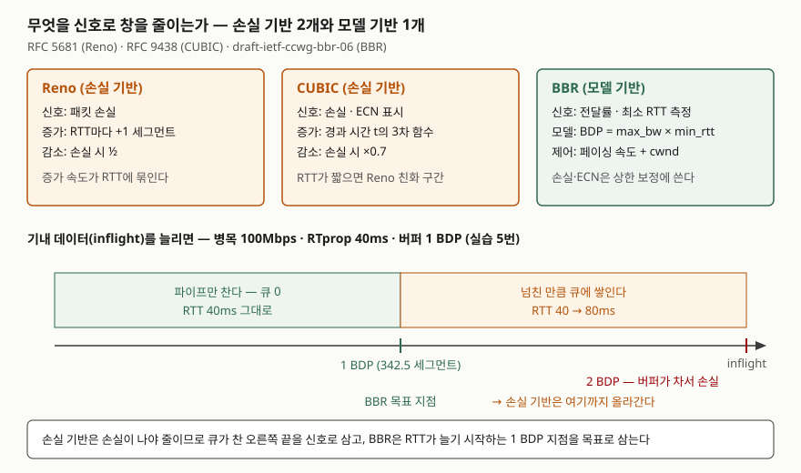

> 이 글의 숫자는 RFC와 드래프트의 식을 [`code/congestion_signals.py`](code/congestion_signals.py)로 계산한 값이다.
> 실제 망에서 잰 값이 아니다. 실행 기록은 [`code/output.txt`](code/output.txt)에 있다.

## 들어가며

혼잡 제어 문항은 "Reno와 CUBIC과 BBR을 비교하라"로 나온다. 증가·감소 방식을 표로 외워 두면 반은 쓰지만, 점수가 갈리는
곳은 **각 알고리즘이 무엇을 보고 혼잡이라고 판단하는가**다. 실무에서도 같은 질문이 돌아온다. 대역폭은 남는데 지연이
수백 ms로 튀는 회선(버퍼블로트), 손실이 조금만 나도 처리량이 무너지는 장거리 회선은 신호를 무엇으로 잡느냐에서 갈린다.
기본 구조(느린 시작·혼잡 회피·빠른 재전송·빠른 회복)는 [TCP 연결 수립과 혼잡 제어 글](../2026-09-28-tcp-handshake-flow-congestion-control/index.md)에서 다뤘다.

## 정의

> **혼잡 제어 알고리즘**: 송신 측이 망의 혼잡 신호를 받아 **혼잡 윈도(cwnd)와 송신 속도를 조절**해, 경로의
> 병목을 넘치지 않게 쓰는 규칙. — RFC 5681 용어 정의(§2)는 cwnd를 송신 측이 보낼 수 있는 데이터 양을 제한하는
> 상태 변수로, 실제 상한을 cwnd와 rwnd 중 작은 값으로 정한다

알고리즘을 가르는 기준은 **신호의 종류 2가지**다.

- **손실 기반**: 패킷 손실(또는 ECN 표시)을 혼잡으로 보고 창을 곱셈으로 줄인다 — Reno, CUBIC
- **모델 기반**: 전달률과 RTT를 재서 경로 모델(병목 대역폭 × 최소 RTT)을 세우고 그에 맞춰 보낸다 — BBR

## 등장 배경

- **Reno의 한계 — 증가가 RTT에 묶인다.** 혼잡 회피에서 RTT마다 1 세그먼트씩 늘므로, 손실 뒤 창 W_max를 되찾는 데
  W_max/2 RTT가 걸린다. 계산하면 W_max 1000·RTT 100ms에서 **50초**다(실습 1번). 고속·장거리 망을 채우지 못한다.
- **CUBIC — RTT 대신 경과 시간.** RFC 9438은 RTT 공정성 원칙(§3.3)에서 창 증가를 RTT 횟수가 아닌 **실제 경과 시간**의
  함수로 두어, Reno 친화 구간 밖에서는 증가 속도가 RTT와 무관하다고 적는다. 같은 RFC 서론(§1)은 CUBIC이 리눅스·
  윈도·애플 스택의 기본 알고리즘이 되었다고 적고, 2023년 RFC 9438로 표준 트랙이 됐다.
- **BBR — 손실이 혼잡과 어긋난다.** BBR 드래프트 서론(§1)은 손실 기반의 문제 2가지를 든다. 얕은 버퍼에서는 이용률이
  낮아도 손실이 나 처리량이 떨어지고, 깊은 버퍼에서는 버퍼를 반복해 채워 큐 지연이 커진다(버퍼블로트).

## 구성요소 — 3가지 알고리즘

| 구분 | 신호 | 증가 | 감소 | 근거 |
|---|---|---|---|---|
| **① Reno** | 손실(중복 ACK 3개, 타임아웃) | RTT마다 +1 세그먼트 | ssthresh = max(FlightSize/2, 2·SMSS) | RFC 5681 §3.1·§3.2 |
| **② CUBIC** | 손실, ECN-Echo | W(t) = C(t−K)³ + W_max | cwnd × β (β = 0.7) | RFC 9438 §4.2·§4.6 |
| **③ BBR** | 전달률 · 최소 RTT (손실·ECN은 상한 보정) | 페이싱 이득으로 대역폭 탐색 | 모델이 정한 BDP로 수렴 | draft-ietf-ccwg-bbr-06 §2.9·§5.3 |

**② CUBIC의 식 4개** (RFC 9438)

1. 창 증가 함수 — W_cubic(t) = C·(t − K)³ + W_max, **C = 0.4** (§4.2, 권고값은 §5.1)
2. K = ∛((W_max − cwnd_epoch) / C) — 줄어든 창이 W_max로 돌아오는 시간(§4.2)
3. Reno 친화 구간 — W_est가 RTT마다 α = 3(1−β)/(1+β) ≈ 0.53씩 늘고, **W_est가 W_cubic보다 크면 W_est를 쓴다**(§4.3)
4. 곱셈 감소 — 혼잡 신호에 창을 **β = 0.7**배로(§4.6). Reno의 0.5보다 덜 줄인다

**③ BBR의 모델과 상태 4단계** (draft-06)

- 모델: **BBR.bdp = BBR.bw × BBR.min_rtt**(§2.9.2). min_rtt는 최근 10초 창의 최솟값(§2.16)
- 상태: **Startup**(이득 2.77로 대역폭 탐색) → **Drain**(0.5로 쌓인 큐 비우기) → **ProbeBW**(DOWN 0.9 · CRUISE 1.0 ·
  REFILL 1.0 · UP 1.25 순환) ↔ **ProbeRTT**(10초간 min_rtt가 갱신되지 않으면 200ms 동안 창을 줄여 최소 RTT 재측정)
- 손실은 버리지 않는다. 라운드당 손실률이 BBR.LossThresh(기본 2%)를 넘으면 기내 데이터 상한을 낮춘다(§2.8)

## 도식

> **출처**: [RFC 5681 §3.1 Slow Start and Congestion Avoidance](https://www.rfc-editor.org/rfc/rfc5681#section-3.1),
> [RFC 9438 §4.2 Window Increase Function](https://www.rfc-editor.org/rfc/rfc9438#section-4.2)·[§4.6 Multiplicative Decrease](https://www.rfc-editor.org/rfc/rfc9438#section-4.6),
> [draft-ietf-ccwg-bbr-06 §1 Introduction](https://www.ietf.org/archive/id/draft-ietf-ccwg-bbr-06.html#section-1)·[§2.9.2](https://www.ietf.org/archive/id/draft-ietf-ccwg-bbr-06.html#section-2.9.2).
> 아래 축의 RTT 값은 병목 큐 하나만 있는 경로로 가정해 계산한 실습 5번 결과다.

답안에는 위 세 칸(신호·증가·감소)과 아래 축의 두 지점(1 BDP, 버퍼가 찬 지점)만 옮기면 된다.

## 비교

### 식을 계산해 본 결과 — 손실 뒤 W_max로 돌아오는 시간

| W_max | RTT | Reno | CUBIC (실제 cwnd) | CUBIC에서 먼저 닿은 쪽 |
|---|---|---|---|---|
| 100 | 10ms | 0.50초 | 0.57초 | W_est (Reno 친화) |
| 100 | 100ms | 5.00초 | 4.30초 | W_cubic |
| 1000 | 10ms | 5.00초 | 5.67초 | W_est (Reno 친화) |
| 1000 | 100ms | 50.00초 | 9.10초 | W_cubic |

(실습 1·3번 출력. CUBIC의 K는 W_max 100에서 4.217초, 1000에서 9.086초로 **RTT가 식에 없다**.)

예상과 달랐던 것은 RTT 10ms 줄이다. CUBIC은 3차 함수로 4.2초 걸릴 것 같았지만 실제로는 **Reno 친화 구간의 W_est가 먼저
닿아 0.57초**였다. RTT가 짧으면 RTT마다 0.53씩 느는 W_est가 시간 함수보다 빠르다. CUBIC이 Reno보다 확실히 앞서는 것은
**BDP가 크고 RTT가 긴 경로**다. W_max 1000·RTT 100ms에서 50초 대 9.1초로 갈렸다. RFC 9438이 Reno 친화 원칙(§3.2)을 둔
이유가 이것이다. 작은 BDP 망에서는 Reno와 같은 몫을 가져가게 한다.

### 손실 기반과 모델 기반

| 항목 | 손실 기반 (Reno·CUBIC) | 모델 기반 (BBR) |
|---|---|---|
| 혼잡 판단 | 손실·ECN이 오면 | 측정한 전달률·최소 RTT로 BDP 추정 |
| 동작 지점 | 버퍼가 찰 때까지 올라간다 | BDP 부근을 목표로 한다 |
| 큐 지연 | 버퍼 크기만큼 쌓였다 비워진다 | 탐색(UP 1.25) 때만 잠깐 쌓인다 |
| 송신 방식 | ACK가 오면 창만큼 보낸다 | 페이싱 속도로 고르게 보낸다 |
| 표준 상태 | RFC 5681(표준), RFC 9438(표준 트랙) | IETF 드래프트(실험) |

실습 5·6번에서 병목 100Mbps·RTprop 40ms·버퍼 1 BDP 경로를 계산했다. BDP는 342.5 세그먼트다. 기내 데이터가 1 BDP면
RTT가 40ms 그대로이고, 손실 기반이 버퍼를 다 채운 2 BDP에서는 80ms가 된다. Reno가 버퍼를 채우고 손실로 절반이 되는 한
주기는 343 RTT(약 20.6초)였고 **주기 평균 RTT는 60ms**, RTprop의 1.5배였다. BBR의 UP 단계(1.25배)를 기내 데이터 1.25 BDP로
근사하면 RTT는 50ms다. 이 RTT 값은 큐 하나짜리 경로를 가정한 계산이다.

## 적용 시 고려사항

- **경로의 버퍼 깊이를 먼저 본다.** 깊은 버퍼(가정용 회선, 모바일 기지국)에서 손실 기반은 큐 지연을 키운다. 지연에 민감한
  서비스는 BBR이나 AQM([RED·CoDel 글](../2026-10-01-active-queue-management-red-codel/index.md))을 함께 검토한다.
- **RTT가 짧은 데이터센터 안에서는 CUBIC이 Reno처럼 움직인다.** 실습 3번처럼 Reno 친화 구간이 이긴다. 알고리즘을 바꿔
  처리량을 올리려는 판단은 RTT와 BDP를 재고 나서 한다.
- **공존 공정성을 확인한다.** 손실 기반과 모델 기반이 같은 병목을 나눌 때 몫이 갈릴 수 있다. BBR 드래프트가 손실률 상한
  (LossThresh 2%)을 둔 것도 이 때문이다. 도입 전 혼재 환경에서 흐름별 처리량을 측정한다.
- **혼잡 제어는 송신 측 선택이다.** 수신 측이나 중간 장비가 바꿀 수 없으므로, 다운로드 서비스는 서버의 알고리즘이 사용자
  체감 지연을 정한다. 서버 커널 설정과 QUIC 구현의 알고리즘을 같이 관리한다.
- **ECN을 함께 켠다.** CUBIC은 ECN-Echo를 손실과 같은 혼잡 신호로 받는다(RFC 9438 §4.6). 손실 없이 신호를 받으면 재전송이 줄어든다.

## 정리

암기 단서는 **"손실이냐 모델이냐 — 리½ · 큐0.7 · 비BDP"** 다.

- 정의: 송신 측이 혼잡 신호로 **cwnd와 송신 속도를 조절**하는 규칙. 신호 **2종류**(손실 기반·모델 기반)
- **3가지 알고리즘** — Reno(+1/RTT, ½), CUBIC(경과 시간의 3차 함수, ×0.7, RTT가 짧으면 Reno 친화), BBR(BDP = max_bw × min_rtt)
- CUBIC 식 **4개** — W(t), K, Reno 친화 구간, 곱셈 감소
- BBR 상태 **4단계** — Startup → Drain → ProbeBW(4국면) ↔ ProbeRTT
- 손실 기반은 버퍼가 찬 지점을, BBR은 1 BDP 지점을 동작점으로 삼는다

## 참고 자료

- [RFC 5681 — TCP Congestion Control (2009)](https://www.rfc-editor.org/rfc/rfc5681) — [§2 Definitions](https://www.rfc-editor.org/rfc/rfc5681#section-2), [§3.1 Slow Start and Congestion Avoidance](https://www.rfc-editor.org/rfc/rfc5681#section-3.1), [§3.2 Fast Retransmit/Fast Recovery](https://www.rfc-editor.org/rfc/rfc5681#section-3.2)
- [RFC 9438 — CUBIC for Fast and Long-Distance Networks (2023)](https://www.rfc-editor.org/rfc/rfc9438) — [§3 Design Principles](https://www.rfc-editor.org/rfc/rfc9438#section-3), [§4.2 Window Increase Function](https://www.rfc-editor.org/rfc/rfc9438#section-4.2), [§4.3 Reno-Friendly Region](https://www.rfc-editor.org/rfc/rfc9438#section-4.3), [§4.6 Multiplicative Decrease](https://www.rfc-editor.org/rfc/rfc9438#section-4.6), [§5.1 Fairness to Reno](https://www.rfc-editor.org/rfc/rfc9438#section-5.1)
- [draft-ietf-ccwg-bbr-06 — BBR Congestion Control (2026-07, Experimental 의도)](https://www.ietf.org/archive/id/draft-ietf-ccwg-bbr-06.html) — [§1 Introduction](https://www.ietf.org/archive/id/draft-ietf-ccwg-bbr-06.html#section-1), [§2.9.2 BDP](https://www.ietf.org/archive/id/draft-ietf-ccwg-bbr-06.html#section-2.9.2), [ProbeBW](https://www.ietf.org/archive/id/draft-ietf-ccwg-bbr-06.html#probebw), [ProbeRTT](https://www.ietf.org/archive/id/draft-ietf-ccwg-bbr-06.html#probertt)
