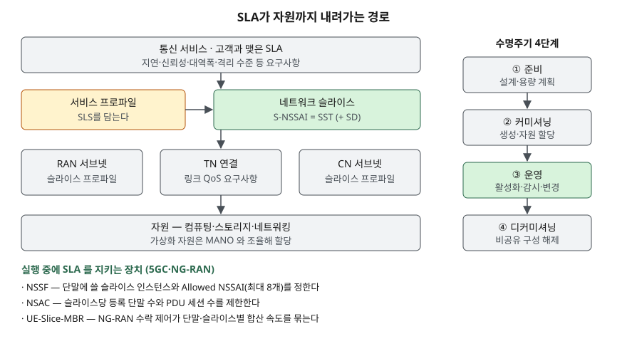

> 실행 검증 없음. 정의와 구성요소는 3GPP TS 23.501 V17.15.0과 TS 28.530 V17.3.0(ETSI 발행본) 원문으로 확인했다.
> 이 글에 성능 수치는 없다. 두 문서 모두 슬라이스별 지연·속도 목표값을 정하지 않는다. (§7)

## 들어가며

5G를 다루는 문항에서 슬라이싱은 "하나의 물리망 위에 여러 논리망"이라는 한 줄로 끝나기 쉽다.
점수가 갈리는 곳은 그 다음, **논리망마다 약속한 품질을 무엇으로 지키는가**다. 실무에서는 공장 자동화
고객에게 저지연을, 스마트 미터 사업자에게 대량 접속을 같은 망에서 동시에 팔아야 하고, 한쪽 트래픽이
몰려도 다른 쪽 약속이 깨지지 않아야 한다. 슬라이싱은 이 약속을 식별자·선택 절차·관리 체계로 나눠 구현한다.

## 정의

**네트워크 슬라이스(Network Slice)**: TS 23.501은 **특정 네트워크 기능(capabilities)과 네트워크 특성을 제공하는
논리 네트워크**로 정의한다(용어 정의 절). 관리 표준 TS 28.530은 같은 문장 뒤에 **슬라이스 고객을 위한 다양한
서비스 속성을 지원한다**를 덧붙인다. 앞은 망 구조, 뒤는 고객과의 약속을 앞세운 정의다.

**네트워크 슬라이스 인스턴스**: TS 23.501은 **배치된 슬라이스를 이루는 네트워크 기능 인스턴스와 필요한 자원
(컴퓨팅·스토리지·네트워킹)의 집합**으로 정의한다. 답안에는 "논리망(슬라이스) — 그것을 실제로 구현한 NF와
자원의 묶음(인스턴스)"으로 둘을 나눠 쓴다.

## 등장 배경

TS 28.530은 5G가 **서로 다른 통신 서비스, 서로 다른 트래픽 부하, 서로 다른 사용자 집단**을 최적화해 지원해야
한다고 적고, 예로 V2X, 유무선 융합 eMBB, 대규모 IoT를 든다(일반 개념 절). V2X는 데이터율·신뢰성·지연이
더 엄격하고, 대규모 IoT는 많은 수의 고밀도 단말을 값싸게 붙여야 한다. 요구가 서로 반대인 서비스를
**한 벌의 망 설정**으로 받으면 어느 한쪽에 맞춘 설정이 다른 쪽을 해친다.
그래서 서비스 유형마다 기능·최적화가 다른 논리망을 따로 두고, 같은 기능이라도 고객별로 다른 약속을 하는
논리망을 나눌 수 있게 한 것이 슬라이싱이다(TS 23.501 슬라이싱 총론, §5.15.1).

## 구성요소 / 절차

**① 식별 — S-NSSAI 구성 2요소** (TS 23.501 §5.15.2.1)

| 요소 | 뜻 |
|---|---|
| SST (Slice/Service Type) | 기능과 서비스 측면에서 기대하는 슬라이스 동작 |
| SD (Slice Differentiator) | 선택 항목. 같은 SST의 슬라이스 여럿을 구분 |

S-NSSAI 여럿을 모은 것이 **NSSAI**다. 단말과 망 사이 신호의 Requested·Allowed NSSAI에는 **최대 8개**까지 담긴다.

**② 표준 SST 값 5가지** (Rel-17 기준, TS 23.501 §5.15.2.2)

| SST | 값 | 용도 |
|---|---|---|
| eMBB | 1 | 5G 향상된 모바일 광대역 |
| URLLC | 2 | 초고신뢰·저지연 통신 |
| MIoT | 3 | 대규모 IoT |
| V2X | 4 | 차량 통신 서비스 |
| HMTC | 5 | 고성능 기계형 통신 |

표준값은 로밍에서 상호운용을 쉽게 하려는 것이고, 한 망이 다섯을 다 지원할 의무는 없다. 같은 표의 주석은
표에 적은 서비스를 다른 SST로도 지원할 수 있다고 적는다. 이 표는 릴리스마다 개정되는 문서에 들어 있으므로
답안에는 "Rel-17 기준 5종"처럼 기준 릴리스를 밝힌다.

**③ 관리 계층 — SLA가 자원으로 내려가는 3단계** (TS 28.530 §3.1, §4.4~§4.6)

1. **서비스 프로파일** — 슬라이스에 걸린 SLS(SLA에 딸린 서비스 수준 요구사항)를 담는다
2. **슬라이스 서브넷과 슬라이스 프로파일** — 슬라이스를 RAN·CN 기능 묶음(서브넷)으로 나누고, 서브넷마다
   적용할 요구사항 집합(슬라이스 프로파일)을 붙인다. 서브넷은 여러 슬라이스가 **공유**할 수도, 한 슬라이스
   **전용**일 수도 있다
3. **비3GPP 영역 조율** — 전송망(TN)에는 토폴로지와 링크별 QoS 요구사항을 TN 관리 시스템에 넘기고,
   가상화 자원은 MANO 같은 관리 시스템과 조율한다

TS 28.530이 서비스 유형별로 드는 슬라이스 요구사항은 **11가지**다(통신 서비스 요구사항 절, §4.1.4): 영역 트래픽
용량, 과금, 커버리지, **격리 수준**, 종단 간 지연, 이동성, 사용자 밀도, 우선순위, 서비스 가용성, 신뢰성, 단말 속도.

**④ 수명주기 4단계** (TS 28.530 §4.3)

| 단계 | 하는 일 |
|---|---|
| 준비(Preparation) | 인스턴스가 아직 없다. 슬라이스 설계, 용량 계획, NF 온보딩·평가, 환경 준비 |
| 커미셔닝(Commissioning) | 인스턴스 생성. 요구사항을 만족하도록 필요한 자원을 할당·설정 |
| 운영(Operation) | 활성화, 감시, KPI 성능 보고, 자원 용량 계획, 변경, 비활성화 |
| 디커미셔닝(Decommissioning) | 비공유 구성요소 해제, 공유 구성요소에서 이 인스턴스 설정 제거. 이후 인스턴스는 없다 |

**⑤ 실행 중 SLA를 지키는 장치 3가지** (TS 23.501)

- **NSSF** — 단말에 쓸 슬라이스 인스턴스 집합과 Allowed NSSAI, 단말을 맡을 AMF 집합을 정한다(NSSF 기능 절, §6.2.14)
- **NSAC** — 슬라이스당 등록 단말 수와 PDU 세션 수를 제어한다(슬라이싱 총론에서 §5.15.11로 안내)
- **UE-Slice-MBR** — 가입 정보의 슬라이스별 최대 속도를 AMF가 NG-RAN에 주고, NG-RAN 수락 제어가 GBR 플로우
  보장 속도 합이 이 값을 넘지 않게 막으며 전체 합산 속도도 이 값 안으로 묶는다(UE-Slice-MBR 시행 절, §5.7.1.10)

## 도식

> **출처**: 슬라이스·서브넷·서비스 프로파일·슬라이스 프로파일과 TN·MANO 조율은 [ETSI TS 128 530 V17.3.0 §3.1, §4.4~§4.7](https://www.etsi.org/deliver/etsi_ts/128500_128599/128530/17.03.00_60/ts_128530v170300p.pdf),
> 수명주기 4단계는 같은 문서 §4.3.2~§4.3.5,
> S-NSSAI 구성과 Allowed NSSAI 최대 8개, NSSF·NSAC·UE-Slice-MBR은 [ETSI TS 123 501 V17.15.0 §5.15.2.1, §6.2.14, §5.15.1, §5.7.1.10](https://www.etsi.org/deliver/etsi_ts/123500_123599/123501/17.15.00_60/ts_123501v171500p.pdf)를 따랐다.

답안지에는 왼쪽에 4층(서비스 → 프로파일·슬라이스 → RAN·TN·CN 서브넷 → 자원)을 세로로 쌓고, 오른쪽에
수명주기 4단계를 화살표로 잇는다. 아래 한 줄에 실행 중 장치 3개(NSSF·NSAC·UE-Slice-MBR)를 적는다.

## 비교

**슬라이스·서브넷·QoS 플로우** — 묶는 단위가 다르다

| 구분 | 네트워크 슬라이스 | 슬라이스 서브넷 | QoS 플로우 |
|---|---|---|---|
| 정의 | 특정 기능·특성을 제공하는 논리 네트워크 | 슬라이스를 이루는 NF와 자원의 묶음 | 5G 시스템에서 QoS 전달 처리의 가장 작은 단위 |
| 근거 | TS 23.501 용어 정의 | TS 28.530 §3.1 | TS 23.501 용어 정의, §5.7.1.1 |
| 식별자 | S-NSSAI | 관리 객체(NetworkSliceSubnet 인스턴스) | QFI (PDU 세션 안에서 유일) |
| 나누는 것 | 망 기능과 최적화, 고객별 약속 | 관리 범위 (RAN·CN·공유·전용) | 같은 세션 안 트래픽의 처리 방식 |
| 관계 | PDU 세션은 PLMN마다 **하나의** 슬라이스 인스턴스에만 속한다 | 여러 슬라이스가 공유 가능 | 한 PDU 세션 안에 여럿 |

QoS 플로우만으로도 트래픽마다 스케줄링을 달리할 수 있다. 슬라이스는 그 위에서 **NF 인스턴스와 자원 자체를
가르는** 단위라, 기능 구성이나 수용 한도까지 달리할 수 있다는 점이 다르다.

**슬라이스를 고객에게 내놓는 방식 2가지** (TS 28.530 §4.1.6, §4.1.7)

| 구분 | NSaaS (서비스로서의 슬라이스) | NOP 내부용 슬라이스 |
|---|---|---|
| 고객에게 보이는가 | 보인다. 파는 것이 슬라이스 자체 | 보이지 않는다. 운영자 내부 최적화용 |
| 고객이 할 수 있는 것 | 사용, 또는 노출된 범위 안에서 관리. 받은 슬라이스로 자기 서비스를 만들 수 있다 | 사용, 또는 SLA 이행 상태 감시 |

SDN·NFV는 슬라이스를 구현하는 수단이다. TS 23.501은 5G 시스템이 NFV·SDN 같은 기법을 쓰는 배치를 지원하도록
정의됐다고 적는다(구조 일반 개념, §4.1). 둘의 차이는 [SDN과 NFV — 제어와 데이터 평면 분리](../2026-09-28-sdn-nfv-control-data-plane/index.md)에 정리했다.

## 적용 시 고려사항

- **격리 수준을 먼저 정한다.** 격리 수준은 TS 28.530이 드는 슬라이스 요구사항 중 하나다. 서브넷은 여러 슬라이스가
  공유할 수도 한 슬라이스 전용일 수도 있다(TS 28.530 §4.5). 공유하면 그 구성요소의 자원을 여러 슬라이스가
  나눠 쓰므로, URLLC처럼 약속이 엄격한 슬라이스는 전용 서브넷을 검토한다.
- **RAN·CN만으로는 종단 간 SLA가 닫히지 않는다.** 3GPP 관리 시스템이 직접 관리하는 것은 RAN·CN뿐이고,
  전송망은 요구사항을 넘겨 조율할 뿐이다(TS 28.530 §4.4.1). 전송망 관리 체계와 연동 인터페이스를 설계에 넣는다.
- **수용 한도를 숫자로 걸어 둔다.** NSAC로 슬라이스당 단말 수·세션 수를, UE-Slice-MBR로 단말당 합산 속도를
  묶어야 한 슬라이스의 폭주가 다른 슬라이스의 자원을 잠식하지 않는다. 한도 값은 표준이 정하지 않으므로
  준비 단계의 용량 계획에서 정한다.
- **단말이 동시에 쓸 수 있는 슬라이스 수에 상한이 있다.** 단말당 동시 연결 슬라이스 인스턴스 수는 Requested·Allowed
  NSSAI의 S-NSSAI 수(최대 8개)로 제한된다(TS 23.501 §5.15.1 주석). 서비스를 슬라이스로 너무 잘게 나누지 않는다.
- **표준 SST와 비표준 값을 구분한다.** SD가 붙거나 비표준 SST인 S-NSSAI는 그 PLMN 안에서만 한 슬라이스를
  가리킨다. 로밍 서비스는 표준 SST로 설계하거나 HPLMN 값과의 매핑을 둔다(TS 23.501 §5.15.2.1).

## 정리

- **정의**: 특정 기능·특성을 제공하는 **논리 네트워크**(TS 23.501). 인스턴스는 그것을 구현한 **NF + 자원** 묶음.
- **식별 2-8-5**: S-NSSAI = SST + SD(**2**요소), NSSAI 최대 **8**개, 표준 SST **5**종(eMBB·URLLC·MIoT·V2X·HMTC, Rel-17).
- **관리 3층**: 서비스 프로파일(SLS) → 슬라이스 서브넷·슬라이스 프로파일 → 자원(TN·MANO 조율).
- **수명주기 4단계 "준·커·운·디"**: 준비 → 커미셔닝 → 운영 → 디커미셔닝 (TS 28.530).
- **실행 중 장치 3개**: NSSF(선택) · NSAC(수용 한도) · UE-Slice-MBR(속도 한도).

## 참고 자료

- [ETSI TS 123 501 V17.15.0 — 5G; System architecture for the 5G System (3GPP TS 23.501 Rel-17, 2026-01)](https://www.etsi.org/deliver/etsi_ts/123500_123599/123501/17.15.00_60/ts_123501v171500p.pdf) — 용어 정의(Network Slice, Network Slice instance, QoS Flow), §4.1 General concepts, §5.7.1.1 QoS Flow, §5.7.1.10 UE-Slice-MBR enforcement, §5.15.1 General, §5.15.2.1 S-NSSAI, §5.15.2.2 Standardised SST values, §5.15.13 data rate limitation per Network Slice, §6.2.14 NSSF
- [ETSI TS 128 530 V17.3.0 — 5G; Management and orchestration; Concepts, use cases and requirements (3GPP TS 28.530 Rel-17, 2022-10)](https://www.etsi.org/deliver/etsi_ts/128500_128599/128530/17.03.00_60/ts_128530v170300p.pdf) — §3.1 Definitions, §4.1.4 Communication services requirements, §4.1.6 NSaaS, §4.1.7 Network slices as NOP internals, §4.3 Management aspects(수명주기 4단계), §4.4 Managed network slice concepts, §4.5 Network slice subnet concepts, §4.6 Slice profile and service profile, §4.7 Coordination with non-3GPP parts
