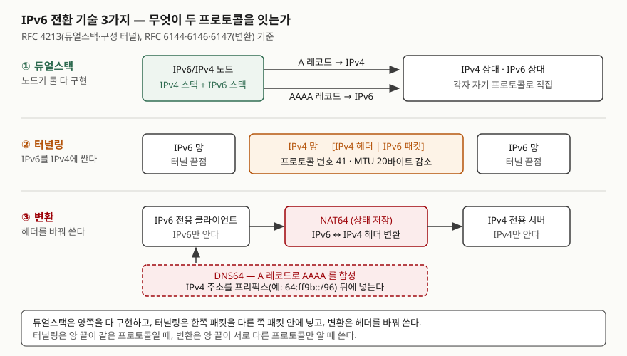

> 이 글의 주소와 MTU 값은 RFC의 규칙을 [`code/transition_addresses.py`](code/transition_addresses.py)로 계산한 값이다.
> 패킷을 실제로 주고받은 실험이 아니다. 실행 기록은 [`code/output.txt`](code/output.txt)에 있다.

## 들어가며

IPv6 전환 문항은 "듀얼스택·터널링·변환 3가지를 설명하라"로 나온다. 세 이름은 쉽게 외우지만, 점수가 갈리는 곳은
**각 기술이 어떤 상황의 문제를 푸는가**다. 실무에서는 상황이 먼저 주어진다. 사내망 단말은 둘 다 되는데 외부 회선이
IPv4뿐이거나, 모바일 망을 IPv6 전용으로 바꿨는데 접속할 서버가 아직 IPv4뿐인 경우다. 앞의 것은 터널링, 뒤의 것은
변환의 자리다. 이 글은 세 기술을 **두 프로토콜을 무엇으로 잇는가** 하나로 나눠 정리한다.

## 정의

> **IPv6 전환 기술**: IPv4와 IPv6가 공존하는 동안 두 프로토콜의 노드와 망이 서로 통신할 수 있게 하는 메커니즘.
> RFC 4213은 듀얼스택과 구성 터널을 정하고, RFC 6144는 "듀얼스택 배치 외에 상호 연동의 근본 접근은 터널링과
> 변환 두 가지"라고 적는다.

세 기술 각각의 정의는 RFC가 직접 준다.

| 기술 | RFC 정의 (요지) | 출처 |
|---|---|---|
| **듀얼스택** | 호스트와 라우터에서 IPv4와 IPv6 두 프로토콜을 모두 완전히 지원하는 기법 | RFC 4213 용어 절(§1.1) |
| **터널링** | IPv6 패킷을 IPv4로 캡슐화해 IPv4 라우팅 기반 위로 실어 나르는 기법 | RFC 4213 용어 절(§1.1) |
| **변환** | 한 프로토콜의 패킷을 다른 프로토콜의 패킷으로 바꿔 써서 서로 다른 프로토콜만 아는 양 끝을 잇는 기법 | RFC 6144 (한 문장 정의가 없어 프레임워크 설명을 요약) |

## 등장 배경

RFC 4213의 듀얼스택 절은 "IPv6 노드가 IPv4 전용 노드와 호환을 유지하는 가장 직접적인 방법은 IPv4를 완전히 구현하는
것"이라고 시작한다. 처음 그림은 모든 노드가 둘 다 구현하는 것이었다. 이 그림이 세 가지 이유로 모자랐다.

- **IPv6 섬 사이에 IPv4 망만 있다** — 양 끝은 IPv6인데 가운데 경로가 IPv4뿐이면 듀얼스택으로는 못 지나간다. 터널링이 이 자리를 맡는다.
- **IPv4 주소를 줄 수 없다** — 듀얼스택은 노드마다 IPv4 주소도 요구한다. DS-Lite(RFC 6333)는 서비스 사업자가
  "고객 사이에 IPv4 주소를 나눠 쓰도록" 듀얼스택 모델을 다시 짠 것이라고 초록에 적는다.
- **양 끝이 서로 다른 프로토콜만 안다** — IPv6 전용 클라이언트와 IPv4 전용 서버는 캡슐화로는 이을 수 없다.
  초기 변환 방식인 NAT-PT는 RFC 4966에서 폐기됐고, RFC 6144가 그 자리를 대신할 변환 프레임워크를 세웠다.
  RFC 6144는 변환을 장기 지원 전략이 아니라 **중기 공존 전략**으로 규정한다.

## 구성요소 — 3가지 기술과 세부 방식

### ① 듀얼스택

노드가 IPv4 스택과 IPv6 스택을 함께 갖는다. 상대가 어느 프로토콜인지는 DNS가 정한다. RFC 4213 DNS 절(§2.2)은
듀얼스택 노드의 리졸버가 IPv4의 **A 레코드와 IPv6의 AAAA 레코드를 모두** 다룰 수 있어야 한다고 적는다.
두 주소가 다 나오면 어느 쪽부터 연결할지가 문제가 되는데, Happy Eyeballs v2(RFC 8305)는 연결 시도 사이 지연의
권고값을 250ms, AAAA 응답을 기다리는 지연을 50ms로 든다.

### ② 터널링

IPv6 패킷 앞에 IPv4 헤더를 붙여 IPv4 망을 지나게 한다. IPv4 헤더의 프로토콜 번호는 **41**이다(RFC 4213 §3.5).
터널 끝점 주소를 정하는 방식으로 두 갈래가 나뉜다.

| 방식 | 끝점 주소를 어떻게 정하나 | 근거 |
|---|---|---|
| 구성 터널 | 양 끝에 설정으로 적는다 | RFC 4213 §3 |
| 자동 터널 (예: 6to4) | IPv6 주소 안에 IPv4 주소를 넣어 두고 거기서 꺼낸다. `2002:V4ADDR::/48` | RFC 3056 §2 |

IPv4 헤더 20바이트가 붙으므로 터널의 MTU가 준다. RFC 4213은 동적 터널 MTU를 "IPv4 경로 MTU에서 캡슐화 IPv4
헤더 크기를 뺀 값"으로 보고, 정적 터널 MTU는 **1280~1480바이트, 권고값 1280**으로 정한다(§3.2).

### ③ 변환

RFC 6144는 변환 프레임워크를 5가지 구성요소로 나눈다(§3.1).

| 구성요소 | 하는 일 | RFC |
|---|---|---|
| 주소 변환 | IPv4 주소를 IPv6 주소 안에 넣는 규칙 | RFC 6052 |
| IP/ICMP 변환 | 헤더와 ICMP 메시지를 바꿔 쓰는 알고리즘 | RFC 6145 |
| 변환 상태 유지 | 상태 저장형 NAT64의 세션 관리 | RFC 6146 |
| DNS64·DNS46 | A 레코드로 AAAA 레코드를 합성 | RFC 6147 |
| ALG | 페이로드에 주소를 싣는 프로토콜(FTP 등) 처리 | — |

**상태 저장**(stateful)과 **무상태**(stateless)가 갈린다. RFC 6144는 패킷을 주고받을 때 장비 안의 자료구조를 만들거나
바꾸면 상태 저장, 메시지와 미리 설정한 정보만으로 계산하면 무상태라고 정의한다. NAT64(RFC 6146)는 상태 저장형으로,
IPv6 전용 클라이언트가 IPv4 서버에 UDP·TCP·ICMP로 접속하게 한다. RFC 6146은 DNS64와 **함께** 쓸 때 IPv6 전용
클라이언트가 IPv4 전용 서버와 통신을 시작할 수 있다고 적는다.

조합형도 있다. **DS-Lite**(RFC 6333)는 고객 쪽 B4가 IPv6 망 위로 IPv4-in-IPv6 터널을 만들고, 사업자 쪽 AFTR이 터널
끝점과 IPv4-IPv4 NAT를 겸한다. **464XLAT**(RFC 6877)는 고객 쪽 CLAT(무상태 1:1 변환)과 사업자 쪽 PLAT(상태 저장 N:1
변환)을 이어 IPv6 전용 망 위에 제한된 IPv4 연결을 준다. CLAT은 휴대폰 같은 단말에도 들어갈 수 있다.

## 도식



> **출처**: [RFC 4213 §1.1 Terminology](https://www.rfc-editor.org/rfc/rfc4213.html#section-1.1)(듀얼스택·터널링 정의), [§2.2 DNS](https://www.rfc-editor.org/rfc/rfc4213.html#section-2.2)(A·AAAA), [§3.5 IPv4 Header Construction](https://www.rfc-editor.org/rfc/rfc4213.html#section-3.5)(프로토콜 41),
> [RFC 6146 §1 Introduction](https://www.rfc-editor.org/rfc/rfc6146.html#section-1)(NAT64와 DNS64의 결합), [RFC 6052 §2.1 Well-Known Prefix](https://www.rfc-editor.org/rfc/rfc6052.html#section-2.1).

답안지에는 세 줄로 옮긴다. 가운데 무엇이 있는지만 바꿔 그리면 된다 — 듀얼스택은 **노드 안의 두 스택**,
터널링은 **IPv4 망 구간의 이중 헤더**, 변환은 **NAT64 상자와 그 위의 DNS64**.

## 계산으로 확인한 것 — 변환이 쓰는 주소

변환에서 IPv6 전용 클라이언트가 IPv4 서버를 부르려면, 서버의 IPv4 주소가 IPv6 주소 안에 들어가 있어야 한다.
RFC 6052는 프리픽스 길이를 **32·40·48·56·64·96의 6가지**로 제한하고, 비트 64~71(u 옥텟)은 **0으로 둬야 한다**고
정한다. 이 규칙대로 192.0.2.33을 넣어 RFC 6052 텍스트 표현 절(§2.4)의 예시 표와 비교했다.

```text
== 1. RFC 6052 §2.4 표 검산 — IPv4 192.0.2.33 을 프리픽스 길이별로 넣는다
  /32  2001:db8:c000:221::              RFC 일치 · 역변환 192.0.2.33
  /40  2001:db8:1c0:2:21::              RFC 일치 · 역변환 192.0.2.33
  /48  2001:db8:122:c000:2:2100::       RFC 일치 · 역변환 192.0.2.33
  /56  2001:db8:122:3c0:0:221::         RFC 일치 · 역변환 192.0.2.33
  /64  2001:db8:122:344:c0:2:2100:0     RFC 일치 · 역변환 192.0.2.33
  /96  2001:db8:122:344::c000:221       RFC 일치 · 역변환 192.0.2.33
```

6줄 모두 일치했다. /40·/48·/56에서 IPv4 32비트가 u 옥텟을 사이에 두고 두 토막으로 갈라지는 것이 보인다.
/56의 `3c0:0:221`에서 가운데 `0`이 그 자리다. /64 줄이 RFC의 `…:2100::`와 달리 `…:2100:0`으로 찍힌 것은 표기 차이다.
파이썬 `ipaddress`는 0 한 그룹을 `::`로 줄이지 않는다. 주소 값은 같다.

**예상과 달랐던 것은 DNS64 쪽이다.** 같은 주소를 잘 알려진 프리픽스 `64:ff9b::/96`에 넣으려 하자 합성하지 않았다.

```text
== 4. DNS64 합성 — 잘 알려진 프리픽스 64:ff9b::/96
  192.0.2.33 -> 합성하지 않음 (전역 주소가 아니다, RFC 6052 §3.1)
  8.8.8.8 -> 64:ff9b::808:808
  10.1.2.3 -> 합성하지 않음 (전역 주소가 아니다, RFC 6052 §3.1)
```

RFC 6052는 잘 알려진 프리픽스를 RFC 1918 사설 주소나 RFC 5735 3절의 특수 용도 주소에 **쓰면 안 된다**고 정한다.
192.0.2.0/24는 문서용 주소라 여기에 걸린다. RFC의 예시가 전부 `2001:db8::` 계열의 **망별 프리픽스**(사업자가 정하는 프리픽스)를
쓴 것도 이 때문으로 읽힌다. 사내 IPv4 서버를 NAT64로 열려면 잘 알려진 프리픽스가 아니라 망별 프리픽스가 필요하다.

같은 계산으로 6to4 프리픽스(`8.8.8.8` → `2002:808:808::/48`)와 터널 MTU(경로 MTU 1500 → 1480, 1492 → 1472)도 확인했다.

## 비교

| 항목 | ① 듀얼스택 | ② 터널링 | ③ 변환 |
|---|---|---|---|
| 잇는 방법 | 양쪽 스택을 다 구현 | IPv6 패킷을 IPv4 패킷에 넣는다 | 헤더를 바꿔 쓴다 |
| 양 끝 프로토콜 | 각자 맞는 것으로 직접 | 같아야 한다 (IPv6–IPv6) | 달라도 된다 (IPv6–IPv4) |
| 필요한 IPv4 주소 | 노드마다 | 터널 끝점마다 | 변환기 쪽에만 |
| 대표 RFC | RFC 4213 | RFC 4213, RFC 3056 | RFC 6144·6145·6146·6147 |
| 주된 비용 | 두 망을 함께 운영 | MTU 감소, 끝점 설정 | 상태 유지, 주소를 싣는 프로토콜에 ALG 필요 |
| RFC가 정한 위치 | IETF가 권하는 기본 모델(RFC 6144가 RFC 4213을 인용) | 섬 사이 연결 | 중기 공존 전략 |

## 적용 시 고려사항

- **기본은 듀얼스택, 예외가 생길 때 나머지를 고른다.** 경로가 IPv4뿐이면 터널링, 양 끝 프로토콜이 다르면 변환이다.
  IPv4 주소를 노드마다 줄 수 없으면 DS-Lite·464XLAT처럼 터널과 변환을 묶은 방식을 본다.
- **듀얼스택은 보안 정책도 두 벌이다.** 방화벽 규칙, 접근 제어 목록, 모니터링을 IPv4에만 걸어 두면 IPv6 경로가
  열린 채 남는다. 운영 부담은 두 망을 함께 관리하는 데서 나온다.
- **터널은 MTU를 먼저 정한다.** 헤더 20바이트만큼 MTU가 줄고, RFC 4213은 정적 터널 MTU 권고값을 1280으로 둔다.
  경로 MTU 탐색이 막힌 구간에서는 큰 패킷이 조용히 사라진다.
- **6to4는 애니캐스트 방식을 쓰지 않는다.** RFC 7526은 애니캐스트 모드가 인터넷 전반 배치에 맞지 않는다고 보고
  관련 RFC를 Historic으로 돌렸다. 다만 유니캐스트 6to4와 `2002::/16` 프리픽스 자체는 폐기하지 않았다고 명시한다.
- **변환은 주소를 페이로드에 싣는 프로토콜에서 깨진다.** 헤더만 바꾸므로 FTP처럼 본문에 IP 주소를 적는 프로토콜은
  ALG가 필요하다(RFC 6144 §3.1). 응용이 IPv4 리터럴 주소를 직접 쓰면 DNS64 합성도 거치지 않는다.
- **잘 알려진 프리픽스는 전역 IPv4 주소에만 쓴다.** 사설·문서용 주소를 변환하려면 망별 프리픽스를 쓴다(RFC 6052 §3.1).

## 정리

- **3가지**: 듀얼스택(둘 다 구현) · 터널링(싸서 보낸다) · 변환(바꿔 쓴다). 두문자로 **"구·싸·바"**.
- 고르는 기준은 **양 끝과 가운데**다. 가운데만 IPv4면 터널링, 양 끝이 서로 다르면 변환.
- 터널링 2갈래(구성·자동), 변환 구성요소 **5가지**(주소 변환·IP/ICMP 변환·상태 유지·DNS64·ALG).
- 숫자: 프로토콜 41, 헤더 20바이트, 정적 터널 MTU 1280~1480(권고 1280), RFC 6052 프리픽스 길이 6가지, `64:ff9b::/96`.

## 참고 자료

- [RFC 4213 — Basic Transition Mechanisms for IPv6 Hosts and Routers (2005-10)](https://www.rfc-editor.org/rfc/rfc4213.html) — [§1.1 Terminology](https://www.rfc-editor.org/rfc/rfc4213.html#section-1.1), [§2 Dual IP Layer Operation](https://www.rfc-editor.org/rfc/rfc4213.html#section-2), [§3.2 Tunnel MTU and Fragmentation](https://www.rfc-editor.org/rfc/rfc4213.html#section-3.2), [§3.5 IPv4 Header Construction](https://www.rfc-editor.org/rfc/rfc4213.html#section-3.5)
- [RFC 6144 — Framework for IPv4/IPv6 Translation (2011-04)](https://www.rfc-editor.org/rfc/rfc6144.html) — [§1 Introduction](https://www.rfc-editor.org/rfc/rfc6144.html#section-1), [§3.1 Translation Components](https://www.rfc-editor.org/rfc/rfc6144.html#section-3.1)
- [RFC 6052 — IPv6 Addressing of IPv4/IPv6 Translators (2010-10)](https://www.rfc-editor.org/rfc/rfc6052.html) — [§2.2 IPv4-Embedded IPv6 Address Format](https://www.rfc-editor.org/rfc/rfc6052.html#section-2.2), [§2.4 Text Representation](https://www.rfc-editor.org/rfc/rfc6052.html#section-2.4), [§3.1 Restrictions on the Use of the Well-Known Prefix](https://www.rfc-editor.org/rfc/rfc6052.html#section-3.1)
- [RFC 6146 — Stateful NAT64 (2011-04)](https://www.rfc-editor.org/rfc/rfc6146.html)
- [RFC 6147 — DNS64 (2011-04)](https://www.rfc-editor.org/rfc/rfc6147.html)
- [RFC 3056 — Connection of IPv6 Domains via IPv4 Clouds (6to4, 2001-02)](https://www.rfc-editor.org/rfc/rfc3056.html#section-2)
- [RFC 7526 — Deprecating the Anycast Prefix for 6to4 Relay Routers (2015-05)](https://www.rfc-editor.org/rfc/rfc7526.html)
- [RFC 6333 — Dual-Stack Lite (2011-08)](https://www.rfc-editor.org/rfc/rfc6333.html)
- [RFC 6877 — 464XLAT (2013-04)](https://www.rfc-editor.org/rfc/rfc6877.html)
- [RFC 8305 — Happy Eyeballs Version 2 (2017-12)](https://www.rfc-editor.org/rfc/rfc8305.html)
