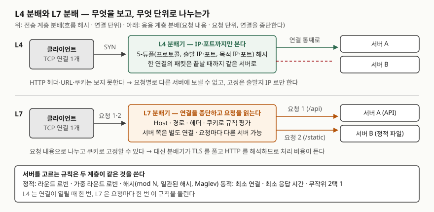

> 이 글의 숫자는 분배 알고리즘을 [`code/lb_algorithms.py`](code/lb_algorithms.py)로 같은 요청 흐름에 적용해 센 값이다.
> 실제 망에서 잰 값이 아니다. 실행 기록은 [`code/output.txt`](code/output.txt)에 있다.

## 들어가며

로드 밸런싱 문항은 "L4와 L7을 비교하고 분배 알고리즘을 설명하라"로 나온다. 라운드 로빈·최소 연결·해시를 표로
외워 두면 반은 쓰지만, 점수가 갈리는 곳은 **왜 그 알고리즘이 필요했는가**와 **세션을 어디에 붙들어 두는가**다.
실무에서도 같은 질문이 돌아온다. 서버를 한 대 늘렸더니 캐시 적중률이 바닥으로 떨어지는 일, 한 서버만 CPU가 치솟는데
분배기는 "고르게 나눴다"고 하는 일, 서버 한 대를 내렸더니 사용자 절반이 로그아웃되는 일은 전부 이 두 질문에서 갈린다.
계층 번호의 뜻은 [OSI 7계층 글](../2026-09-28-osi-7-layer-vs-tcpip-4-layer/index.md)에서 다뤘다.

## 정의

> **부하 분산(load sharing)**: 기능이 같거나 유사한 서버 **클러스터에 세션 부하를 나누는 것**. — RFC 2391의
> 용어 정의(§2.7). 같은 절은 세션이 한 노드에 배정되면 **종료될 때까지 그 노드에 묶이며** 도중에 노드를 바꾸지 않는다고 적는다

로드 밸런서는 HTTP 용어로는 **게이트웨이**(리버스 프록시)다. RFC 9110의 중개자 정의(§3.7)는 게이트웨이를
"바깥쪽 연결에서는 원 서버처럼 행동하면서, 받은 요청을 번역해 안쪽의 다른 서버로 전달하는 중개자"로 적는다.
분배기를 가르는 축은 **2가지**다.

- **무엇을 보고 나누는가** — 전송 계층 헤더까지(L4)인가, 응용 계층 메시지까지(L7)인가
- **어떤 규칙으로 고르는가** — 상태 없이 정해지는 정적 규칙인가, 서버 상태를 보는 동적 규칙인가

## 등장 배경

- **서버 한 대의 한계.** RFC 2391(1998)은 서버 한 대로 감당하지 못하는 요청을 **클라이언트와 서버를 고치지 않고**
  여러 대로 나누려고 NAT를 확장했다. 요청의 목적지 주소를 서버 풀의 한 주소로 바꿔 쓰는 방식(LSNAT)이다.
- **같은 세션은 같은 서버로.** TCP는 연결 상태가 양 끝에 있으므로 한 연결의 패킷이 서버를 옮겨 다니면 연결이 끊긴다.
  RFC 2391의 세션 바인딩 절(§4.1)과 Maglev 논문의 백엔드 선택 절(§3.3)이 같은 요구를 적는다.
- **서버 집합이 바뀔 때의 문제.** 키를 `hash mod N`으로 나누면 서버 한 대를 더하는 순간 대부분의 키가 자리를 옮긴다.
  캐시가 비고 세션이 끊긴다. Karger 등(1997)이 **일관된 해시**를 제안한 이유다.

## 구성요소 — 계층 2가지, 알고리즘 6가지, 세션 고정 3가지

### 계층 2가지

| 구분 | L4 분배 | L7 분배 |
|---|---|---|
| 보는 것 | 프로토콜, 출발지 IP·포트, 목적지 IP·포트(5-튜플) | Host·경로·헤더·쿠키 등 HTTP 메시지 |
| 나누는 단위 | **연결**. 한 연결은 끝까지 한 서버 | **요청**. 한 연결 안의 요청이 서로 다른 서버로 갈 수 있다 |
| 연결 처리 | 패킷을 전달한다 | 클라이언트 쪽 연결을 **종단**하고 서버 쪽은 별도 연결 |
| 할 수 있는 일 | 흐름 해시, 출발지 IP 고정 | 경로별 라우팅, 쿠키 고정, 헤더 추가, 연결 다중화 |
| 비용 | 낮다 | TLS 종단과 HTTP 해석 비용 |
| 근거 | AWS NLB: 흐름 해시, 연결 수명 동안 한 대상 | AWS ALB: 규칙 평가 → 대상 그룹 알고리즘 |

### 분배 알고리즘 6가지

| 구분 | 알고리즘 | 고르는 법 | 근거 |
|---|---|---|---|
| 정적 ① | 라운드 로빈 | 순서대로 한 대씩 | RFC 2391 §5, nginx 기본값(가중) |
| 정적 ② | 가중 라운드 로빈 | 가중치만큼 차례를 더 받는다 | nginx `weight`(기본 1) |
| 정적 ③ | 해시 | 키(출발지 IP·URL·사용자 ID)의 해시로 서버를 정한다. mod N, 링 일관된 해시, Maglev | nginx `hash`·`ip_hash`, Karger 1997, Maglev 2016 |
| 동적 ④ | 최소 연결 | 열린 연결이 가장 적은 서버 | RFC 2391 "least load first", nginx `least_conn` |
| 동적 ⑤ | 최소 부하(가중) | 세션 수·트래픽에 서버 가중치를 곱해 가장 적은 서버 | RFC 2391 "weighted least load/traffic first" |
| 동적 ⑥ | 무작위 2택 1 | 둘을 무작위로 뽑아 연결이 적은 쪽 | nginx `random two`(기본 `least_conn`) |

### 세션 고정(sticky session) 3가지

| 방식 | 계층 | 어떻게 | 비용 |
|---|---|---|---|
| ① 출발지 IP 해시 | L4·L7 | 클라이언트 IP(nginx `ip_hash`는 IPv4 앞 3옥텟)로 서버 결정 | NAT 뒤 사용자가 한 서버에 몰린다 |
| ② 쿠키 삽입 | L7 | 첫 응답에 `Set-Cookie`로 서버 식별자를 넣고 다음 요청의 `Cookie`로 찾는다(RFC 6265 §3) | 분배기가 HTTP를 해석해야 한다 |
| ③ 연결 추적표 | L4 | 5-튜플 해시 → 서버 매핑을 표에 기록(Maglev §3.3) | 표가 가득 차면 새 연결은 해시로만 결정 |

## 도식

> **출처**: [RFC 9110 §3.7 Intermediaries](https://www.rfc-editor.org/rfc/rfc9110.html#section-3.7)(게이트웨이 정의),
> [AWS — How Elastic Load Balancing works: Routing algorithm](https://docs.aws.amazon.com/elasticloadbalancing/latest/userguide/how-elastic-load-balancing-works.html#routing-algorithm)(NLB 흐름 해시·연결 단위, ALB 규칙 평가·요청 단위),
> [nginx — ngx_http_upstream_module](https://nginx.org/en/docs/http/ngx_http_upstream_module.html)(`hash`·`ip_hash`·`least_conn`·`random`).

## 비교 — 서버를 더할 때 키가 얼마나 옮기는가

서버 4대에 키 20,000개를 나눈 뒤 5대로 늘렸다. 자리를 옮긴 키의 비율이다(실습 3번).

| 방식 | 옮긴 키 | 5대일 때 분포(최소~최대) | 근거 |
|---|---|---|---|
| `hash mod N` | **80.2%** | 20% 안팎 | 이론값 1 − 1/5 = 80%. `h mod 4 = h mod 5`인 키만 남는다 |
| 링 일관된 해시(서버당 160점) | **19.3%** | 18.6% ~ 22.9% | Karger §4.1 단조성: 새 서버로만 옮기고 옛 서버 사이에서는 안 옮긴다 |
| Maglev 해시(M = 65537) | **19.6%** | 칸 수 13,107 ~ 13,108 | 조회표 칸이 20.1% 바뀜. 서버별 칸 수 차이 최대 1 |

Karger 등은 일관된 해시의 성질 **4가지**를 정의한다(§4.1). **균형**(balance, 각 버킷이 받는 비율이 O(1/|V|)),
**단조성**(monotonicity, 버킷이 추가되면 항목은 새 버킷으로만 옮기고 옛 버킷 사이에서는 옮기지 않는다),
**분산**(spread, 서로 다른 뷰에서 한 항목이 가는 버킷 수가 작다), **부하**(load, 한 버킷이 받는 항목 수가 작다).
구성(§4.2)은 버킷과 항목을 단위 구간에 무작위로 놓고 항목을 가장 가까운 버킷에 보내는 것인데, 균형을 위해
**버킷마다 κ log C개의 점**을 찍는다. 구현(§4.3)은 균형 이진 탐색 트리로 조회 O(1), 추가·삭제 O(log C)다.
링 분포가 18.6~22.9%로 흔들린 것은 점이 160개라 그렇다. 점을 늘리면 좁혀지고 메모리가 는다.

Maglev 논문은 Karger와 랑데부 해시가 **소수 서버의 웹 캐시**를 위해 교란 최소화를 우선했다고 적고, 백엔드가
수백 대인 환경에서는 반대로 **균등 분배를 우선**했다(§3.4). 서버마다 조회표 자리의 선호 순열을 두고 차례로
빈 자리를 채워 가므로 서버별 칸 수 차이가 최대 1이다. M은 소수이고 M ≫ N이어야 하며, 실무에서는 1% 차이를
위해 M을 100N보다 크게 둔다. 논문의 측정(§5.3)에서는 조회표 65,537칸에 백엔드 1,000대일 때 Karger와 랑데부가
각각 29.7%, 49.5%의 초과 용량을 요구했다. 이 글의 Maglev 실습은 백엔드가 5대라 그 차이가 드러나지 않는다.

## 적용 시 고려사항

- **세션 고정이 정말 필요한지부터 묻는다.** 실습 4번에서 세션 2,000개 중 602개가 NAT 하나(10.0.0.1)에서 왔다.
  라운드 로빈 + 쿠키 고정은 500개씩 나눴지만, 출발지 IP 해시는 한 서버에 993개(49.6%, 평균의 1.99배)를 보냈다.
  그 서버가 내려가면 **세션 993개의 서버 측 상태가 사라진다.** 세션을 외부 저장소(Redis·DB)에 두면 고정 자체가
  필요 없고 어느 서버가 받아도 된다. 고정은 상태를 못 옮기는 레거시에 한해 쓰고, 쓰더라도 L7의 쿠키 고정이 IP 해시보다 치우침이 적다.
- **느린 서버가 섞여 있으면 정적 규칙으로는 못 잡는다.** 실습 2번에서 한 서버의 처리 시간을 3배로 두자 라운드 로빈은
  1,000건씩 똑같이 보내 그 서버의 동시 접속이 20(다른 서버 9~10)까지 올라갔다. 최소 연결은 그 서버에 451건만 보내
  세 서버 모두 9로 맞췄다. 분배기는 서버가 느린 이유를 모르지만 **열린 연결 수**가 그것을 드러낸다.
- **캐시·세션 서버 앞에는 일관된 해시다.** mod N은 서버 1대 추가에 80%가 옮긴다. 링이면 20% 안팎, 분포 편차를 줄여야 하면 Maglev다.
  nginx의 `hash … consistent`가 ketama(서버당 160점) 방식이고, 서버 추가·제거 시 소수의 키만 옮긴다고 문서가 적는다.
- **상태 확인(health check)의 기본값을 안다.** nginx는 `max_fails`(기본 1)만큼 실패하면 `fail_timeout`(기본 10초) 동안
  그 서버를 빼고, 같은 시간이 지나면 다시 넣는다. 너무 민감하면 일시 오류에 서버가 빠졌다 들어왔다 하며 해시 자리가 흔들린다.
- **L7의 연결 다중화를 기억한다.** AWS ALB는 여러 클라이언트의 요청을 서버 쪽 연결 하나로 보낸다. 서버가 보는 연결 수와
  클라이언트 수가 다르므로 서버 쪽 `keep-alive`와 연결 수 상한을 분배기 기준으로 다시 계산한다.

## 정리

암기 단서는 **"보고 · 고르고 · 붙든다"** 셋이다.

- **보고**: L4는 5-튜플, 연결 단위. L7은 HTTP 내용, 요청 단위, 연결 종단.
- **고르고**: 정적 3(라운드 로빈·가중·해시) + 동적 3(최소 연결·최소 부하·무작위 2택 1).
- **붙든다**: IP 해시·쿠키·연결 추적표. 외부 세션 저장소가 있으면 붙들 필요가 없다.
- 서버 추가 시 옮기는 키: mod N 80% → 일관된 해시 20%. 일관된 해시의 성질 4가지는 균형·단조성·분산·부하.

## 참고 자료

- [RFC 2391 — Load Sharing using IP Network Address Translation (LSNAT)](https://www.rfc-editor.org/rfc/rfc2391.html) — 용어 정의(§2.7), 세션 바인딩(§4.1), 부하 분산 알고리즘(§5)
- [RFC 9110 — HTTP Semantics §3.7 Intermediaries](https://www.rfc-editor.org/rfc/rfc9110.html#section-3.7) — 프록시·게이트웨이·터널 정의
- [RFC 6265 — HTTP State Management Mechanism](https://www.rfc-editor.org/rfc/rfc6265.html) — §3 Overview: `Set-Cookie`와 `Cookie`
- [Karger, Lehman, Leighton, Levine, Lewin, Panigrahy — Consistent Hashing and Random Trees (STOC 1997)](https://cs.brown.edu/courses/csci2950-u/f09/papers/chash97stoc.pdf) — §4.1 성질 4가지, §4.2 구성, §4.3 구현
- [Eisenbud et al. — Maglev: A Fast and Reliable Software Network Load Balancer (NSDI 2016)](https://www.usenix.org/system/files/conference/nsdi16/nsdi16-paper-eisenbud.pdf) — §3.3 백엔드 선택과 연결 추적, §3.4 일관된 해시, §5.3 측정
- [nginx — Module ngx_http_upstream_module](https://nginx.org/en/docs/http/ngx_http_upstream_module.html) — `hash`(consistent), `ip_hash`, `least_conn`, `random`, `server`의 `weight`·`max_fails`·`fail_timeout`
- [AWS — How Elastic Load Balancing works](https://docs.aws.amazon.com/elasticloadbalancing/latest/userguide/how-elastic-load-balancing-works.html) — Routing algorithm(ALB·NLB·CLB), HTTP connections(연결 다중화)
