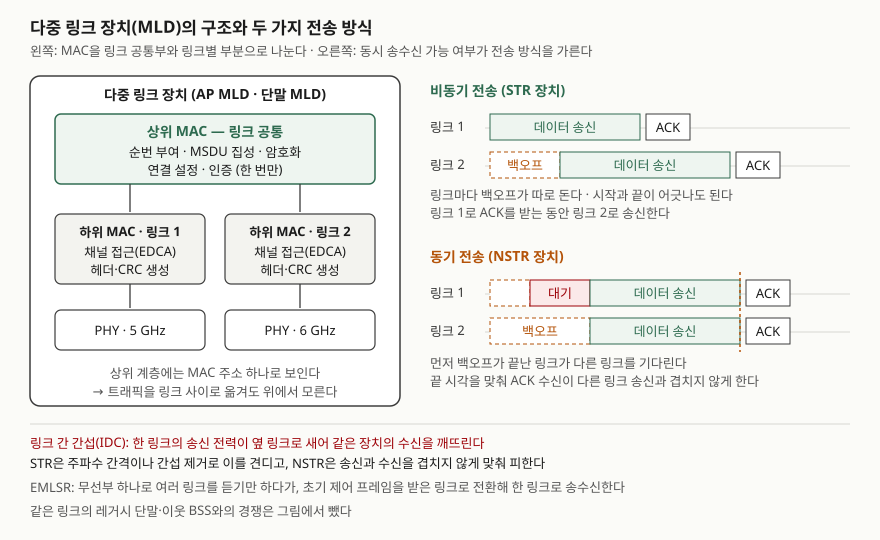

> 실행 검증 없음. IEEE 802.11be 표준 본문은 유료라 직접 인용하지 않았다. MLD 구조와 전송 방식은
> 표준화 과정을 정리한 논문 세 편(Deng 외 2020, López-Raventós·Bellalta 2022, Carrascosa-Zamacois 외 2022)의
> 해당 절로 확인했다. 성능 수치는 싣지 않았다.

## 들어가며

Wi-Fi 7 문항에서 MLO는 "여러 대역을 동시에 쓴다" 한 줄로 끝나기 쉽다. 점수는 **왜 같은 장치가
링크 둘을 동시에 못 쓸 때가 있는지**(링크 간 간섭)와 **그래서 전송 방식이 둘로 갈린다**는 데서 난다.
실무에서는 Wi-Fi 7 AP를 들였는데 단말 종류에 따라 체감 지연이 다르고, 붐비는 사무실에서는 오히려
이웃 AP의 지연이 늘어나는 현상으로 나타난다. 둘 다 MLO의 동작 방식에서 나온다.

## 정의

**다중 링크 동작(MLO, Multi-Link Operation)**: IEEE 802.11be(EHT)가 도입한 기능으로, 여러 무선
인터페이스를 가진 **다중 링크 장치(MLD)** 가 **한 번의 연결**로 2.4·5·6 GHz의 여러 링크에서
동시에 또는 골라서 송수신하게 하는 동작이다(López-Raventós·Bellalta 2022 초록·§II-A,
Carrascosa-Zamacois 외 2022 §II).

**다중 링크 장치(MLD)**: 링크마다 하나씩 딸린 AP 또는 단말(affiliated AP/STA)을 묶어, 상위 계층에는
**MAC 인스턴스 하나**로 보이는 장치다. AP 쪽은 AP MLD, 단말 쪽은 non-AP MLD라 부른다(López-Raventós·Bellalta §II-A).

## 등장 배경

802.11에는 이전에도 여러 대역을 오가는 방법이 있었다. 고속 세션 전환(FST)이다. 그러나 **한 트래픽
식별자(TID)의 데이터는 한 번에 한 대역·채널만** 쓸 수 있었고, 대역을 바꿀 때마다 FST 설정 요청·응답과
확인 요청·응답을 주고받아야 했다. 독립 MAC 구조에서는 대역을 옮기면 보안 연결과 키, 패킷 번호 카운터까지
새로 맺었다(Deng 외 2020 §III-A).

802.11be 작업반의 목표에는 처리량과 함께 **최악 지연·지터 개선**이 들어갔다. 대역 하나가 붐비면 그
대역에서 기다리는 구조로는 지연 상한을 내릴 수 없다. 그래서 같은 TID든 다른 TID든 **여러 링크로
동시에 또는 번갈아** 보낼 수 있는 통합 MAC 구조가 제안됐다(Deng 외 §III-A·§III-C).

## 구성요소 / 절차

**MLD 구조 2계층** — López-Raventós·Bellalta §II-A

| 계층 | 범위 | 하는 일 |
|---|---|---|
| 상위 MAC (U-MAC) | 모든 링크 공통 | 순번 부여, MSDU 집성·해제, 연결 설정·연결·인증 |
| 하위 MAC (L-MAC) | 링크마다 하나 | 채널 접근, 접근 범주별 EDCA 큐, 관리·제어 프레임 생성, MAC 헤더 생성·검증 |

순번을 상위 MAC에서 매기는 이유가 핵심이다. 같은 흐름의 패킷이 서로 다른 링크로 나가도 번호가 하나의
공간에 있어야 **수신 쪽이 재정렬**할 수 있다. 채널 접근은 하위 MAC에 있으므로 링크마다 백오프와 EDCA
파라미터를 따로 둔다.

**다중 링크 설정 3단계** — López-Raventós·Bellalta §II-C

| 단계 | 동작 |
|---|---|
| ① 발견 | 비콘의 기본형 다중 링크 요소(MLE)가 MLD MAC 주소, 활성 링크, STR 능력을 알린다. 비콘을 보내지 않는 다른 링크 정보는 축소 이웃 보고(RNR)로 싣는다 |
| ② 다중 링크 탐색 | 단말이 요청·응답형 MLE로 다른 링크의 전체 파라미터를 받는다. 다른 대역을 직접 스캔하지 않아 전력과 관리 프레임 점유 시간이 준다 |
| ③ 다중 링크 설정 | 링크마다 따로 연결하지 않고 **연결 하나**를 맺으며 링크별 파라미터를 한꺼번에 정한다 |

설정이 끝나면 **TID-링크 매핑**으로 어떤 트래픽을 어느 링크에 보낼지 정한다. 모든 TID를 모든 링크에
두면 부하를 자유롭게 옮기고, 특정 TID를 특정 링크에 묶으면 같은 품질 요구의 트래픽끼리만 자원을 나눈다
(López-Raventós·Bellalta §I).

**전송 방식 2가지** — Deng 외 표 IV, López-Raventós·Bellalta §II-B

동시 송수신(STR, Simultaneous Transmit and Receive)이 되는지에 따라 갈린다. 한 링크로 보내는 동안 같은
장치의 다른 링크로 받으려면, 송신 전력이 옆 링크로 새어 수신을 깨뜨리는 **장치 내 공존 간섭(IDC)** 을
견뎌야 한다.

- **비동기 전송**: STR이 되는 장치. 링크마다 채널 접근이 독립이고 송신 시작·끝이 어긋나도 된다.
- **동기 전송**: STR이 안 되는 장치(NSTR, 제약 MLD). 한 링크로 받는 동안 다른 링크로 보낼 수 없으므로
  링크 사이 송신을 맞춘다. 끝 시각을 맞추거나(end-time alignment), 먼저 백오프가 끝난 링크가 다른 링크를
  기다린다(defer).

**구현 방식 4가지** — Carrascosa-Zamacois 외 §II-A (표준의 구현 형태를 정리)

| 방식 | 무선부 | 동작 |
|---|---|---|
| MLSR | 하나 | 채널 감지와 송수신을 한 번에 한 채널에서만 |
| EMLSR | 완전한 무선부 하나 + 저기능 수신부 | 여러 링크를 감지만 하다가 초기 제어 프레임을 받은 링크로 전환해 모든 안테나로 송수신 |
| MLMR | 여럿 | 여러 링크에서 동시에 동작 |
| EMLMR | 여럿 | MLMR에 링크 사이 공간 다중화 재구성을 더함. STR형과 NSTR형으로 나뉜다 |

## 도식

> **출처**: [López-Raventós·Bellalta, Multi-link Operation in IEEE 802.11be WLANs §II-A Architecture, §II-B Transmission modes (arXiv:2201.07499, 2022)](https://arxiv.org/abs/2201.07499) · [Deng et al., IEEE 802.11be – Wi-Fi 7: New Challenges and Opportunities §III-B, Fig. 10, Table IV (arXiv:2007.13401v3, 2020)](https://arxiv.org/abs/2007.13401) · [Carrascosa-Zamacois et al., Understanding Multi-link Operation in Wi-Fi 7 §II-A Multi-link Flavors (arXiv:2210.07695, 2022)](https://arxiv.org/abs/2210.07695)

답안지에는 왼쪽에 상자 셋(상위 MAC 하나, 하위 MAC 둘)을 세로로 그리고, 오른쪽에 링크 두 줄의
시간축을 두 벌 그린다. 위 벌은 송신 막대가 어긋나게, 아래 벌은 끝이 한 세로선에 맞게 그리면 된다.

## 비교

### 비동기·동기 다중 링크 — Deng 외 표 IV

| 항목 | 비동기 (STR) | 동기 (NSTR) |
|---|---|---|
| 동시 송수신 | 가능 | 불가 |
| 채널 접근 | 링크마다 독립. 기존 규칙 변경이 적다 | 링크끼리 종속. 규칙이 복잡하다 |
| 송신 시작·끝 | 어긋남 | 맞춤 |
| 링크별 PPDU 길이·대역폭·MCS | 독립 | 종속 |
| 스펙트럼 이용률 | 높다 | 낮다 (먼저 빈 링크가 기다린다) |
| 하드웨어 요구 | 주파수 간격 또는 자기 간섭 제거 | 낮다 |
| 품질 문제 | 링크 간 도착 순서 뒤바뀜, 누설로 인한 수신 실패, 불필요 재전송 | 불필요 재전송 |

### Wi-Fi 6 단일 링크와 대비

| 항목 | Wi-Fi 6 (802.11ax) | Wi-Fi 7 MLO (802.11be) |
|---|---|---|
| 한 연결이 쓰는 링크 | 하나 | 여럿 |
| 대역 전환 | FST 교환, 보안 재설정 가능 | 연결 유지한 채 트래픽만 이동 |
| 순번 공간 | 링크 하나 | 상위 MAC 공통 |
| 붐비는 대역에서 | 그 대역에서 대기 | 비어 있는 다른 링크로 송신 |
| 연결 설정 | 대역마다 | 다중 링크 설정 한 번 |

## 적용 시 고려사항

- **단말의 STR 능력을 먼저 확인한다.** 같은 Wi-Fi 7 단말이라도 STR이 안 되면 동기 전송만 가능해
  먼저 빈 링크가 기다린다. 휴대 단말은 무선부를 여럿 켜는 전력 부담 때문에 EMLSR처럼 한 번에 한
  링크로 보내는 방식이 흔하다. 기대 성능은 단말 구성비를 보고 잡는다.
- **STR 링크는 주파수 간격을 두고 배치한다.** 같은 5 GHz 대역의 두 채널처럼 가까우면 장치 내 간섭으로
  STR이 성립하지 않는다(López-Raventós·Bellalta §II-B). Carrascosa-Zamacois 외는 80 MHz 링크 넷을
  5·6 GHz에 나눠 **160 MHz 이상 띄우고 RF 필터를 둔** 구성을 예로 든다(§II-A).
- **붐비는 환경에서는 이웃 BSS가 굶을 수 있다.** 부하가 높을 때 STR 장치가 링크 여러 개를 동시에
  잡으면, 같은 링크를 쓰던 이웃 BSS는 채널을 얻지 못한다. 시뮬레이션에서는 링크별로 고정 배정한
  단일 링크보다 지연이 커졌다(Carrascosa-Zamacois 외 §IV). 저자들은 BSS마다 **경쟁 없는 전용 채널
  하나 + 공용 채널 하나**를 두는 배정이나 EMLSR로 이를 피했다(§V).
- **레거시 단말과 NSTR 단말은 다른 링크를 보지 못한다.** 다른 링크에서 송신 중이면 그 링크의 진행 중인
  전송을 감지하지 못해 충돌할 수 있고, 단일 링크 단말은 링크 집성을 하는 장치에 밀려 접근 기회를
  잃는다. 레거시 단말이 많으면 링크 집성을 제한하는 것이 공정성에 유리하다(López-Raventós·Bellalta §V).
- **링크 배분 정책이 성능을 가른다.** 모든 링크에 똑같이 나누는 정책은 채널 점유를 보지 않아 비효율적이고,
  링크 점유를 측정해 덜 붐비는 링크로 보내는 정책이 손실을 줄였다(López-Raventós·Bellalta §III·§IV).

## 정리

- **정의 1줄**: MLD가 연결 하나로 여러 링크에서 동시에 또는 골라 송수신하는 802.11be 기능.
- **구조 2계층** — 상위 MAC(순번·집성·연결, 공통), 하위 MAC(채널 접근, 링크별).
- **설정 3단계** — 발견(기본 MLE·RNR) → 탐색(요청·응답 MLE) → 설정(연결 한 번).
- **전송 2가지** — STR이면 비동기(독립 접근, 이용률↑), NSTR이면 동기(시작·끝 맞춤, 이용률↓). 가르는 것은 **장치 내 간섭(IDC)**.
- **구현 4가지** — MLSR·EMLSR·MLMR·EMLMR. 고려사항 키워드: STR 능력, 주파수 간격, 이웃 BSS 기아, 레거시 공정성.

> 기출 답안: [기출문제 — Wi-Fi 7(IEEE 802.11be)](../../exam/2026-10-10-wi-fi-7-ieee-802-11be/index.md)

## 참고 자료

- [IEEE 802.11be-2024 — Amendment 2: Enhancements for Extremely High Throughput (EHT) (2024-09-26 승인)](https://standards.ieee.org/ieee/802.11be/7516/) — MLO의 원 규격. 본문은 직접 인용하지 않았다
- [C. Deng et al., "IEEE 802.11be – Wi-Fi 7: New Challenges and Opportunities", arXiv:2007.13401v3, 2020-08](https://arxiv.org/abs/2007.13401) — §III-A 독립·분산·통합 MAC과 FST의 한계, §III-B 다중 링크 채널 접근과 비동기·동기 전송(Fig. 10, Table IV), §III-C 레거시 단말과 링크 간 누설
- [Á. López-Raventós, B. Bellalta, "Multi-link Operation in IEEE 802.11be WLANs", arXiv:2201.07499, 2022-01](https://arxiv.org/abs/2201.07499) — §II-A U-MAC·L-MAC, §II-B 비동기·동기 모드와 IDC, §II-C 다중 링크 요소·발견·설정, §III 트래픽 배분 정책, §V NSTR·레거시 미감지와 공정성
- [M. Carrascosa-Zamacois et al., "Understanding Multi-link Operation in Wi-Fi 7: Performance, Anomalies, and Solutions", arXiv:2210.07695, 2022-10](https://arxiv.org/abs/2210.07695) — §II-A MLSR·EMLSR·MLMR·EMLMR, §IV 이웃 BSS 기아로 인한 지연 이상, §V 전용 채널 배정과 EMLSR
