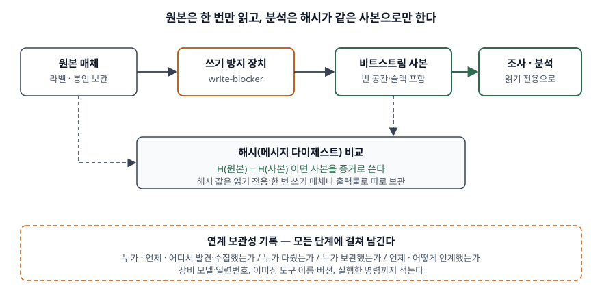

> **실행 검증 없음.** 표준·공식 문서의 정의와 절차를 정리한 개념 글이다. 출력·측정값은 싣지 않는다.
>
> ISO/IEC 27037·27043 본문은 유료라 직접 열람하지 못했다. 27043의 프로세스 부류와 준비도
> 정의는 그 표준을 인용한 동료 심사 논문(Makura 외, 2021)에서 확인한 문장만 썼다.

## 들어가며

침해 사고가 나면 가장 먼저 하는 일이 서버에 접속해 로그를 보는 것이다. 그런데 그 접속과
조회가 파일 접근 시각을 바꾸고 메모리 내용을 덮어쓴다. 원인을 찾는 동안 증거가 망가지는
셈이다. 시험은 이 모순을 **어떤 절차로 풀고, 증거가 바뀌지 않았다는 것을 무엇으로 증명하는가**를
묻는다. 정보시스템 쪽에서는 사고가 나기 전에 로그와 시각을 준비해 두는 **포렌식 준비도**가
함께 나온다.

## 정의

**디지털 포렌식(Digital Forensics)**: 정보의 무결성을 보존하고 데이터에 대한 엄격한 연계 보관성을
유지하면서, 데이터의 식별·수집·조사·분석에 과학을 적용하는 것이다. NIST SP 800-86 용어집의
정의이며, 같은 문서는 컴퓨터 포렌식·네트워크 포렌식이라는 이름도 함께 쓴다.

**디지털 증거**: ISO/IEC 27037은 이진 형태로 저장·전송되어 증거로 쓰일 수 있는 정보나 데이터로
정의한다.

**연계 보관성(chain of custody)**: 증거가 누구 손을 거쳤는지 끊김 없이 남긴 기록이다. RFC 3227(§4.1)은
발견·수집한 장소·시각·사람, 다루거나 조사한 사람, 보관한 사람과 보관 방법, 인계한 시각과 방법을
적으라고 한다.

## 등장 배경

종이 문서나 흉기와 달리 디지털 증거에는 **세 가지 성질**이 있어서 일반 증거 취급 절차로는 다룰 수 없다.

- **읽기만 해도 바뀐다.** RFC 3227(§2.2)은 파일 전체의 접근 시각을 고치는 프로그램(`tar`, `xcopy`)을
  돌리지 말라고 적는다. 조사하는 행위가 원본을 고친다.
- **사라진다.** NIST SP 800-86(§3.1.2)은 휘발성 데이터를 전원을 끄거나 시간이 지나면 잃는 데이터로
  정의한다. 로그처럼 비휘발성이어도 새 이벤트에 덮어써지면 없어진다.
- **복사본과 원본이 겉으로 구분되지 않는다.** 그래서 "원본과 같다"는 것을 외관이 아니라
  계산(해시)과 기록(연계 보관성)으로 보여 줘야 한다.

이 세 성질 때문에 포렌식은 도구의 문제이기 전에 **절차와 기록의 문제**가 된다. 같은 절차를 따르면
다른 분석가가 같은 사본을 다시 만들 수 있어야 하고(NIST §4.2.1), 그 과정이 법적·징계 절차에서
의심받지 않아야 한다.

## 구성요소 / 절차

### 포렌식 절차 — 4단계 (NIST SP 800-86 §3)

| 단계 | 하는 일 | 형태 변화 |
|---|---|---|
| ① 수집 | 출처를 식별·표시·기록하고 데이터를 확보, 무결성 보존 | 매체 |
| ② 조사 | 자동·수동 방법으로 관심 있는 데이터를 추출 | 매체 → 데이터 |
| ③ 분석 | 수집의 계기가 된 질문에 답하는 정보를 도출 | 데이터 → 정보 |
| ④ 보고 | 결과, 수행 절차, 추가 조치와 개선 권고 | 정보 → 증거 |

### 수집 안의 획득 — 3단계와 우선순위 3요소 (NIST §3.1.2)

획득은 **계획 수립 → 획득 → 무결성 검증**의 3단계로 한다. 계획은 출처별 수집 순서를 정하는 일이고,
순서를 가르는 요소는 **3가지**다.

- **예상 가치**: 상황과 경험에 비춰 그 출처가 얼마나 쓸모 있을지
- **휘발성**: 먼저 잃을 것부터. RFC 3227(§2.1)은 레지스터·캐시에서 보관 매체까지 7단계 순서를 준다
- **드는 노력**: 분석가 시간뿐 아니라 외부 전문가·장비 비용. 같은 네트워크 기록도 사내 라우터보다
  통신사에서 받는 쪽이 훨씬 비싸다

### 사고 조사 프로세스 부류 — 5가지 (ISO/IEC 27043)

ISO/IEC 27043은 조사 전체를 **준비(readiness)·착수(initialization)·획득(acquisitive)·조사(investigative)**
의 4부류로 순서대로 놓고, 그 전 과정에 걸쳐 도는 **병행(concurrent)** 부류를 하나 더 둔다. 병행 부류에는
정보 흐름 관리, 문서화, 권한 획득, 연계 보관성 유지, 디지털 증거 보존이 들어간다. 연계 보관성이 한
단계가 아니라 **모든 단계에 걸친 활동**이라는 뜻이다.

준비 부류는 조사가 필요해졌을 때 **디지털 증거를 쓸 수 있는 가능성은 최대로, 조사 시간·비용은
최소로** 하도록 조직을 미리 갖추는 프로세스로 정의된다. 이것이 포렌식 준비도다.

### 표준 묶음 — 4종

| 표준 | 다루는 범위 |
|---|---|
| ISO/IEC 27037:2012 | 디지털 증거의 식별·수집·획득·보존 |
| ISO/IEC 27041:2015 | 조사 방법이 목적에 맞고 충분한지 보증 |
| ISO/IEC 27042:2015 | 디지털 증거의 분석과 해석 |
| ISO/IEC 27043:2015 | 사고 조사의 원칙과 프로세스 전체 |

## 도식

> **출처**: [NIST SP 800-86 §4.2.1 Copying Files from Media, §4.2.2 Data File Integrity, Appendix A.2.1](https://csrc.nist.gov/pubs/sp/800/86/final) · [RFC 3227 §4.1 Chain of Custody](https://www.rfc-editor.org/rfc/rfc3227#section-4.1)

답안지에는 윗줄에 원본 → 쓰기 방지 → 사본 → 분석 네 칸을 긋고, 원본과 사본에서 점선을 내려
해시 비교 칸에 모은다. 맨 아래에 연계 보관성 띠를 가로로 깐다. 요점은 **분석 화살표가 원본이 아닌
사본에서만 나간다**는 것이다.

## 비교

### 논리 백업과 비트스트림 이미징 (NIST §4.2.1)

| 구분 | 논리 백업 | 비트스트림 이미징 |
|---|---|---|
| 복사 대상 | 논리 볼륨의 디렉터리와 파일 | 매체 전체 비트, 빈 공간·슬랙 공간 포함 |
| 삭제 파일·잔여 데이터 | 못 담는다 | 담는다 |
| 파일 시각 | 도구에 따라 생성 시각이 바뀔 수 있다 | 보존된다 |
| 비용 | 빠르고 공간이 적다 | 느리고 공간이 많이 든다 |
| 쓰는 때 | 운영 중단 없이 특정 파일만 필요할 때 | 소송·징계에 증거가 필요할 때 |

### 절차 표준과 증거 요건

| 구분 | NIST SP 800-86 | ISO/IEC 27037 | RFC 3227 |
|---|---|---|---|
| 초점 | 사고 대응에 포렌식을 결합 | 증거 취급 과정 | 현장 수집·보관 수칙 |
| 단계 | 수집·조사·분석·보고 4단계 | 식별·수집·획득·보존 4과정 | 휘발성 순서 7단계 |
| 증거가 갖출 것 | 무결성, 연계 보관성 | 감사 가능성·반복성·재현성·정당성 | 증거 능력·진정성·완전성·신뢰성·설득력 5가지(§2.4) |

세 문서는 겹치는 범위가 다르다. NIST의 수집 단계를 ISO/IEC 27037이 넷으로 쪼개고, 그 안의 현장
수칙을 RFC 3227이 준다. 한 표준만 외우면 "수집과 획득이 무엇이 다른가" 같은 질문에서 막힌다.

## 적용 시 고려사항

- **전원을 끌지 말지를 미리 정해 둔다.** NIST(§5.2.1)는 휘발성 데이터를 보존할지 판단 기준을 사전에
  문서화하라고 한다. 네트워크를 뽑거나 전원을 끄는 순간 메모리에 남은 비밀번호 해시 같은 증거가 사라지고,
  반대로 살아 있는 시스템을 만지면 루트킷이 거짓 결과를 돌려줄 수 있다. 현장에서 고민할 시간이 없다.
- **수집 도구를 사고 시스템에서 빌리지 않는다.** 침해된 서버의 `ls`·`ps`는 바꿔치기됐을 수 있다.
  NIST는 정적 링크된 도구를 외부 매체에서 실행하고, 도구마다 해시와 버전, 실행한 명령줄을 기록하라고
  적는다. 도구 자체도 증거 사슬의 일부다.
- **로그를 사고 서버 밖에 둔다.** NIST(§3.1.1)는 중앙 로그 서버로 사본을 보내면 권한 없는 사용자가
  로그를 지우거나 고치는 것을 막을 수 있다고 한다. 여기에 RFC 3227이 요구하는 시각 기록(시스템 시계와
  UTC의 차이)이 더해져야 여러 서버의 로그가 한 줄의 시간 순서로 엮인다.
- **클라우드에서는 매체를 압수할 수 없다.** 포렌식 이미지를 뜨려면 장치에 접근해야 하는데, 클라우드는
  데이터 센터가 다른 관할에 있을 수 있다(Makura 외). 사고 뒤 수집이 어려우므로 준비 부류의 사전 수집·해시
  보관 비중이 커진다.
- **감시 범위는 정책으로 먼저 알린다.** NIST는 키 입력 기록 같은 사용자 행위 감시가 사생활 침해가 될 수
  있으므로 정책과 로그인 배너로 고지하고 법률 자문을 거치라고 한다. 준비도를 높이려다 증거 능력을 잃을 수 있다.

> 기출 답안: [기출문제 — 디지털 포렌식](../../exam/2026-09-28-digital-forensics/index.md)

## 정리

- 정의(NIST) = **무결성 보존 + 연계 보관성 유지** 속에서 식별·수집·조사·분석에 과학을 적용.
- 절차 **4단계** 수·조·분·보 — 매체 → 데이터 → 정보 → 증거로 형태가 바뀐다.
- 획득 **3단계** 계획·획득·검증, 우선순위 **3요소** 가치·휘발성·노력.
- 무결성 증명 **4장치** — 쓰기 방지, 비트스트림 사본, 해시 비교, 사본으로만 분석.
- ISO/IEC 27043 **5부류** — 준비·착수·획득·조사 + 병행. 준비 부류가 곧 포렌식 준비도.

## 참고 자료

- [NIST SP 800-86, Guide to Integrating Forensic Techniques into Incident Response (2006-08)](https://csrc.nist.gov/pubs/sp/800/86/final) — §3 절차 4단계, §3.1.1 중앙 로그, §3.1.2 획득 3단계·우선순위, §4.2.1 논리 백업과 비트스트림 이미징, §5.2.1 휘발성 OS 데이터, Appendix C 용어집
- [ISO/IEC 27037:2012, Guidelines for identification, collection, acquisition and preservation of digital evidence](https://www.iso.org/standard/44381.html)
- [ISO/IEC 27041:2015, Guidance on assuring suitability and adequacy of incident investigative method](https://www.iso.org/standard/44405.html)
- ISO/IEC 27042:2015, Guidelines for the analysis and interpretation of digital evidence
- [ISO/IEC 27043:2015, Incident investigation principles and processes](https://www.iso.org/standard/44407.html)
- [RFC 3227, Guidelines for Evidence Collection and Archiving (2002-02)](https://www.rfc-editor.org/rfc/rfc3227) — §2.1 휘발성 순서, §2.2 피할 것, §2.4 법적 고려, §4.1 연계 보관성
- [Makura, Venter, Kebande, Karie, Ikuesan, Alawadi, "Digital forensic readiness in operational cloud leveraging ISO/IEC 27043 guidelines on security monitoring", Security and Privacy, Wiley (2021)](https://doi.org/10.1002/spy2.149) — §2.5 ISO/IEC 27043 프로세스 부류와 준비 부류 정의 인용
