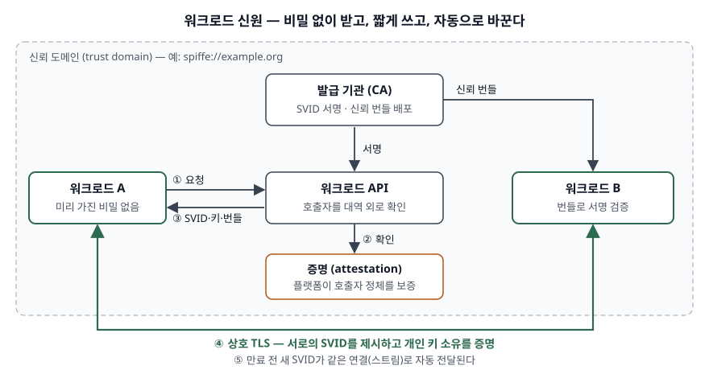

> **실행 검증 없음.** 표준·공식 문서의 정의와 규칙을 정리한 개념 글이다. 출력·측정값은 싣지 않는다.
>
> NHI라는 용어를 정의한 ISO·NIST 표준은 찾지 못해 OWASP 프로젝트 공식 문서의 정의를 쓴다.
> 워크로드 신원은 SPIFFE 표준(CNCF 프로젝트의 공개 명세)과 IETF WIMSE 작업반 초안을 근거로 했다.
> WIMSE 문서는 아직 RFC가 아닌 인터넷 초안이라 세부가 바뀔 수 있다.

## 들어가며

마이크로서비스와 CI/CD가 늘면서 로그인하는 주체의 다수가 사람이 아니라 프로그램이 됐다.
서비스가 DB에, 파이프라인이 클라우드에, 외부 SaaS가 사내 API에 붙을 때마다 신원이 하나씩
생긴다. 보안 문항은 이 신원이 **사람 계정과 무엇이 달라서 위험한가**와 **그 차이를 어떤 구조로
메우는가**를 묻는다. 앞 질문의 답이 비인간 신원(NHI) 관리이고, 뒤 질문의 답이 워크로드 신원이다.

## 정의

**비인간 신원(NHI, Non-Human Identity)**: 소프트웨어 주체가 보호된 자원에 접근할 때 그 주체를
식별·인증·인가하는 데 쓰는 신원이다. OWASP NHI Top 10(2025)의 정의이며, 서비스 계정, 클라우드
역할(role), API·접근 키, 서드파티 연동 애플리케이션을 예로 든다.

**워크로드 신원(workload identity)**: 신뢰 도메인 안에서 워크로드를 유일하게 가리키는 이름으로,
신원 자격증명에 실려 전달된다. IETF WIMSE 아키텍처 초안의 용어 정의(§2)이며, 워크로드는
독립적으로 주소를 가질 수 있는 소프트웨어 개체로 정의된다.

두 용어의 관계는 이렇다. NHI는 **관리 대상 전체**(키, 토큰, 계정)를 부르는 말이고, 워크로드 신원은
그중 **프로그램 자체에 암호학적 이름을 붙여 비밀 배포를 없애는 방식**이다. NIST SP 800-207A는 같은
대상을 서비스 신원이라 부르며, 제로 트러스트 환경에서 네트워크 위치가 아니라 이 신원을 기준으로
인증·인가 정책을 건다고 본다.

## 등장 배경

전통적인 방식은 **정적 비밀을 나눠 주는 것**이다. 운영자가 API 키나 서비스 계정 비밀번호를 만들어
설정 파일·환경 변수·저장소에 넣는다. 이 방식이 무너지는 지점은 세 가지다.

- **가진 쪽이 곧 주체다.** RFC 6750은 베어러 토큰을 "가진 당사자라면 누구든 쓸 수 있는" 보안 토큰으로
  정의한다(§1.2). 키가 로그·저장소·CI 변수로 한 번 새면 훔친 쪽이 정상 서비스와 구별되지 않는다.
- **인사 절차 밖에 있다.** 사람 계정은 입사·퇴사 때 만들고 지우지만, NHI는 개발자와 파이프라인이
  필요할 때 만든다. OWASP가 1순위(NHI1)로 부적절한 폐기를 든 이유다.
- **오래 산다.** 비밀을 바꾸려면 쓰는 곳을 전부 찾아 다시 배포해야 하므로 만료를 길게 잡는다.
  OWASP NHI7은 장기 시크릿을 별도 위험으로 둔다.

워크로드 신원은 이 셋을 구조로 뒤집는다. 비밀을 **미리 주지 않고**, 실행 중인 워크로드를 플랫폼이
확인한 뒤 **짧게 유효한** 자격증명을 발급하고, **개인 키 소유를 증명**해야 쓸 수 있게 한다.

## 구성요소 / 절차

### 워크로드 신원의 구성요소 — 3가지 (WIMSE §3.1)

| 구성요소 | 정의 (WIMSE 초안) | SPIFFE 대응 |
|---|---|---|
| ① 신뢰 도메인 | 보안 통제와 정책을 공유하는 시스템의 논리적 묶음. FQDN으로 식별 (§3.1.1) | 신뢰 도메인 — 시스템의 신뢰 루트 |
| ② 워크로드 식별자 | 신뢰 도메인 안에서 워크로드를 유일하게 가리키는 URI (§3.1.2) | SPIFFE ID `spiffe://<도메인>/<경로>` |
| ③ 신원 자격증명 | 서명된 인증서 또는 토큰 + 대응하는 개인 키 (§3.1.3) | SVID (X.509, JWT, WIT 형식) |

SPIFFE 개요 문서는 표준을 **SPIFFE ID, SVID, 워크로드 API의 3개 요소**로 나눈다. 앞의 둘이 WIMSE의
②·③이고, 워크로드 API는 SVID를 받아 가는 통로다. SPIFFE ID 명세(§3)는 SVID가 그 SPIFFE ID의 신뢰
도메인 안 발급 기관이 서명했을 때 유효하다고 정한다.

### 발급과 사용 — 5단계

1. **요청** — 워크로드가 워크로드 API를 호출한다. 이때 워크로드는 비밀을 제시하지 않는다
2. **확인** — 워크로드 API 명세(§4.1)는 직접적인 클라이언트 인증을 두지 않고 **대역 외 확인**에
   기대도록 정한다. WIMSE 초안(§3.4.1)은 이것을 워크로드가 증명 근거(attestation evidence)를 내는 과정으로 설명한다
3. **발급** — X.509-SVID, 개인 키, 자기 도메인과 연합 도메인의 신뢰 번들을 받는다
4. **사용** — 상대에게 SVID를 제시하고 개인 키 소유를 증명한다(상호 TLS 또는 키에 묶인 토큰).
   상대는 신뢰 번들로 서명을 검증한다
5. **갱신** — 워크로드 API는 스트림으로 응답하며, SVID가 교체되면 새 정보를 보낸다(§4.3).
   WIMSE 초안은 수명을 제한하고 자동 갱신하라고 권고한다(SHOULD, §3.1.3)

## 도식

> **출처**: [SPIFFE Workload API §4.1 · §4.3](https://github.com/spiffe/spiffe/blob/main/standards/SPIFFE_Workload_API.md) · [SPIFFE-ID §2 · §3](https://github.com/spiffe/spiffe/blob/main/standards/SPIFFE-ID.md) · [IETF draft-ietf-wimse-arch-08 §3.1 · §3.4.1](https://datatracker.ietf.org/doc/html/draft-ietf-wimse-arch-08)

답안지에는 가운데 세로로 발급 기관 → 워크로드 API → 증명 세 칸을 긋고, 좌우에 워크로드 두 개를
둔다. 아래 초록 선(④)이 핵심이다. 두 워크로드 사이에 오가는 것은 **공유 비밀이 아니라 서로의
인증서와 서명**이다.

## 비교

### 사람 신원과 비인간 신원

| 구분 | 사람 신원 | 비인간 신원 |
|---|---|---|
| 생성 주체 | 인사 절차에 따라 IAM 관리자 | 개발자·파이프라인이 필요할 때 |
| 인증 수단 | 비밀번호 + 사람이 응답하는 추가 인증 | 키·토큰·인증서 자체 |
| 폐기 계기 | 퇴사·전보 | 서비스 종료 — 인사 이벤트가 없다 |
| 이상 징후 발견 | 본인이 알아챌 수 있다 | 로그인하는 사람이 없어 기록으로만 보인다 |

### 베어러 자격증명과 소유 증명

| 구분 | 베어러 (bearer) | 소유 증명 (proof-of-possession) |
|---|---|---|
| 근거 문서 | RFC 6750 §1.2 | RFC 9449(DPoP), RFC 8705(상호 TLS) |
| 사용 조건 | 토큰을 가지고 있으면 된다 | 토큰 + 그 토큰이 묶인 개인 키로 만든 서명 |
| 토큰이 샜을 때 | 훔친 쪽이 그대로 쓴다 | 개인 키가 없으면 못 쓴다 |
| 요청마다 하는 일 | 토큰 제시 | DPoP는 요청마다 서명한 증명 JWT를 헤더에 싣는다 |

RFC 9449는 DPoP가 전송 계층을 쓰는 방식(RFC 8705 상호 TLS)을 쓸 수 없거나 원치 않을 때 쓰는
응용 계층의 대안이라고 적는다(§1). 둘은 경쟁 관계가 아니라 적용 위치가 다르다.

### 정적 비밀 배포와 워크로드 신원

| 구분 | 정적 비밀 배포 | 워크로드 신원 |
|---|---|---|
| 처음 받는 방법 | 사람이 설정에 넣는다 | 플랫폼 확인 후 API로 받는다 |
| 수명 | 길다 — 교체 비용이 크다 | 짧다 — 자동 갱신 |
| 유출 시 | 폐기·재배포까지 유효 | 만료 시점까지만, 키 없이는 못 씀 |
| 인가 기준 | 키가 맞는가 | 이 이름(SPIFFE ID)에 허용된 호출인가 |

## 적용 시 고려사항

- **증명의 근거가 곧 신뢰의 뿌리다.** 워크로드 API는 호출자를 대역 외로 확인하므로, 그 확인이
  무엇에 기대는지(노드, 컨테이너 런타임, 클라우드 메타데이터)가 전체 보안 수준을 정한다. 플랫폼이
  뚫리면 정상 이름으로 발급받을 수 있다. 증명 범위를 설계 문서에 적어 둔다.
- **모든 NHI를 워크로드 신원으로 바꿀 수는 없다.** 외부 SaaS의 API 키처럼 상대가 정적 키만 받는 곳이
  남는다. 이 부분은 전용 저장소(vault), 인벤토리, 주기적 재인증 같은 OWASP의 수명주기 통제로
  관리하고, 워크로드 신원은 사내 서비스 간 호출부터 적용한다.
- **짧은 수명은 가용성 요구로 바뀐다.** 자격증명이 자주 만료되면 발급 기관과 워크로드 API가 멈췄을
  때 서비스 호출이 줄줄이 실패한다. 발급 계층을 이중화하고 만료 전 갱신 여유를 둔다.
- **인증과 인가를 분리한다.** SVID는 "누구인가"만 말한다. NIST SP 800-207A처럼 서비스 신원을 기준으로
  한 접근 정책을 호출마다 따로 적용해야 과다 권한(OWASP NHI5)을 막는다.
- **사람의 작업은 사람 신원으로 한다.** 운영자가 서비스 계정으로 수작업을 하면(OWASP NHI10) 감사 기록에서
  누가 했는지가 사라진다.

> 기출 답안: [기출문제 — 비인간 신원(NHI)의 보안 취약점](../../exam/2026-09-28-non-human-identity-security-weaknesses/index.md)

## 정리

- NHI = 소프트웨어 주체의 신원(OWASP). 사람 신원과 **3가지**가 다르다 — 생성 주체, 인증 수단, 폐기 계기.
- 정적 비밀이 무너지는 이유 **3가지** — 가진 쪽이 주체(베어러), 인사 절차 밖, 오래 산다.
- 워크로드 신원 구성요소 **3가지**(WIMSE) — **신뢰 도메인·식별자·자격증명**. "도·식·자".
  SPIFFE로는 SPIFFE ID·SVID·워크로드 API.
- 발급과 사용 **5단계** — 요청·확인·발급·사용·갱신. "요·확·발·사·갱".
- 베어러는 가지면 쓰고, 소유 증명은 키가 있어야 쓴다(RFC 6750 ↔ RFC 9449·8705).

## 참고 자료

- [OWASP Non-Human Identities Top 10 — 2025](https://owasp.org/www-project-non-human-identities-top-10/2025/top-10-2025/) — NHI 정의, NHI1 부적절한 폐기, NHI5 과다 권한, NHI7 장기 시크릿, NHI10 사람의 NHI 사용
- [NIST SP 800-207A, A Zero Trust Architecture Model for Access Control in Cloud-Native Applications in Multi-Cloud Environments (2023-09)](https://csrc.nist.gov/pubs/sp/800/207/a/final)
- [IETF, Workload Identity in a Multi System Environment (WIMSE) Architecture, draft-ietf-wimse-arch-08 (2026-07-06)](https://datatracker.ietf.org/doc/html/draft-ietf-wimse-arch-08) — §2 용어, §3.1 구성요소, §3.1.3 자격증명과 수명, §3.4.1 증명. 인터넷 초안
- SPIFFE 표준 (github.com/spiffe/spiffe, 2026-09 열람)
  - [SPIFFE — 개요 (3개 요소)](https://github.com/spiffe/spiffe/blob/main/standards/SPIFFE.md)
  - [SPIFFE-ID — §2 SPIFFE ID 형식, §3 SVID](https://github.com/spiffe/spiffe/blob/main/standards/SPIFFE-ID.md)
  - [SPIFFE Workload API — §4.1 호출자 확인, §4.3 스트림 응답](https://github.com/spiffe/spiffe/blob/main/standards/SPIFFE_Workload_API.md)
- [RFC 6750, The OAuth 2.0 Authorization Framework: Bearer Token Usage (2012-10)](https://www.rfc-editor.org/rfc/rfc6750#section-1.2) — §1.2 베어러 토큰 정의
- [RFC 9449, OAuth 2.0 Demonstrating Proof of Possession (DPoP) (2023-09)](https://www.rfc-editor.org/rfc/rfc9449#section-1) — §1 목적과 RFC 8705와의 관계
