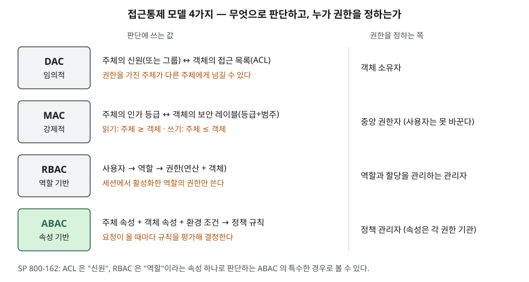
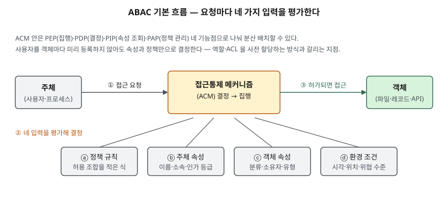

> **실행 검증 없음.** 표준·공식 문서의 정의와 구조를 정리한 개념 글이다. 실행 예제와 측정값은 없다.

## 들어가며

접근통제 문제는 "누가 무엇을 할 수 있는가"를 묻는 것처럼 보이지만, 시험이 실제로 묻는 것은
**그 판단을 무엇으로 하고 누가 권한을 정하는가**다. 네 모델은 이 두 질문에 다르게 답한다.
실무에서는 한 시스템에 모델 하나만 쓰는 경우가 드물다. 운영체제 파일 권한은 DAC, 업무 화면 권한은
RBAC로 두고, 규칙이 복잡한 곳에만 ABAC를 얹는다. 그래서 각 모델이 **표현하지 못하는 요구사항**이
무엇인지를 알아야 섞는 지점을 고를 수 있다.

## 정의

- **DAC(임의적 접근통제)**: 주체의 **신원** 또는 주체가 속한 그룹을 근거로 객체 접근을 제한하는 방식이다.
  접근 권한을 가진 주체가 그 권한을 **다른 주체에게 넘길 수 있다**는 뜻에서 "임의적"이다(TCSEC 용어 정의).
- **MAC(강제적 접근통제)**: 객체에 담긴 정보의 **민감도(레이블)** 와 주체의 **공식 인가 등급(clearance)** 을
  근거로 접근을 제한하는 방식이다(TCSEC 용어 정의). NIST SP 800-192는 결정을 객체 소유자가 아니라
  **중앙 권한자**가 내리고 사용자가 접근 권한을 바꿀 수 없다고 덧붙인다.
- **RBAC(역할 기반 접근통제)**: 허용된 행위를 개별 주체의 신원이 아니라 **역할**에 묶어 두는 모델이다(NIST SP 800-95).
- **ABAC(속성 기반 접근통제)**: 주체·객체에 부여된 속성, 환경 조건, 정책을 평가해 요청을 허용하거나 거부하는
  방식이다(NIST SP 800-162).

## 등장 배경

SP 800-162의 모델 변천 설명(§2)은 네 단계를 거친다.

1. **DAC·MAC** — 1960~70년대 국방 분야에서 먼저 쓰였고 TCSEC(오렌지북)이 용어를 정했다.
2. **신원 기반(IBAC)·ACL** — 네트워크가 커지며 객체마다 허용 신원 목록(ACL)을 두었다. 객체마다 ACL이 필요하고
   목록 등록이 요청 전에 정적으로 이루어져서, 제때 빼지 않으면 **사용자에게 권한이 쌓인다.**
3. **RBAC** — 권한을 역할에 모아 중앙에서 관리하게 하면서 ACL 수요를 줄였다.
4. **ABAC** — 역할은 비교적 고정된 조직 직위에 맞춰 주어져서, 위치나 교육 이수처럼 **여러 요인이 걸린 결정**을
   담기 어렵다. 억지로 담으면 구성원이 몇 명 안 되는 임시 역할이 늘어나는데, 문서는 이것을 흔히 "역할 폭증(role explosion)"이라
   부른다고 적는다.

## 구성요소 / 절차

### 네 모델의 판단 축 — 2가지

| 축 | DAC | MAC | RBAC | ABAC |
|---|---|---|---|---|
| 판단에 쓰는 값 | 주체 신원·그룹 | 인가 등급 ↔ 보안 레이블 | 사용자에게 할당된 역할 | 주체·객체 속성 + 환경 조건 |
| 권한을 정하는 쪽 | 객체 소유자 | 중앙 권한자 | 역할·할당 관리자 | 정책 관리자 |

### MAC의 읽기·쓰기 규칙 — 2가지 (TCSEC B1 강제적 접근통제 요건)

- **읽기**: 주체의 등급이 객체 등급 **이상**이고, 주체의 범주가 객체의 범주를 **모두 포함**할 때만
- **쓰기**: 주체의 등급이 객체 등급 **이하**이고, 주체의 범주가 객체의 범주에 **모두 포함**될 때만

높은 등급 정보를 읽은 주체가 낮은 등급 객체에 쓰지 못하게 해서 정보가 아래로 흐르는 것을 막는다.
TCSEC 용어집은 이 규칙을 형식화한 모델로 **Bell-LaPadula 모델**을 들고, 두 규칙을 단순 보안 속성과 *-속성으로 가리킨다.

### RBAC 표준의 구성요소 — 4가지 (ANSI INCITS 359-2004 참조 모델)

1. **Core RBAC** — 사용자·역할·권한·세션. 사용자-역할 할당, 권한-역할 할당, 세션에서 역할 활성화
2. **Hierarchical RBAC** — 역할 계층. 상위 역할이 하위 역할의 권한을 물려받는다
3. **정적 직무 분리(SSD)** — 서로 충돌하는 역할을 한 사용자에게 **할당**하지 못하게 한다
4. **동적 직무 분리(DSD)** — 할당은 허용하되 한 **세션**에서 동시에 활성화하지 못하게 한다

이 표준은 Sandhu 등(1996)의 RBAC0~3 단계 모델과 Ferraiolo·Kuhn(1992)의 모델을 합친 것이다.

### ABAC의 입력 — 4가지, 기능점 — 4가지 (SP 800-162 §2.3, §2.4.3)

- 입력: **정책 규칙**, **주체 속성**, **객체 속성**, **환경 조건**(시각·위치·위협 수준 등 주체·객체와 무관한 동적 요인)
- 기능점: **PEP**(결정 집행), **PDP**(결정), **PIP**(속성 조회), **PAP**(정책 관리)

## 도식

> **출처**: DAC·MAC 정의는 [DoD 5200.28-STD TCSEC, Glossary](https://csrc.nist.gov/csrc/media/publications/conference-paper/1998/10/08/proceedings-of-the-21st-nissc-1998/documents/early-cs-papers/dod85.pdf#page=106), 읽기·쓰기 규칙은 같은 문서 §3.1.1.4 Mandatory Access Control(B1),
> MAC의 중앙 권한자는 [NIST CSRC Glossary — mandatory access control](https://csrc.nist.gov/glossary/term/mandatory_access_control)(SP 800-192),
> RBAC·ABAC와 "ACL·RBAC는 ABAC의 특수한 경우"라는 설명은 [NIST SP 800-162 §2 Understanding ABAC](https://csrc.nist.gov/pubs/sp/800/162/upd2/final)를 따랐다.
> 두 축으로 나눈 표 형태는 글쓴이의 정리다.

> **출처**: [NIST SP 800-162 §2.3 Basic ABAC Concepts, Figure 2 Basic ABAC Scenario](https://csrc.nist.gov/pubs/sp/800/162/upd2/final), 기능점 4개는 같은 문서 §2.4.3 Access Control Mechanism Distribution in Enterprise ABAC

답안지에는 첫 도식을 4행 2열 표로, 둘째 도식을 "주체 → ACM → 객체" 한 줄과 ACM 아래 입력 네 칸으로 옮긴다.

## 비교

### 같은 요구사항을 네 모델로 표현하면

요구사항: 병원 진료기록 시스템에서 **(가) 간호사는 자기 병동 환자의 기록만 읽는다, (나) 근무 시간에만 읽는다,
(다) 기록은 작성한 의사만 고친다.**

| 모델 | 표현 방법 | 표현이 막히는 곳 |
|---|---|---|
| DAC | 작성 의사(소유자)가 기록마다 ACL에 해당 병동 간호사를 넣는다. (다)는 소유자만 쓰기 권한을 가지면 된다 | (나)를 담을 자리가 없다. 간호사가 병동을 옮기면 기록마다 ACL을 고쳐야 하고, 권한을 받은 주체가 다른 사람에게 넘길 수 있다 |
| MAC | 기록 레이블에 범주 `병동A`, 간호사 인가에 범주 `병동A`를 준다. 범주 포함 규칙으로 (가)가 된다 | (나)를 담을 자리가 없다. (다)는 "작성자"를 구분하는 규칙이 없고, 쓰기 규칙은 등급의 높낮이만 본다 |
| RBAC | `병동A 간호사` 역할에 진료기록 읽기 권한을 준다 | 병동 수만큼 역할이 생긴다. (나)는 표준 참조 모델에 시간 조건이 없다. (다)의 "자기가 쓴 기록"은 역할로 표현되지 않는다 |
| ABAC | 규칙 하나: `주체.직무 = 간호사 AND 주체.병동 = 객체.병동 AND 환경.시각 ∈ 주체.근무시간 → 읽기`, `주체.ID = 객체.작성자 → 수정` | 속성의 정확성에 결정이 전부 걸린다. 병동·근무시간 속성을 누가 언제 갱신하는지 정해야 한다 |

(나)와 (다)처럼 **요청 시점의 조건**이나 **객체와 주체의 관계**가 들어가면 앞의 세 모델은 모델 밖에서 따로
처리해야 한다. SP 800-162가 RBAC의 한계로 든 "여러 요인이 걸린 결정"이 이것이다.

### 서로 겹치는 관계

SP 800-162는 ACL이 **신원**, RBAC이 **역할**이라는 속성 하나로 판단한다는 점에서 둘을 ABAC의 특수한 경우로
볼 수 있다고 적는다. 역할도 주체 속성의 하나로 평가된다. 반대로 ACL이나 RBAC로도 ABAC의 목적을 이룰 수는 있지만,
요구사항과 모델 사이의 추상화가 커서 **준수를 입증하기 어렵고**, 요구사항이 바뀌면 고칠 곳을 모두 찾기 어렵다고 본다.

## 적용 시 고려사항

- **모델을 하나 고르기보다 층을 나눈다.** 대부분의 권한은 RBAC로 굵게 나누고, 시간·위치·관계 조건이 붙는
  소수의 규칙만 ABAC로 얹는다. 모든 권한을 속성 규칙으로 쓰면 규칙 간 충돌을 찾기 어렵다. SP 800-162도 규칙 충돌을
  해소하는 기능을 요구 사항으로 든다(§3.1.3.6).
- **속성의 출처와 신선도를 먼저 정한다.** ABAC에서 속성이 틀리면 결정이 틀린다. 속성마다 관리 주체(권한 기관),
  갱신 주기, 신뢰도를 정해야 한다. SP 800-162는 이것을 메타속성으로 다루고, 신뢰도 점수를 결정 입력으로 쓸 수도 있다고 적는다.
- **직무 분리는 할당 단계와 세션 단계를 구분한다.** 결재자와 수령자를 한 사람에게 아예 주지 않을지(SSD),
  주되 동시에 쓰지 못하게 할지(DSD)는 업무 요구로 정한다. SSD가 강할수록 인력 운영이 경직된다.
- **권한 누적을 점검한다.** ACL·역할 할당은 요청 전에 정적으로 정해져서, 부서 이동 뒤 회수하지 않으면 권한이 쌓인다.
  주기적 권한 재검토와 퇴직·이동 이벤트에 연동한 회수 절차를 둔다.
- **PDP를 분산할 때 일관성을 지킨다.** 같은 객체를 두 조직이 들고 있으면 제한이 약한 쪽으로 우회할 수 있다(SP 800-162 §3.1.3.7).
  PDP를 여러 곳에 두더라도 정책은 한 PAP에서 배포한다.

## 정리

- 모델 **4개**: DAC(신원·소유자), MAC(레이블·중앙), RBAC(역할·관리자), ABAC(속성+환경·정책).
- MAC 규칙 **2개**: 읽기는 등급 이상, 쓰기는 등급 이하 → 정보가 아래로 흐르지 않는다(Bell-LaPadula).
- RBAC 표준 **4구성요소**: Core·Hierarchical·SSD·DSD. 약점은 **역할 폭증**.
- ABAC **4입력**(규칙·주체·객체·환경), **4기능점**(PEP·PDP·PIP·PAP). ACL·RBAC는 속성 하나짜리 ABAC다.
- 판별 질문: 요구사항에 **시간·위치** 같은 요청 시점 조건이나 **주체-객체 관계**가 있으면 ABAC 층이 필요하다.

## 참고 자료

- [DoD 5200.28-STD, Trusted Computer System Evaluation Criteria (1985-12)](https://csrc.nist.gov/csrc/media/publications/conference-paper/1998/10/08/proceedings-of-the-21st-nissc-1998/documents/early-cs-papers/dod85.pdf) — Glossary(DAC·MAC·Bell-LaPadula Model), §3.1.1.4 Mandatory Access Control(B1)
- [NIST SP 800-162, Guide to Attribute Based Access Control (ABAC) Definition and Considerations (2014-01, 2019-08 갱신)](https://csrc.nist.gov/pubs/sp/800/162/upd2/final) — §1 용어, §2 모델 변천(MAC/DAC·IBAC/ACL·RBAC·ABAC), §2.1 RBAC의 한계와 역할 폭증, §2.3 Figure 2, §2.4.3 PEP·PDP·PIP·PAP, §3.1.3.6~7
- [NIST CSRC Glossary — discretionary access control](https://csrc.nist.gov/glossary/term/discretionary_access_control), [mandatory access control](https://csrc.nist.gov/glossary/term/mandatory_access_control), [role based access control](https://csrc.nist.gov/glossary/term/role_based_access_control), [attribute based access control](https://csrc.nist.gov/glossary/term/attribute_based_access_control)
- [NIST RBAC Project — FAQs](https://csrc.nist.gov/projects/role-based-access-control/faqs) — ANSI INCITS 359-2004의 4구성요소, 1992·1996·2000·2004 경위
- [R. Sandhu, E. Coyne, H. Feinstein, C. Youman, "Role-Based Access Control Models", IEEE Computer 29(2), 1996-02](https://csrc.nist.gov/CSRC/media/Projects/Role-Based-Access-Control/documents/sandhu96.pdf) — RBAC0~3
