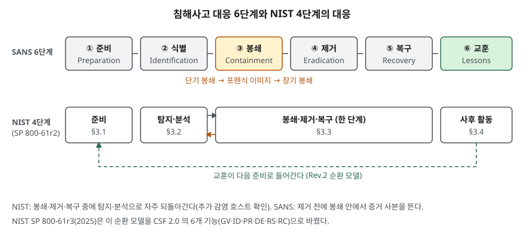

> **실행 검증 없음.** 표준·공식 문서의 정의와 절차를 정리한 개념 글이다. 출력·측정값은 싣지 않는다.
>
> 6단계는 SANS 독서실에 실린 GIAC Gold 논문(Kral)의 구성이다. NIST 문서는 원문 PDF에서 확인했다.
> ISO/IEC 27035-1 본문은 유료라 열람하지 못했다. 단계가 5개이고 첫 단계와 마지막 단계가 계획·준비와
> 교훈이라는 것은 ISO/IEC 27035-2:2023 공식 초록에서, 가운데 단계 이름은 2차 자료(Rapid7, 2017)에서 확인했다.

## 들어가며

침해사고는 "무엇을 먼저 하느냐"에서 피해 규모가 갈린다. 감염 서버를 서둘러 포맷하면 원인과 침입 경로가
사라져 같은 공격을 다시 받고, 증거를 모으느라 격리를 미루면 옆 서버로 번진다. 시험은 이 순서를
**몇 단계로 나누고, 단계마다 무엇을 남기는가**로 묻는다. 정보시스템 쪽에서는 로그·시각 동기화·백업처럼
사고 전에 갖춰 둬야 하는 것이 답안의 절반을 차지한다.

## 정의

**침해사고(cybersecurity incident)**: 정당한 권한 없이 정보나 정보시스템의 무결성·기밀성·가용성을
실제로 또는 임박하게 위협하거나, 법·보안 정책·보안 절차·허용 사용 정책을 위반하거나 위반이 임박한
사건이다. NIST SP 800-61r3 용어집이 FISMA 2014에서 가져온 정의다.

**침해사고 대응(incident response)**: 보안 정책과 권장 관행 위반을 해소하거나 완화하는 활동이다(같은 용어집).

## 등장 배경

SP 800-61r3은 2012년판이 대응을 **별도 팀이 가끔 수행하는 순환 활동**으로 그렸다고 설명한다. 당시에는
사고가 드물고 범위가 좁았으며 하루이틀이면 끝났다. 지금은 사고가 잦고, 복구에 몇 주에서 몇 달이 걸린다.
그래서 두 가지가 바뀌었다.

- **절차가 필요한 이유** — 대응 중의 결정(시스템을 끌지, 네트워크에서 뗄지)은 미리 정한 전략이 있어야
  빨라진다(SP 800-61r2의 봉쇄 전략 선택 항목, §3.3.1). 즉석에서 고르면 증거와 가용성 중 하나를 잃는다
- **순환 모델의 한계** — 교훈을 복구가 끝난 뒤가 아니라 알게 된 즉시 나눠야 한다. SP 800-61r3(2.1절)은
  이 이유로 4단계 순환 모델을 CSF 2.0의 6개 기능으로 바꿨다

## 구성요소 / 절차

### 대응 절차 — 6단계 (SANS, Kral)

| 단계 | 하는 일 | 남기는 것(산출물) |
|---|---|---|
| ① 준비 | 정책 수립·공지, 연락 체계, 기록부·대응 도구 모음, 정기 훈련 | 대응 정책, 연락망, 도구 모음, 훈련 기록 |
| ② 식별 | 이상 징후가 사고인지 판단하고 발생 위치·발견 경로·범위를 정함 | 사고 기록(누가·무엇·어디·왜·어떻게), 영향 범위와 업무 영향 |
| ③ 봉쇄 | 단기 봉쇄 → 포렌식 이미지 → 장기 봉쇄 **3단계** | 격리 기록, 포렌식 사본, 연계 보관 기록 |
| ④ 제거 | 악성코드·계정·백도어 제거, 재설치와 보안 강화 | 제거 조치 기록, 악용된 취약점 목록 |
| ⑤ 복구 | 운영 복귀 시점 결정, 시험·감시 후 복귀 | 복귀 승인, 감시 기간과 도구 |
| ⑥ 교훈 | 사후 회의, 보고서, 개선 사항 반영 | 사고 보고서, 개선 과제 |

SANS 점검표는 교훈 회의를 해결 후 **2주 안에** 열 수 있는지 묻는다. SP 800-61r2(§3.4.1)는 사고가 끝난 뒤
**며칠 안에** 열라고 적는다.

### 우선순위 판단 요소 — 3가지 (SP 800-61r2 §3.2.6)

- **기능 영향**: 업무 기능에 주는 현재와 앞으로의 영향
- **정보 영향**: 기밀성·무결성·가용성에 주는 영향
- **복구 가능성**: 복구에 드는 시간과 자원. 이미 유출된 정보처럼 복구가 불가능한 경우도 있다

r2는 사고를 **들어온 순서대로 처리하지 말라**고 적는다. 앞의 둘이 업무 영향을, 셋째가 대응 방식을 정한다.

### 봉쇄 전략을 고르는 기준 — 6가지 (SP 800-61r2 §3.3.1)

자원 피해·도난 가능성, 증거 보존 필요성, 서비스 가용성, 전략 수행에 드는 시간·자원, 전략의 효과(부분·전체 봉쇄),
해법의 지속 기간(임시·영구)이다. 사고 유형마다 따로 정해 두라고 한다.

## 도식

> **출처**: [NIST SP 800-61r2 §3 Handling an Incident, Figure 3-1](https://csrc.nist.gov/pubs/sp/800/61/r2/final) ·
> [NIST SP 800-61r3 §2.1 Incident Response Life Cycle Model, Table 1](https://csrc.nist.gov/pubs/sp/800/61/r3/final) ·
> [Kral, The Incident Handlers Handbook, SANS Reading Room (2012-02)](https://www.sans.org/white-papers/33901/).
> 위아래 단계의 대응은 두 문서의 단계 설명을 맞춰 본 글쓴이의 정리다.

답안지에는 윗줄에 6칸을 긋고, 아랫줄에 NIST 4칸을 긋되 봉쇄·제거·복구 세 칸 밑을 한 칸으로 묶는다.
교훈에서 준비로 점선을 되돌리고, 봉쇄 칸 아래에 "단기 → 이미지 → 장기"를 적는다.

## 비교

### 대응 모델 — 문서마다 단계 수가 다르다

| 구분 | SANS (Kral) | NIST SP 800-61r2 | ISO/IEC 27035-1 | NIST SP 800-61r3 |
|---|---|---|---|---|
| 단계 수 | 6 | 4 | 5 | CSF 기능 6 |
| 구성 | 준비 / 식별 / 봉쇄 / 제거 / 복구 / 교훈 | 준비 / 탐지·분석 / 봉쇄·제거·복구 / 사후 활동 | 계획·준비 / 탐지·보고 / 평가·결정 / 대응 / 교훈 | GV·ID·PR(준비) / DE·RS·RC(대응) / ID.IM(개선) |
| 봉쇄·제거·복구 | 따로 3단계 | 한 단계로 묶음 | 대응 단계 안 | RS·RC |
| 모양 | 순서대로 | 순환, 탐지·분석과 봉쇄 사이 반복 | 순환 | 개선이 모든 기능에 수시로 되먹임 |

r3은 표 1에서 r2의 4단계를 CSF 기능에 대응시키고, 조직에 맞는 모델을 쓰라고 한다.
단계 수는 정답이 없고, **어느 문서 기준인지 밝히는 것**이 답안의 점수 자리다.

### 증거 기록 — 4항목 (SP 800-61r2 §3.3.2)

| 항목 | 예 |
|---|---|
| 식별 정보 | 위치, 일련번호, 모델, 호스트명, MAC·IP 주소 |
| 다룬 사람 | 수집·취급한 사람의 이름, 직함, 연락처 |
| 시각 | 취급할 때마다 날짜와 시각, **시간대 포함** |
| 보관 장소 | 증거를 둔 곳 |

## 적용 시 고려사항

- **네트워크를 끊는 것이 안전하다고 가정하지 않는다.** r2(§3.3.1)는 주기적으로 다른 호스트에 핑을 보내는
  악성 프로세스가, 연결이 끊겨 핑이 실패하면 디스크를 덮어쓰거나 암호화할 수 있다고 적는다. 봉쇄 전략에
  "격리 전 메모리·디스크 확보"를 넣어 둘지 사고 유형별로 정한다.
- **재설치 전에 포렌식 이미지를 뜬다.** SANS는 봉쇄 안의 둘째 단계로 시스템 백업을 두고, 원인을 밝히는 교훈
  단계와 형사 절차에 쓰려고 한다. r2(§3.6 권고)는 파일시스템 백업이 아니라 **전체 디스크 이미지**를 쓰기 방지
  매체에 뜨라고 한다. 이미지와 연계 보관은 [디지털 포렌식 절차와 증거 무결성](../2026-09-28-digital-forensics-process-evidence-integrity/index.md)을 본다.
- **사실만 적는다.** r2는 기록부에 의견이나 결론을 쓰지 말고, 제본된 기록부에 쪽 번호를 매기고 잉크로
  쓰며 쪽을 뜯지 말라고 한다(각주 36·37). 추정은 보고서에 쓴다.
- **시각을 맞춰 둔다.** r2(§3.2.4)는 NTP로 호스트 시계를 맞춰 두라고 한다. 로그 셋의 시각이 제각각이면
  사건 상관 분석이 어려워지고 증거로도 약해진다. 준비 단계에서만 할 수 있는 일이다.
- **공격자 추적에 매달리지 않는다.** r2(§3.3.3)는 공격 호스트 식별이 시간만 들고 헛수고가 될 수 있다며
  봉쇄·제거·복구에 집중하라고 한다.
- **증거 보존 기간을 정책으로 정한다.** r2(§3.4.3)는 소송이 끝날 때까지 몇 년이 걸릴 수 있다는 점과, 이미지
  안에 든 메일처럼 데이터 보존 정책과 부딪치는 점을 함께 따지라고 한다.

## 정리

- 정의(NIST r3 용어집) = 권한 없이 **CIA를 위협**하거나 **법·정책을 위반**하는 사건.
- 6단계 **준·식·봉·제·복·교** — 봉쇄는 다시 **단기 → 이미지 → 장기** 3단계.
- NIST r2는 **4단계**(봉쇄·제거·복구를 한 단계로), ISO/IEC 27035-1은 **5단계**, r3은 **CSF 6기능**.
- 우선순위 **3요소** 기능·정보·복구 가능성, 봉쇄 기준 **6가지**, 증거 기록 **4항목**.
- 함정: 네트워크 차단이 증거를 지울 수 있다, 재설치 전에 이미지부터.

## 참고 자료

- [NIST SP 800-61r2, Computer Security Incident Handling Guide (2012-08)](https://csrc.nist.gov/pubs/sp/800/61/r2/final) — §3 대응 수명 주기와 Figure 3-1, §3.2.4 시계 동기화, §3.2.5 사실 기록(각주 36·37), §3.2.6 우선순위, §3.3.1 봉쇄 전략 기준, §3.3.2 증거 기록, §3.3.3 공격 호스트 식별, §3.3.4 제거와 복구, §3.4.1 교훈 회의, §3.4.3 증거 보존
- [NIST SP 800-61r3, Incident Response Recommendations and Considerations for Cybersecurity Risk Management: A CSF 2.0 Community Profile (2025-04)](https://csrc.nist.gov/pubs/sp/800/61/r3/final) — §2.1 수명 주기 모델 변경과 Table 1, Appendix B 용어집(침해사고·침해사고 대응 정의)
- [Patrick Kral, The Incident Handlers Handbook, SANS Institute Reading Room (GIAC Gold 논문, 2011-12 승인, 2012-02 게시)](https://www.sans.org/white-papers/33901/) — 6단계, 봉쇄 3단계, 복구 결정 사항, 점검표
- [ISO/IEC 27035-2:2023, Guidelines to plan and prepare for incident response](https://www.iso.org/standard/78974.html) — 초록: 27035-1:2023의 5.2 계획·준비와 5.6 교훈 단계
- [ISO/IEC 27035-1:2023, Information security incident management — Part 1: Principles and process](https://www.iso.org/standard/78973.html) (본문 미열람)
- [Rapid7, Introduction to ISO/IEC 27035 (2017-04)](https://www.rapid7.com/blog/post/2017/04/20/introduction-to-isoiec-27035-planning-for-and-detection-of-incidents/) — 2차 자료, 5단계 이름
