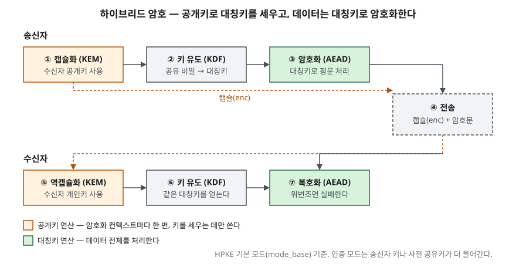

> **실행 검증 없음.** 표준·원 논문의 정의와 구조를 정리한 개념 글이다. 속도 측정값은 싣지 않는다.
> 키 개수 공식은 조합 계산으로 직접 셈했다.

## 들어가며

HTTPS 연결 하나에도 두 종류의 암호가 함께 들어간다. 연결을 여는 순간에는 공개키 연산이, 그 뒤
데이터를 주고받는 동안에는 대칭키 연산이 돈다. 시험은 이 둘을 따로 묻기보다 **왜 둘을 섞어 쓰는가**를
묻는다. 한쪽만으로는 풀리지 않는 문제가 각각 하나씩 있고, 그 두 문제를 나눠 맡긴 것이 하이브리드 방식이다.

## 정의

- **대칭키 알고리즘(symmetric-key algorithm)**: 한 연산과 그 역연산(예: 암호화와 복호화)에 **같은 비밀키**를
  쓰는 암호 알고리즘이다. NIST SP 800-57 Part 1 Rev. 5의 정의이며, 비밀키 알고리즘이라고도 한다.
- **공개키(비대칭키) 알고리즘(asymmetric-key algorithm)**: **서로 관련된 두 키**, 공개키와 개인키를 쓰며,
  공개키로부터 개인키를 알아내는 것이 계산상 불가능한 성질을 가진 암호 알고리즘이다(NIST SP 800-175B Rev. 1, SP 800-56B Rev. 2).
- **하이브리드 암호**: 공개키 방식으로 대칭키를 세우고, 그 대칭키로 데이터를 암호화하는 결합 방식이다.
  RFC 9180은 이것이 공개키의 키 관리 이점과 대칭키의 성능 이점을 함께 얻는다고 설명한다.

## 등장 배경

대칭키만 쓰던 시절의 문제는 **키 분배**였다. Diffie와 Hellman(1976)은 논문 서두에서, 암호로 기밀을 지키려면
양쪽이 미리 비밀키를 나눠 가져야 하고 그 키를 전령이나 등기우편 같은 안전한 경로로 보내야 한다는 점을 들었다.
처음 거래하는 상대와 대화하려고 키가 물리적으로 도착할 때까지 기다리는 것은 현실적이지 않고, 이 비용과
지연이 업무 통신을 네트워크로 옮기는 데 큰 장벽이라고 적었다.

규모가 커지면 키 개수도 문제가 된다. n명이 서로 1:1로 대칭키를 나누면 필요한 키는 **n(n−1)/2개**다.
공개키 방식은 사람마다 키 쌍 하나, 합쳐 **2n개**(공개키 n + 개인키 n)면 된다. 100명이면 4,950개 대 200개다(직접 계산).

같은 논문은 두 가지 해법을 제안했다. 암호화 키를 공개 디렉터리에 올리는 **공개키 암호 시스템**과,
두 사람이 공개 채널로 값을 주고받아 같은 키에 도달하는 **공개키 분배 시스템**(Diffie-Hellman 키 교환)이다.
후자에서 합의한 키는 "보통의 암호 시스템"에 쓴다고 적었다. 하이브리드 구성이 처음부터 전제였던 셈이다.

## 구성요소 / 절차

### 키 확립 방식 — 2가지 (SP 800-57 용어 정의)

| 방식 | 하는 일 | 1976년 논문의 대응 |
|---|---|---|
| **키 전송(key transport)** | 한쪽이 키를 골라 상대의 공개키로 암호화(래핑)해 보낸다 | 공개키 암호 시스템 |
| **키 합의(key agreement)** | 양쪽이 정보를 주고받아 각자 같은 키를 만든다 | 공개키 분배 시스템 |

### HPKE의 구성요소 — 3가지 (RFC 9180)

- **KEM**(키 캡슐화): 수신자 공개키로 공유 비밀과 그것을 담은 캡슐(`enc`)을 만든다. 수신자는 개인키로 공유 비밀을 꺼낸다
- **KDF**(키 유도): 공유 비밀에서 대칭키와 논스 기준값을 유도한다
- **AEAD**(인증 암호): 유도한 대칭키로 데이터를 암호화하고 위변조를 검출한다. 인증에 실패하면 복호화가 실패한다

### HPKE 모드 — 4가지

`mode_base`(수신자 공개키만), `mode_psk`(사전 공유키로 송신자 인증), `mode_auth`(송신자 개인키로 인증),
`mode_auth_psk`(둘 다)다. 모드가 올라갈수록 **송신자 인증**이 붙는다.

## 도식

> **출처**: [RFC 9180 §4 Cryptographic Dependencies](https://www.rfc-editor.org/rfc/rfc9180.html#section-4) (Encap·Decap), [§5.1 Creating the Encryption Context](https://www.rfc-editor.org/rfc/rfc9180.html#section-5.1) (KeySchedule), [§5.1.1 Encryption to a Public Key](https://www.rfc-editor.org/rfc/rfc9180.html#section-5.1.1), [§5.2 Encryption and Decryption](https://www.rfc-editor.org/rfc/rfc9180.html#section-5.2)

답안지에는 위아래 두 줄에 KEM → KDF → AEAD 세 칸씩을 긋고, 윗줄 끝에서 전송 칸으로 내려 아랫줄로
넘긴다. 요점은 **공개키 연산(KEM)은 앞 한 칸에만 있고, 데이터는 대칭키 칸(AEAD)만 지난다**는 것이다.
한 컨텍스트로 여러 메시지를 암호화할 수 있고, 메시지마다 순번을 논스에 섞는다(§5.2).

## 비교

### 대칭키와 공개키

| 구분 | 대칭키 | 공개키 |
|---|---|---|
| 키 | 양쪽이 같은 비밀키 | 공개키·개인키 쌍 |
| 키 분배 | 사전에 안전한 경로가 필요 | 공개키는 공개해도 된다. 대신 그 공개키가 진짜인지 확인해야 한다 |
| n명의 키 개수 | n(n−1)/2 | 2n |
| 주된 쓰임 | 데이터 암호화(AES), 무결성(HMAC) | 키 확립(RSA·DH), 전자서명(RSA·ECDSA) |
| 성능 | 설계상 효율적이다(SP 800-57은 무결성에서 HMAC이 서명보다 효율적으로 설계됐다고 적는다) | 키가 클수록 생성·처리가 느리고 메모리·대역을 더 쓴다 |
| 부인 방지 | 양쪽이 같은 키를 가져 누가 만들었는지 가릴 수 없다 | 개인키 보유자만 서명할 수 있다 |

### 같은 보안 강도를 내는 키 길이 (SP 800-57 §5.6.1.1 Table 2)

| 보안 강도 | 대칭키 | RSA (k) | ECC (f) |
|---|---|---|---|
| 112비트 | 3TDEA | 2048 | 224–255 |
| 128비트 | AES-128 | 3072 | 256–383 |
| 192비트 | AES-192 | 7680 | 384–511 |
| 256비트 | AES-256 | 15360 | 512 이상 |

같은 128비트 강도에서 대칭키는 128비트, RSA는 3072비트다. 공개키를 데이터 전체에 쓰지 않는 이유가
이 차이에서 드러난다.

## 적용 시 고려사항

- **보호 강도는 가장 약한 고리로 정해진다.** SP 800-57(§5.6.2)은 224비트 ECC로 AES-128 키를 세우면
  그 키로 보호한 데이터는 112비트를 넘지 못한다고 예를 든다. AES-256을 골라 놓고 RSA-2048로 키를
  전송하면 강도는 112비트다. 키 확립 알고리즘과 데이터 암호를 **같은 강도 줄**에서 고른다.
- **공개키는 진위 확인이 따로 필요하다.** 1976년 논문도 공개 파일이 무단으로 바뀌지 않게 보호하는 것이
  결정적이라고 적었다. 이것을 인증서와 CA로 푸는 것이 PKI다. 하이브리드 암호의 설계는 PKI 없이 완성되지 않는다.
- **양자 컴퓨터는 공개키 쪽을 먼저 위협한다.** SP 800-57(§5.6.1)은 대규모 양자 컴퓨터가 나오면 승인된
  공개키 알고리즘의 보안이 위협받는다고 경고한다. 하이브리드 구성에서는 KEM 칸을 교체할 수 있게 알고리즘
  민첩성을 두는 것이 판단 지점이다.
- **HPKE 기본 모드에는 송신자 인증이 없다.** `mode_base`는 누구든 수신자 공개키로 암호화할 수 있다.
  송신자를 확인해야 하면 `mode_auth` 계열이나 별도 서명을 붙인다.
- **대칭키를 세션마다 새로 세운다.** 공개키로 세운 대칭키도 결국 비밀키다. TLS 1.3은 정적 RSA 키 전송을
  없애고 공개키 기반 키 교환을 모두 전방 비밀성을 주는 방식으로 바꿨다(RFC 8446 §1.2). 서버의 장기
  개인키가 나중에 유출돼도 지난 세션의 대칭키를 되살릴 수 없다는 뜻이다.
  실제 핸드셰이크는 [TLS 핸드셰이크를 openssl로 따라가기](../../../Infra/tls/2026-09-21-tls-handshake-openssl/index.md)에서 볼 수 있다.

## 정리

- 정의 2개: 대칭키 = **같은 비밀키**, 공개키 = **관련된 두 키**, 공개키로 개인키 계산 불가.
- 대칭키의 약점 **키 분배**, 공개키의 약점 **성능·키 길이** → 둘을 나눠 맡긴 것이 하이브리드.
- 키 개수 **n(n−1)/2 대 2n**, 키 확립 **2방식** 전송·합의.
- HPKE **3요소** KEM·KDF·AEAD, **4모드** base·psk·auth·auth_psk.
- 128비트 강도 = **AES-128 = RSA-3072 = ECC-256**. 강도는 가장 약한 고리로 정해진다.

## 참고 자료

- [NIST SP 800-57 Part 1 Rev. 5, Recommendation for Key Management: Part 1 – General (2020-05)](https://csrc.nist.gov/pubs/sp/800/57/pt1/r5/final) — §2.1 용어 정의(키 전송·키 합의), §5.6.1 비교 강도와 양자 경고, §5.6.1.1 Table 2, §5.6.2 알고리즘 조합과 실효 강도
- [NIST CSRC Glossary — symmetric key algorithm](https://csrc.nist.gov/glossary/term/symmetric_key_algorithm), [asymmetric key algorithm](https://csrc.nist.gov/glossary/term/asymmetric_key_algorithm)
- [RFC 9180, Hybrid Public Key Encryption (2022-02)](https://www.rfc-editor.org/rfc/rfc9180.html) — §1 도입, §4 KEM·KDF·AEAD, §5.1 모드 4가지, §5.2 컨텍스트 암호화
- [RFC 8446, The Transport Layer Security (TLS) Protocol Version 1.3 (2018-08)](https://www.rfc-editor.org/rfc/rfc8446.html#section-1.2) — §1.2 정적 RSA 제거와 전방 비밀성
- [W. Diffie, M. Hellman, "New Directions in Cryptography", IEEE Trans. Information Theory IT-22(6), 1976-11](https://ee.stanford.edu/~hellman/publications/24.pdf) — §I 키 분배 문제, §III 공개키 암호 시스템과 공개키 분배 시스템
