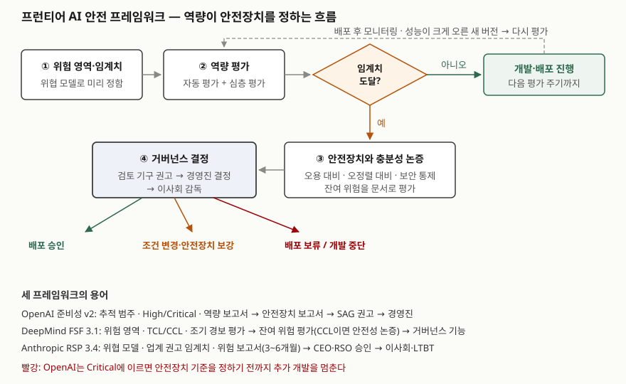

> 실행 검증 없음. 세 개발사가 공개한 프레임워크 원문과 인공지능 기본법 조문만 근거로 정리했다.
> 세 문서는 각 회사의 **자율 규약**이고 자주 개정된다. 이 글은 위 버전 기준이며, 각 문서의 개정
> 이력에 적힌 변경만 옮겼다. 회사가 실제로 그 절차를 지켰는지는 이 글의 범위가 아니다.

## 들어가며

AI 보안 문항에서 "대응 방안"을 쓸 때 거부 학습이나 모니터링 같은 개별 기술만 나열하면 깊이가
부족하다. 그 기술들을 **언제, 어느 수준으로 적용할지 정하는 상위 구조**가 프런티어 AI 안전
프레임워크이고, 주요 개발사가 이것을 공개해 두었다. 실무에서는 외부 모델을 업무에 붙이는
조직이 그 모델의 위험 수준을 판단할 때 이 문서들과 시스템 카드·위험 보고서를 읽게 된다.
인공지능 기본법의 안전성 확보 의무도 같은 구조의 의무를 사업자에게 지운다.

## 정의

**프런티어 AI 안전 프레임워크**: 개발사가 심각한 피해로 이어질 수 있는 **역량 수준(임계치)을 미리
정하고**, 모델이 그 수준에 이르렀는지 평가해, 그에 맞는 **안전장치가 충분하다고 판단될 때만**
개발과 배포를 진행하도록 정한 자율 규약이다.

Google DeepMind FSF 3.1은 개요에서 이런 프레임워크의 핵심 구성을 4가지로 든다.

1. 추가 완화 없이는 심각한 위험이 될 수 있는 역량 수준을 정한다
2. 모델 수명주기 전반에서 그 수준 도달을 탐지하는 절차를 둔다
3. 그 수준에 이르렀을 때 위험을 충분히 줄일 완화 계획을 미리 세운다
4. 필요하거나 적절하면 외부 당사자를 참여시킨다

세 문서는 이름이 다르다. OpenAI는 준비성 프레임워크(Preparedness Framework), DeepMind는 프런티어
안전 프레임워크(Frontier Safety Framework), Anthropic은 책임 있는 확장 정책(Responsible Scaling
Policy)이라 부른다. 다루는 위험의 크기도 정해 둔다. OpenAI는 **수천 명의 사망·중상 또는 수천억
달러의 경제 피해**를 심각한 피해로 정의한다.

## 등장 배경

배포한 서비스에서 생긴 사고를 보고 대책을 고치는 방식은 **겪어 본 피해**에만 통한다. OpenAI는 과거
배포 경험이 기존 위험을 아는 중요한 정보원이지만, 새로운 종류의 심각한 피해에는 **한 번도 실현된
적 없는 피해**를 줄일 안전장치가 필요하다고 적는다. 생물 무기나 대규모 사이버 공격처럼 일어나는
순간 되돌릴 수 없는 피해가 그런 예다. OpenAI가 추적 범주를 고르는 기준에 "즉각적이거나 회복
불가능한" 피해를 넣은 이유다. 그래서 **"이 역량에 이르면 이 안전장치를 갖춘다"를 미리 공약하고,
개발 중에도 역량을 재는** 방식이 나왔다.

OpenAI는 v2 개정 이유로, 지금까지는 모델의 한계 자체가 안전의 근거였지만 곧 심각한 위험을 낼 수
있는 시스템이 나오므로 **믿고 쓸 안전장치를 계획해야 한다**는 점과, 배포 주기가 빨라져 **확장 가능한
평가**가 필요하다는 점을 든다.

## 구성요소 / 절차

세 문서의 공통 흐름은 **4단계**다.

| 단계 | 하는 일 | OpenAI 준비성 v2 | DeepMind FSF 3.1 | Anthropic RSP 3.4 |
|---|---|---|---|---|
| ① 위험 영역·임계치 정의 | 위협 모델로 피해 경로를 찾고 임계치를 정한다 | 추적 범주 3가지(생물·화학, 사이버 보안, AI 자기 개선), 임계치 High·Critical | 오용 3영역(CBRN, 사이버, 유해 조작) + ML R&D·오정렬, 임계치 CCL·TCL | 임계치 4행(기존 화생 무기, 신규 화생 무기, 고위험 환경의 오정렬 AI, 핵심 분야 R&D 자동화) |
| ② 역량 평가 | 위협 행위자가 끌어낼 수 있는 최대 역량을 잰다 | 자동 평가(지표 임계치) + 심층 평가(레드팀·외부 평가) | 조기 경보 평가, CCL마다 경보 임계치 | 위험 보고서의 증거로 역량·정렬 평가 |
| ③ 안전장치·충분성 논증 | 남은 위험이 받아들일 만한지 문서로 따진다 | 안전장치 보고서 — 오용 대비·오정렬 대비 주장 | 잔여 위험 평가, CCL이면 안전성 논증(safety case) | 업계 권고의 "강한 논증"과 회사 계획을 함께 보고 |
| ④ 거버넌스 결정 | 누가 승인하고 누가 감독하는가 | 안전 자문 그룹(SAG) 권고 → 경영진 결정 → 이사회 안전보안위원회 감독 | 적절한 거버넌스 기능이 잔여 위험을 수용해야 외부 배포 | CEO·RSO 승인 → 이사회·LTBT 공유, 한계 위험 논리가 크면 이사회·LTBT 승인 |

OpenAI가 어떤 역량을 **추적 범주**로 삼는 기준은 5가지다. 인과 경로가 그럴듯하고(plausible),
측정 가능하고(measurable), 심각하고(severe), 프런티어 AI 없이는 불가능한 새로운 것이며(net new),
즉각적이거나 회복 불가능해야(instantaneous or irremediable) 한다. 기준에 못 미치지만 대비가 필요한
5가지(장기 자율성, 평가 회피, 자율 복제·적응, 안전장치 훼손, 핵·방사능)는 **연구 범주**로 둔다.

DeepMind는 위험 관리를 **5단계**로 쓴다. 위험 식별 → 고유 위험 평가 → 위험 완화 → 잔여 위험 평가 →
위험 수용 결정 순이다. CCL이 심각한(severe) 피해의 임계치라면, 3.1판이 새로 둔
**TCL(Tracked Capability Level)** 은 그보다 낮은 역량에서 나타나는 상당한(significant) 위험을 잡는다.
TCL에도 같은 완화·수용 절차를 쓰되 위험 수준에 비례해 적용한다.

Anthropic의 3판은 **4가지 요소**로 다시 짜였다. 업계 전체를 위한 권고 표, 프런티어 안전 로드맵, 위험
보고서(3~6개월마다 공개, 외부 검토), 거버넌스다. 2판까지 쓰던 **AI 안전 수준(ASL)** 별 통제 목록은
현재 적용 중인 안전장치를 가리키는 데만 쓰고, 미래 수준에 대해서는 정해진 통제 목록 대신 **어떤
논증을 내야 하는지**를 적는 쪽으로 바꿨다(부록 B).

## 도식

> **출처**: [OpenAI Preparedness Framework v2 (2025-04-15) — §3.3 Capability threshold determinations, §4.2 Safeguard sufficiency](https://cdn.openai.com/pdf/18a02b5d-6b67-4cec-ab64-68cdfbddebcd/preparedness-framework-v2.pdf) · [Google DeepMind Frontier Safety Framework 3.1 — §1.3 Risk Management Process](https://storage.googleapis.com/deepmind-media/DeepMind.com/Blog/strengthening-our-frontier-safety-framework/frontier-safety-framework_3-1.pdf) · [Anthropic Responsible Scaling Policy 3.4 — §1 Recommendations for Industry-Wide Safety, §3.4 Procedures](https://www.anthropic.com/responsible-scaling-policy)

답안지에는 "위험 영역 → 역량 평가 → 임계치? → 안전장치 논증 → 거버넌스 결정" 한 줄과 결정 결과
세 갈래(승인·조건 변경·보류)를 그린다. 핵심은 **역량이 안전장치의 수준을 정한다**는 화살표 하나다.

## 비교

### 세 프레임워크의 대비

| 비교 항목 | OpenAI 준비성 v2 | DeepMind FSF 3.1 | Anthropic RSP 3.4 |
|---|---|---|---|
| 임계치 단계 | 2단계 (High, Critical) | 2단계 (TCL, CCL) | 위협별 임계치, 단계 구분 없음 |
| 상위 임계치의 효과 | Critical이면 안전장치 기준을 정하기 전까지 **추가 개발 중단** | CCL이면 외부 배포 전 안전성 논증 검토 | 업계 권고의 강한 논증 요구, 단독 공약은 하지 않음 |
| 내부 배포 | 사이버 High면 대규모 내부 배치에 오정렬 안전장치 요구 | ML R&D CCL은 고위험 내부 배치도 수용 판단 대상 | 대규모 완전 자율 연구에 쓰는 내부 모델은 위험 보고서 대상 |
| 결과 문서 | 역량 보고서, 안전장치 보고서 | 잔여 위험 평가, 안전성 논증 | 위험 보고서, 프런티어 안전 로드맵 |
| 외부 참여 | 제3자 평가·안전장치 스트레스 시험(조건부) | 필요하면 외부 전문가 | 위험 보고서 외부 검토(조건 충족 시 의무) |
| 경쟁사 조항 | 다른 개발사가 안전장치 없이 출시하면 조정 가능, 단 3조건 | 업계 전체가 채택해야 효과가 있는 완화가 있다고 명시 | 업계 권고와 회사 계획을 분리, 경쟁 상황별 공약 3가지(부록 A) |

마지막 줄이 세 문서의 공통 고민이다. 한 회사만 안전장치를 갖추면 위험은 가장 약한 개발사가 정한다.
OpenAI는 조정의 조건으로 **전체 위험을 의미 있게 늘리지 않을 것, 공개적으로 밝힐 것, 상대보다 더
보호적인 수준을 유지할 것** 3가지를 건다. Anthropic은 3판에서 업계 권고를 단독으로 지키겠다고
공약할 수 없다고 밝히고, 대신 자사가 앞선 경우·경쟁사가 강한 안전장치를 갖춘 경우·경쟁사가 더 나은
완화를 쓰는 경우의 공약을 따로 둔다.

### 안전장치가 겨누는 두 경로

OpenAI는 위험이 실현되는 주된 경로를 **악의적 사용자**와 **오정렬 모델** 2가지로 나누고 각각의
충분성 주장을 둔다. 오용 대비는 견고성·사용 모니터링·신뢰 기반 접근 3가지, 오정렬 대비는 자율 역량
부재·가치 정렬·지시 정렬·시스템 감독·시스템 구조 5가지다. DeepMind가 오용 CCL과 ML R&D·오정렬
CCL을 나누고, Anthropic이 무기 제조 임계치와 오정렬 AI 임계치를 따로 둔 것도 같은 구분이다.

## 적용 시 고려사항

- **한 번의 평가는 하한이다.** OpenAI는 일회성 역량 측정을 실제 사용에서 나올 역량의 **상한이 아니라
  하한**으로 본다고 적는다. 도입 조직도 공개된 평가 점수를 "이 이상은 못 한다"로 읽지 말고, 도구·
  스캐폴딩을 붙이면 역량이 더 나온다는 전제로 권한을 설계한다.
- **평가 자체를 속일 수 있다.** OpenAI는 평가 회피(sandbagging)를 연구 범주로 두고, 극복할 수 없으면
  보수적 상한을 쓰라고 정한다. Anthropic은 외부 검토자의 요건으로 정렬 위장 같은 **평가가 오도되는
  방식**을 알 것을 든다. 평가 결과만으로 안전을 주장하지 말고 감시·권한 제한을 겹쳐야 한다.
- **자율 규약이라 강제력은 법이 준다.** 세 문서 모두 회사가 스스로 개정한다. 인공지능 기본법
  제32조는 학습 누적 연산량이 대통령령 기준 이상인 AI 시스템의 사업자에게 **수명주기 전반의 위험
  식별·평가·완화**와 **안전사고 모니터링·대응 위험관리체계 구축**을 요구하고, 이행 결과를
  과학기술정보통신부 장관에게 내게 한다. 시행령 입법예고안(2025-11)은 기준을 10²⁶ 부동소수점
  연산으로 잡았다.
- **내부 배포도 위험이다.** 세 문서 모두 외부 출시 전만 보지 않는다. 자동화된 AI 연구처럼 회사 안에서
  쓰는 모델도 오정렬·사보타주 경로가 되므로 평가와 승인 대상에 넣었다. 조직 안의 에이전트 도입에도
  같은 판단이 필요하다.

## 정리

- **정의 1줄**: 역량 임계치를 미리 정하고, 넘으면 충분한 안전장치가 입증될 때까지 배포(필요하면 개발)를 멈추는 자율 규약.
- **공통 4단계 — 정의·평가·논증·결정**: 위험 영역·임계치 → 역량 평가 → 안전장치 충분성 논증 → 거버넌스 결정.
- **숫자로 외울 것**: OpenAI 추적 범주 3·연구 범주 5·임계치 2(High·Critical)·추적 기준 5·오용 주장 3·오정렬 주장 5. DeepMind 위험 관리 5단계, 임계치 2(TCL·CCL). Anthropic 3판 구성 4, 임계치 4행, 위험 보고서 3~6개월.
- **안전장치의 두 과녁**: 악의적 사용자와 오정렬 모델.
- **공통 난제**: 평가는 하한이고 속을 수 있으며, 한 회사의 안전장치는 경쟁사가 없으면 효과가 줄어든다. 제도화가 법(인공지능 기본법 제32조)으로 이어지는 이유다.

> 기출 답안: [기출문제 — AI 보안: 사이버 공격 지원 위협과 자율성에 따른 통제 상실](../../exam/2026-10-01-ai-security-cyber-offense-loss-of-control/index.md)

## 참고 자료

- [OpenAI, Preparedness Framework Version 2 (2025-04-15)](https://cdn.openai.com/pdf/18a02b5d-6b67-4cec-ab64-68cdfbddebcd/preparedness-framework-v2.pdf) — §2.1 추적 범주 기준 5가지, §2.2 Table 1, §2.3 Table 2, §3.1 평가 방식, §3.3 임계치 판정, §4.2 Table 3, §4.3 Marginal risk, §5 Building trust
- [Google DeepMind, Frontier Safety Framework 3.1 (2026-04-17)](https://storage.googleapis.com/deepmind-media/DeepMind.com/Blog/strengthening-our-frontier-safety-framework/frontier-safety-framework_3-1.pdf) — Overview 핵심 구성 4가지, §1.2 CCL·TCL, §1.3.1~1.3.5 위험 관리 절차
- [Google DeepMind, Strengthening our Frontier Safety Framework (2025-09-22, 2026-04-17 갱신)](https://deepmind.google/blog/strengthening-our-frontier-safety-framework/)
- [Anthropic, Responsible Scaling Policy Version 3.4 (2026-07-08)](https://www.anthropic.com/responsible-scaling-policy) — §1 업계 권고 표, §2 Frontier Safety Roadmap, §3 Risk Reports, §4 Governance, 부록 A·B, 개정 이력
- [국가법령정보센터, 인공지능 발전과 신뢰 기반 조성 등에 관한 기본법 (법률 제20676호, 2026-01-22 시행) — 제32조 인공지능 안전성 확보 의무](https://www.law.go.kr/법령/인공지능발전과신뢰기반조성등에관한기본법)
- [법제처, 인공지능 발전과 신뢰 기반 조성 등에 관한 기본법 시행령 제정안 입법예고 (2025-11-12 ~ 2025-12-22)](https://www.moleg.go.kr/lawinfo/makingInfo.mo?lawSeq=84360&lawCd=0&lawType=TYPE5&mid=a10104010000)
