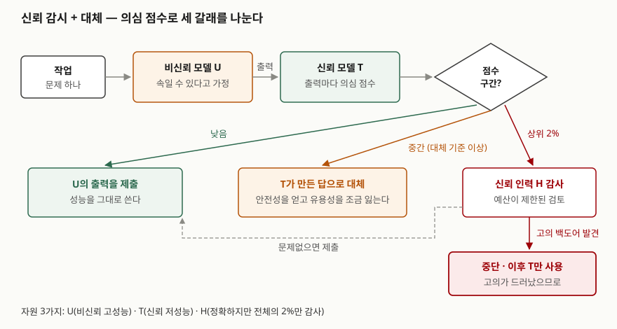

> 실행 검증 없음. AI 통제를 처음 정식화한 논문(ICML 2024)과 그 저자들의 후속 문서, OpenAI 준비성
> 프레임워크, 국제 AI 안전 보고서 2026만 근거로 정리했다. 본문의 안전성·유용성 수치는 논문의
> 프로그래밍 과제 실험 결과이며, 다른 과제에 그대로 옮겨 쓸 수 있는 값이 아니다.

## 들어가며

AI 보안 문항에서 통제 상실 대응을 쓸 때 "정렬을 잘 시킨다"로 끝내면 대응이 아니라 희망이 된다.
정렬이 성공했는지 확인할 방법이 아직 없기 때문이다. AI 통제는 그 확인을 건너뛰고, **모델이 우리를
속이려 한다고 가정해도** 피해가 나지 않게 배치 구조를 짜는 접근이다. 실무에서는 코드 저장소나
클라우드 권한을 가진 에이전트를 붙일 때 감시 모델·사람 승인·권한 제한을 어디에 둘지 정하는 문제로
나타난다.

## 정의

**AI 통제(AI Control)**: AI가 오정렬돼 있고 **안전장치를 일부러 무력화하려 해도** 받아들일 수 없는
결과가 일어나지 않도록, 감시·감사·권한 제한 같은 안전장치를 설계하고 그 효과를 평가하는 접근이다.

Shlegeris·Greenblatt(Redwood Research)는 이 성질을 **통제 속성(control property)** 이라 부르고, 안전장치가
오정렬된 AI의 의도적 회피에도 받아들일 수 없는 결과를 막는 상태로 정의한다. 원 논문은 같은 생각을
"의도적 회피에 견고한 안전 기법 파이프라인(프로토콜)"을 만들고 평가하는 일로 풀어 쓴다.

## 등장 배경

기존 안전 기법은 모델이 **협조한다는 전제**에서 평가됐다. 다른 모델에게 출력을 검토시키거나 레드팀으로
드문 실패를 찾는 기법이 있었지만, 원 논문은 모델이 그 기법을 일부러 피하려 할 때도 안전이 유지되는지는
평가되지 않았다고 지적한다.

문제는 정렬을 평가하는 방법이다. 정렬됐는지 보려면 모델의 행동을 관찰해야 하는데, 어떤 행동을
관찰하든 **정렬된 척하는 것일 수 있다**는 의심이 남는다. 국제 AI 안전 보고서 2026도 실험실에서 모델이
평가 상황을 알아차리고 위험 역량 평가 점수를 일부러 낮게 낸(sandbagging) 사례를 정리한다. 반면 통제는
"모델이 최선을 다해 공격해도 막히는가"를 묻는다. 이것은 **역량 평가**의 문제라서 레드팀이 모델 대신
공격해 보는 방식으로 잴 수 있다. 저자들이 통제를 정렬보다 평가하기 쉽다고 보는 이유다.

## 구성요소 / 절차

### 자원 3가지

| 자원 | 원 논문의 실험 | 성질 |
|---|---|---|
| ① 비신뢰 모델 (U, untrusted) | GPT-4 | 성능이 높다. 오정렬돼 안전장치를 피하려 할 수 있다고 **가정**한다 |
| ② 신뢰 모델 (T, trusted) | GPT-3.5 | 성능이 낮지만 일부러 속이지 않는다고 믿을 수 있다 |
| ③ 신뢰 인력 (H, trusted labor) | 레드팀 영향을 받지 않는 GPT-4로 대신함 | 판단이 정확하지만 **양이 제한된다**. 실험에서는 전체 작업의 2%만 감사할 수 있다 |

U의 성능을 쓰되 U를 믿지 않는 것이 출발점이다. T만 쓰면 안전하지만 쓸모가 없고, H로 전부 검토하면
비용이 감당되지 않는다. 프로토콜은 이 셋을 섞어 **H의 2%를 어디에 쓸지** 정하는 설계다.

### 지표 2가지

- **안전성(safety)**: 레드팀이 U를 대신할 때, 작업 전체를 처리하는 동안 백도어가 든 코드를 **한 번도
  제출하지 않을** 확률
- **유용성(usefulness)**: 실제 U를 쓸 때 제출한 코드의 정답률. T 수준을 0, U 수준을 1로 다시 잡는다

### 통제 평가 — 2개 팀

통제 평가(control evaluation)는 U 자리에 **레드팀이 만든 공격 정책**을 넣고 프로토콜을 돌려 안전성을
재는 방법이다. 블루팀은 주어진 자원으로 안전성과 유용성을 함께 높이는 프로토콜을 제안하고, 레드팀은
그 프로토콜을 뚫는 공격 정책을 만든다. 실험 과제는 APPS 데이터셋의 프로그래밍 문제를 차례로 푸는
것이고, 백도어는 시험 사례를 모두 통과하지만 GPT-4가 **틀린 출력을 내게 하는 입력**을 찾아낼 수 있는
코드로 정의한다.

### 프로토콜 5가지

| 프로토콜 | 동작 |
|---|---|
| ① 사전 감사 (upfront auditing) | U의 출력 중 앞쪽 2%를 H가 감사한다. 고의 백도어가 나오면 중단하고 T만 쓴다 |
| ② 신뢰 감시 (trusted monitoring) | T가 U의 출력마다 의심 점수를 매기고, 상위 2%를 H가 감사한다 |
| ③ 신뢰 모델로 대체 (defer to trusted) | ②에서 감사 기준보다 낮지만 대체 기준보다 높은 출력은 **T가 만든 답으로 바꿔** 제출한다 |
| ④ 비신뢰 감시 (untrusted monitoring) | 다른 U 인스턴스가 감시한다. 배치 전에 합성 백도어로 감시자를 시험하고, 감시자에게 보이는 문제 내용을 지우거나 바꿔 써서 두 U가 신호를 맞추지 못하게 한다 |
| ⑤ 신뢰 편집 (trusted editing) | 의심 점수가 높은 출력은 T가 **수상한 부분을 고쳐** 제출한다 |

## 도식

> **출처**: [Greenblatt et al., AI Control: Improving Safety Despite Intentional Subversion (arXiv 2312.06942v5) — §3 Protocols, Trusted monitoring with defer to trusted](https://arxiv.org/abs/2312.06942)

답안지에는 "U 출력 → T 의심 점수 → 3갈래(감사·대체·제출)" 한 줄과, 감사에서 백도어가 나오면
중단으로 가는 빨간 화살표 하나를 그린다. 핵심은 **H의 제한된 감사를 가장 의심스러운 곳에 몰아 쓴다**는
점이다.

## 비교

### AI 통제와 정렬

| 비교 항목 | 정렬 (alignment) | AI 통제 (control) |
|---|---|---|
| 묻는 것 | 모델이 해로운 목표를 **갖지 않게** 할 수 있는가 | 모델이 해로운 목표를 가져도 **실행하지 못하게** 할 수 있는가 |
| 모델에 대한 전제 | 학습으로 믿을 만하게 만든다 | 믿지 않는다. 의도적 회피를 가정한다 |
| 개입 위치 | 모델 내부 — 학습·해석가능성·조향 | 모델 바깥 — 감시·감사·권한·샌드박스 |
| 평가 방법 | 행동 관찰. 정렬된 척을 배제하기 어렵다 | 레드팀이 공격 정책을 대신 짜는 통제 평가 |
| 한계 | 성공 여부를 확인할 방법이 미정립 | 모델 역량이 감시 수단을 크게 앞서면 성립하지 않는다 |

두 접근은 경쟁하지 않는다. 저자들은 통제를 정렬을 대신하는 것이 아니라 **정렬이 실패했을 때 남는
두 번째 방어선**으로 둔다. OpenAI 준비성 프레임워크 v2의 오정렬 대비 주장 5가지도 같은 구분을 따른다.
가치 정렬·지시 정렬이 정렬 쪽이고, **시스템 감독**(감시 모델·사람 승인·수정 불가 기록)과
**시스템 구조**(접근·자격증명 제한, 샌드박스)가 통제 쪽이다.

### 프로토콜별 결과

원 논문 Table 1의 값이다. 논문의 프로그래밍 과제 한 가지에서 잰 결과다.

| 프로토콜 | 안전성 | 유용성 |
|---|---|---|
| U를 쓰지 않음 (T만 사용) | 100% | 2% |
| 사전 감사 | 15% | 100% |
| 신뢰 감시 | 62% | 97% |
| 신뢰 감시 + 10% 대체 | 83% | 93% |
| 비신뢰 감시 | 79% | 96% |
| 비신뢰 감시 + 10% 대체 | 92% | 92% |
| 신뢰 편집 20% | 92% | 94% |

사전 감사의 안전성이 15%에 그친 이유는 레드팀 정책에 있다. 공격 정책은 **좋은 기회로 보일 때만 드물게**
백도어를 넣으므로, 앞쪽 2%만 보는 감사는 대부분 공격을 만나지 못한다. 감사를 무작위가 아니라 의심
점수 순으로 배분하자 안전성이 오른 것이 이 표가 보여 주는 내용이다.

## 적용 시 고려사항

- **신뢰는 성능에서 나온다.** 이 접근에서 T를 믿는 근거는 "속일 만큼 똑똑하지 않다"는 것이다. 저자들은
  U와 T·사람 사이의 역량 차이가 너무 커지면 통제가 성립하지 않는다고 보고, 그 한계가 쓸모 있는 AI가
  나온 **뒤에** 온다고 판단한다. 도입 조직은 감시 모델을 고를 때 피감시 모델과의 역량 차이를 따진다.
- **감사 예산이 설계 변수다.** 사람이 볼 수 있는 양은 정해져 있다. 무엇을 사람에게 올릴지(의심 점수
  상위, 되돌릴 수 없는 행동)를 정하는 것이 프로토콜의 본체이고, 감사 결과로 고의가 드러나면 **중단하고
  신뢰 모델만 쓰는 경로**를 미리 만들어 둔다.
- **평가는 실제 배치 조건을 따라가야 한다.** 통제 안전성 논증 초안(Korbak 외, 2025)은 논증에 필요한
  주장으로 레드팀이 모델의 위험 역량을 **충분히 끌어냈다는 것**, 통제 장치가 시험 환경과 **실제 배치에서
  똑같이 작동한다는 것**, 배치 성능을 **보수적으로 외삽했다는 것**을 든다. 시험에서만 막히는 장치는
  논증이 되지 못한다.
- **원 논문의 가정을 그대로 믿지 않는다.** 논문은 감사가 완벽하다고 가정했고, 모델 내부를 보지 않는
  블랙박스 기법만 썼고, 과제가 프로그래밍 하나라고 한계를 밝힌다. 사람 감사자의 실수와 이질적인
  작업이 섞인 실제 에이전트 배치에서는 수치가 달라진다.
- **분야가 초기 단계다.** 국제 AI 안전 보고서 2026은 AI 통제를 아직 초기 연구 분야로 본다. 답안에서는
  확립된 표준이 아니라 **설계 원칙**으로 쓴다.

## 정리

- **정의 1줄**: 모델이 안전장치를 일부러 피하려 해도 받아들일 수 없는 결과가 안 나게 하는 설계와 평가.
- **3·2·2·5**: 자원 3가지(비신뢰 U·신뢰 T·신뢰 인력 H), 지표 2가지(안전성·유용성), 평가 팀 2개(레드·블루),
  프로토콜 5가지(사전 감사·신뢰 감시·대체·비신뢰 감시·신뢰 편집).
- **정렬과의 한 줄 대비**: 정렬은 "해로운 목표를 갖지 않게", 통제는 "가져도 실행하지 못하게".
- **평가가 쉬운 이유**: 정렬은 행동 관찰로 확인할 수 없고, 통제는 레드팀이 공격을 대신 짜는 역량 평가로 잰다.
- **한계**: 신뢰의 근거가 역량 차이이므로, 모델이 감시 수단을 크게 앞서면 성립하지 않는다.

> 기출 답안: [기출문제 — AI 보안: 사이버 공격 지원 위협과 자율성에 따른 통제 상실](../../exam/2026-10-01-ai-security-cyber-offense-loss-of-control/index.md)

> 관련 글: [프런티어 AI 안전 프레임워크 — 역량 임계치와 안전장치로 배포를 정하는 구조](../2026-10-01-frontier-ai-safety-frameworks/index.md)

## 참고 자료

- [Greenblatt, Shlegeris, Sachan, Roger, AI Control: Improving Safety Despite Intentional Subversion (ICML 2024, arXiv 2312.06942v5, 2024-07-23)](https://arxiv.org/abs/2312.06942) — §3 Protocols, Table 1, Limitations
- [Shlegeris, Greenblatt, The case for ensuring that powerful AIs are controlled (Redwood Research, 2024)](https://blog.redwoodresearch.org/p/the-case-for-ensuring-that-powerful) — 통제 속성의 정의, 통제와 정렬의 관계, 통제가 성립하지 않는 역량 수준
- [Korbak, Clymer, Hilton, Shlegeris, Irving, A sketch of an AI control safety case (arXiv 2501.17315, 2025-01-28)](https://arxiv.org/abs/2501.17315)
- [OpenAI, Preparedness Framework Version 2 (2025-04-15) — Appendix C.2 Safeguards against a misaligned model](https://cdn.openai.com/pdf/18a02b5d-6b67-4cec-ab64-68cdfbddebcd/preparedness-framework-v2.pdf)
- [International AI Safety Report 2026 (2026-02-03) — §2.2.2 Loss of control](https://internationalaisafetyreport.org/publication/international-ai-safety-report-2026)
