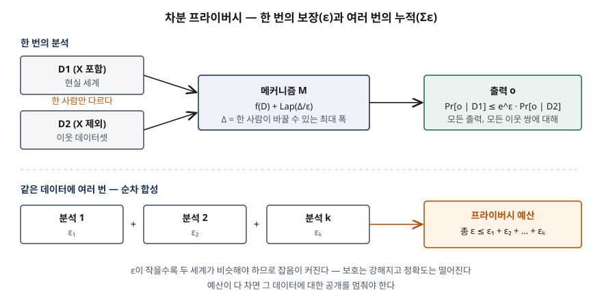

## 들어가며

합성데이터·개인정보 보호 강화 기술(PET) 문제에서 차분 프라이버시는 "잡음을 넣는 기법"으로만 쓰면 점수가 붙지 않는다.
보장이 **ε과 프라이버시 단위 두 요소**로 정해지고, ε이 분석마다 **더해진다**는 것까지 써야 한다.
실무에서는 통계 공개나 모델 학습에 차분 프라이버시를 쓴다는 주장을 받았을 때, 그 보장이 실제로 얼마나 강한지 판정하는 데 쓰인다.

> 계산으로 확인할 수 있는 주제이므로 라플라스 메커니즘의 식을 직접 돌려 검산했다. 수행 기록은
> [code/output.txt](code/output.txt)에 있다. NIST SP 800-226은 직접 구현하지 말고 검증된 라이브러리를 쓰라고 권하므로,
> 이 코드는 수치 확인용이다.

## 정의

- **순수 ε-차분 프라이버시 (NIST SP 800-226 2.1.1절, Dwork 2006)**: 무작위 메커니즘 M이 한 사람의 데이터만 다른
  모든 이웃 데이터셋 D1·D2와 모든 출력 집합 S에 대해 `Pr[M(D1) ∈ S] ≤ e^ε · Pr[M(D2) ∈ S]`를 만족하면 ε-차분 프라이버시를 만족한다.
- **(ε, δ)-차분 프라이버시 (같은 문서 부록 B.1)**: 위 부등식 우변에 `+ δ`를 더한 정의. δ만큼의 확률로 보장이 깨지는 것을 허용한다.

NIST는 이를 "어떤 결과가 나올 확률이 그 사람이 데이터를 냈든 안 냈든 거의 같다"로 풀어 쓴다. ε을
**프라이버시 매개변수·프라이버시 손실·프라이버시 예산**이라 부른다.

답안 첫 줄에는 "차분 프라이버시는 데이터셋에서 한 사람을 넣거나 빼도 분석 결과의 확률분포가 e^ε 배 이상 달라지지 않도록
잡음을 더해, 개인이 입는 프라이버시 손실의 상한을 ε으로 수량화하는 수학적 정의다"로 쓸 수 있다.

## 등장 배경

NIST SP 800-226은 이전 방식의 한계를 두 가지로 든다(1.1절).

- **비식별 처리는 연결 공격에 약하다.** 어느 속성이 식별 정보인지 가려내기 어렵고, 속성이 쌓이면 조합이 유일해진다.
  성별·우편번호·생년월일로 비식별 의료 기록에서 개인을 다시 찾아낸 1997년 사례가 대표적이다.
- **집계 통계도 새어 나간다.** 통계를 충분히 많이 공개하면 원래 레코드를 복원하는 재구성 공격이 가능하다는 수학적 결과가 있다.

두 방식 모두 "이 처리가 얼마나 안전한가"를 수치로 말할 수 없었다. 차분 프라이버시는 기법이 아니라 **정의**이고,
정의를 만족하는 메커니즘이면 손실의 상한이 ε으로 정해진다는 점이 다르다.

## 구성요소

### 보장을 정하는 2요소 (2.1.1절)

| 요소 | 무엇 | 약해지는 경우 |
|---|---|---|
| ① **프라이버시 매개변수 ε** (δ 포함) | 두 세계(그 사람이 있는 세계·없는 세계)가 얼마나 비슷해야 하는가 | ε이 크면 두 세계가 멀어도 된다 |
| ② **프라이버시 단위** | "한 사람의 데이터"를 무엇으로 볼 것인가 = 이웃 데이터셋의 정의 | 이벤트(행) 단위면 사람이 아니라 거래 한 건만 보호된다 |

ε이 같아도 단위가 다르면 두 보장을 비교할 수 없다(2.5절). NIST는 사용자 단위를 기본값으로 권한다(2.4절).

### 성질 5가지 (2.1.2절)

① 모든 정보를 식별 정보로 취급한다 ② 보조 데이터를 이용한 공격에 견딘다 ③ **합성** — 여러 공개의 누적 손실을 더해서 상한을
잡을 수 있다 ④ **후처리 불변** — 결과를 어떻게 가공해도 보장이 풀리지 않는다 ⑤ **그룹 프라이버시** — 여러 사람에게도 더 약한
보장이 성립한다. NIST는 ①~③이 정의에서 바로 증명된다고 적는다.

### 기본 메커니즘 2가지 (3.1절, 부록 B.2)

**민감도** Δ는 한 단위(한 사람)가 바뀔 때 질의 결과가 바뀔 수 있는 최대 폭이다. 개수 질의는 Δ = 1이다(부록 B.3).

| 메커니즘 | 잡음 | 민감도 | 보장 | 유리한 경우 |
|---|---|---|---|---|
| **라플라스** | 라플라스 분포, 척도 `Δ1/ε` | L1 | 순수 ε-DP | 출력 차원이 낮은 질의 |
| **가우시안** | 정규분포, 분산 σ² | L2 | (ε, δ)-DP 등. 순수 ε-DP는 아니다 | 여러 값을 동시에 내는 고차원 질의 |

## 도식



> **출처**: [NIST SP 800-226 (2025-03) §2.1.1 The Math of Differential Privacy, §2.2 The Privacy Parameter ε, Appendix B.2 Definitions of Sensitivity and Basic Mechanisms](https://doi.org/10.6028/NIST.SP.800-226)

답안지에는 위에 D1·D2 → M → 출력과 부등식을, 아래에 분석 상자 셋과 "총 ε ≤ Σεᵢ"를 쓴다.

### 계산으로 본 ε

`[2]`는 참값 632와 633인 이웃 데이터셋에서 ε = 1 라플라스 메커니즘이 같은 출력을 낼 확률밀도와 그 비다.

```text
  출력 o | p(o|D1)  | p(o|D2)  | 비 p1/p2 | e^ε
   628.0 | 0.009158 | 0.003369 |   2.7183 | 2.7183
   632.0 | 0.500000 | 0.183940 |   2.7183 | 2.7183
   632.5 | 0.303265 | 0.303265 |   1.0000 | 2.7183
   633.0 | 0.183940 | 0.500000 |   0.3679 | 2.7183
   637.0 | 0.003369 | 0.009158 |   0.3679 | 2.7183
```

비는 어느 출력에서도 `e^1 = 2.7183`과 `e^-1 = 0.3679` 사이에 있다. 출력을 본 공격자는 "그 사람이 있는 쪽"의 가능성을 최대
e^ε 배까지만 올려 잡을 수 있다. NIST가 2.3절에서 드는 가설검정 해석이 이것이다. ε-DP에서 공격자의 오류율은
`Pr[거짓 양성] + e^ε · Pr[거짓 음성] ≥ 1`을 따르므로, ε = 1일 때 거짓 양성을 5%로 묶으면 거짓 음성은 `0.95 / 2.7183 ≈ 0.35` 아래로 내려갈 수 없다.

대가는 정확도다. `[1]`에서 척도 `b = Δ/ε`, 95% 오차 폭 `b·ln 20`을 보면 ε을 10배 줄일 때 오차 폭도 10배가 된다.

```text
     ε |     b |  95% 오차 폭 | 실측 95% 안 비율
   0.1 |  10.0 |       29.96 | 0.9500
   1.0 |   1.0 |        3.00 | 0.9478
  10.0 |   0.1 |        0.30 | 0.9482
```

(표는 `[1]`의 다섯 줄 중 세 줄이다.) 실측 비율은 20,000회 표집에서 잡음이 이론 오차 폭 안에 든 비율로, 0.95 근처에 있다.

## 비교

### 누적 손실 — 같은 ε이 다른 보장이 되는 경우

| 경우 | 계산 | 총 ε | 출처 |
|---|---|---|---|
| ε = 0.1 분석 10회 | 0.1 × 10 | 1 | NIST SP 800-226 2.2절 |
| ε = 1 공개를 한 번 더 | 1 + 1 | 2 | 같은 절 |
| 사용자-일 단위 ε = 1을 1년 | 1 × 365 | 365 | 같은 문서 2.4.2절 |
| 사람당 기여를 k = 20건으로 묶은 사용자 단위 | Δ = 20, ε = 1 | 1 (단, 95% 오차 폭 3.00 → 59.91) | 같은 문서 2.4.2절, `[4]` |

마지막 두 줄이 프라이버시 단위의 문제다. 사용자-일 단위 ε = 1은 작아 보이지만 1년이면 365가 된다. 반대로 사람 단위를
지키려고 기여 상한 k를 두면 민감도가 k배가 되어 같은 ε에서 잡음이 k배로 커진다.

### 중앙 모델과 지역 모델 (4.2절)

| 구분 | 중앙 모델 | 지역 모델 |
|---|---|---|
| 잡음을 넣는 곳 | 신뢰하는 큐레이터가 결과에 | 각 개인이 자기 데이터에 |
| 신뢰 가정 | 데이터 주체·큐레이터 신뢰, 소비자 불신 | 데이터 주체만 신뢰 |
| 정확도 | 차분 프라이버시가 허용하는 최대 | 더 많은 잡음이 필요 |
| 무너지는 경우 | 큐레이터가 원본을 유출하면 보장이 의미를 잃는다 | 큐레이터 유출에도 원본은 없다 |

NIST는 신뢰 모델의 가정이 현실과 맞지 않으면 보장 자체가 의미를 잃는다고 적는다.

## 적용 시 고려사항 — 5가지

- **ε을 정하는 공식은 없다.** NIST는 구체 지침을 주지 않는다고 밝히고, 한 연구를 인용해 ε = 0.1은 대체로 강한 보호,
  1 미만은 합리적이라고 소개한다. 실제 배포는 1 < ε ≤ 20을 쓴 경우가 많고, ε이 10 이상이면 이상치가 노출될 수 있다는
  연구도 함께 든다. 쓴 매개변수는 **공개하라**고 권한다. 공개해도 추가 위험은 없다.
- **δ는 1/n² 이하로 둔다.** (ε, δ)-DP는 δ 확률로 한 사람의 데이터를 그대로 내보내도 정의를 만족할 수 있다.
  NIST는 δ ≤ 1/n²을 권하고 10⁻⁵를 넘는 값은 근거가 필요하다고 본다(2.3절).
- **예산을 질의에 나눠 쓰면 질의마다 정확도가 떨어진다.** `[5]`에서 총 ε = 1을 10개 질의에 나누면 질의당 95% 오차 폭이
  3.00에서 29.96이 된다. 합성데이터를 주변분포로 만들 때 2차원 주변분포는 칸이 많아져 칸마다 신호가 약해진다는 NIST의
  설명(3.6절)도 같은 원리다.
- **합성데이터에는 학습 단계에 건다.** 생성 모델을 DP-SGD 같은 차분 프라이버시 학습으로 만들면 후처리 불변성에 따라 생성된
  데이터도 차분 프라이버시를 만족한다(3.6절). 다만 NIST는 현재 딥러닝 기반 DP 합성의 품질이 주변분포 기반보다 크게 낮다고 적는다.
- **원본 저장은 별개 문제다.** 차분 프라이버시는 공개 결과를 보호할 뿐 수집·저장 중인 원본을 보호하지 않는다. 원본이
  유출되면 그 레코드에 대한 보장은 무효가 된다. 보안과 접근 통제가 피라미드의 맨 아래 층에 있는 이유다(요약의 4장 개관).

## 정리

- 정의: 이웃 데이터셋에서 출력 확률비 **≤ e^ε**. (ε, δ)는 δ만큼 깨짐을 허용.
- 보장 **2요소**: ε · 프라이버시 단위 → "**엡·단**". 단위는 사용자 단위가 기본.
- 성질 **5가지**: 식별정보 일괄 취급 · 보조 데이터 저항 · **합성** · **후처리 불변** · 그룹 프라이버시.
- 메커니즘 **2가지**: 라플라스(L1, 척도 Δ/ε, 순수 ε) · 가우시안(L2, (ε, δ)).
- 누적: 같은 데이터에 대한 분석의 ε은 **더한다** — 0.1 × 10 = 1, 사용자-일 1 × 365 = 365.
- 한 줄: **ε이 작을수록 보호는 강하고 결과는 부정확하다. 그리고 ε은 쓸수록 쌓인다.**

> 기출 답안: [기출문제 — 합성데이터의 개념과 생성 기법, 품질 평가 지표](../../exam/2026-10-03-synthetic-data-generation-quality-metrics/index.md) — 차분 프라이버시 합성을 비교표에 넣은 답안
>
> 관련 개념: [합성데이터 — 유용성과 안전성의 상충, 구별·연결·추론 위험도](../../data-analysis/2026-10-03-synthetic-data-utility-privacy-tradeoff/index.md) — 사후 측정 방식의 안전성 지표

## 참고 자료

- [NIST SP 800-226, Guidelines for Evaluating Differential Privacy Guarantees (2025-03)](https://doi.org/10.6028/NIST.SP.800-226) — §1.1 De-Identification and Re-Identification, §2.1.1 The Math of Differential Privacy, §2.1.2 Properties, §2.2 The Privacy Parameter ε, §2.3 Variants, §2.4 The Unit of Privacy, §3.1 Basic Mechanisms, §3.6 Synthetic Data, §4.2 Trust Models, §4.4 Data Security and Access Control, Appendix B.1–B.3
- C. Dwork, Differential Privacy, ICALP 2006, LNCS 4052 — 정의의 원 논문
- C. Dwork, F. McSherry, K. Nissim, A. Smith, Calibrating Noise to Sensitivity in Private Data Analysis, TCC 2006, LNCS 3876 — 민감도와 라플라스 메커니즘
- [C. Dwork, A. Roth, The Algorithmic Foundations of Differential Privacy, Foundations and Trends in Theoretical Computer Science 9(3–4) (2014)](https://www.cis.upenn.edu/~aaroth/Papers/privacybook.pdf)
