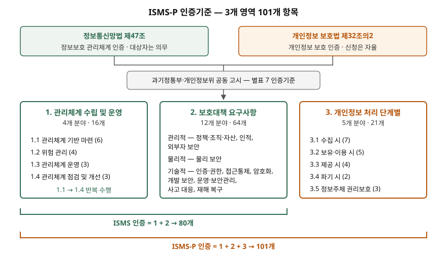

> 실행 검증 없음. 제도 개념이므로 국가법령정보센터의 현행 법령·고시 본문과 개인정보보호위원회·과학기술정보통신부의
> 인증기준 안내서(2023.11)를 근거로 정리했다. 2026년 4월 정부가 발표한 개편 방안은 보도자료만 있고 고시로 확정되지
> 않았으므로, 해당 부분은 "발표된 방안"으로 구분해 적었다.

## 들어가며

정보보호 컴플라이언스 기출에서 대응 방안을 쓰면 거의 모든 답안이 "ISMS-P 인증 취득"을 적는다. 채점자는 그 다음 줄을
본다. 어느 법에서 나온 인증인지, 누가 의무로 받아야 하는지, 101개 기준이 어떻게 나뉘는지를 쓰지 못하면 이름만 아는
답안이 된다. 실무에서는 인증 범위를 어디까지 잡을지, ISO/IEC 27001을 이미 받았으면 무엇이 줄어드는지가 비용을 정한다.

## 정의

**ISMS-P(정보보호 및 개인정보보호 관리체계 인증)**: 신청인의 정보보호 및 개인정보보호를 위한 일련의 조치와 활동이
**인증기준에 적합함을 한국인터넷진흥원 또는 인증기관이 증명하는 것**이다(정보보호 및 개인정보보호 관리체계 인증
등에 관한 고시 제2조제1호).

같은 조 제2호는 개인정보 영역을 뺀 **ISMS(정보보호 관리체계 인증)**를 따로 정의한다. 신청인은 둘 중 하나를 골라
신청한다(고시 제18조제1항).

## 등장 배경

두 인증은 원래 다른 법에서 따로 생겼다. 정보통신망법은 정보통신망의 안정성·신뢰성을 위해 관리적·기술적·물리적
보호조치를 포함한 종합적 관리체계를 인증하고(제47조제1항), 개인정보 보호법은 개인정보 처리와 보호 조치가 법에
부합하는지를 인증한다(제32조의2제1항). 한 기업이 두 법을 동시에 적용받으면 비슷한 통제를 두 번 심사받아야 했다.

지금의 고시는 두 인증의 **통합 운영**에 필요한 사항을 정하는 것을 목적으로 한다(제1조). 과학기술정보통신부와
개인정보보호위원회가 공동으로 고시하고, 인증기준 하나(별표 7)를 두 인증이 나눠 쓴다. ISMS는 앞의 두 영역,
ISMS-P는 세 영역 전부를 적용한다(제23조제1항).

## 구성요소와 절차

### 법적 근거 — 2개 법률

| 구분 | ISMS | ISMS-P의 개인정보 부분 |
|---|---|---|
| 근거 | 정보통신망법 제47조 | 개인정보 보호법 제32조의2 |
| 소관 | 과학기술정보통신부 | 개인정보보호위원회 |
| 의무 여부 | 제2항 대상자는 **받아야 한다** | "인증할 수 있다" — 의무 조항 없음 |
| 유효기간 | 3년 (제47조제5항) | 3년 (제32조의2제2항) |
| 사후관리 | 연 1회 이상, 현장심사와 서면심사 병행 (제47조제8항) | 연 1회 이상 (제32조의2제4항) |

### ISMS 의무 대상 — 3가지

정보통신망법 제47조제2항은 전기통신사업자와 그 역무를 이용해 정보를 제공·매개하는 자 가운데 다음에 해당하면
인증을 받도록 한다.

| 번호 | 대상 | 세부 기준 |
|---|---|---|
| ① | 주요정보통신서비스 제공자 | 법 제47조제2항제1호 |
| ② | 집적정보통신시설 사업자 | 법 제47조제2항제2호 |
| ③ | 대통령령 기준 해당자 | 시행령 제49조제2항: ⑴ 전년도 매출액·세입 1,500억 원 이상인 상급종합병원 또는 재학생 1만 명 이상 대학 ⑵ 정보통신서비스 부문 전년도 매출액 100억 원 이상 ⑶ 전년도 일일평균 이용자 100만 명 이상 (⑵⑶은 금융회사 제외) |

의무 대상자는 **다음 해 8월 31일까지** 인증을 받아야 한다(고시 제19조제4항). 의무 대상자가 ISMS 대신 ISMS-P를
받아도 의무를 이행한 것으로 본다(같은 조 제3항). 다시 말해 현행법에서 **의무인 것은 ISMS**이고, ISMS-P는 그
의무를 더 넓은 기준으로 채우는 방법이다.

### 인증기준 — 3개 영역 101개

| 영역 | 분야 수 | 항목 수 | 무엇을 보는가 |
|---|---|---|---|
| 1. 관리체계 수립 및 운영 | 4 | 16 | 경영진 참여·범위 설정 → 위험 관리 → 보호대책 구현 → 점검·개선의 순환 |
| 2. 보호대책 요구사항 | 12 | 64 | 위험평가 결과에 따라 고른 보호대책 — 인적·물리·접근통제·암호화·운영·사고 대응 등 |
| 3. 개인정보 처리 단계별 요구사항 | 5 | 21 | 수집 → 보유·이용 → 제공 → 파기, 그리고 정보주체 권리보호 |

안내서는 1영역을 관리체계를 운영하는 동안 **지속적이고 반복적으로** 실행해야 하는 것으로, 3영역을 대부분 **법적
요구사항과 직접 관련**된 것으로 설명한다. 2영역은 1영역의 위험평가 결과와 서비스·시스템 특성을 반영해 고른다.
ISMS는 1·2영역 80개, ISMS-P는 101개를 적용한다. 2023년 11월 안내서 개정 전에는 3영역이 22개, 전체 102개였다.

### 심사 — 3종

| 심사 | 언제 | 근거 |
|---|---|---|
| ① 최초심사 | 처음 신청하거나 인증범위에 중요한 변경이 있을 때 | 고시 제2조제9호 |
| ② 사후심사 | 인증 후 매년 | 고시 제2조제10호, 제27조 |
| ③ 갱신심사 | 유효기간 만료 3개월 전 신청 | 고시 제2조제11호, 제28조 |

갱신을 신청하지 않고 유효기간이 지나면 인증 효력은 상실된다(제28조제3항). 심사는 서면심사와 현장심사로
확인한다(제2조제6호).

## 도식

> **출처**: [정보보호 및 개인정보보호 관리체계 인증 등에 관한 고시 제1조·제18조·제23조, 별표 7](https://www.law.go.kr/행정규칙/정보보호및개인정보보호관리체계인증등에관한고시) · [ISMS-P 인증기준 안내서(2023.11) 제1장 인증기준 개요](https://www.privacy.go.kr/front/bbs/bbsView.do?bbsNo=BBSMSTR_000000000049&bbscttNo=20677) · [정보통신망법 제47조](https://www.law.go.kr/법령/정보통신망이용촉진및정보보호등에관한법률/제47조) · [개인정보 보호법 제32조의2](https://www.law.go.kr/법령/개인정보보호법/제32조의2)

답안지에는 위에 법 두 개, 가운데 고시 한 줄, 아래 영역 상자 세 개를 그리고 괄호 두 개로 80개와 101개를 표시하면
된다. 2영역 상자의 관리적·물리적·기술적 묶음은 정보통신망법 제47조제1항의 보호조치 구분에 맞춰 12개 분야를 나눈
것으로, 안내서의 공식 구분은 아니다.

## 비교 — ISMS, ISMS-P, ISO/IEC 27001

| 구분 | ISMS | ISMS-P | ISO/IEC 27001:2022 |
|---|---|---|---|
| 성격 | 국내 법정 인증 | 국내 법정 인증 | 국제표준 기반 인증 |
| 의무 | 법 제47조제2항 대상자는 의무 | 현행법상 의무 없음 (ISMS 의무를 대신 채울 수 있음) | 자율 |
| 기준 | 별표 7 1·2영역 80개 | 별표 7 1·2·3영역 101개 | 본문 4~10절 요구사항 + 부속서 A 통제(조직·인적·물리·기술) |
| 개인정보 | 다루지 않음 | 처리 단계별 21개 항목 | 별도 표준(ISO/IEC 27701)으로 확장 |
| 서로의 관계 | ISO/IEC 27001 인증이 있으면 심사 일부 생략 가능 (고시 제20조, 별표 5) | 같음 | 국내 인증을 대신하지 못한다 |

구조로 보면 ISMS-P 1영역은 ISO/IEC 27001 본문(조직 맥락·리더십·계획·운영·성과 평가·개선)과, 2영역은 부속서 A의
통제와 같은 자리에 있다. 3영역에 해당하는 것은 ISO/IEC 27001에 없다. 고시가 정한 공식 연결은 항목 대응표가
아니라 **심사 일부 생략**이고, 생략하려면 ISO 인증 범위가 신청 범위를 포함하고 심사 시점에 유효해야 한다(제20조제2항).

## 2026년 개편 방안 — 발표 단계

과학기술정보통신부와 개인정보보호위원회는 2026년 4월 10일 인증제 실효성 강화방안을 발표했다. 인증을 받은 기업에서
사고가 이어지자 나온 방안이다. 보도자료 기준 골자는 4가지다.

1. **ISMS-P 의무 대상 신설** — 주요 공공시스템 운영기관, 이동통신사업자, 본인확인기관, 대규모 개인정보처리자
2. **3단계 차등** — 강화인증·표준인증·간편인증. 국민 생활 파급력이 큰 곳에 강화 기준
3. **심사 방식 전환** — 서면 중심에서 현장 중심으로. 예비심사로 핵심 기준을 먼저 보고, 취약점 진단·모의침투를 도입
4. **사후관리 강화** — 상시 점검, 중대 결함 시 인증 취소

사후관리는 2026년 하반기, 의무화와 차등 체계는 2027년부터 시행한다고 밝혔다. 이와 별개로 이미 시행 중인 변화도
있다. 2026년 3월 31일 개정된 정보통신망법은 사후관리에 현장심사와 서면심사를 병행하도록 하고(제47조제8항),
정보보호 관계 법령을 중대하게 위반한 경우를 인증 취소 사유에 더했다(제47조제10항제4호).

## 적용 시 고려사항

- **인증 범위를 먼저 정한다.** 범위는 신청 전에 심사수행기관과 협의하고(고시 제18조제3항), 범위에 중요한 변경이
  생기면 최초심사를 다시 받는다. 범위를 좁게 잡으면 비용은 줄지만, 범위 밖 시스템에서 난 사고는 인증이 보증하지
  않는다. 개인정보가 흐르는 시스템을 빼고 잡은 범위는 개편 방안의 방향과 반대로 간다.
- **ISMS 의무 대상인지 매년 확인한다.** 기준은 전년도 매출액과 일일평균 이용자 수다. 사업이 커져 기준을 넘으면
  다음 해 8월 31일이 기한이 된다. 재무·서비스 지표를 보안 조직이 받아 보는 절차가 없으면 기한을 놓친다.
- **ISO/IEC 27001과 함께 운영하면 생략 요건을 맞춘다.** 해외 고객 때문에 ISO 인증을 유지하는 조직은 두 인증의
  범위와 갱신 시점을 맞춰야 일부 생략을 받을 수 있다. 3영역은 ISO로 대신할 수 없으므로 별도로 준비한다.
- **증적은 시스템이 남기게 한다.** 사후심사가 매년 있고, 개편 방안은 시연 확인과 상시 점검으로 간다. 퇴직자 계정
  회수, 백업 복구, 접속기록 보관 같은 항목은 문서보다 **시스템 로그와 실행 결과**로 보여야 한다.
- **개편 내용은 고시 확정 후 다시 확인한다.** 3단계 구분 기준과 강화 항목은 발표된 방안이고 아직 고시가 아니다.
  답안이나 계획서에는 "발표된 방안"으로 적는다.

> 기출 답안: [기출문제 — 국내 규제에 따른 정보보호 컴플라이언스의 개념, 필요성, 대응 방안](../../exam/2026-10-07-information-security-compliance-korea/index.md)

## 정리

- ISMS-P = **정보보호·개인정보보호 관리체계가 인증기준에 적합함을 증명하는 통합 인증.** 근거 법 **2개**(정보통신망법 제47조, 개인정보 보호법 제32조의2), 고시는 공동 고시 하나.
- 의무인 것은 **ISMS**, 대상 **3가지**: 주요정보통신서비스 제공자 · 집적정보통신시설 사업자 · 매출 1,500억(병원·대학)/정보통신 매출 100억/일평균 이용자 100만. 기한은 다음 해 8월 31일.
- 인증기준 **3영역 101개 = 16 + 64 + 21**. ISMS는 앞 두 영역 80개.
- 유효기간 **3년**, 심사 **3종**(최초·사후·갱신), 사후심사 매년.
- ISO/IEC 27001과의 공식 연결은 **심사 일부 생략**(고시 제20조). 2026년 발표 방안은 **의무화·3단계·현장 심사·상시 점검**.

## 참고 자료

- [정보통신망 이용촉진 및 정보보호 등에 관한 법률 (법률 제21988호, 2026-10-02 시행)](https://www.law.go.kr/법령/정보통신망이용촉진및정보보호등에관한법률/제47조) — 제47조 정보보호 관리체계의 인증
- [정보통신망법 시행령 (대통령령 제36728호, 2026-10-02 시행)](https://www.law.go.kr/법령/정보통신망이용촉진및정보보호등에관한법률시행령/제49조) — 제49조 인증 대상자의 범위
- [개인정보 보호법 (법률 제21445호, 2026-09-11 시행)](https://www.law.go.kr/법령/개인정보보호법/제32조의2) — 제32조의2 개인정보 보호 인증
- [정보보호 및 개인정보보호 관리체계 인증 등에 관한 고시 (과기정통부 고시 제2024-30호·개인정보위 고시 제2024-8호, 2024-07-24 시행)](https://www.law.go.kr/행정규칙/정보보호및개인정보보호관리체계인증등에관한고시) — 제1조, 제2조, 제18조~제20조, 제23조, 제27조, 제28조, 제35조, 별표 5, 별표 7
- [개인정보보호위원회·과학기술정보통신부, 정보보호 및 개인정보보호 관리체계(ISMS-P) 인증기준 안내서 (2023.11)](https://www.privacy.go.kr/front/bbs/bbsView.do?bbsNo=BBSMSTR_000000000049&bbscttNo=20677) — 제1장 인증기준 개요(영역·분야·항목)
- [ISO/IEC 27001:2022 Information security management systems — Requirements](https://www.iso.org/standard/27001)
- [정책브리핑 보도자료 재게시(복지로), "개인정보 유출 사전예방 강화…개인정보보호 인증제 전면 개편" (2026-04-10)](https://www.bokjiro.go.kr/ssis-tbu/cms/pc/news/news/1309615_1114.html) — 개인정보보호위원회·과학기술정보통신부 발표
- [법무법인 화우, ISMS·ISMS-P 인증제 전면 개편 (2026-04-13)](https://www.hwawoo.com/kor/insights/newsletter/14720) — 2차 자료, 개편 방안 해설
- [법무법인 세종, 정부, 유출사고 예방 위해 ISMS·ISMS-P 인증제도 전면 개편 (2026-04)](https://shinkim.com/kor/media/newsletter/3231) — 2차 자료, 개편 방안 해설
