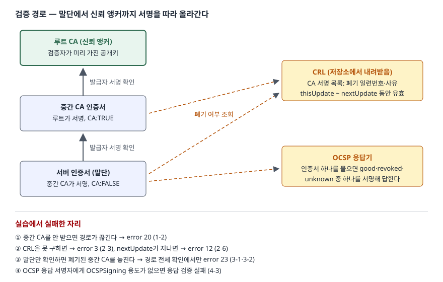

> 이 글의 실패 사례는 [`code/pki_lab.sh`](code/pki_lab.sh)로 실습용 CA를 만들어 OpenSSL 3.5.6에서 돌린 결과다.
> 실행 기록은 [`code/output.txt`](code/output.txt)에 있다. 실제 공인 CA나 브라우저의 동작을 잰 것이 아니다.

## 들어가며

PKI 문항은 "구성요소를 쓰고 인증서 검증 절차를 설명하라"로 나오고, 최근에는 "CRL과 OCSP를 비교하라"가 붙는다.
구성요소 표는 외우기 쉽지만 점수가 갈리는 곳은 **검증이 실제로 어디서 끊기는가**다.
실무에서도 같다. 서버가 중간 CA 인증서를 안 보내 일부 클라이언트만 접속이 실패하는 일, 폐기한 인증서가 계속 통하는 일은
전부 검증 경로와 폐기 확인의 빈틈에서 생긴다. 공개키 암호 자체는 [대칭키·공개키 혼합 암호 글](../2026-09-29-symmetric-vs-public-key-hybrid/index.md)에서 다뤘다.

## 정의

> **공개키 기반구조(PKI)**: 공개키와 그 소유자의 신원을 **인증기관(CA)의 서명이 붙은 인증서**로 묶고,
> 인증서의 발급·배포·폐기를 관리해 검증자가 그 묶음을 믿을 수 있게 하는 체계.
> — RFC 5280의 개요 절(§3)이 인증서 사용자는 공개키를 쓰기 전에 그 키가 올바른 주체의 것인지 확인해야 하며,
> 인증서가 CA 서명으로 이 결합을 보증한다고 적는 내용을 정리한 것이다.

**인증서 검증 경로(certification path)** 는 검증 대상 인증서에서 출발해, 각 인증서의 발급자가 다음 인증서의 주체가 되는
인증서들을 이어 **신뢰 앵커**(검증자가 미리 신뢰하는 CA 공개키)에 닿는 순서열이다. 검증은 이 경로의 인증서마다
서명·유효기간·폐기 여부·이름 연결을 확인하는 일이다(RFC 5280 경로 검증 절, §6).

## 등장 배경

- **공개키만으로는 주인을 알 수 없다.** 공개키는 누구나 만들 수 있으므로, "이 키가 shop.example의 것"이라는 주장을
  제3자가 서명해 줘야 중간자 공격을 막는다. 그 제3자가 CA다.
- **모든 CA를 직접 믿을 수는 없다.** 검증자가 들고 있을 수 있는 신뢰 앵커는 소수다. 루트 CA가 중간 CA를 서명하고
  중간 CA가 서버 인증서를 서명하는 **계층**을 두면, 루트 하나로 수많은 인증서를 검증할 수 있다. 루트 키는 오프라인에 두고
  일상 발급은 중간 CA가 한다.
- **인증서는 만료 전에 무효가 될 수 있다.** 개인키 유출, 도메인 소유 변경 같은 일이 생기면 유효기간이 남은 인증서를 무효로
  돌려야 한다. RFC 5280의 폐기 절(§3.3)은 CA가 CRL을 시간·일·주 단위로 정기 발행한다고 적고, 폐기 통보 지연을 줄이는
  온라인 방식은 별도 규격으로 넘긴다. 그것이 OCSP(RFC 6960)다.

## 구성요소 5가지와 검증 절차 5단계

### 구성요소 5가지 (RFC 5280 구조 모델, §3.1)

| 구성요소 | 하는 일 |
|---|---|
| ① 최종 개체(end entity) | 인증서의 주체가 되는 사용자·서버. 인증서를 쓰는 쪽(검증자)도 포함한다 |
| ② 인증기관(CA) | 인증서와 CRL에 서명한다 |
| ③ 등록기관(RA) | CA가 위임한 관리 기능(신원 확인 등)을 맡는 선택적 시스템 |
| ④ CRL 발행자(CRL issuer) | CRL을 만들어 서명한다. 보통 CA가 겸한다 |
| ⑤ 저장소(repository) | 인증서와 CRL을 저장해 내려받게 하는 시스템 |

### 경로 검증 절차 5단계 (RFC 5280 기본 경로 검증, §6.1)

| 단계 | 이름 | 내용 |
|---|---|---|
| 1 | 입력(Inputs) | 검증할 경로, 현재 시각, 허용 정책, 신뢰 앵커 정보 |
| 2 | 초기화(Initialization) | 신뢰 앵커의 이름·공개키로 상태 변수를 채운다 |
| 3 | 기본 인증서 처리 | 인증서마다 **4가지**: 서명 확인, 유효기간 확인, 폐기되지 않았는지 확인, 발급자 이름 = 앞 인증서의 주체 이름 |
| 4 | 다음 인증서 준비 | CA 인증서인지(basicConstraints), 경로 길이 제한, 키 용도(keyCertSign) 확인 후 공개키를 넘긴다 |
| 5 | 마무리(Wrap-Up) | 마지막 인증서의 공개키·정책을 결과로 낸다 |

3단계의 폐기 확인에 대해 RFC 5280은 CRL, 상태 정보 서비스, 대역 외 방법 중 무엇으로든 판단할 수 있다고만 적는다.
**어떤 수단을 쓸지, 정보를 못 얻으면 어떻게 할지는 검증자의 정책**이다. 실습에서 가장 많이 깨진 곳이 여기다.

## 도식



> **출처**: [RFC 5280 §6.1 Basic Path Validation](https://www.rfc-editor.org/rfc/rfc5280.html#section-6.1)(경로 검증 절차),
> [RFC 5280 §5 CRL and CRL Extensions Profile](https://www.rfc-editor.org/rfc/rfc5280.html#section-5)(CRL의 thisUpdate·nextUpdate),
> [RFC 6960 §2.2 Response](https://www.rfc-editor.org/rfc/rfc6960.html#section-2.2)(OCSP 상태 3가지).
> 실패 자리는 실습 1-2·2-3·2-6·3-2·4-3번의 실행 결과다.

## 실습 — 검증이 끊기는 자리

중간 CA가 서버 인증서 둘(`shop.example`, `api.example`)과 OCSP 응답기 인증서를 발급한 3단 체인을 만들었다.

### 경로가 끊기는 경우

```text
-- 1-2. 중간 CA 를 빼고 넘김 (서버가 체인을 안 보낸 경우)
CN=shop.example
error 20 at 0 depth lookup: unable to get local issuer certificate
error probe_pki/leaf.crt: verification failed
종료 코드 2
```

검증자는 루트만 가지고 있으므로 서버 인증서의 발급자(중간 CA)를 찾지 못했다. TLS 서버가 중간 CA 인증서를 함께 보내야 하는 이유다.
반대로 중간 CA만 신뢰 저장소에 넣으면 그 발급자(루트)를 찾지 못해 error 2가 났고(1-3), `-partial_chain`을 줘서 중간 CA를
앵커로 인정하자 통과했다(1-4).

### 폐기 확인은 켜야 돈다

```text
-- 2-2. 폐기 확인을 켜지 않으면 (-crl_check 없음)
probe_pki/leaf.crt: OK
-- 2-3. -crl_check 를 켰는데 CRL 을 못 구했으면
error 3 at 0 depth lookup: unable to get certificate CRL
-- 2-4. -crl_check + CRL 제공
error 23 at 0 depth lookup: certificate revoked
-- 2-6. CRL 의 nextUpdate 가 지난 시각(이틀 뒤)으로 검증
error 12 at 0 depth lookup: CRL has expired
```

(출력에서 결과 줄만 골랐다. 전체는 output.txt.)

`shop.example`은 `keyCompromise` 사유로 폐기한 뒤였지만 2-2는 `OK`였다. OpenSSL 문서는 `-crl_check`를 "말단 인증서의 유효한 CRL을
찾아 확인한다"고 적을 뿐, 이 옵션이 없을 때 폐기를 확인한다는 말이 없다. CRL을 켜도 **못 구하면 실패**(2-3)이고,
CRL의 `nextUpdate`(이 실습은 발행 하루 뒤)가 지나면 그 CRL은 더 이상 쓸 수 없다(2-6). 폐기 정보에도 유효기간이 있다는 뜻이다.

### 말단만 보면 중간 CA 폐기를 놓친다

```text
-- 3-1. -crl_check (말단 인증서만 확인) — leaf2
probe_pki/leaf2.crt: OK
종료 코드 0

-- 3-2. -crl_check_all (경로 전체 확인) — leaf2
CN=Lab Issuing CA
error 23 at 1 depth lookup: certificate revoked
error probe_pki/leaf2.crt: verification failed
종료 코드 2
```

루트가 중간 CA를 `cACompromise`로 폐기했다. 말단만 확인하는 3-1은 그 사실을 몰랐고, 경로 전체를 확인한 3-2만 깊이 1(중간 CA)에서 실패했다.
RFC 5280의 기본 인증서 처리는 경로의 **모든** 인증서에 폐기 확인을 요구한다.

### OCSP — 응답의 서명도 확인해야 한다

```text
-- 4-3. OCSPSigning 용도가 없는 인증서(leaf2)로 서명한 응답
Response Verify Failure
282E0000:error:13800067:OCSP routines:ocsp_check_delegated:missing ocspsigning usage:../openssl-3.5.6/crypto/ocsp/ocsp_vfy.c:374:
282E0000:error:13800070:OCSP routines:OCSP_basic_verify:root ca not trusted:../openssl-3.5.6/crypto/ocsp/ocsp_vfy.c:149:
282E0000:error:13800067:OCSP routines:ocsp_check_delegated:missing ocspsigning usage:../openssl-3.5.6/crypto/ocsp/ocsp_vfy.c:374:
282E0000:error:13800070:OCSP routines:OCSP_basic_verify:root ca not trusted:../openssl-3.5.6/crypto/ocsp/ocsp_vfy.c:149:
probe_pki/leaf.crt: revoked
	This Update: Oct  8 03:12:04 2026 GMT
	Next Update: Oct  9 03:12:04 2026 GMT
	Reason: keyCompromise
	Revocation Time: Oct  8 03:12:03 2026 GMT
종료 코드 1
```

RFC 6960은 응답에 서명할 수 있는 주체를 **3가지**로 정한다. 발급 CA 자신, 검증자가 따로 신뢰하는 응답기, 그리고 CA가 직접 발급하고
`id-kp-OCSPSigning` 용도를 표시한 인증서를 가진 **지정 응답기**다(§4.2.2.2). 4-1에서 그 용도를 넣은 응답기 인증서로 서명한 응답은
`Response verify OK`였고, 용도가 없는 일반 서버 인증서로 서명한 4-3은 실패했다. 눈여겨볼 점은 **검증이 실패했는데도 상태 줄 `revoked`가
그대로 찍혔다**는 것이다. 응답 내용만 읽고 서명 검증 결과를 버리는 클라이언트라면, 위조된 `good` 응답도 받아들이게 된다.
기록이 없는 일련번호에는 `unknown`이 돌아왔고 종료 코드는 0이었다(4-4). `unknown`을 통과로 볼지는 역시 검증자의 정책이다.

## 비교 — 폐기 확인 수단 4가지

| 구분 | CRL | OCSP | OCSP 스테이플링 | 단기 인증서 |
|---|---|---|---|---|
| 근거 | RFC 5280 §5 | RFC 6960 | RFC 6066 §8 | CA/B BR 단기 인증서 정의(§1.6.1) |
| 방식 | CA가 서명한 폐기 목록 전체를 주기적으로 발행 | 인증서 하나를 물어 서명된 상태를 받는다 | **서버**가 OCSP 응답을 받아 두었다가 TLS 핸드셰이크에 실어 보낸다 | 유효기간을 짧게 해 만료로 무효화 |
| 신선도 | 발행 주기(`thisUpdate`~`nextUpdate`) | 응답의 `thisUpdate`~`nextUpdate` | 서버가 받아 둔 응답의 유효기간 | 유효기간 자체 |
| 검증자 부담 | 목록 전체를 내려받는다 | 접속마다 응답기에 묻는다 | 추가 질의 없음 | 폐기 확인 없음 |
| 개인정보 | 목록 전체를 받으므로 어느 인증서를 확인하는지 드러나지 않는다 | 응답기가 질의한 IP와 인증서를 안다 | 응답기에는 서버만 묻는다 | 해당 없음 |
| 실패 지점 | 목록을 못 받음, 만료(실습 2-3·2-6) | 응답기 장애, 서명자 용도(4-3), unknown(4-4) | 서버가 응답을 받아 두지 못하면 붙일 것이 없다 | 발급 자동화가 멈추면 곧바로 만료 |

현행 공인 TLS 인증서 규칙에서는 축이 CRL 쪽으로 옮겨 갔다. CA/B Forum 기본 요건(Baseline Requirements)은 투표안 SC-063을 반영한 2.0.1판(2023-08-17 채택, 2024-03-15 발효)에서
**OCSP를 선택으로 바꾸고 CRL을 필수로** 했으며, 유효기간이 짧은 인증서(2026-03-15 이후 발급분은 7일 이하)는
CRL·OCSP 위치를 넣지 않아도 되고 폐기하지 않아도 된다고 정했다. Let's Encrypt는 2024-12-05 공지에서 개인정보 위험과 운영 비용을 이유로
OCSP를 끝낸다고 밝혔고, 2025-08-06을 응답기 종료일로 잡았다.

## 적용 시 고려사항

- **폐기 확인이 실제로 켜져 있는지부터 본다.** OpenSSL `verify`는 옵션을 주지 않으면 폐기된 인증서도 `OK`였다(실습 2-2).
  라이브러리·언어 런타임의 TLS 클라이언트도 기본값을 확인해야 한다. 켜려면 CRL을 어디서 받아 올지까지 정해야 한다.
- **정보를 못 얻었을 때의 정책을 정한다.** CRL을 못 받거나(2-3) 만료됐거나(2-6) OCSP가 `unknown`일 때(4-4) 거부하면 응답기 장애가
  곧 서비스 장애가 되고, 통과시키면 공격자가 조회만 막아도 폐기가 무력해진다. 내부 시스템처럼 CA를 직접 운영하면 거부 쪽을,
  그럴 수 없으면 스테이플링이나 단기 인증서로 조회 자체를 없애는 쪽을 검토한다.
- **경로 전체를 확인한다.** 말단만 확인하면 중간 CA 폐기를 놓친다(3-1). 중간 CA 폐기는 그 아래 모든 인증서를 무효로 만드는 가장 큰 사건이다.
- **OCSP 응답은 상태보다 서명을 먼저 본다.** 서명자가 발급 CA이거나 `OCSPSigning` 용도를 가진 지정 응답기인지 확인하고,
  검증이 실패한 응답의 상태 값은 쓰지 않는다(4-3). 재전송을 막으려면 nonce(RFC 6960 §4.4.1)를 쓴다.
- **서버는 중간 CA 인증서를 함께 보낸다.** 검증자는 보통 루트만 가지고 있으므로, 빠뜨리면 경로를 만들지 못한다(1-2).
  서버 쪽 확인은 [openssl s_client 글](../../../Linux/command/2026-10-02-openssl-s-client-cert-chain-expiry/index.md)에서 다뤘다.

## 정리

암기 단서는 **"5·5·4·4"** 다.

- **구성요소 5**: 최종 개체·CA·RA·CRL 발행자·저장소 (RFC 5280 §3.1)
- **검증 절차 5**: 입력 → 초기화 → 기본 처리 → 다음 인증서 준비 → 마무리 (§6.1)
- **기본 처리 4**: 서명·유효기간·폐기·이름 연결 — 경로의 **모든** 인증서에
- **폐기 확인 수단 4**: CRL·OCSP·스테이플링·단기 인증서. 공인 TLS는 2024-03-15부터 CRL 필수·OCSP 선택
- 검증이 깨지는 자리: 중간 CA 누락, 폐기 정보 미확보·만료, 말단만 확인, 응답 서명 미검증

## 참고 자료

- [RFC 5280 — Internet X.509 PKI Certificate and CRL Profile](https://www.rfc-editor.org/rfc/rfc5280.html) — §3.1 구조 모델(구성요소 5가지), §3.3 폐기, §5 CRL 프로필, §6.1 기본 경로 검증
- [RFC 5280 §6.1 Basic Path Validation](https://www.rfc-editor.org/rfc/rfc5280.html#section-6.1) — 입력·초기화·기본 처리·다음 인증서 준비·마무리
- [RFC 5280 §5 CRL and CRL Extensions Profile](https://www.rfc-editor.org/rfc/rfc5280.html#section-5) — thisUpdate·nextUpdate
- [RFC 6960 — X.509 Internet PKI Online Certificate Status Protocol (OCSP)](https://www.rfc-editor.org/rfc/rfc6960.html) — §2.2 응답 상태 3가지, §2.4 시각 필드, §4.2.2.2 응답 서명자, §4.4.1 Nonce
- [RFC 6960 §2.2 Response](https://www.rfc-editor.org/rfc/rfc6960.html#section-2.2) — good·revoked·unknown
- [RFC 6066 §8 Certificate Status Request](https://www.rfc-editor.org/rfc/rfc6066.html#section-8) — OCSP 스테이플링
- [CA/Browser Forum — Ballot SC063v4: Make OCSP Optional, Require CRLs, and Incentivize Automation (2023-07-14)](https://cabforum.org/2023/07/14/ballot-sc063v4-make-ocsp-optional-require-crls-and-incentivize-automation) — 단기 인증서는 폐기 정보 불필요
- [CA/Browser Forum — Baseline Requirements (BR.md)](https://github.com/cabforum/servercert/blob/main/docs/BR.md) — §1.2.1 개정 이력(2.0.1·SC063, 2023-08-17 채택, 2024-03-15 발효), §1.6.1 단기 인증서 정의(10일·7일 기준과 적용일)
- [Let's Encrypt — Ending OCSP Support in 2025 (2024-12-05)](https://letsencrypt.org/2024/12/05/ending-ocsp/) — OCSP 종료 일정과 이유
- [OpenSSL 3.5 — openssl-verification-options](https://docs.openssl.org/3.5/man1/openssl-verification-options/) — `-crl_check`·`-crl_check_all`·`-partial_chain`·`-attime`
