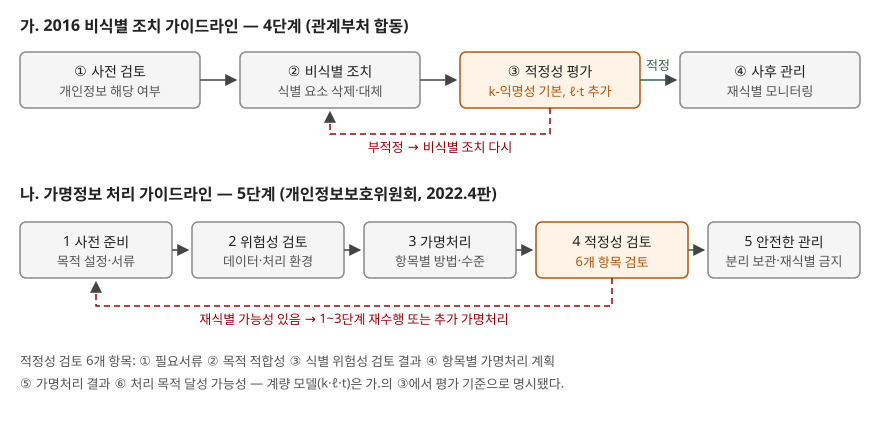

## 들어가며

빅데이터·AI 학습 데이터 문제에는 "개인정보를 어떻게 처리해야 활용할 수 있는가"가 거의 빠지지 않는다. 답안에서 점수가
갈리는 곳은 기법 이름을 나열하는 데가 아니라 **절차의 단계 수**와 **적정성을 무엇으로 판단하는가**, 그리고 그 판단 기준인
프라이버시 보호 모델이 **어떤 공격을 막고 어떤 공격을 못 막는가**다. 실무에서는 "이름과 주민번호를 지웠으니 비식별됐다"는
주장을 받았을 때 그것이 왜 부족한지를 숫자로 보여 주는 데 쓰인다.

> 정의와 절차는 정부 가이드라인 원문에서, 모델의 정의와 거리 식은 원 논문과 NIST 보고서에서 가져왔다. 모델의 동작은
> 가상 데이터로 직접 계산해 확인했고 기록은 [code/output.txt](code/output.txt)에 있다.

## 정의

- **비식별 조치 (2016 가이드라인)**: 정보집합물에서 개인을 식별할 수 있는 요소를 전부 또는 일부 삭제하거나 대체하는 등의
  방법으로 **개인을 알아볼 수 없도록 하는 조치**.
- **가명처리 (가명정보 처리 가이드라인 용어 정리)**: 개인정보의 일부를 삭제하거나 일부 또는 전부를 대체하는 등의
  방법으로 **추가정보 없이는** 특정 개인을 알아볼 수 없도록 처리하는 것.
- **익명정보**: 시간·비용·기술 등을 합리적으로 고려할 때 **다른 정보를 사용하여도 더 이상** 개인을 알아볼 수 없는 정보.

가명정보는 추가정보와 합치면 다시 알아볼 수 있으므로 여전히 개인정보이고, 익명정보는 그렇지 않다. 둘을 가르는 것은 처리 기법이
아니라 **재식별 가능성이 남는가**다. 2016 가이드라인은 가명정보 특례(개인정보 보호법 제28조의2)가 들어가기 전 문서라
용어도 "비식별"이다. 개인정보보호위원회 안내서
게시판의 현행 안내서는 **가명정보 처리 가이드라인 2026.3. 개정판**이다. 이 글의 5단계·6개 항목은 원문을 읽을 수 있었던
**2022.4판** 기준이며, 2026.3판은 파일이 커서 본문을 확인하지 못했다.

## 등장 배경

이름·주민등록번호 같은 **직접 식별자**를 지우는 것만으로는 부족하다는 것이 출발점이다. 2016 가이드라인은 미국 매사추세츠주의
선거인명부와 공개 의료 데이터가 지역 코드·나이·성별로 결합되어 병명이 노출된 사례를 **연결 공격**(linkage attack)의 예로 든다.
NIST IR 8053도 같은 맥락에서 출생 연도·거주 주(state)처럼 **혼자서는 식별자가 아니지만 조합하면 식별에 쓰이는 속성**을
준식별자(quasi-identifier)로 구분한다. 그래서 "무엇을 지웠는가"가 아니라 "남은 속성으로 몇 명까지 좁혀지는가"를 재는 계량 모델이
필요해졌고, 그 기본이 k-익명성이다.

## 구성요소 / 절차

### 2016 비식별 조치 — 4단계

| 단계 | 내용 |
|---|---|
| ① 사전 검토 | 개인정보에 해당하는지 검토. 개인정보가 아닌 것이 명백하면 법적 규제 없이 활용 |
| ② 비식별 조치 | 식별 요소를 전부 또는 일부 삭제·대체 |
| ③ 적정성 평가 | 외부전문가가 참여하는 평가단이 **k-익명성을 기본으로**, 필요시 ℓ-다양성·t-근접성을 추가해 평가 |
| ④ 사후 관리 | 비식별 정보 안전조치, 재식별 가능성 모니터링 |

②단계의 처리 기법은 **5가지**다: 가명처리, 총계처리, 데이터 삭제, 데이터 범주화, 데이터 마스킹. 가이드라인은 그 아래 세부 기술
17개(휴리스틱 가명화, 라운딩, 식별자 부분삭제, 범위 방법, 임의 잡음 추가 등)를 든다.

### 현행 가명처리 — 5단계 (2022.4판)

| 단계 | 내용 |
|---|---|
| 1 목적 설정 등 사전 준비 | 법이 정한 목적(통계작성·과학적 연구·공익적 기록보존 등) 중에서 처리 목적을 정하고 서류 작성 |
| 2 위험성 검토 | 데이터 자체의 식별 위험성과 처리 환경의 식별 위험성 |
| 3 가명처리 | 항목별 가명처리 방법과 수준을 정해 수행 |
| 4 적정성 검토 및 추가 가명처리 | 아래 6개 항목. 재식별 가능성이 있으면 1~3단계 재수행 또는 추가 처리 |
| 5 안전한 관리 | 추가정보 분리 보관, 재식별 금지와 모니터링, 처리 기록 |

적정성 검토는 **6개 항목**을 차례로 본다: ① 필요서류 ② 처리 목적 적합성 ③ 식별 위험성 검토 결과의 적정성 ④ 항목별 가명처리
계획의 적정성 ⑤ 가명처리 결과의 적정성 ⑥ 처리 목적 달성 가능성. 가이드라인은 검토위원회를 최소 3명 이상으로 구성하도록 권고한다.

### 프라이버시 보호 모델 — 3가지

| 모델 | 정의 (2016 가이드라인·NIST IR 8053) | 제안 |
|---|---|---|
| k-익명성 | 준식별자 조합마다 같은 값을 가진 레코드가 **k개 이상**. 특정 개인을 식별할 확률은 1/k | Sweeney, 2002 |
| ℓ-다양성 | 각 동질 집합에 서로 다른 민감정보가 **ℓ개 이상** | Machanavajjhala 외, 2006 |
| t-근접성 | 각 동질 집합의 민감정보 **분포**와 전체 분포의 차이가 **t 이하** | Li 외, 2007 |

**동질 집합**(equivalence class)은 준식별자 값이 같게 일반화된 레코드의 모임이다. t-근접성 논문은 분포 차이를
**EMD**(Earth Mover's Distance)로 재고, 순서가 있는 값은 순위 차를 (m−1)로 나눈 거리(5.1절), 범주 값은 모든 거리를 1로 두는
방식과 분류 계층을 따르는 방식(5.2절)을 제시한다.

## 도식



> **출처**: 가.는 [개인정보 비식별 조치 가이드라인(2016.6, 관계부처 합동) Ⅱ장 조치 개요](https://blog.skby.net/wp-content/uploads/2019/03/%EA%B0%9C%EC%9D%B8%EC%A0%95%EB%B3%B4-%EB%B9%84%EC%8B%9D%EB%B3%84-%EC%A1%B0%EC%B9%98-%EA%B0%80%EC%9D%B4%EB%93%9C%EB%9D%BC%EC%9D%B8.pdf)(제3자 전재, 3쪽 절차도),
> 나.는 [가명정보 처리 가이드라인(2022.4, 개인정보보호위원회) 제2장](https://data.gangwon.kr/images/%EA%B0%80%EB%AA%85%EC%A0%95%EB%B3%B4%EC%B2%98%EB%A6%AC%EA%B0%80%EC%9D%B4%EB%93%9C%EB%9D%BC%EC%9D%B8_2022_04_29.pdf)(제3자 전재, 10쪽 단계별 절차도, 35~36쪽 적정성 검토).

## 계산으로 확인한 것 — 각 모델이 막는 공격과 못 막는 공격

전체 소스: [`code/privacy_models.py`](code/privacy_models.py). 데이터와 이름은 전부 지어낸 것이다.

### k-익명성은 연결 공격을 막는다

이름을 지운 의료 기록 12건은 (우편번호, 나이, 성별) 조합이 **12건 모두 유일**했고, 공개 명부와 붙이자 12명 전원의 질병이
나왔다. 우편번호 앞 3자리·나이 구간으로 일반화하고 성별을 지우자 동질 집합 3개가 각 4행이 되어 **k=4**가 됐다. 명부로
붙여도 각 이름이 4행 중 하나로만 좁혀진다.

### k-익명성이 못 막는 것 — 동질성·배경지식

```text
('301**', '20대')  행 1,2,3,4    크기 4  ℓ=2  민감정보 ['전립선비대증', '고혈압', '전립선비대증', '고혈압']
('301**', '30대')  행 9,10,11,12 크기 4  ℓ=1  민감정보 ['위암', '위암', '위암', '위암']
   동질성 공격: 자람(30125, 33, 남)은 ('301**', '30대') 집합 -> 질병 ['위암']
   배경지식 공격: 나래(30125, 27, 여)는 ('301**', '20대') 집합 -> 후보 ['고혈압', '전립선비대증']
```

k=4라도 30대 집합은 네 명이 모두 위암이라 누구인지 몰라도 **질병은 드러난다**(동질성 공격). 20대 집합은 후보가 둘이지만
"전립선 질환은 여성에게 없다"는 상식만으로 여성의 질병이 확정된다(배경지식 공격). k-익명성은 **누구인지**를 숨길 뿐
**무엇인지**를 숨기지 않는다. ℓ-다양성은 이 두 공격을 막으려고 나왔다.

### 같은 사람들을 두 번 내면

같은 12명을 다른 기준(성별 유지, 나이 20년 구간, 우편번호 삭제)으로 일반화해 한 번 더 냈다. 이 표의 k는 2다. 공격자가 두 표에서
대상이 속한 집합의 질병 후보를 각각 뽑아 교집합을 내자 **12명 중 5명의 질병이 하나로 좁혀졌다.** 2번 행(나래)은 배경지식 없이도
고혈압이 됐다. 프라이버시 보호 모델은 **표 한 장**을 두고 계산하는 지표라서, 같은 원본에서 나간 다른 공개본과의 관계는 재지 않는다.
가명처리 가이드라인이 처리 환경과 다른 정보와의 결합 가능성을 위험성 검토와 사후 모니터링에서 따로 보게 하는 이유다.

### ℓ-다양성이 못 막는 것 — 유사성·쏠림, 그리고 t-근접성

급여·질병 9건을 일반화하자 세 집합 모두 ℓ=3이 됐다. 그런데 20대 집합의 질병은 위궤양·역류성식도염·위염으로 **전부 소화기**이고
급여도 30·40·50으로 **하위 세 값**이었다. 2016 가이드라인은 이것을 유사성 공격, 값이 한쪽으로 몰린 경우를 쏠림 공격이라 부른다.
급여 분포를 EMD로 재면 차이가 숫자로 드러난다.

| 일반화 | 동질 집합 | 급여 | t(급여, 순서 거리) | t(질병, 동일 거리) |
|---|---|---|---|---|
| C | 476** · 20대 | 30, 40, 50 | **0.375** | 0.444 |
| C | 476** · 30대 | 70, 90, 100 | 0.236 | 0.333 |
| D | 4767* · ≤40 | 30, 50, 90 | 0.167 | **0.444** |
| D | 4760* · ≤40 | 40, 70, 100 | 0.083 | 0.333 |

우편번호 4자리로 다시 묶은 일반화 D에서 급여 기준 최대 t는 0.375에서 **1/6(0.167)**로 줄었다. 반면 질병을 동일 거리로 잰 t는
"전부 소화기"인 C의 20대 집합과 폐렴이 섞인 D의 집합이 **똑같이 0.444**였다. 범주 사이 거리를 모두 1로 두면 위염과 위궤양이
가깝다는 것을 모른다. 논문이 범주 값에 **분류 계층 거리**를 따로 정의한 이유가 이것이다. t-근접성도 거리를 무엇으로
정의하느냐에 따라 막는 범위가 달라진다.

검산으로 C의 두 집합을 합쳐 t를 다시 쟀다. 0.375와 0.236인 집합을 합치자 0.083이 됐다. 논문의 Fact 2(합치면 최대 거리가
커지지 않는다)와 맞는다. 일반화를 넓히면 t는 줄지만 그만큼 정보가 뭉개진다는 뜻이기도 하다.

## 비교

| 구분 | k-익명성 | ℓ-다양성 | t-근접성 |
|---|---|---|---|
| 보는 대상 | 준식별자 조합의 개수 | 동질 집합 안 민감정보의 종류 | 동질 집합 안 민감정보의 분포 |
| 막는 공격 | 연결 공격(재식별) | 동질성 공격, 배경지식 공격(일부) | 쏠림 공격, 유사성 공격 |
| 못 막는 공격 | 동질성, 배경지식 | 쏠림, 유사성 | 여러 공개본의 합성, 거리 정의 밖의 유사성 |
| 대가 | 일반화·삭제로 정밀도 손실 | 집합을 다시 묶느라 손실 증가 | 민감정보와 준식별자의 상관이 약해짐 |

| 구분 | 비식별 조치 (2016) | 가명처리 (현행) | 익명처리 |
|---|---|---|---|
| 결과물의 법적 지위 | 개인정보가 아닌 것으로 추정 | 개인정보 (추가정보로 복원 가능) | 개인정보 아님 |
| 절차 | 4단계 | 5단계 | — |
| 적정성 판단 | 평가단, k-익명성 기본 | 검토위원회, 6개 항목 | — |
| 쓰는 곳 | 빅데이터 분석 등 | 통계작성·과학적 연구·공익적 기록보존 등 | 불특정 제3자에게 공개할 때 원칙 (2022.4판) |

차분 프라이버시는 표가 아니라 **질의 결과에 잡음을 넣는 방식**이라 위 세 모델과 축이 다르다.
→ [차분 프라이버시 — ε과 누적 손실](../2026-10-03-differential-privacy-epsilon-composition/index.md)

## 적용 시 고려사항

- **준식별자 목록이 결과를 정한다.** k는 무엇을 준식별자로 넣었느냐에 따라 달라진다. 성별을 빼고 계산한 k=4가 성별을 아는
  공격자 앞에서 무너진 것처럼(배경지식 공격), 공격자가 구할 수 있는 정보를 위험성 검토 단계에서 먼저 정해야 한다.
- **공개본을 여러 번 내면 합쳐서 본다.** 표마다 k를 만족해도 교집합으로 좁혀진다(계산에서 12명 중 5명). 같은 원본에서 나가는
  공개본의 일반화 기준을 맞추거나, 반복 제공 이력을 관리 대상으로 둔다.
- **t의 거리 정의를 데이터에 맞춘다.** 범주를 동일 거리로 재면 의미가 비슷한 값의 몰림을 못 잡는다. 질병·업종처럼 분류 체계가
  있는 값은 계층 거리를 쓴다.
- **k·ℓ·t 값에는 정해진 수치가 없다.** 2016 가이드라인은 k·ℓ·t 값을 전문가 등이 검토해 정한다고만 적는다. 같은 값이라도
  처리 환경(폐쇄망 여부, 제공 대상)에 따라 위험이 다르므로 위험성 검토 결과와 함께 정한다.
- **유용성 검증을 같은 무게로 둔다.** 현행 적정성 검토의 마지막 항목이 "처리 목적 달성 가능성"이다. 일반화를 넓히면 t는
  줄지만(검산 0.375·0.236 → 0.083) 분석에 필요한 차이도 사라진다.

## 정리

- 절차는 **4단계**(2016: 사전 검토 → 비식별 조치 → 적정성 평가 → 사후 관리)와 **5단계**(현행: 사전 준비 → 위험성 검토 →
  가명처리 → 적정성 검토 → 안전한 관리). 적정성 검토는 **6개 항목**.
- 비식별 기법 **5가지**: 가명처리·총계처리·데이터 삭제·데이터 범주화·데이터 마스킹.
- 모델 **3가지**를 "개수 → 종류 → 분포"로 외운다. k는 재식별을, ℓ은 동질성·배경지식을, t는 쏠림·유사성을 막는다.
- 세 모델 모두 표 한 장의 지표다. 여러 공개본의 합성은 절차(위험성 검토·사후 관리)로 막는다.

## 참고 자료

- [행정자치부 — 「개인정보 비식별 조치 가이드라인」 발간 (2016.6.30, 관계부처 합동)](https://www.mois.go.kr/frt/bbs/type010/commonSelectBoardArticle.do?bbsId=BBSMSTR_000000000008&nttId=55287) — 발행 공지.
  본문은 [가이드라인 PDF](https://blog.skby.net/wp-content/uploads/2019/03/%EA%B0%9C%EC%9D%B8%EC%A0%95%EB%B3%B4-%EB%B9%84%EC%8B%9D%EB%B3%84-%EC%A1%B0%EC%B9%98-%EA%B0%80%EC%9D%B4%EB%93%9C%EB%9D%BC%EC%9D%B8.pdf)(제3자 전재)로 읽었다 — 3쪽 4단계, 9쪽 적정성 평가, 30쪽 처리 기법, 36~41쪽 프라이버시 보호 모델
- [개인정보보호위원회 — 안내서: 가명정보 처리 가이드라인(2026.3. 개정)](https://www.pipc.go.kr/np/cop/bbs/selectBoardArticle.do?bbsId=BS217&mCode=D010030000&nttId=11931) — 현행판 게시글.
  본문은 [2022.4판 PDF](https://data.gangwon.kr/images/%EA%B0%80%EB%AA%85%EC%A0%95%EB%B3%B4%EC%B2%98%EB%A6%AC%EA%B0%80%EC%9D%B4%EB%93%9C%EB%9D%BC%EC%9D%B8_2022_04_29.pdf)(제3자 전재)로 읽었다 — 7쪽 용어, 10쪽 5단계, 35~36쪽 적정성 검토 6개 항목
- [NIST IR 8053 — De-Identification of Personal Information (2015)](https://csrc.nist.gov/pubs/ir/8053/final) — 동질 집합과 k-익명성 정의, ℓ-다양성·t-근접성 인용, 추론에 의한 노출
- [Li, Li, Venkatasubramanian — t-Closeness: Privacy Beyond k-Anonymity and ℓ-Diversity (ICDE 2007)](https://www.cs.purdue.edu/homes/ninghui/papers/t_closeness_icde07.pdf) — 5.1절 순서 거리 EMD, 5.2절 범주 거리, Fact 2
- [Sweeney — k-Anonymity: A Model for Protecting Privacy (2002)](https://doi.org/10.1142/S0218488502001648) — NIST IR 8053의 인용을 따라 적었다
