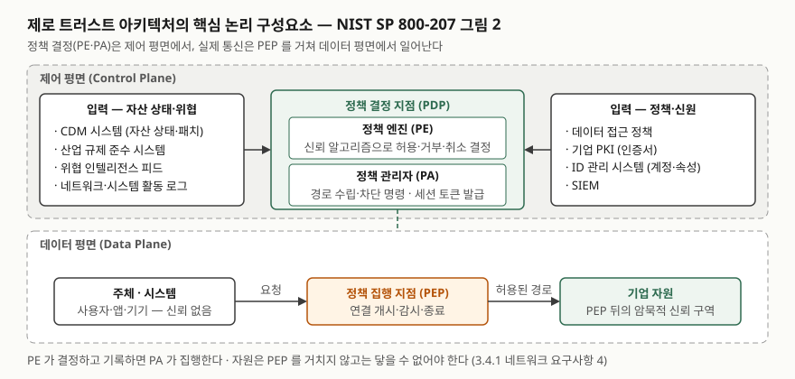

> 실행 검증 없음. 아키텍처 개념이므로 NIST SP 800-207 원문과 CISA 성숙도 모델 2.0을 근거로 정리했다.
> 국내 가이드라인 2.0은 KISA 자료실이 열리지 않아 발표 당시 업계 매체 기사 2건(2차 자료)으로 항목 수만
> 확인했고, 그 부분은 본문에 표시했다.

## 들어가며

보안 기출에서 "제로 트러스트"는 정의 문제로도, 재택근무·클라우드·공급망 문제의 대응 방안으로도 나온다.
많은 답안이 "절대 신뢰하지 않고 항상 검증한다"는 구호에서 끝나는데, 채점자는 그 다음 줄을 본다. 무엇을
검증하는 구성요소가 어디에 놓이고, 경계 방화벽과 무엇이 다른지, 기존 망에서 어떤 순서로 옮겨 가는지다.
실무에서는 VPN을 걷어내고 SaaS와 원격 근무자를 받아들여야 하는 조직이 "어느 제품을 사면 제로 트러스트가
되는가"를 묻는데, NIST 문서는 그것이 제품이 아니라 **계획**이라고 답한다.

## 정의

NIST SP 800-207의 운용 정의(2절)를 옮기면 이렇다.

**제로 트러스트(ZT)**: 네트워크가 이미 침해됐다고 보는 상황에서, 정보시스템과 서비스에 대해 **요청마다
정확한 최소 권한 접근 결정**을 집행할 때의 불확실성을 최소화하도록 설계된 **개념과 아이디어의 집합**이다.

**제로 트러스트 아키텍처(ZTA)**: 제로 트러스트 개념을 활용하고 **구성요소 관계, 워크플로 계획, 접근
정책**을 포괄하는 기업의 사이버보안 **계획**이다. 그 계획의 산물로 갖춰진 네트워크 인프라와 운영 정책이
**제로 트러스트 기업**이다.

같은 절은 짧은 정의도 둔다. 제로 트러스트는 **자원 보호**에 초점을 두고, 신뢰는 암묵적으로 부여되지 않으며
**계속 평가되어야 한다**는 전제에 선 사이버보안 패러다임이다. 답안 첫 줄에는 이 문장을, 본문에는 운용
정의의 세 요소(요청마다, 최소 권한, 침해된 네트워크 가정)를 쓴다.

## 등장 배경

전통적인 기업망은 **경계 방어**였다. 인터넷 관문의 방화벽이 바깥을 막고, 일단 내부망에 들어와 인증을 통과한
주체는 넓은 범위의 자원에 접근할 수 있었다. NIST는 이 결과로 **내부에서의 권한 없는 횡적 이동**(lateral
movement)이 연방 기관의 가장 큰 과제가 됐다고 적는다. 경계 방화벽은 내부에서 시작된 공격을 탐지·차단하는
데 쓸모가 적고, 경계 밖의 주체(원격 근무자, 클라우드 서비스, 엣지 기기)를 보호하지 못한다.

NIST는 이것을 **암묵적 신뢰 구역**(implicit trust zone)으로 설명한다. 공항 검색대를 지난 탑승 구역처럼,
한 번 정책 결정·집행 지점을 통과하면 그 안의 모든 개체가 같은 수준으로 신뢰된다. 검색대는 자기 위치보다
뒤에서는 정책을 더 적용할 수 없다. 그래서 제로 트러스트의 핵심은 **정책 결정·집행 지점을 자원 가까이
옮겨 암묵적 신뢰 구역을 가능한 한 작게** 만드는 것이다. 경계를 없애는 것이 아니라 경계를 자원 하나
단위로 줄이는 것이다.

## 구성요소

### 기본 원칙 — 7가지

NIST 2.1절은 제로 트러스트를 "무엇을 배제하는가"가 아니라 "무엇을 지키는가"로 정의하려고 7가지 원칙을
든다. 모든 원칙이 순수한 형태로 구현되지는 않을 수 있다고 전제한다.

| 번호 | 원칙 | 뜻 |
|---|---|---|
| ① | 모든 데이터 소스와 컴퓨팅 서비스를 **자원**으로 본다 | SaaS, 소형 기기, 액추에이터, 접근이 허용된 개인 기기까지 |
| ② | 네트워크 위치와 무관하게 **모든 통신을 보호**한다 | 내부망에 있다는 이유로 신뢰하지 않는다. 기밀성·무결성·출처 인증 |
| ③ | 개별 자원 접근은 **세션 단위**로 허가한다 | 한 자원의 인증·인가가 다른 자원의 접근을 주지 않는다. 최소 권한 |
| ④ | 접근은 **동적 정책**으로 결정한다 | 클라이언트 신원, 응용/서비스, 요청 자산의 관측 상태, 행위·환경 속성 |
| ⑤ | 보유·연계 자산의 **무결성과 보안 태세를 감시·측정**한다 | CDM 같은 체계로 기기 상태를 보고 패치. 취약한 자산은 다르게 취급 |
| ⑥ | 인증·인가는 **동적**이며 접근 허용 전에 **엄격히 집행**한다 | 접근·위협 평가·적응·재평가의 순환. ICAM과 MFA |
| ⑦ | 자산·인프라·통신 상태 **정보를 최대한 수집**해 태세 개선에 쓴다 | 정책 수립과 집행의 근거, 접근 요청의 맥락 |

2.2절은 이 원칙 위에 네트워크에 대한 가정 6가지를 더한다. 기업 사설망 전체가 암묵적 신뢰 구역이 아니라는
것, 망 위의 기기가 기업 소유가 아닐 수 있다는 것, 어떤 자원도 본래 신뢰되지 않는다는 것, 모든 자원이 기업
인프라 위에 있지는 않다는 것, 원격 주체는 자기 로컬 망을 신뢰할 수 없다는 것, 기업·비기업 인프라를 오가는
자산은 일관된 보안 정책을 가져야 한다는 것이다.

### 핵심 논리 구성요소 — 3개와 입력 8개

3절의 그림 2가 답안 도식의 원형이다. 정책 결정 지점(PDP)이 둘로 나뉘고 집행 지점이 하나 있다.

| 구성요소 | 역할 | 평면 |
|---|---|---|
| **정책 엔진**(Policy Engine, PE) | 주체의 자원 접근을 **허용·거부·취소**하는 최종 결정. 기업 정책과 외부 입력을 **신뢰 알고리즘**에 넣어 결정하고 기록한다 | 제어 |
| **정책 관리자**(Policy Administrator, PA) | PE의 결정을 **집행**한다. PEP에 명령해 주체와 자원 사이 통신 경로를 수립·차단하고, 세션용 인증 토큰·자격증명을 만든다 | 제어 |
| **정책 집행 지점**(Policy Enforcement Point, PEP) | 주체와 자원 사이 연결을 **개시·감시·종료**한다. 클라이언트 쪽 에이전트와 자원 쪽 게이트웨이로 나뉠 수도, 하나의 포털일 수도 있다 | 데이터 |

PE와 PA는 제품에 따라 한 서비스로 합쳐지기도 한다. PEP 뒤가 자원이 사는 암묵적 신뢰 구역이다. PE가
결정할 때 쓰는 입력은 **8가지**다. CDM(지속 진단·완화) 시스템, 산업 규제 준수 시스템, 위협 인텔리전스 피드,
네트워크·시스템 활동 로그, 데이터 접근 정책, 기업 PKI, ID 관리 시스템, SIEM이다. 암기할 때는 "자산 상태·
위협" 넷과 "정책·신원" 넷으로 나눈다.

### 접근 방식 — 3가지

3.1절은 모든 원칙을 구현하되 **정책의 주된 원천**이 무엇이냐로 세 접근을 나눈다. 완전한 해법은 셋의 요소를
모두 가진다.

| 접근 | 정책의 축 | 맞는 상황 |
|---|---|---|
| **강화된 신원 거버넌스** | 행위자의 **신원과 속성** | 방문자·비기업 기기가 많은 개방망, 기업 보안 구성요소를 둘 수 없는 SaaS |
| **마이크로 세그멘테이션** | 자원마다 둔 **게이트웨이**(스위치·NGFW·호스트 에이전트) | 자원 단위로 PEP를 둘 수 있는 환경. 신원 거버넌스 프로그램이 전제 |
| **네트워크 인프라·SDP** | **오버레이 네트워크**. PA가 네트워크 컨트롤러 역할 | SDN·의도 기반 네트워킹을 쓰는 환경 |

### 배치 변형 — 4가지

3.2절은 논리 구성요소를 실제로 어디에 두느냐로 네 변형을 든다.

1. **기기 에이전트/게이트웨이** — PEP를 기기의 에이전트와 자원 앞의 게이트웨이 둘로 나눈다. 기기 관리가
   잘 되는 조직, BYOD를 허용하지 않는 조직에 맞는다.
2. **엔클레이브 기반** — 게이트웨이를 자원 하나가 아니라 **자원 묶음의 경계**(온프레미스 데이터센터)에 둔다.
   API가 없는 레거시에 쓰지만, 묶음 안의 자원을 개별로 보호하지 못한다.
3. **자원 포털 기반** — PEP가 **포털 하나**다. 기기에 에이전트가 필요 없어 BYOD에 맞지만, 기기 상태를 포털이
   본 것만큼만 안다.
4. **기기 응용 샌드박싱** — 검증된 응용을 **샌드박스**에서 돌리고 그 응용만 PEP와 통신한다. 호스트가
   감염돼도 응용은 격리되지만, 조직이 샌드박스 응용을 전부 유지해야 한다.

### 신뢰 알고리즘 — 2축

3.3절은 PE를 뇌, 신뢰 알고리즘(TA)을 그 사고 과정에 비유한다. 입력은 접근 요청, 주체 데이터베이스, 자산
데이터베이스(관측 상태), 자원 요구사항, 위협 인텔리전스의 **5범주**다. 구현은 두 축으로 갈린다.

| 축 | 한쪽 | 다른쪽 |
|---|---|---|
| 평가 방식 | **기준 기반**(criteria): 자원마다 정한 조건을 **모두** 만족해야 허용 | **점수 기반**(score): 입력마다 가중치를 곱한 신뢰 수준이 **임계값**을 넘으면 허용 |
| 요청 간 관계 | **단일**(singular): 요청을 개별로 평가. 빠르지만 역할 안에 머무는 공격을 놓친다 | **맥락**(contextual): 주체의 **최근 이력**을 함께 평가. 상태를 유지해야 하지만 탈취된 계정의 비정상 패턴을 잡는다 |

NIST는 이상적으로는 맥락 기반이 좋지만 인프라가 허락하지 않을 수 있고, 정상 패턴에 대한 재인증 요구가
잦으면 사용성이 떨어진다고 적는다. 초기에는 정상 요청이 거부되는 **튜닝 단계**를 겪는다.

### 이행 절차 — 7단계

7절은 한 번의 교체가 아니라 **여정**이며 대부분의 조직이 하이브리드(ZTA + 경계 기반) 상태로 무기한
운영된다고 전제한다. 7.3절의 단계는 다음과 같다.

| 단계 | 하는 일 |
|---|---|
| ① 행위자 식별 | 사람과 비인간 개체(서비스 계정) 전부. 관리자·개발자는 더 엄격한 속성 |
| ② 자산 식별 | 하드웨어와 디지털 산출물(계정·응용·인증서). 섀도 IT와 비기업 기기까지. 상태 관측이 가능해야 한다 |
| ③ 핵심 프로세스 식별과 위험 평가 | 업무 프로세스와 데이터 흐름의 순위. 첫 대상은 **저위험** 프로세스 |
| ④ 후보 정책 수립 | 상·하류 자원과 관련 개체를 모두 적고, 기준 또는 가중치를 정한다 |
| ⑤ 후보 솔루션 선정 | 클라이언트 설치 필요 여부, 온프레미스 지원, 로그 제공, 프로토콜 범위, 사용자 행동 변화 |
| ⑥ 초기 배치와 모니터링 | 한동안 **보고 전용**(reporting-only)으로 운영해 기준선을 잡는다 |
| ⑦ 확장 | 정상 운영 단계. 워크플로가 바뀌면 전체를 재평가하고 다음 후보로 간다 |

## 도식

> **출처**: [NIST SP 800-207 §3 Logical Components of Zero Trust Architecture, Figure 2](https://nvlpubs.nist.gov/nistpubs/SpecialPublications/NIST.SP.800-207.pdf)(PE·PA·PEP와 8개 입력),
> [§3.4 Network/Environment Components](https://nvlpubs.nist.gov/nistpubs/SpecialPublications/NIST.SP.800-207.pdf)(제어 평면·데이터 평면 분리). 입력 8개를 둘로 묶은 것은 답안용 정리이고 원문의 구분은 아니다.

답안지에는 위에 제어 평면 상자, 안에 PE와 PA, 아래 데이터 평면에 주체 → PEP → 자원 세 상자를 그리고 PA에서
PEP로 점선을 내리면 된다. 입력은 양옆에 이름만 적는다.

## 비교

### 경계 방어와 제로 트러스트

| 구분 | 경계 기반 | 제로 트러스트 |
|---|---|---|
| 신뢰의 근거 | **네트워크 위치**(내부망) | 요청마다 **주체·기기·맥락**을 평가 |
| 암묵적 신뢰 구역 | 경계 안 전체 | PEP 뒤 자원 하나 단위로 최소화 |
| 인증·인가 시점 | 진입 시 한 번 | 세션마다, 그리고 세션 중에도 재평가(원칙 ③·⑥) |
| 횡적 이동 | 진입 후 자유로움 | 자원마다 다시 허가받아야 한다 |
| 원격·클라우드 | VPN으로 경계를 늘린다 | 클라이언트가 PEP를 거쳐 클라우드 자원에 직접 요청 |
| 운영 전제 | 경계 관리 | **자산·주체·업무 흐름의 완전한 목록**과 상태 관측 |

한쪽이 우월한 것은 아니다. NIST 자체가 하이브리드 운영을 전제하고, 원칙 ①~⑦은 경계 방화벽을 없애라고
하지 않는다. 경계를 자원 단위로 **잘게** 만드는 것이다.

### NIST, CISA 성숙도 모델, 국내 가이드라인

| 구분 | NIST SP 800-207 (2020-08) | CISA ZTMM 2.0 (2023-04) | 제로트러스트 가이드라인 2.0 (2024-12) |
|---|---|---|---|
| 성격 | 아키텍처 **정의**와 논리 구성요소 | 도입 **성숙도** 평가 틀 | 국내 기업 도입 **지침** (1.0은 2023-07) |
| 구조 | 7원칙, 3구성요소, 3접근, 4배치 | **5기둥**(신원·기기·네트워크·응용과 워크로드·데이터) + **3횡단 역량**(가시성과 분석·자동화와 오케스트레이션·거버넌스) | 기업망 **6핵심요소**(식별자·기기와 엔드포인트·네트워크·시스템·애플리케이션과 워크로드·데이터) |
| 단계 | 이행 7단계 | 성숙도 **4단계**(Traditional·Initial·Advanced·Optimal) | 성숙도 **4단계**(기존·초기·향상·최적화), 1.0의 3단계에서 세분 |

국내 가이드라인의 항목 수는 2차 자료(발표 당시 기사 2건)로 확인한 것이다. CISA는 자기 모델이 NIST의
이행 단계와 정렬된다고 밝히고, 평가 전에 현 상태 조사를 먼저 하라는 점에서 NIST 7.3절과 같다.

## 적용 시 고려사항

5절의 고유 위협 7가지(결정 과정 전복, 서비스 거부·네트워크 교란, 탈취 자격증명·내부자, 네트워크 가시성,
시스템·네트워크 정보 저장, 독점 포맷 의존, 비인간 개체의 관리 사용)가 곧 설계 시 판단할 지점이다.

- **PE·PA가 단일 장애점이자 최우선 공격 대상이 된다.** 모든 통신이 PE·PA의 승인을 거치므로 구성 변경은
  로그와 감사 대상이어야 하고(5.1절), PEP·PE·PA는 보안된 클라우드나 여러 위치에 복제해 가용성을 확보한다(5.2절).
  클라우드 제공자의 운영 사고로 PE가 닿지 않으면 기업 전체가 멈춘다.
- **목록이 없으면 PE가 거부한다.** 이행 1~2단계의 자산·주체·업무 흐름 조사가 불완전하면 정보 부족으로
  정상 요청이 거부되는 업무 장애가 난다(7.3절). 섀도 IT는 네트워크 기반 접근에서 아예 쓸 수 없게 될 수 있다.
- **첫 대상은 저위험 프로세스로, 보고 전용으로 시작한다.** 초기 정책은 완전하지 않아 관리자 계정이 막히기도
  한다. 한동안 허용하며 기준선을 잡은 뒤 조인다(7.3.6절). 다만 MFA 실패와 알려진 공격 IP는 처음부터 차단한다.
- **신뢰 알고리즘의 축을 자원별로 정한다.** 기준 기반은 자원마다 독립적으로 조건을 둬야 하고, 점수 기반은
  가중치와 임계값 튜닝이 필요하다. 맥락 기반은 PE가 주체별 상태를 유지해야 하므로 PA·PEP가 행위를 보고하는
  경로가 설계에 들어가야 한다(3.3.1절).
- **정책 저장소와 수집한 트래픽 자체가 정찰 자료다.** 접근 정책은 어느 계정이 가치 있는지를 알려 주므로
  가장 제한적인 정책으로 전용 관리자 계정에서만 접근하게 한다(5.5절).
- **비인간 개체의 인증을 설계한다.** 자동화 에이전트가 사람 대신 PE·PA와 상호작용하는데, 그 자격증명이
  탈취되면 정책 자체가 바뀔 수 있다(5.7절). 비인간 신원은 별도 글에서 다뤘다.
- **독점 포맷에 묶이지 않게 한다.** 입력 소스 사이에 공통 표준이 없어 공급자 교체 비용이 크다(5.6절).
  공급자 선정에 전환 비용과 공급망 위험을 넣는다.

> 관련 개념: [비인간 신원(NHI)](../2026-09-28-non-human-identity-workload-identity/index.md) ·
> [접근통제 모델 — DAC·MAC·RBAC·ABAC](../2026-09-29-access-control-dac-mac-rbac-abac/index.md)

## 정리

- 제로 트러스트 = **침해된 네트워크를 전제로 요청마다 최소 권한 접근 결정을 내리는 개념의 집합**. ZTA는 그 개념으로 세운 **계획**.
- 경계 방어와의 차이는 **신뢰의 근거**: 위치가 아니라 주체·기기·맥락. 암묵적 신뢰 구역을 자원 단위로 줄인다.
- 암기 단서 **7-3-8-3-4-2-7**: 원칙 7, 핵심 구성요소 3(PE·PA·PEP), 입력 8, 접근 3, 배치 4, 신뢰 알고리즘 2축, 이행 7단계.
- 고유 위협 7가지의 첫째는 PE·PA 전복. 가용성·감사·목록 선행·보고 전용 시작이 대응이다.
- CISA는 5기둥·3횡단 역량·4단계, 국내 가이드라인 2.0은 6핵심요소·4단계.

## 참고 자료

- [NIST SP 800-207, Zero Trust Architecture (2020-08)](https://csrc.nist.gov/pubs/sp/800/207/final) — [PDF](https://nvlpubs.nist.gov/nistpubs/SpecialPublications/NIST.SP.800-207.pdf): §2 정의, §2.1 7원칙, §2.2 네트워크 가정 6, §3 논리 구성요소와 입력, §3.1 접근 3, §3.2 배치 4, §3.3 신뢰 알고리즘, §3.4.1 네트워크 요구사항, §5 위협 7, §7.3 이행 7단계
- [CISA, Zero Trust Maturity Model Version 2.0 (2023-04)](https://www.cisa.gov/sites/default/files/2023-04/zero_trust_maturity_model_v2_508.pdf) — §5 5기둥·3횡단 역량·4단계
- [바이라인네트워크, '제로트러스트 가이드라인 2.0' 공개…단계별 성숙도 모델·도입절차 구체화 (2024-12-03)](https://byline.network/2024/12/3-220/) — 2차 자료, 6핵심요소·4단계
- [디지털데일리, 베일 벗은 '제로트러스트 가이드라인 2.0' (2024-12-03)](https://www.ddaily.co.kr/page/view/2024120314433218979) — 2차 자료, 1.0 발표 시점(2023-07)·4단계
- [OASIS, eXtensible Access Control Markup Language (XACML) Version 2.0](https://docs.oasis-open.org/xacml/2.0/access_control-xacml-2.0-core-spec-os.pdf) — PDP·PEP 용어의 출처 (NIST 각주 3)
