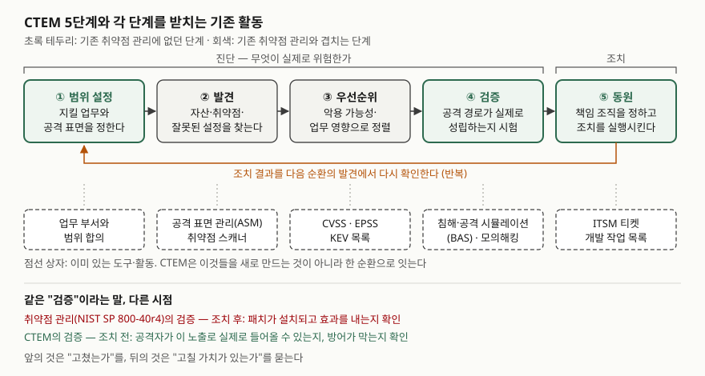

> 실행 검증 없음. 개념 정리이므로 문서 근거만으로 썼다.
>
> **1차 자료 없음.** CTEM을 정의한 표준이나 공공기관 문서는 찾지 못했다. 용어를 만든 Gartner의
> 리포트(2023-10-16)를 기준으로 삼고, 그와 독립된 해설 3건(IBM Think 2026-06-05, HackerOne
> 2026-07-02, Infosecurity Europe 2026-08-14)으로 5단계와 기존 방식과의 차이를 교차 확인했다.
> 세 해설 모두 Gartner 틀을 설명하므로 **정의의 원천은 하나**다(§10). 비교 대상인 취약점 관리·
> 우선순위 입력값은 1차 자료(NIST SP 800-40r4, FIRST EPSS, CISA KEV)로 확인했다.

## 들어가며

CTEM은 "취약점을 계속 스캔한다"로 이해하면 기존 취약점 관리와 구분되지 않는다. 시험에서 갈리는 지점은
**기존 생애주기의 앞에 범위 설정이, 뒤에 검증·동원이 붙은 이유**를 쓰는가다. 실무에서는 스캐너가 매달
수천 건을 쏟아내는데 고친 건수만 보고되고, 정작 SaaS 설정이나 공급망처럼 스캐너가 잡지 못하는 노출은
목록에 없는 상황으로 나타난다. CTEM은 이 두 문제를 겨냥한다.

## 정의

**CTEM(Continuous Threat Exposure Management, 지속적 위협 노출 관리)**: 공격자가 실제로 이용할 수 있는
노출을 **범위 설정 → 발견 → 우선순위 → 검증 → 동원의 5단계로 반복**해, 경영진이 이해하고 실무 조직이
실행할 수 있는 개선 계획을 만드는 **보안 프로그램**이다. 2022년 Gartner가 이름 붙였다(Gartner 2023,
HackerOne 2026, Infosecurity Europe 2026).

Gartner는 이것을 도구가 아니라 **우선순위를 계속 다듬는 체계적 접근**으로 설명한다. IBM은 기존 취약점
관리의 범위를 넓히고 주기를 늘리며 초점을 좁힌 진화형으로 설명한다. 표현은 다르지만 **제품이 아니라
운영 틀**이라는 점은 일치한다.

**노출(exposure)** 은 패치할 수 있는 소프트웨어 취약점보다 넓다. 잘못된 설정, SaaS 설정, 공급망 의존성,
보안 통제의 약점처럼 **패치로 해결되지 않는 것**까지 포함한다(Gartner 2023).

## 등장 배경

NIST SP 800-40r4는 취약점 관리 생애주기를 **파악 → 대응 계획 → 대응 실행(준비·적용·확인·지속 감시)** 으로
둔다(§2.2). 이 틀 자체는 패치 외의 대응도 인정한다 — **수용·완화·전가·회피**의 4가지다(§2.1).
문제는 운영에서 생겼다.

1. **전부 고칠 수 없다.** 같은 문서도 패치가 아직 없거나, 지원이 끝났거나, 점검 창을 기다려야 하는 경우를
   든다(§2.1). 발견 건수가 대응 역량을 넘으면 "무엇부터"가 핵심 질문이 된다.
2. **점수만으로 순서를 매긴다.** 심각도 점수는 취약점 자체의 성질이고, 내 환경에서 실제로 뚫리는지는
   말해 주지 않는다(IBM 2026, HackerOne 2026).
3. **활동이 따로 논다.** 공격 표면 관리, 취약점 스캔, 모의해킹이 각각 있지만 결과가 통합되지 않는다(Gartner 2023).
4. **보고서에서 멈춘다.** 앞 단계는 잘 돌아가는데 조치 단계에서 막힌다(HackerOne 2026).

## 구성요소 / 절차

**CTEM 5단계** — Gartner 2023, IBM 2026, HackerOne 2026에서 교차 확인

| 단계 | 하는 일 | 기존 취약점 관리와 |
|---|---|---|
| ① 범위 설정 (Scoping) | 보안 조직과 업무 부서가 지킬 업무·핵심 자산과 공격 표면을 정한다 | **새로 붙음** — 인프라 단위가 아니라 업무 단위 |
| ② 발견 (Discovery) | 범위 안의 자산과 노출을 찾는다. 설정 오류·통제 약점까지 | 겹침 — 대상이 넓어짐 |
| ③ 우선순위 (Prioritization) | 악용 가능성·자산 중요도·업무 영향·위협 정보로 정렬 | 겹침 — 점수 외 입력이 늘어남 |
| ④ 검증 (Validation) | 공격자 시각으로 실제 악용 가능 여부, 방어·대응 절차가 막는지 시험 | **새로 붙음** |
| ⑤ 동원 (Mobilization) | 확인된 노출의 책임 조직과 절차를 정하고 실행시킨다 | **새로 붙음** — 부서 간 조치 체계 |

해설 자료는 앞 단계를 **진단**("무엇이 실제로 위험한가"), 동원을 **조치**로 나눠 설명한다.

**우선순위 입력값 3가지** — 1차 자료

| 입력 | 무엇을 말하나 | 출처 |
|---|---|---|
| CVSS | 취약점 자체의 심각도 | FIRST |
| EPSS | 공개된 CVE가 **앞으로 30일 안에** 실제로 악용될 확률 추정 | FIRST |
| KEV | **실제로 악용된 증거**가 있는 취약점 목록. CVE 부여, 악용 증거, 명확한 조치 방법의 3가지 기준 | CISA |

CTEM의 ③은 여기에 **자산 중요도와 업무 영향**을 곱한다. 같은 KEV 취약점이라도 인터넷에 노출된 결제
서버와 격리된 시험 서버의 순서는 다르다.

## 도식

> **출처**: Gartner, Top Strategic Technology Trends for 2024: Continuous Threat Exposure Management (G00796532, 2023-10-16) · [IBM Think, What is CTEM (2026-06-05)](https://www.ibm.com/think/topics/ctem) · [HackerOne, The Complete Guide to CTEM (2026-07-02)](https://www.hackerone.com/blog/complete-guide-to-ctem) · [NIST SP 800-40r4 §2.2 Software Vulnerability Management Life Cycle](https://csrc.nist.gov/pubs/sp/800/40/r4/final) (2차 자료 기반)

답안지에는 상자 다섯 개를 가로로 놓고 ⑤에서 ①로 되돌아가는 화살표를 그린다. ①④⑤에 표시를 해
"기존에 없던 단계"임을 보이면 된다.

## 비교

### "검증"이 두 번 나온다 — 시점이 다르다

NIST의 생애주기에도 **확인(verify)** 이 있다. 패치가 설치되고 효과를 내는지, 추가 통제가 의도대로 동작하는지,
회피했으면 자산이 실제로 폐기됐는지 본다(§2.2 3-c). 이것은 **조치 후**의 확인이다. CTEM의 검증은
**조치 전**에 공격 경로가 성립하는지를 본다. 앞의 것은 "고쳤는가", 뒤의 것은 "고칠 가치가 있는가"를 묻는다.

### 인접 개념과의 대비

| 구분 | 취약점 관리 (VM) | 공격 표면 관리 (ASM) | 침해·공격 시뮬레이션 (BAS) | CTEM |
|---|---|---|---|---|
| 묻는 것 | 알려진 자산에 어떤 취약점이 있나 | 외부에 드러난 자산이 무엇인가 | 알려진 공격 기법을 방어가 막나 | 무엇을 먼저 고쳐야 위험이 실제로 주나 |
| 주로 보는 것 | 소프트웨어 취약점 | 외부 노출 자산 | 보안 통제의 효과 | 노출 전체 + 업무 영향 |
| 산출물 | 취약점 목록, 패치 현황 | 자산 목록 | 통제별 탐지·차단 결과 | 확인된 공격 경로와 조치 계획 |
| CTEM에서의 자리 | ②·③ | ② | ④ | 전체 틀 |

ASM과 BAS는 CTEM과 경쟁 관계가 아니라 **한 단계를 맡는 구성 활동**이다(IBM 2026, HackerOne 2026).

## 적용 시 고려사항

- **자산 목록을 먼저 맞춘다.** NIST는 OT·IoT·컨테이너까지 포함한 소프트웨어 목록을 계속 갱신하라고
  하고, 월·분기 스캔으로 목록을 갱신하던 방식은 더 쓰지 말라고 적는다(§3.2). 범위 설정과 발견이 같은
  자산을 가리키려면 CMDB와 클라우드 API로 자동 수집한 목록이 기준이 되어야 한다.
- **도구별 결과를 공통 식별자로 묶는다.** 스캐너, 클라우드 설정 점검, ASM 결과가 따로 쌓이면 ③에서 한
  기준으로 정렬할 수 없다. 자산 식별자와 CVE 식별자로 결과를 합치는 데이터 통합이 우선이다.
- **패치 불가 노출은 대응 유형을 기록한다.** 패치가 없거나 지원이 끝난 노출에는 NIST의 4가지 대응 중
  완화(망 분리, 기능 비활성화)·전가·회피를 고르고, **어떤 대응을 택했는지를 남겨** 다음 순환에서 다시 본다.
- **검증 범위와 중단 기준을 정한다.** BAS와 모의해킹은 운영 시스템을 건드린다. 대상·시간대·중단 조건을
  사전에 합의하고 변경 관리 기록과 연결한다.
- **동원은 기존 작업 흐름으로 넘긴다.** 보안 조직의 보고서로 끝나면 고쳐지지 않는다. ITSM 티켓과 개발
  작업 목록으로 넘기고, 처리 기한을 운영 조직과 합의한다. Gartner는 첫 순환을 전사가 아니라 **공격 표면
  하나나 새 애플리케이션 하나**로 시작하라고 권한다.

## 정리

- **정의 1줄**: 실제로 악용 가능한 노출을 5단계로 반복 관리해 실행 가능한 개선 계획을 만드는 보안 프로그램(Gartner, 2022).
- **5단계 — 범·발·우·검·동**(범위 설정·발견·우선순위·검증·동원). 새로 붙은 것은 **범위 설정·검증·동원** 3개.
- **검증의 두 시점** — VM은 조치 후 "고쳤는가", CTEM은 조치 전 "실제로 뚫리는가".
- **우선순위 입력 3가지** — CVSS(심각도)·EPSS(30일 악용 확률)·KEV(실제 악용) + 업무 영향.
- **대응 4가지(NIST)** — 수용·완화·전가·회피. 패치 불가 노출은 완화·회피로 간다.

> 기출 답안: [기출문제 — CTEM(지속적 위협 노출 관리)](../../exam/2026-10-10-continuous-threat-exposure-management/index.md)

## 참고 자료

- Gartner, Top Strategic Technology Trends for 2024: Continuous Threat Exposure Management (G00796532, Jeremy D'Hoinne·Pete Shoard, 2023-10-16) — 정의, 5단계, 패치 가능·불가 노출, 도입 방식. 유료 리포트라 링크를 달지 않는다 (2차 등급: 애널리스트 리포트)
- [Gartner 보도자료, Gartner Identifies the Top 10 Strategic Technology Trends for 2024 (2023-10-16)](https://www.gartner.com/en/newsroom/press-releases/2023-10-16-gartner-identifies-the-top-10-strategic-technology-trends-for-2024) — CTEM을 2024 전략 기술 동향으로 소개
- [NIST SP 800-40 Rev. 4, Guide to Enterprise Patch Management Planning (2022-04)](https://csrc.nist.gov/pubs/sp/800/40/r4/final) — §2.1 위험 대응 4가지, §2.2 취약점 관리 생애주기, §3.2 소프트웨어·자산 목록
- [FIRST, Exploit Prediction Scoring System (EPSS)](https://www.first.org/epss/) — 공개된 CVE의 30일 내 악용 확률 추정
- [CISA, Known Exploited Vulnerabilities Catalog](https://www.cisa.gov/known-exploited-vulnerabilities) — 등재 기준 3가지, BOD 22-01 기준을 이어받은 BOD 26-04(2026-06-10)
- [IBM Think, What is continuous threat exposure management (CTEM)? (Derek Robertson·Matthew Kosinski, 2026-06-05)](https://www.ibm.com/think/topics/ctem) — 5단계, 취약점 관리와의 차이, ASM·BAS·모의해킹의 자리
- [HackerOne, The Complete Guide to Continuous Threat Exposure Management (CTEM) (2026-07-02)](https://www.hackerone.com/blog/complete-guide-to-ctem) — 5단계, 동원 단계의 정체, EASM·BAS와의 관계
- [Infosecurity Europe, Understanding Continuous Threat Exposure Management (Kevin Poireault, 2026-08-14)](https://www.infosecurityeurope.com/en-gb/blog/guides-checklists/understanding-ctem-gartner-framework.html) — 2022년 Gartner 명명, 정기 스캔과의 차이
