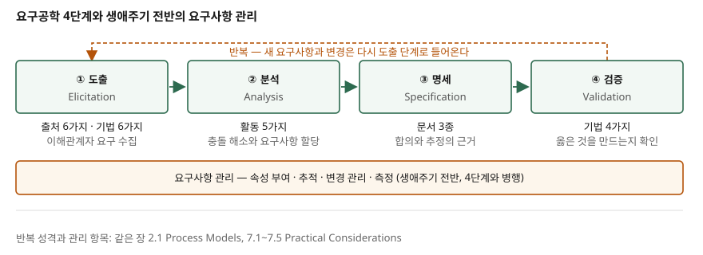

> **실행 검증 없음.** 개념 정리 글이라 실행할 예제가 없다. 정의와 항목은 SWEBOK
> Guide V3.0 Chapter 1과 ISO/IEC/IEEE 29148:2018 서지 정보를 근거로 적었고,
> 근거 없는 수치는 쓰지 않았다.

## 들어가며

요구공학은 정보관리기술사에서 단답과 논술 양쪽으로 반복해 나온다. 4단계를 나열하는
문제는 쉬운 편이지만, "각 단계의 산출물"이나 "검증과 확인의 차이"로 들어가면 답안이
갈린다. 단계 이름만 외운 답안은 여기서 점수를 잃는다.

실무에서도 같다. 납품 직전에 "이건 우리가 말한 게 아니다"가 나오는 프로젝트는
대개 도출이나 검증 어느 한 단계를 건너뛴 곳이다. 이 글은 단계마다 하위 항목을
개수와 함께 정리하고, 그 단계를 빼먹으면 무엇이 무너지는지를 근거에 붙여 정리한다.

## 정의

**요구공학은 소프트웨어 요구사항의 도출, 분석, 명세, 검증과 생애주기 전반에 걸친
요구사항 관리를 다루는 지식 영역이다.** (SWEBOK Guide V3.0 Chapter 1)

여기서 요구사항의 정의도 함께 끊어 둘 필요가 있다.

**소프트웨어 요구사항은 실세계의 어떤 문제를 해결하기 위해 무언가가 반드시 보여야
하는 속성이다.** (SWEBOK Guide V3.0 §1.1)

출처에 따라 강조점이 다르다. SWEBOK은 **활동**(도출·분석·명세·검증)으로 정의하고,
ISO/IEC/IEEE 29148:2018은 **생애주기 프로세스**로 규정하며 요구사항의 속성과 특성,
프로세스의 반복적·재귀적 적용을 다룬다. 답안에는 두 관점을 나눠 쓰는 편이 안전하다.

SWEBOK이 강조하는 필수 속성은 하나다. **모든 요구사항은 검증 가능해야 한다.**
기능 요구사항은 개별 기능으로, 비기능 요구사항은 시스템 수준에서 검증 가능해야 한다.
검증할 수 없는 요구사항은 요구사항이 아니라 희망사항이다.

## 등장 배경

이전 방식의 문제는 **요구사항을 문서 한 장의 산출물로 봤다**는 점이다.
IEEE 830-1998은 SRS 작성법, 1233-1998은 시스템 요구사항 명세, 1362-1998은 운영 개념
문서를 다뤘다. 세 표준 모두 **문서 템플릿 중심**이었다.

ISO/IEC/IEEE 29148이 이 세 표준을 대체했고 2018년판이 현행이다. 요구공학을 12207과
15288의 생애주기에 맞물리는 **프로세스**로 규정한다. 문서에서 프로세스로 무게 중심이
옮겨진 것이 변화의 핵심이다.

## 구성요소 / 절차

요구공학은 **4단계**로 구성되고, 여기에 생애주기 전반의 **요구사항 관리**가 병행된다.

### ① 도출 (Elicitation)

요구사항의 출처를 찾아 정보를 끌어내는 단계다. **요구사항 출처는 6가지**다.

| 출처 | 내용 |
|---|---|
| 목표 | 소프트웨어의 상위 목적. 대개 모호하게 표현되므로 가치와 비용을 평가해야 한다 |
| 도메인 지식 | 도출된 요구사항을 이해하기 위한 배경 지식 |
| 이해관계자 | 사용자, 고객, 시장 분석가, 규제 기관, 소프트웨어 엔지니어 |
| 비즈니스 규칙 | 업무 자체의 구조나 행위를 정의하거나 제약하는 문장 |
| 운영 환경 | 실행 환경에서 파생되는 제약. 실시간 시스템의 타이밍 제약 등 |
| 조직 환경 | 업무 프로세스를 둘러싼 조직의 구조, 문화, 내부 정치 |

**도출 기법은 6가지**가 주요 기법으로 제시된다. 인터뷰, 시나리오(유스케이스 기술),
프로토타입, 촉진 회의(facilitated meeting), 관찰(에스노그래피), 사용자 스토리다.

SWEBOK은 **한 집단의 요구사항을 다른 집단의 희생 위에서 강조한 소프트웨어가
불만족스러운 결과로 이어졌다**고 지적한다. 결과물은 쓰기 어렵거나 고객 조직의
문화적·정치적 구조를 훼손한다. 이해관계자 식별 누락이 곧 이 실패다.

### ② 분석 (Analysis)

요구사항 간 충돌을 찾아 해소하고, 소프트웨어의 경계를 파악하며, 시스템 요구사항에서
소프트웨어 요구사항을 도출하는 단계다. **하위 활동은 5가지**다.

1. **요구사항 분류** — 기능/비기능, 파생/직접, 제품/프로세스 등 여러 차원으로 분류
2. **개념 모델링** — 문제 영역의 모델 작성
3. **아키텍처 설계와 요구사항 할당** — 요구사항을 만족할 책임이 있는 아키텍처
   구성요소에 배정하는 것
4. **요구사항 협상** — 충돌 해소. 우선순위 결정을 포함하며 비용-가치 접근,
   분석적 계층화 기법(AHP) 등이 쓰인다
5. **정형 분석** — 형식 의미론을 가진 언어로 표현해 속성을 증명. 고신뢰 시스템에서 유효

3번이 빠지면 상세 분석 자체가 막힌다. SWEBOK은 **할당이 있어야 요구사항의 상세
분석이 가능**하다고 명시한다. 구성요소에 배정된 뒤에야 그 구성요소가 다른 구성요소와
어떻게 상호작용해야 하는지가 추가 요구사항으로 나온다.

### ③ 명세 (Specification)

체계적으로 검토·평가·승인할 수 있는 문서를 만드는 단계다. 소프트웨어 외 구성요소가
많은 복잡한 시스템에서는 **문서 3종**이 만들어진다.

| 문서 | 성격 |
|---|---|
| 시스템 정의서 | 도메인 관점의 상위 시스템 요구사항. 사용자·고객이 읽는다 |
| 시스템 요구사항 명세 | 시스템 요구사항. 엄밀히는 시스템 공학 활동이다 |
| 소프트웨어 요구사항 명세(SRS) | 고객과 공급자 사이 합의의 기반 |

단순한 소프트웨어 제품이면 **세 번째만** 필요하다. 이 점이 시험에서 자주 묻는 부분이다.

SRS는 **다섯 가지 근거**를 동시에 제공한다. 설계 착수 전 엄격한 평가와 재설계 감소,
비용·위험·일정 추정, 검증·확인 계획 수립, 새 사용자·플랫폼 이관, 기능 개선이다.
명세를 생략하면 이 다섯이 한꺼번에 사라진다.

### ④ 검증 (Validation)

**옳은 소프트웨어를 정의하고 있는지**, 즉 사용자가 기대하는 소프트웨어를 정의했는지
확인하는 단계다. **기법은 4가지**다.

1. **요구사항 검토(review, inspection)** — 가장 흔한 방법. 검토 그룹 구성이 중요하고
   체크리스트로 무엇을 볼지 안내한다
2. **프로토타이핑** — 엔지니어의 해석이 맞는지 확인. 사용자가 부수적 요소에 주의를
   빼앗기는 단점이 있다
3. **모델 검증** — 분석 단계 모델의 품질 검증. 정형 표기를 썼다면 속성 증명 가능
4. **인수 테스트** — 각 요구사항을 어떻게 검증할지 계획. 비기능 요구사항은 정량적으로
   표현될 수준까지 분해해야 설계할 수 있다

## 도식

> **구조 근거**: [SWEBOK Guide V3.0](https://ieeecs-media.computer.org/media/education/swebok/swebok-v3.pdf)
> Chapter 1 Software Requirements — 3. Requirements Elicitation, 4. Requirements Analysis,
> 5. Requirements Specification, 6. Requirements Validation의 주제 분해를 4단계로 옮겼고,
> 반복 화살표와 하단 관리 띠는 같은 장 2.1 Process Models(생애주기 전반에 걸쳐 정제되는
> 프로세스)와 7.1~7.5 Practical Considerations(반복적 성격, 변경 관리, 요구사항 속성,
> 추적, 측정)에 근거했다. 단계 간 산출물 전달 방식은 문서에 특정 표기가 없어 그리지 않았다.

## 비교

### 4단계 비교

| 단계 | 목적 | 주요 산출물 | 빠지면 무너지는 것 |
|---|---|---|---|
| 도출 | 출처에서 정보를 끌어냄 | 이해관계자·출처 목록, 초기 요구 목록 | 특정 집단의 요구만 반영되어 쓰기 어려운 결과물 |
| 분석 | 충돌 해소, 경계 확정, 할당 | 개념 모델, 분류·우선순위, 할당 결과 | 할당이 없어 상세 분석 자체가 불가 |
| 명세 | 합의 가능한 문서화 | 시스템 정의서, 시스템 요구사항 명세, SRS | 합의·추정·검증 계획의 근거 소실 |
| 검증 | 옳은 것을 정의했는지 확인 | 검토 기록, 프로토타입, 인수 테스트 계획 | 검증 불가능한 요구사항이 그대로 남음 |

### 검증(validation)과 확인(verification)

시험에서 가장 자주 묻는 대비다. SWEBOK은 요구사항 문서가 양쪽 절차의 대상이 될 수
있다고 보고 둘을 구분한다.

| 구분 | 묻는 질문 | 대상 |
|---|---|---|
| 검증(validation) | 옳은 소프트웨어를 정의했는가 | 사용자가 기대하는 것과 요구사항이 일치하는지 |
| 확인(verification) | 문서가 규격에 맞는가 | 사내 표준 준수, 이해 가능성, 일관성, 완전성 |

사내 표준의 용어가 널리 통용되는 표준과 어긋나면 **둘 사이의 매핑을 합의해 문서에
첨부**해야 한다는 점도 함께 적어 두면 좋다.

## 적용 시 고려사항

- **선형 프로세스로 구현하지 않는다.** SWEBOK은 대규모 프로젝트의 요구사항이 완벽히
  이해되거나 명세되는 일은 신화라고 못 박는다. 설계·조달 결정을 내릴 만큼의 품질과
  상세도까지 반복해 수렴시키는 것이 현실적인 목표다.
- **요구사항을 구성 항목으로 관리한다.** 요구사항은 다른 생애주기 산출물과 동일한
  구성 관리 대상이다. 고유 식별자를 부여해 추적하고, 우선순위와 상태 같은 속성을 붙인다.
- **이해관계자 전원을 먼저 식별한다.** 전원을 식별하고 이해관계의 성격을 분석한
  뒤에야 도출이 가능하다. 전원을 완벽히 만족시키는 것은 불가능하므로, 주요 이해관계자가
  수용하고 예산·기술·규제 제약 안에 있는 절충안을 협상하는 것이 엔지니어의 일이다.
- **비기능 요구사항은 정량화한 뒤 받는다.** 인수 테스트를 설계할 수 있는 수준까지
  분해되지 않으면 검증할 수 없다.
- **문서화를 부담으로 보는 조직도 결국 요구사항을 복원해야 한다.** 제품이 진화하면
  변경 영향을 평가할 근거가 필요해진다는 것이 SWEBOK의 지적이다.

## 정리

- 암기 단서는 **도-분-명-검**이다. 도출 → 분석 → 명세 → 검증, 그리고 전 구간에 관리.
- 개수로 묶으면 **출처 6 · 기법 6 · 분석 활동 5 · 명세 문서 3 · 검증 기법 4**다.
  답안에서는 개수를 먼저 쓰고 항목을 나열한다.
- 정의는 두 갈래로 쓴다. 활동 관점은 SWEBOK, 생애주기 프로세스 관점은 29148:2018.
- 29148:2018은 IEEE 830-1998, 1233-1998, 1362-1998을 대체했다. 문서 중심에서
  프로세스 중심으로의 전환이 배경이다.
- 단계별 실패는 각각 다른 것을 무너뜨린다. 도출은 이해관계자 편향, 분석은 할당 부재,
  명세는 합의·추정 근거 소실, 검증은 검증 불가능한 요구사항 잔존.

## 참고 자료

- [SWEBOK Guide V3.0 — Chapter 1 Software Requirements](https://ieeecs-media.computer.org/media/education/swebok/swebok-v3.pdf) (IEEE Computer Society)
- [ISO/IEC/IEEE 29148-2018 — Systems and software engineering, Life cycle processes, Requirements engineering](https://standards.ieee.org/ieee/29148/6937/)
