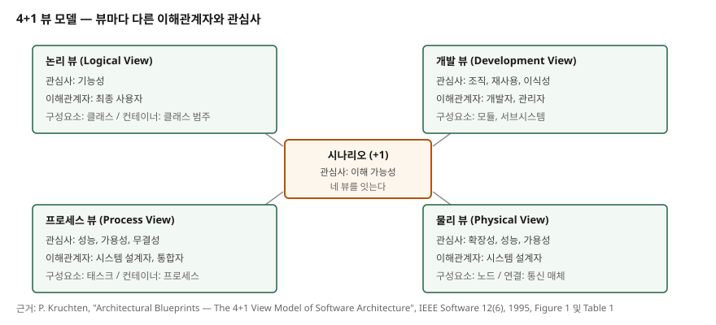

> **실행 검증 없음.** 개념 정리 글이라 실행할 예제가 없다. 뷰 구성과 표의 항목은
> P. Kruchten의 1995년 논문을 근거로 적었고, 논문에 없는 내용은 쓰지 않았다.

## 들어가며

아키텍처 설명을 요청받아 그림을 한 장 그리다 보면 매번 같은 지점에서 막힌다.
박스가 실행 중인 프로그램인지, 소스 코드 덩어리인지, 물리 서버인지 뒤섞인다.
화살표도 컴파일 의존성인지 제어 흐름인지 데이터 흐름인지 구분되지 않는다.

기술사 답안에서도 같은 일이 일어난다. "아키텍처를 설명하라"에 박스 몇 개를 그려 놓으면
채점자가 읽을 관심사가 특정되지 않는다. 4+1 뷰가 시험에 반복해 나오는 이유가 여기에 있다.
**뷰를 나누는 기준이 곧 이해관계자를 나누는 기준**이라는 것이 이 모델의 요점이다.

이 글은 다섯 뷰를 나열하는 대신, 뷰마다 누구의 어떤 관심사를 담는지와 어떤 뷰를
생략할 수 있는지를 원 논문 근거로 정리한다.

## 정의

**4+1 뷰 모델은 여러 개의 동시적 뷰를 사용해 소프트웨어 집약 시스템의 아키텍처를
기술하는 모델이다.** 여러 뷰를 쓰는 목적은 두 가지다. 최종 사용자·개발자·시스템
엔지니어·프로젝트 관리자 등 **이해관계자들의 관심사를 분리해 다루는 것**, 그리고
**기능 요구사항과 비기능 요구사항을 분리해 다루는 것**이다.
(P. Kruchten, IEEE Software 12(6), 1995)

논문은 각 뷰에 Perry와 Wolf의 공식을 독립적으로 적용한다.

> 소프트웨어 아키텍처 = {요소(Elements), 형식(Forms), 근거·제약(Rationale/Constraints)}

즉 뷰마다 쓸 요소 집합을 정하고, 동작하는 형식과 패턴을 포착하고, 근거와 제약을
요구사항에 연결한다. **뷰마다 자기 표기법을 쓰고 자기 아키텍처 스타일을 고를 수 있다.**
그래서 한 시스템 안에 여러 스타일이 공존할 수 있다.

## 등장 배경

이전 방식의 문제는 **한 장의 청사진에 표현할 수 있는 것보다 많은 것을 담으려 했다**는
점이다. 그 결과 박스가 실행 프로그램인지 소스 덩어리인지 물리 컴퓨터인지 알 수 없게 되고,
보통은 그 모두가 조금씩 섞인다.

논문은 그로 인한 두 가지 손상을 지적한다. 소프트웨어를 너무 이르게 분할한 시스템 설계의
흉터, 그리고 데이터 공학·런타임 효율·개발 전략과 팀 조직 중 **한 측면만 과도하게 강조**한
결과다. 또한 아키텍처가 모든 이해관계자의 관심사를 다루지 못하는 문제는
Garlan과 Shaw, CMU의 Abowd와 Allen, SEI의 Clements 등 여러 저자가 이미 지적한 것이다.

처방이 뷰의 분리다. 하나의 관심사 집합을 다루는 여러 개의 동시적 뷰로 아키텍처 기술을
조직하는 것이다.

## 구성요소 / 절차

**뷰는 5개**다. 네 개의 뷰에 시나리오가 더해진다.

1. **논리 뷰(Logical View)** — 설계의 객체 모델. 기능 요구사항을 주로 지원한다.
   객체지향 방법을 쓰지 않는 데이터 중심 애플리케이션이면 E-R 다이어그램 같은 다른
   형태를 쓸 수 있다.
2. **프로세스 뷰(Process View)** — 설계의 동시성과 동기화 측면을 포착한다.
3. **개발 뷰(Development View)** — 개발 환경에서의 소프트웨어 정적 조직. 소프트웨어를
   프로그램 라이브러리나 서브시스템 단위로 묶고, 계층 구조로 조직한다. 각 계층은 위
   계층에 좁고 잘 정의된 인터페이스를 제공한다.
4. **물리 뷰(Physical View)** — 소프트웨어를 하드웨어에 매핑한다. 가용성, 신뢰성,
   성능, 확장성 같은 비기능 요구사항을 주로 다룬다.
5. **시나리오(Scenarios)** — 유스케이스의 인스턴스 몇 개. 나머지 네 뷰가 함께 동작함을
   보이는 역할이다.

시나리오가 "+1"인 이유는 **다른 뷰들과 중복되기 때문**이다. 중복인데도 두는 이유는 두
가지다. 아키텍처 설계 중 아키텍처 요소를 발견하는 **동력**이 되고, 설계가 끝난 뒤에는
**검증과 예시**의 역할을 한다. 후자는 문서상의 검증뿐 아니라 아키텍처 프로토타입
테스트의 출발점이 된다.

개발 뷰의 용도는 시험에서 자주 묻는 부분이다. 요구사항 할당, 팀별 작업 배분과 팀 조직,
비용 산정과 계획, 진척 관리, 재사용·이식성·보안에 대한 판단, 제품 라인 확립의 기반이 된다.

## 도식

> **출처**: [P. Kruchten, "Architectural Blueprints — The 4+1 View Model of Software Architecture", IEEE Software 12(6), Nov 1995, pp. 42-50](https://www.cs.ubc.ca/~gregor/teaching/papers/4+1view-architecture.pdf)
> — 네 뷰의 배치와 시나리오의 중앙 위치는 논문 Figure 1, 각 박스의 구성요소·연결·컨테이너·
> 이해관계자·관심사는 논문 Table 1을 그대로 옮겼다. Figure 1은 물리 뷰의 이해관계자를
> 시스템 엔지니어로, Table 1은 시스템 설계자로 적는다. 그림에는 Table 1을 따랐다.
> 뷰 사이의 선은 논문이 "완전히 직교하지 않는다"고만 밝힌 연결 관계를 나타낸 것으로,
> 구체적 전달 방식은 근거가 없어 그리지 않았다.

## 비교

논문 Table 1을 답안용으로 옮기면 이렇다. 뷰 이름만 외우지 말고 이 표의 가로 한 줄을
묶어 기억하는 편이 좋다.

| 뷰 | 구성요소 | 연결 | 컨테이너 | 이해관계자 | 관심사 |
|---|---|---|---|---|---|
| 논리 | 클래스 | 연관, 상속, 포함 | 클래스 범주 | 최종 사용자 | 기능성 |
| 프로세스 | 태스크 | 랑데부, 메시지, 브로드캐스트, RPC | 프로세스 | 시스템 설계자, 통합자 | 성능, 가용성, 소프트웨어 내고장성, 무결성 |
| 개발 | 모듈, 서브시스템 | 컴파일 의존성, include | 서브시스템(라이브러리) | 개발자, 관리자 | 조직, 재사용, 이식성, 제품 라인 |
| 물리 | 노드 | 통신 매체(LAN, WAN, 버스) | 물리 서브시스템 | 시스템 설계자 | 확장성, 성능, 가용성 |
| 시나리오 | 단계, 스크립트 | — | 웹 | 최종 사용자, 개발자 | 이해 가능성 |

### 다른 뷰 모델과의 관계

논문은 다른 저자들이 제안한 뷰들이 대개 이 네 뷰 중 하나로 접힌다고 본다.
비용·일정 뷰는 개발 뷰로, 데이터 뷰는 논리 뷰로, 실행 뷰는 프로세스 뷰와 물리 뷰의
조합으로 접힌다. 뷰를 추가하기 전에 **기존 뷰로 접히는지 먼저 확인**하라는 뜻이다.

4+1은 1995년에 제안된 **특정 뷰 집합**이고, 뷰와 뷰포인트 자체를 규정하는 것은
ISO/IEC/IEEE 42010:2022다. 이 표준은 아키텍처 기술의 구조와 표현에 대한 요구사항을
규정하며 아키텍처 뷰포인트, 이해관계자 관점, 모델 종류, 아키텍처 기술 프레임워크(ADF)와
기술 언어(ADL)를 다룬다. 답안에서 "4+1은 42010이 말하는 뷰포인트 집합의 한 예"로
위치를 잡아 주면 깔끔하다.

## 적용 시 고려사항

- **모든 시스템이 다섯 뷰를 다 필요로 하지 않는다.** 쓸모없는 뷰는 생략한다.
  프로세서가 하나면 물리 뷰를, 프로세스나 프로그램이 하나면 프로세스 뷰를 생략할 수 있다.
  아주 작은 시스템은 논리 뷰와 개발 뷰가 너무 비슷해 따로 기술할 필요가 없을 수 있다.
  **시나리오는 모든 경우에 유용하다**는 점이 이 절의 결론이다.
- **선형 4단계 설계를 쓰지 않는다.** 논문은 스케치·조직화·명세·최적화의 4단계 접근이
  야심차고 전례 없는 프로젝트에는 너무 선형이라고 본다. 4단계가 끝난 시점에도 아키텍처를
  검증할 만큼 알려진 것이 적기 때문이다. 대신 아키텍처를 프로토타입으로 만들어
  테스트·측정·분석하고 다음 반복에서 정제하는 방식을 택한다.
- **시나리오 주도로 반복한다.** 위험도와 중요도로 소수의 시나리오를 고르고,
  스트로맨 아키텍처를 세우고, 시나리오를 스크립팅해 주요 추상화를 식별한 뒤 네 청사진에
  배치한다. 구현·테스트·측정으로 결함과 개선점을 찾고 교훈을 기록한다. 다음 반복은
  위험 재평가와 시나리오 확장으로 시작한다.
- **진화적 프로토타입을 쓴다.** 논문이 말하는 프로토타입은 버리는 탐색적 프로토타입이
  아니라 서서히 시스템이 되어 가는 것이다. 이 방식은 팀 빌딩, 교육, 도구 확보 같은
  부수적 이득도 준다.
- **뷰 사이 대응을 놓치지 않는다.** 뷰는 완전히 직교하지 않는다. 논리 뷰에서 프로세스
  뷰로 넘어갈 때는 클래스의 **자율성, 영속성, 종속성, 분산** 네 가지 특성을 본다.
  시나리오는 주로 논리 뷰와 연결되고, 객체 간 상호작용이 제어 스레드 둘 이상에 걸치면
  프로세스 뷰와도 연결된다.

## 정리

- 암기 단서는 **논-프-개-물 + 시**다. 논리·프로세스·개발·물리 네 뷰에 시나리오 하나.
- 이해관계자로 묶으면 논리는 최종 사용자, 프로세스는 통합자, 개발은 개발자와 관리자,
  물리는 시스템 설계자, 시나리오는 사용자와 개발자 모두다.
- 관심사로 묶으면 기능성 / 성능·가용성 / 조직·재사용·이식성 / 확장성 / 이해 가능성이다.
- 시나리오는 중복이지만 남긴다. 요소를 **발견**하는 동력이자 설계를 **검증**하는 수단이다.
- 뷰는 생략할 수 있다. 프로세서 하나면 물리 뷰를, 프로세스 하나면 프로세스 뷰를 뺀다.

## 참고 자료

- [P. Kruchten, "Architectural Blueprints — The 4+1 View Model of Software Architecture", IEEE Software 12(6), Nov 1995, pp. 42-50](https://www.cs.ubc.ca/~gregor/teaching/papers/4+1view-architecture.pdf)
- [ISO/IEC/IEEE 42010:2022 — Software, systems and enterprise, Architecture description](https://www.iso.org/standard/74393.html)
