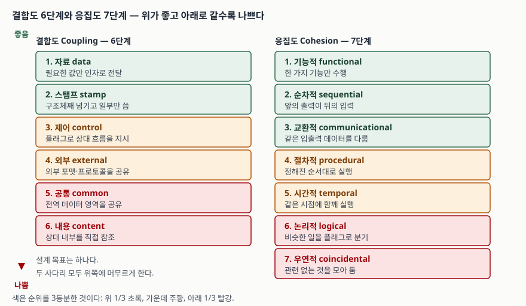

> **실행 검증 없음.** 이 글은 표준 문서와 원 논문의 정의를 정리한 개념 글이다.
> 본문의 코드 조각은 등급 판별을 설명하기 위한 예시이며 실행해 측정한 결과가 아니다.
> 측정값이나 통계는 싣지 않았다.

## 들어가며

모듈화 문제는 "결합도는 낮추고 응집도는 높인다"는 한 줄로 끝나는 것처럼 보인다.
그런데 실제 시험에서는 코드 조각이나 설계 상황을 주고 **몇 등급인지 고르라**고 묻는다.
이때 사다리의 단계 이름만 외워서는 답이 안 나온다. 단계 사이의 경계가 어디인지,
무엇을 보고 가르는지를 알아야 한다.

게다가 표준 문서와 시험용 사다리가 정확히 일치하지 않는다. 이 차이를 모르고 답안에
출처를 적으면 오히려 틀린 인용이 된다. 이 글은 판별 기준과 출처 문제를 함께 정리한다.

## 정의

**결합도(coupling)**: 소프트웨어 모듈 사이의 상호의존이 이루어지는 **방식과 정도**.
(ISO/IEC/IEEE 24765:2017)

**응집도(cohesion)**: 하나의 소프트웨어 모듈이 수행하는 작업들이 **서로 관련되어 있는
방식과 정도**. (ISO/IEC/IEEE 24765:2017)

두 정의 모두 "방식과 정도"라는 같은 틀을 쓴다. 답안 첫 줄에 이 대구를 그대로 쓰면
두 개념이 한 쌍으로 설계된 것임이 드러난다. 표준은 응집도의 동의어로 **module strength**를
함께 싣는데, 이것이 1974년 원 논문에서 쓰던 용어다.

## 등장 배경

1960년대 말까지 모듈을 나누는 기준은 "코드가 길어지면 자른다" 수준이었다. 잘린 단위가
서로 전역 변수를 만지고 상대 내부로 뛰어드는 일이 흔했고, 한 곳을 고치면 어디가 깨질지
예측할 수 없었다.

Constantine이 제시하고 Stevens·Myers·Constantine이 1974년 IBM Systems Journal에
발표한 구조적 설계는 여기에 **두 개의 축**을 세웠다. 모듈 **사이**를 보는 축이 결합도,
모듈 **안**을 보는 축이 응집도다. 나누는 행위 자체가 아니라 나눈 결과를 등급으로
평가할 수 있게 한 것이 이 작업의 핵심이다.

## 구성요소

**결합도는 6단계, 응집도는 7단계**다. 각 단계의 판별 단서는 다음과 같다.

**결합도 6단계** (낮은 쪽이 좋다)

| 단계 | 이름 | 판별 단서 |
|---|---|---|
| 1 | 자료 data | 필요한 값만 인자로 주고받는다 |
| 2 | 스탬프 stamp | 구조체·레코드째 넘기고 그중 일부만 쓴다 |
| 3 | 제어 control | 플래그를 넘겨 상대의 실행 흐름을 지시한다 |
| 4 | 외부 external | 외부 파일 포맷·프로토콜·장치를 함께 전제한다 |
| 5 | 공통 common | 전역 데이터 영역을 여럿이 함께 읽고 쓴다 |
| 6 | 내용 content | 상대 모듈의 내부를 직접 참조하거나 고친다 |

**응집도 7단계** (높은 쪽이 좋다)

| 단계 | 이름 | 판별 단서 |
|---|---|---|
| 7 | 기능적 functional | 모든 작업이 하나의 기능에 기여한다 |
| 6 | 순차적 sequential | 앞 작업의 출력이 뒤 작업의 입력이 된다 |
| 5 | 교환적 communicational | 같은 입력 자료를 쓰거나 같은 출력을 만든다 |
| 4 | 절차적 procedural | 정해진 실행 순서를 공유할 뿐이다 |
| 3 | 시간적 temporal | 같은 시점에 필요해서 모였다 (초기화 묶음) |
| 2 | 논리적 logical | 비슷한 종류의 일을 플래그로 골라 처리한다 |
| 1 | 우연적 coincidental | 작업들 사이에 기능적 관련이 없다 |

## 도식

> **출처**: 각 단계의 정의는 [ISO/IEC/IEEE 24765:2017 Systems and software
> engineering — Vocabulary](https://pascal.computer.org/sev_display/index.action)의
> `content coupling` · `common-environment coupling` · `control coupling` · `data coupling`
> 및 `functional` · `sequential` · `communicational` · `procedural` · `temporal` ·
> `logical` · `coincidental cohesion` 표제어를 따랐다.
> 등급의 **순서**는 Stevens·Myers·Constantine(1974)과 Yourdon·Constantine(1979) 계열의
> 분류이며, 24765는 유형을 나열할 뿐 순위를 매기지 않는다. 색은 그 순서를 3등분한 것이다.

답안지에는 두 개의 사다리와 아래로 향하는 화살표 하나면 된다. 좌우 폭을 맞추고
위쪽을 "좋음"으로 통일하면 5분 안에 옮길 수 있다.

## 비교

### 표준 문서와 시험용 사다리가 다른 지점

답안에 출처를 적을 때 가장 주의할 부분이다.

| 항목 | ISO/IEC/IEEE 24765:2017 | 구조적 설계 계열 (시험 답안) |
|---|---|---|
| 결합도 유형 | 내용 · 공통환경 · 제어 · 자료 · **혼합** · **병리적** (6종) | 자료 · **스탬프** · 제어 · **외부** · 공통 · 내용 (6단계) |
| 스탬프 · 외부 결합도 | 표제어에 **없다** | 사다리에 포함된다 |
| 순위 | 매기지 않는다 | 6단계로 순서를 매긴다 |
| 응집도 유형 | 7종 (우연적~기능적) | 7단계, 표준과 일치 |

응집도는 표준과 시험용 사다리가 정확히 일치한다. 어긋나는 것은 결합도 쪽이다.
답안에 "ISO/IEC/IEEE 24765 기준 6단계"라고 쓰면 스탬프·외부가 들어간 그 목록은
표준의 목록이 아니므로 잘못된 인용이 된다. **정의는 표준을 인용하고, 6단계 순서는
구조적 설계 계열로 밝히는 것**이 정확하다.

### 헷갈리는 쌍

| 구분 | 무엇으로 가르나 |
|---|---|
| 자료 vs 스탬프 | 넘긴 것을 **다 쓰면** 자료, 일부만 쓰면 스탬프 |
| 자료 vs 제어 | 넘긴 값이 **데이터면** 자료, 분기를 지시하면 제어 |
| 공통 vs 내용 | 공유 **영역**을 거치면 공통, 상대 내부를 직접 만지면 내용 |
| 절차적 vs 순차적 | 순서만 공유하면 절차적, **데이터가 이어지면** 순차적 |
| 교환적 vs 순차적 | 같은 데이터를 **각자** 쓰면 교환적, 넘겨주면 순차적 |
| 시간적 vs 논리적 | 같은 **시점**이면 시간적, 같은 **종류**면 논리적 |

판별 순서는 **3단계**로 잡으면 빠르다. ① 모듈 사이에 오가는 것이 값인지 제어인지
공유 영역인지를 먼저 본다 → ② 값이라면 전부 쓰는지 일부만 쓰는지 본다 →
③ 모듈 안에서는 작업들이 데이터로 이어지는지, 순서만 같은지, 종류만 같은지를 본다.

## 적용 시 고려사항

- **제어 결합도는 플래그 인자로 드러난다.** 호출 측이 `render(data, is_summary)`처럼
  동작 방식을 지시하고 있다면, 함수를 둘로 쪼개는 것이 보통 옳다. 이 플래그는 거의 항상
  호출 측이 모듈 내부의 분기를 알고 있다는 뜻이다.
- **논리적 응집은 제어 결합을 부른다.** 한 모듈이 플래그로 여러 종류를 처리하면,
  호출 측은 그 플래그를 넘길 수밖에 없다. 두 지표는 따로 움직이지 않는다.
- **공통 결합도를 없애려다 인자 목록이 길어질 수 있다.** 전역을 걷어낸 자리에 인자
  열 개가 생기면 스탬프 결합도로 옮겨간 것일 뿐이다. 무엇을 위해 낮추는지를 함께 적는다.
- **시간적 응집은 그 자체로 결함이 아니다.** 초기화 루틴은 시간적 응집이 자연스럽다.
  등급이 낮다는 이유로 기계적으로 쪼개면 오히려 호출 순서 의존이 밖으로 드러난다.
- **객체지향에서는 축이 하나 더 붙는다.** 상속은 부모의 내부 표현에 자식을 묶으므로
  절차적 분류로는 내용 결합도에 가깝게 읽힌다. 답안에서 구조적 설계 기준임을 밝혀 둔다.

## 정리

- 정의는 대구로 외운다. 결합도는 모듈 **사이**, 응집도는 모듈 **안**, 둘 다 "방식과 정도".
- 개수는 **결합도 6, 응집도 7**이다. 답안에서 개수를 먼저 적고 시작한다.
- 결합도 두문자: **자·스·제·외·공·내** (좋은 쪽부터).
- 응집도 두문자: **기·순·교·절·시·논·우** (좋은 쪽부터).
- 판별은 3단계다. 오가는 것이 무엇인가 → 다 쓰는가 → 안에서 무엇으로 묶였는가.
- 출처는 나누어 적는다. **정의는 ISO/IEC/IEEE 24765, 6단계 순서는 구조적 설계 계열.**
  표준에는 스탬프·외부 결합도 표제어가 없다.

## 참고 자료

- [ISO/IEC/IEEE 24765:2017 Systems and software engineering — Vocabulary (SEVOCAB 온라인 검색)](https://pascal.computer.org/sev_display/index.action)
- [ISO/IEC/IEEE 24765:2017 표준 정보](https://www.iso.org/standard/71952.html)
- [ISO/IEC TR 19759:2016 SWEBOK Guide V3 — §2.1.4 Coupling and Cohesion](https://www.computer.org/education/bodies-of-knowledge/software-engineering)
- W. P. Stevens, G. J. Myers, L. L. Constantine, "Structured Design", *IBM Systems Journal* 13(2), 1974, pp. 115–139. [ACM DL](https://dl.acm.org/doi/10.1147/sj.132.0115)
- E. Yourdon, L. L. Constantine, *Structured Design: Fundamentals of a Discipline of Computer Program and Systems Design*, Prentice-Hall, 1979.
- [ISO/IEC 25010:2023 — Modularity (제품 품질 모델에서의 모듈성)](https://www.iso.org/standard/78176.html)
