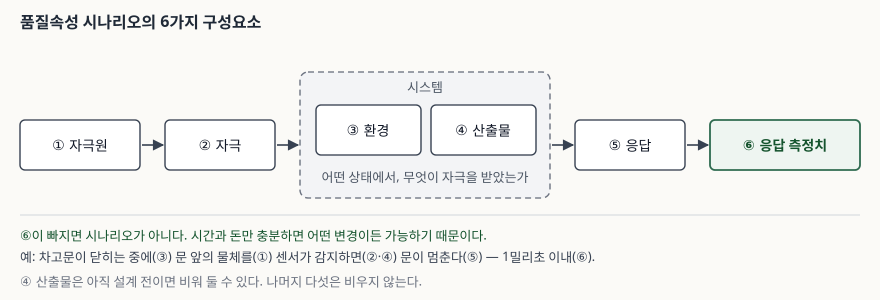
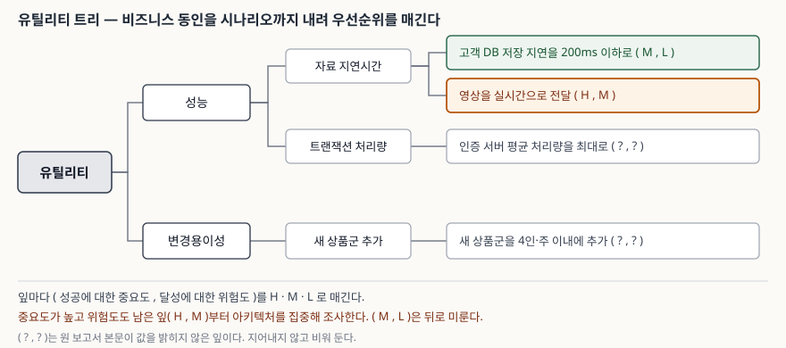

> **실행 검증 없음.** 이 글은 SEI 기술보고서 두 건의 정의와 절차를 정리한 개념 글이다.
> 성능 수치나 적용 통계는 싣지 않았고, 본문의 예시는 원 보고서가 든 예시를 옮긴 것이다.

## 들어가며

요구사항 명세에 "시스템은 성능이 우수해야 한다"고만 적혀 있으면 아키텍트가 그 문장으로
결정할 수 있는 것은 없다. 어떤 요청이 어떤 상태에서 몇 밀리초 안에 끝나야 하는지가
빠져 있기 때문이다. 시험이 품질속성 시나리오와 유틸리티 트리를 함께 묻는 이유가 여기에
있다. 하나는 요구를 검사할 수 있는 형태로 바꾸고, 다른 하나는 그렇게 바꾼 요구 가운데
어디를 먼저 볼지 정한다. ATAM 답안에서 5단계가 왜 "분석 범위를 정하는 단계"인지
설명하려면 이 두 개념이 먼저 서야 한다.

## 정의

**품질속성 시나리오**는 품질속성 요구를 자극과 응답으로 나누어 측정 가능한 형태로 적은
짧은 서술이다. SEI는 시나리오가 최소한 분명한 자극과 응답을 가져야 하고, 우선순위가
높은 시나리오는 6가지 항목으로 더 구체화하라고 정한다.

**유틸리티 트리**는 시스템의 비즈니스 동인을 구체적인 품질속성 시나리오로 옮기고
우선순위를 매기는 하향식 도구다. 뿌리 노드인 "유틸리티"는 시스템 전체의 좋음을 뜻한다.

답안 첫 줄에는 둘을 이어 쓰는 편이 낫다. 시나리오는 요구를 측정 가능하게 만드는
**형식**이고, 유틸리티 트리는 그 시나리오들을 담아 우선순위를 매기는 **구조**다.

## 등장 배경

첫째, 검사할 수 없는 요구 문장이 문제였다. ATAM 보고서는 "아키텍처는 변경 가능하고
견고해야 한다" 같은 문장에는 운영적 의미가 없어 반증할 수 없다고 적는다. 참인지
거짓인지 판정할 방법이 없으므로 평가의 입력이 되지 못한다.

둘째, 범위가 문제였다. 같은 보고서는 아키텍처 수준의 분석조차 본래 범위가 정해져 있지
않다고 적는다. 평가에 쓸 수 있는 시간은 한정돼 있는데 어디를 볼지 정해 주는 장치가
없으면, 평가는 아키텍트가 설명하기 편한 부분에서 끝난다.

셋째, 누락이 문제였다. QAW 보고서는 기능 요구가 설계를 끌고 가면 품질속성이 빠지거나
잊히고 그 자리를 아키텍트의 가정이 채운다고 적는다. 이해관계자에게 무엇이 중요한지
묻지 않은 채 설계가 진행되는 것이다.

## 구성요소 — 시나리오 6가지, 트리 4계층, 우선순위 2축

시나리오의 구성요소는 **6가지**다.

| 번호 | 구성요소 | 무엇을 적나 |
|---|---|---|
| ① | 자극원 | 자극을 만들어 낸 주체 |
| ② | 자극 | 시스템에 영향을 주는 조건 |
| ③ | 환경 | 그 자극이 일어난 상황·상태 |
| ④ | 산출물 | 자극을 받은 시스템 구성요소 |
| ⑤ | 응답 | 자극의 결과로 일어나는 활동 |
| ⑥ | 응답 측정치 | 그 응답을 무엇으로 평가할지 |

> **출처**: [Barbacci 외, *Quality Attribute Workshops (QAWs), Third Edition*, CMU/SEI-2003-TR-016, §3.8 Step 8: Scenario Refinement, Appendix A·B](https://insights.sei.cmu.edu/library/quality-attribute-workshops-qaws-third-edition/)

유틸리티 트리는 **4계층**이다. 뿌리인 유틸리티, 그 아래 품질속성, 각 속성의 하위 요인,
그리고 잎에 놓이는 시나리오다. 성능이 자료 지연시간과 트랜잭션 처리량으로 갈라지고,
자료 지연시간이 다시 "고객 DB 저장 지연을 200ms 이하로" 같은 잎으로 내려가는 식이다.
잎까지 내려가야 비로소 서로 비교할 수 있을 만큼 구체적이 된다.

우선순위는 **2축**으로 매긴다. 하나는 시스템의 성공에 그 잎이 얼마나 중요한가이고,
다른 하나는 그 수준을 달성하는 데 어느 정도 위험이 있다고 보는가다. 각 축은 상·중·하
세 등급을 쓴다. 보고서는 이해관계자가 이보다 잘게 나눈 구분을 일관되게 반복해 내지
못하기 때문이라고 이유를 밝힌다.

> **출처**: [Kazman·Klein·Clements, *ATAM: Method for Architecture Evaluation*, CMU/SEI-2000-TR-004, §5.3 Utility Trees, Figure 3](https://www.sei.cmu.edu/library/atam-method-for-architecture-evaluation/)

ATAM이 다루는 시나리오는 **3종**이다. 현재 시스템의 전형적 사용을 다루는 사용 사례
시나리오, 예상되는 변경을 다루는 성장 시나리오, 극단적 변경으로 한계를 드러내는 탐색
시나리오다. 유틸리티 트리의 잎에는 이 가운데 무엇이든 올 수 있다.

## 비교 — 유틸리티 트리와 시나리오 브레인스토밍

ATAM은 시나리오를 두 번 모은다. 5단계에서 유틸리티 트리로 한 번, 7단계에서 이해관계자
전원의 브레인스토밍으로 또 한 번이다. 보고서는 둘의 차이를 이렇게 정리한다.

| 구분 | 유틸리티 트리 | 시나리오 브레인스토밍 |
|---|---|---|
| 참여자 | 아키텍트, 프로젝트 리더 | 이해관계자 전원 |
| 전형적 인원 | 평가자 2명 + 프로젝트 인력 2~3명 | 평가자 4~5명 + 관련 인력 5~10명 |
| 주 목적 | 주도적 품질속성 요구를 끌어내 구체화·우선순위화하고 이후 평가의 초점을 잡는다 | 트리로 끌어낸 품질속성 목표를 이해관계자 소통으로 검증한다 |
| 접근 방향 | 하향식 (일반 → 구체) | 상향식 (구체 → 일반) |

두 결과가 어긋나는 것 자체가 결과다. 브레인스토밍에서 트리에 없던 주도 시나리오가
나오면, 아키텍트가 본 중요도와 이해관계자가 본 중요도가 다르다는 뜻이다.

## 적용 시 고려사항

- **응답 측정치가 없으면 시나리오가 아니다.** QAW 보고서는 "새 이벤트 생성기를 넣도록
  시스템을 수정한다"로 끝내면 아키텍처가 그 변경을 얼마나 잘 받아 주는지 알 수 없다고
  적는다. 시간과 돈만 충분하면 어떤 변경이든 가능하기 때문이다. "2인·주 이내"처럼
  측정 기준이 붙어야 아키텍트가 맞출 대상이 생긴다.
- **둘째 축은 비용이 아니라 위험이다.** 중요도만으로 순서를 정하면 중요하지만 이미
  달성이 확실한 잎에 평가 시간을 쓰게 된다. 원 보고서가 (중요도 중, 위험도 하)와
  (중요도 상, 위험도 중)을 나란히 예로 든 이유가 그것이다. 파고들 곳은 뒤쪽이다.
- **트리 상위 노드는 고정된 분류표가 아니다.** 보고서는 이해관계자 집단마다 자기 품질속성을
  더하거나 같은 개념을 다른 이름으로 부른다고 적는다. 표준 품질 모델의 분류와 1:1로
  맞추려 들면 그 조직이 실제로 중요하게 여기는 요구가 도리어 밀려난다.
- **환경 칸을 비워 두지 않는다.** 같은 응답이라도 평시에는 쉽고 피크 시간대에는 불가능할
  수 있다. 운영 모드가 나뉘는 시스템일수록 환경이 시나리오의 난이도를 결정한다.
- **④ 산출물은 비워 둘 수 있다.** QAW 양식도 "알고 있다면"이라는 단서를 붙여 둔다.
  설계 전이라 자극받는 구성요소를 특정할 수 없는 시점이 있기 때문이다. 나머지 다섯
  항목에는 같은 단서가 없다.

## 정리

- 시나리오 **6요소**: 자극원 · 자극 · 환경 · 산출물 · 응답 · 응답 측정치.
  앞 넷이 조건이고 뒤 둘이 결과다. 두문자는 **원·자·환·산·응·측**.
- 유틸리티 트리 **4계층**: 유틸리티 → 품질속성 → 하위 요인 → 시나리오.
- 우선순위 **2축**: 중요도와 위험도, 각각 상·중·하. 표기는 (H, M) 꼴.
- ATAM 시나리오 **3종**: 사용 사례 · 성장 · 탐색.
- 시나리오 수집은 **두 번**이다. 5단계 하향식, 7단계 상향식. 둘이 어긋나면 그것이 결과다.
- 한 줄로 외운다. **측정치 없는 문장은 요구가 아니고, 우선순위 없는 요구 묶음은 평가 계획이 아니다.**

> 기출 답안: [기출문제 — ATAM(Architecture Trade-off Analysis Method)](../../exam/2026-09-21-atam/index.md)

## 참고 자료

- [Rick Kazman, Mark Klein, Paul Clements, *ATAM: Method for Architecture Evaluation*, CMU/SEI-2000-TR-004, Software Engineering Institute, 2000.8 — §5.1 시나리오 3종, §5.2 Table 1, §5.3 유틸리티 트리](https://www.sei.cmu.edu/library/atam-method-for-architecture-evaluation/)
- [Mario R. Barbacci 외, *Quality Attribute Workshops (QAWs), Third Edition*, CMU/SEI-2003-TR-016, 2003.8 — §3.8 시나리오 6요소, Appendix A 양식, Appendix B 예시](https://insights.sei.cmu.edu/library/quality-attribute-workshops-qaws-third-edition/)
- [Mario R. Barbacci 외, *Quality Attributes*, CMU/SEI-95-TR-021, 1995.12 — 품질속성 용어의 공동체별 차이](https://insights.sei.cmu.edu/library/quality-attributes/)
- [ISO/IEC 25010:2023 Systems and software quality models — 품질속성 분류 표준](https://www.iso.org/standard/78176.html)
