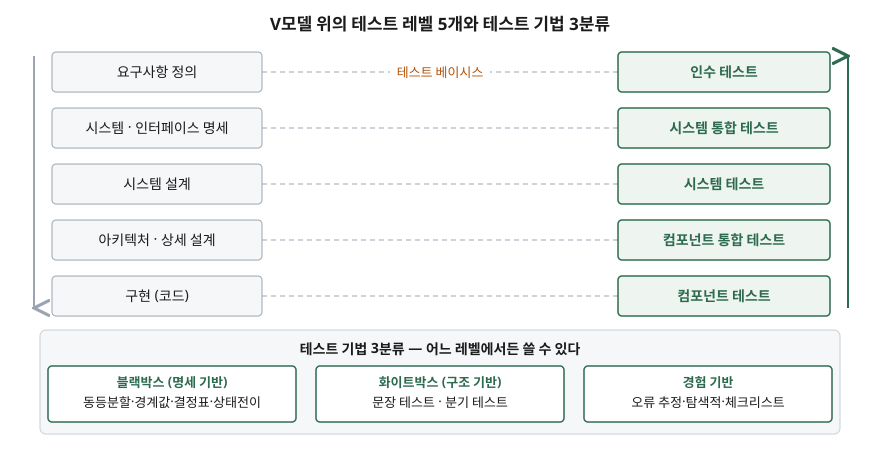

## 들어가며

"단위 테스트는 했는데 통합에서 터졌다"는 말은 현장에서 흔히 오간다. 이 말이 성립하는 이유는
레벨마다 **테스트 대상과 목적과 근거 문서가 다르기** 때문이다. 시험에서는 이 구분을
"테스트 레벨을 쓰고 각 레벨의 테스트 베이시스를 설명하라" 형태로 묻는다.
기법 분류는 한 단계 더 나아가 "무엇을 근거로 테스트 케이스를 뽑는가"를 묻는다.
두 축이 섞이면 답안이 흐려지므로 **레벨과 기법을 분리해** 외우는 것이 핵심이다.

## 정의

> **테스트 레벨**(test level)은 함께 조직되고 관리되는 테스트 활동의 묶음이다.
> 각 레벨은 개별 컴포넌트에서 완성된 시스템까지, 개발의 특정 단계에 있는 소프트웨어를
> 대상으로 수행되는 **테스트 프로세스의 한 인스턴스**다.
> — ISTQB CTFL Syllabus v4.0.1 §2.2

> **테스트 기법**(test technique)은 테스트 분석(무엇을 테스트할지)과
> 테스트 설계(어떻게 테스트할지)를 지원하여, 적지만 충분한 테스트 케이스 집합을
> 체계적으로 도출하게 하는 방법이다. — ISTQB CTFL Syllabus v4.0.1 §4.1

답안 첫 줄에는 "테스트 레벨은 함께 관리되는 테스트 활동의 묶음이며, 각 레벨은
테스트 프로세스의 인스턴스다"까지 쓰면 정의로 충분하다.

## 등장 배경

레벨 구분이 없던 시절의 문제는 **책임과 시점이 뒤섞이는 것**이었다.
코드를 짠 사람이 곧바로 전체 시스템을 켜서 확인하면, 결함이 났을 때 원인이 내 코드인지
연결된 모듈인지 외부 시스템인지 가려낼 수 없다. 결함 위치를 좁히려면 테스트 대상을
작은 것부터 키워 가며 **한 번에 한 종류의 결함만 노출되게** 해야 한다.

기법 분류는 다른 문제에서 나왔다. 입력 조합은 사실상 무한하므로 전수 테스트가 불가능하다.
그래서 "적지만 충분한" 케이스를 뽑는 근거가 필요했고, 근거를 무엇에서 가져오는지에 따라
명세·구조·경험의 세 갈래가 자리 잡았다.

## 구성요소

### 테스트 레벨 — 5개

ISTQB CTFL v4.0.1의 테스트 레벨 항목(§2.2.1)이 기술하는 레벨은 다음 **5개**다.

| # | 레벨 | 대상 | 특징 |
|---|---|---|---|
| 1 | 컴포넌트 테스트 (단위 테스트) | 컴포넌트 단독 | 테스트 하네스·단위 테스트 프레임워크 필요. 보통 개발자가 개발 환경에서 수행 |
| 2 | 컴포넌트 통합 테스트 | 컴포넌트 간 인터페이스·상호작용 | 상향식·하향식·빅뱅 등 **통합 전략에 크게 의존** |
| 3 | 시스템 테스트 | 시스템·제품 전체의 동작과 능력 | 종단 간 기능 테스트 + 비기능 품질 특성. 독립 테스트 조직이 수행할 수 있다 |
| 4 | 시스템 통합 테스트 | 대상 시스템과 **다른 시스템·외부 서비스**의 인터페이스 | 운영 환경에 가까운 테스트 환경이 필요 |
| 5 | 인수 테스트 | 배포 준비 완료의 입증(확인, validation) | UAT·운영·계약·규제 인수, 알파·베타 테스트로 나뉜다 |

레벨을 구별하는 **속성 5가지**도 자주 묻는다: 테스트 대상, 테스트 목적,
테스트 베이시스, 결함과 실패, 접근법과 책임.

### 테스트 기법 — 3분류

| 분류 | 근거 | 세부 기법 |
|---|---|---|
| 블랙박스 (명세 기반) | 명세된 동작. 내부 구조를 보지 않는다 | 동등분할, 경계값 분석, 결정표 테스트, 상태전이 테스트 — **4가지** |
| 화이트박스 (구조 기반) | 내부 구조와 처리 흐름 | 문장 테스트, 분기 테스트 — **2가지** |
| 경험 기반 | 테스터의 지식과 경험 | 오류 추정, 탐색적 테스트, 체크리스트 기반 — **3가지** |

블랙박스는 구현이 바뀌어도 요구된 동작이 같으면 케이스를 그대로 쓸 수 있고,
화이트박스는 설계·구현 이후에만 만들 수 있다. 경험 기반은 앞의 두 분류를
**대체하지 않고 보완한다.**

## 도식



> **출처**: 오른쪽 5개 레벨과 그 순서는
> [ISTQB CTFL Syllabus v4.0.1 §2.2.1 Test Levels](https://astqb.org/assets/documents/ISTQB_CTFL_Syllabus_v4.0.1.pdf)(p.28-29),
> 아래 기법 3분류와 세부 기법 이름은 같은 문서 §4.1·§4.2·§4.3·§4.4(p.38-44)를 근거로 했다.
> V모델을 순차적 개발 모델의 예로 드는 것은 §2.1(p.25)이고, 순차 모델에서 한 레벨의 종료 기준이
> 다음 레벨의 진입 기준이 된다는 서술은 §2.2(p.28)다. 왼쪽 열의 개발 산출물 이름과
> 좌우 짝짓기는 V모델의 통상적 배치이며 표준이 고정한 대응표가 아니다.
> 점선은 같은 항목(§2.2.1)이 레벨 구별 속성으로 든 **테스트 베이시스**를 뜻한다.

답안에 옮길 때는 V자 두 획을 긋고 오른쪽 획에 레벨 5개만 아래에서 위로 적으면 된다.
기법 3분류는 V 아래에 박스 세 개로 따로 둔다. **기법은 특정 레벨에 묶이지 않는다**는
점을 그림으로 분리해 두는 것이 채점자에게 읽힌다.

## 비교

### 블랙박스 vs 화이트박스

| 관점 | 블랙박스 (명세 기반) | 화이트박스 (구조 기반) |
|---|---|---|
| 도출 근거 | 내부 구조와 무관한 문서 | 구현·내부 구조(코드, 아키텍처, 흐름) |
| 작성 시점 | 명세만 있으면 가능 | 설계·구현 이후 |
| 구현 변경 영향 | 동작이 같으면 케이스 재사용 | 케이스를 다시 만들어야 할 수 있다 |
| 주 목적 | 명세 대비 동작 확인 | 내부 구조를 일정 수준까지 덮기 |
| 약점 | 실제 코드 커버리지를 알 수 없다 | **누락된 요구사항(부재의 결함)은 못 찾는다** |

### 문장 커버리지 vs 분기 커버리지 — 직접 계산해 확인

ISTQB의 분기 테스팅 항목(§4.3.2)은 "분기 커버리지가 문장 커버리지를 포함한다(subsume)"고 적는다.
100% 분기는 100% 문장을 보장하지만 그 역은 아니라는 뜻이다. 이 명제를 판단문 2개,
실행문 6줄인 함수에 테스트 집합을 달리 넣어 실행 추적으로 계산했다.
전체 소스: [`code/coverage_subsumption.py`](code/coverage_subsumption.py)

```python
def shipping_fee(weight_kg, is_member):
    fee = 3000
    if weight_kg > 10:
        fee = fee + 2000
    if is_member:
        fee = fee - 1000
    return fee
```

```
테스트 집합 A — 한 건  입력 [(12, True)]
  문장 커버리지: 6/6 = 100%
  분기 커버리지: 2/4 = 50%
    3번 줄 판단문이 밟은 결과: [True]
    5번 줄 판단문이 밟은 결과: [True]

테스트 집합 B — 두 건  입력 [(12, True), (5, False)]
  문장 커버리지: 6/6 = 100%
  분기 커버리지: 4/4 = 100%
    3번 줄 판단문이 밟은 결과: [False, True]
    5번 줄 판단문이 밟은 결과: [False, True]
```

테스트 한 건으로 **문장 커버리지가 100%인데 분기 커버리지는 50%**다.
`else`가 없는 `if`는 참 경로만 밟아도 모든 실행문이 실행되므로, 거짓 경로는
한 번도 확인되지 않은 채 "전부 덮었다"는 숫자가 나온다.
**"문장 커버리지 100% 달성"만 보고서에 쓰면 안 되는 이유**가 이 계산에 있다.

## 적용 시 고려사항

- **레벨을 겹치지 않게 정의한다.** ISTQB가 든 5개 속성(대상·목적·베이시스·결함·책임)으로
  경계를 그어야 같은 테스트를 두 레벨에서 중복 수행하는 낭비가 사라진다.
- **반복형·애자일에서는 레벨을 시점으로 못 묶는다.** 순차 모델에서는 종료 기준이
  다음 레벨의 진입 기준이 되지만, 반복형에서는 이 관계가 성립하지 않고 레벨이 시간상 겹칠 수 있다.
  레벨은 유지하되 진입·종료 기준을 반복 주기에 맞게 다시 써야 한다.
- **커버리지 목표는 기준을 명시한다.** 위 계산처럼 문장인지 분기인지에 따라 같은
  테스트 집합의 수치가 100%와 50%로 갈린다. 목표치만 적힌 품질 기준은 합의가 아니다.
- **화이트박스만으로 요구사항 누락을 막을 수 없다.** 구현된 구조를 덮는 기법이므로
  구현되지 않은 요구사항은 커버리지에 나타나지 않는다. 명세 기반 기법과 함께 써야 한다.
- **경험 기반 기법은 사람에 의존한다.** 효과가 테스터의 역량에 크게 좌우되므로,
  보완 수단으로 배치하고 주된 근거로 삼지 않는다.

> 이 절의 출력은 [`code/output.txt`](code/output.txt)에 수행 기록으로 남아 있다.

## 정리

- **레벨 5개** — 컴포넌트 → 컴포넌트 통합 → 시스템 → 시스템 통합 → 인수.
  "컴·컴통·시·시통·인" 순으로 대상이 커진다.
- **레벨 구별 속성 5개** — 대상·목적·베이시스·결함·책임.
- **기법 3분류 / 4·2·3** — 블랙박스 4가지(동등분할·경계값·결정표·상태전이),
  화이트박스 2가지(문장·분기), 경험 기반 3가지(오류추정·탐색적·체크리스트).
- **기법은 레벨에 묶이지 않는다.** 네 가지 테스트 유형도 모든 레벨에 적용될 수 있다.
- **분기 ⊃ 문장.** 문장 100%에 분기 50%가 실제로 나온다는 것을 계산으로 확인했다.

## 참고 자료

- [ISTQB Certified Tester Foundation Level Syllabus v4.0.1 (2024-09-15)](https://astqb.org/assets/documents/ISTQB_CTFL_Syllabus_v4.0.1.pdf) — §2.1 SDLC, §2.2 테스트 레벨과 유형, §4 테스트 기법
- [ISO/IEC/IEEE 29119-4:2021 — Software testing Part 4: Test techniques](https://www.iso.org/standard/79430.html) — 기법을 명세·구조·경험 기반으로 분류하는 국제표준
- [ISO/IEC 25010 — Systems and software Quality Requirements and Evaluation (SQuaRE)](https://www.iso.org/standard/78176.html) — 비기능 품질 특성 분류의 근거
