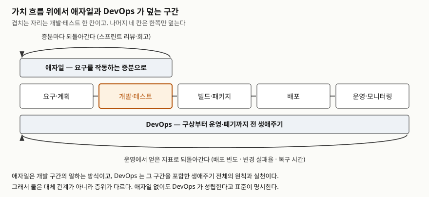

> **실행 검증 없음.** 이 글은 표준 문서와 원 선언문의 공개 본문을 근거로 정리한 개념
> 글이다. 실행 예제가 없고, 도입 효과나 성능 향상 같은 수치는 원 출처를 확인하지 못해
> 싣지 않았다.

## 들어가며

"우리는 애자일로 일한다"는 조직에서 배포는 분기에 한 번 일어나는 일이 흔하다. 2주짜리
스프린트가 정확히 돌고 회고도 빠짐없이 하는데, 만들어진 증분은 릴리스 창구 앞에 쌓여
기다린다. 반대로 하루에 수십 번 배포하면서 요구사항은 여전히 한 번에 확정해 받는
조직도 있다.

**두 경우 모두 이상한 상태가 아니다.** 애자일과 DevOps가 가치 흐름에서 덮는 구간이
다르기 때문이다. 시험에서 이 둘의 관계를 물을 때 "DevOps는 애자일의 확장"으로 한 줄
쓰고 넘어가면 배점의 대부분이 날아간다. 확장이 아니라 **층위가 다르다.**

## 정의

두 개념은 근거 문서의 성격부터 다르다. 이 비대칭 자체가 답안의 첫 줄이 된다.

- **애자일(Agile)** — 2001년 17명이 서명한 **애자일 선언문(Manifesto for Agile Software
  Development)**이 근거다. 표준이 아니라 **가치 선언**이며, 인증 기관도 적합성 기준도 없다.
  선언문은 **4개 가치**와 **12개 원칙**으로 이뤄진다.
- **DevOps** — **ISO/IEC/IEEE 32675:2022**(IEEE Std 2675-2021을 패스트트랙으로 채택)
  §3.1이 정의한다. 옮기면 이렇다.

  > **DevOps는 관련 이해관계자 사이의 의사소통과 협업을 개선해, 소프트웨어·시스템 제품과
  > 서비스를 명세·개발·운영하고 생애주기의 모든 측면을 지속적으로 개선하게 하는
  > 원칙과 실천의 집합이다.**

정의에 "명세·개발·운영"과 "생애주기의 모든 측면"이 함께 들어간 것이 핵심이다.
**개발과 운영을 붙인 도구 묶음이 아니라 생애주기 전체를 대상으로 하는 원칙 집합**으로
정의돼 있다. 표준은 같은 조항에서 지속적 통합·인도·배포를 별도 용어로 따로 정의해,
그것들이 DevOps 자체가 아니라 DevOps가 쓰는 실천임을 구분한다.

## 등장 배경

애자일은 1990년대 중량 프로세스에 대한 반작용으로 나왔다. 문서와 계획을 먼저 완성하고
그대로 만드는 방식이 요구 변화를 흡수하지 못한다는 문제의식이다.

DevOps의 배경은 다른 자리에 있다. 32675 §5.1은 **빌드·패키지·배포를 완전 자동화하는
도구가 먼저 갖춰졌는데 IT 조직이 그 도구를 효과적으로 쓸 준비가 돼 있지 않았다**는
인식에서 용어가 나왔다고 적는다. 표준은 개발자와 운영자의 관점 차이를 "개발은 속도,
운영은 신뢰성과 보안"으로 단순화해 서술하고, DevOps를 그 둘 사이의 **균형을 찾는 것**으로
놓는다. 즉 애자일이 "요구 변화"를 문제로 잡았다면, DevOps는 **"속도와 안정성의 상충"**을
문제로 잡았다.

## 구성요소

### 애자일 — 가치 4 · 원칙 12

선언문의 4개 가치는 모두 "A보다 B"의 형태다. 오른쪽 항목에 가치가 없다는 뜻이 아니라
**왼쪽에 더 둔다**는 뜻이라고 선언문이 직접 밝힌다. 답안에서 이 단서를 빠뜨리면
"문서를 만들지 않는다"는 오독으로 읽힌다.

가장 널리 쓰이는 구현 프레임워크인 스크럼은 **2020년판 스크럼 가이드** 기준으로
**책임 3 · 이벤트 5 · 산출물 3 · 확약 3**으로 구성된다. 확약(제품 목표·스프린트 목표·
완료의 정의)은 2020년판에서 산출물마다 붙은 항목이다.

### DevOps — 원칙 4 · 문화 5 · 프로세스군 4

32675 §5.2가 **DevOps 원칙 4가지**를 든다.

1. **비즈니스·미션 우선** — 절차와 기술보다 조직 목표를 앞에 둔다
2. **고객 중심**
3. **좌측 이동과 지속적 모든 것** — 품질보증·테스트·위험관리를 설계·개발과 같은 시점에 수행
4. **시스템 사고** — 전문 분야별로 갈린 시각 대신 시스템을 끝에서 끝까지 본다

§5.3은 조직 문화를 **5개 항목**으로 나눈다. 리더십 / 조직 구조와 역학 / 효과적
의사소통과 협업 / 학습 조직과 지식 관리 / 적응·복원력·조직 변화다. **원칙 절반이
조직에 관한 것**이라는 점이 답안에서 쓸모가 있다.

§6은 DevOps를 **ISO/IEC/IEEE 12207:2017과 15288:2015의 생애주기 프로세스**에 대응시키며,
프로세스군 **4개**(합의 / 조직 프로젝트 지원 / 기술 관리 / 기술)를 모두 다룬다.
다만 12207은 2017년판이 폐지되고 **12207:2026**으로 바뀌었다. 32675가 가리키는 것은
2017년판이므로, 답안에서 두 문서를 같이 인용할 때는 판번호를 각각 밝힌다.

## 도식

> **출처**: DevOps가 덮는 구간은
> [ISO/IEC/IEEE 32675:2022 §1.1 Scope](https://www.iso.org/standard/83670.html)
> 가 대상 생애주기를 "conception, development, production, utilization, support, and
> retirement"로 적고, 같은 문서 §5.4가 DevOps를 각 단계에 동등한 비중을 두는
> 전 생애주기 활동이라고 적은 것을 따랐다. 애자일이 덮는 구간은
> [애자일 선언문 원칙](https://agilemanifesto.org/iso/ko/principles.html)
> 제1·제3항이 "작동하는 소프트웨어를 자주 인도"하는 데까지를 말하는 것을 따랐다.
> 아래쪽 되돌림에 적은 지표 세 가지는
> [DORA — DORA's software delivery metrics](https://dora.dev/guides/dora-metrics-four-keys/)
> 의 이름을 옮긴 것이다.

## 비교

| 구분 | 애자일 | DevOps |
|---|---|---|
| 근거 문서 | 애자일 선언문 (2001) | ISO/IEC/IEEE 32675:2022 |
| 문서 성격 | 가치 선언, 적합성 기준 없음 | 국제표준, 적합성 조항 보유 |
| 덮는 구간 | 요구 → 작동하는 증분 | 구상 → 개발 → 운영 → 폐기 |
| 풀려는 문제 | 요구 변화를 흡수하지 못함 | 속도와 안정성·보안의 상충 |
| 되돌림 주기 | 스프린트 단위 (리뷰·회고) | 운영 지표 단위 (배포마다) |
| 주 대상 | 팀의 일하는 방식 | 생애주기 프로세스와 조직 문화 |
| 대표 실천 | 반복 개발, 백로그, 회고 | CI/CD, 코드형 인프라, 좌측 이동 |

**겹치는 자리는 개발·테스트 한 칸이다.** 나머지는 한쪽만 덮는다. 요구 도출과 백로그 관리는
애자일 쪽이 두텁고, 빌드·배포·운영·모니터링은 DevOps 쪽이 두텁다.

성공을 재는 지표도 다르다. 애자일은 증분이 실제로 작동하는지를 보고, DevOps는 소프트웨어
인도 성능을 지표로 잰다. DORA가 정리한 지표는 처음 알려진 4개에서 **5개**로 늘었고
**이름도 바뀌었다.** 변경 리드 타임 · 배포 빈도 · 실패 배포 복구 시간 · 변경 실패율 ·
배포 재작업률이다. 옛 이름(예: 서비스 복구 시간)을 그대로 쓰면 최신 자료와 어긋난다.

## 적용 시 고려사항

1. **애자일을 도입했다고 DevOps가 따라오지 않는다.** 스프린트가 2주인데 릴리스 창구가
   분기에 한 번이면 가치 흐름의 뒤쪽은 그대로다. 증분이 쌓이는 자리만 옮긴 것이다.
   개선 대상을 정할 때는 흐름의 **어느 칸에서 대기가 생기는지**를 먼저 본다.
2. **DevOps는 애자일을 전제로 하지 않는다.** 32675 §5.4는 DevOps가 대부분의 생애주기
   모델에 적용 가능하고 애자일 방법론을 쓸 때 특히 적합하지만, **반복적 워터폴 방식에서도
   그만큼 가치가 있다**고 명시한다. "애자일이 아니면 DevOps를 못 한다"는 답안은 틀린다.
3. **조직을 바꾸지 않으면 자동화 도구만 남는다.** 표준이 조직 문화에 다섯 개 항목을
   할애한 이유다. 파이프라인을 깔아 놓고 승인 단계와 부서 경계를 그대로 두면 배포 빈도는
   늘지 않는다.
4. **규제 환경의 직무 분리를 근거로 판단한다.** 표준은 같은 사람이 여러 프로세스를 수행할
   수 있다고 하면서도 **법적·규제적 제약 안에서**라는 단서를 단다. 금융·의료처럼 직무 분리가
   법으로 요구되는 환경에서는 자동화된 승인 기록과 감사 증적으로 통제를 대체 설계한다.
5. **지표를 먼저 정하고 도입한다.** 배포 빈도만 올리고 변경 실패율을 보지 않으면 속도와
   안정성 중 한쪽만 재는 것이 된다. 처리량 지표와 불안정성 지표를 짝으로 본다.

## 정리

암기 단서는 **"가치 4 · 원칙 12 · DevOps 원칙 4 · 문화 5 · 지표 5"** 다섯 숫자다.

- 애자일은 **선언문(2001)** 근거의 가치 체계, DevOps는 **국제표준(2022)** 근거의 원칙·실천
  집합이다. 근거 문서의 성격이 다르다는 것을 첫 줄에 쓴다
- 애자일 선언문은 **가치 4개 · 원칙 12개**, 스크럼은 **책임 3 · 이벤트 5 · 산출물 3 · 확약 3**
- DevOps는 **원칙 4개**(비즈니스 우선 · 고객 중심 · 좌측 이동과 지속적 모든 것 · 시스템 사고),
  **조직 문화 5개 항목**, 생애주기 **프로세스군 4개**를 다룬다
- 둘은 대체 관계가 아니다. 겹치는 자리는 **개발·테스트 한 칸**이고 나머지 네 칸은 한쪽만 덮는다
- **애자일 없이도 DevOps가 성립한다**고 표준이 직접 적는다. 반복적 워터폴에서도 유효하다
- DORA 지표는 **5개**이고 이름이 갱신됐다. 옛 이름으로 쓰면 최신 자료와 어긋난다

## 참고 자료

- [ISO/IEC/IEEE 32675:2022 — Information technology — DevOps](https://www.iso.org/standard/83670.html) — DevOps 정의(§3.1), 원칙(§5.2), 조직 문화(§5.3), 생애주기 프로세스와의 관계(§5.4, §6)
- [IEEE SA — IEEE Std 2675-2021](https://standards.ieee.org/ieee/2675/6830/) — 32675가 패스트트랙으로 채택한 원 표준
- [애자일 선언문 (Manifesto for Agile Software Development, 2001)](https://agilemanifesto.org/iso/ko/manifesto.html) — 4개 가치와 서명자 17인
- [애자일 선언문 — 12개 원칙](https://agilemanifesto.org/iso/ko/principles.html) — 인도 주기와 작동하는 소프트웨어에 관한 원칙
- [Scrum Guide 2020 (scrumguides.org)](https://scrumguides.org/scrum-guide.html) — 책임 3 · 이벤트 5 · 산출물 3 · 확약 3
- [DORA — DORA's software delivery metrics](https://dora.dev/guides/dora-metrics-four-keys/) — 처리량·불안정성 지표 5개의 현행 명칭과 정의
- [ISO/IEC/IEEE 12207:2017 — Software life cycle processes](https://www.iso.org/standard/63712.html) — 32675 §6이 DevOps를 대응시킨 프로세스 체계. 현재 폐지되고 12207:2026으로 대체됐다
