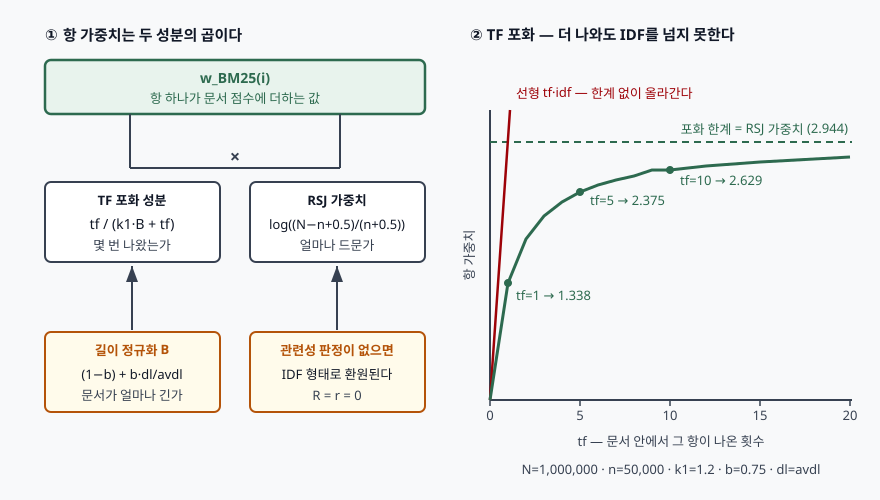

## 들어가며

검색 기능을 붙일 때 대부분 색인 엔진의 기본 점수 함수를 그대로 쓴다. 그 기본값이
BM25이고, `k1 = 1.2`, `b = 0.75`라는 두 숫자가 어디선가 딸려 온다. 문제는 검색 결과가
이상할 때 생긴다. 긴 문서만 위로 올라오거나, 한 단어를 스무 번 반복한 문서가 1위가
되거나 한다. **그 두 숫자가 각각 무엇을 누르는 손잡이인지 모르면 어느 쪽을 돌려야
하는지 고를 수 없다.** BM25는 경험적으로 얻은 공식이 아니라 확률 모형에서 내려온
함수이고, 두 매개변수도 모형의 특정 가정에 각각 대응한다.

## 정의

**BM25는 확률 순위 원리(PRP)에 기반한 확률적 적합성 프레임워크(PRF)에서 유도된 순위
함수로, 질의어별 항 가중치를 문서 내 출현 빈도의 포화 함수와 항의 희소성 가중치의 곱으로
정하고 이를 질의어 전체에 대해 합산해 문서 점수를 매긴다.**

기반이 되는 확률 순위 원리는 **적합 확률의 내림차순 정렬이 주어진 데이터로 낼 수 있는
최선**이라고 말한다. 검색 시스템은 문서가 실제로 적합한지 알 수 없고 확률적 근거만
가지므로, 할 수 있는 최선은 그 확률로 줄을 세우는 것이라는 뜻이다. BM25는 이 원리를
실제로 계산 가능한 식까지 내린 결과물이고, 1994년 TREC-3에 제출된 Okapi 시스템에서
처음 쓰였다.

## 등장 배경

BM25 이전의 확률 모형은 **이진 독립 모형(BIM)**이었다. 항이 문서에 있는지 없는지만
보고, 항마다 로버트슨–스팍 존스(RSJ) 가중치를 매겨 합산한다. 관련성 판정이 없을 때
이 가중치는 IDF 형태로 환원된다.

```text
w_IDF(i) = log( (N - n_i + 0.5) / (n_i + 0.5) )
```

**빠진 것이 문서 내 출현 빈도(tf)였다.** 그렇다고 tf를 그대로 곱하는 전통적 `tf·idf`도
답이 아니었다. 같은 단어가 두 번 나온 문서가 한 번 나온 문서보다 정확히 두 배 적합하다는
근거가 없기 때문이다.

빈틈을 메운 것이 **엘리트성(eliteness)** 개념이다. 문서–항 쌍마다 "이 문서가 그 개념을
다루고 있는가"라는 숨은 이진 속성이 있다고 두고, 실제 출현 빈도는 그 속성에서 나온다고
본다. 엘리트 문서와 비엘리트 문서의 출현 빈도를 각각 푸아송 분포로 두면 말뭉치 전체는
**2-푸아송 혼합 분포**가 된다. 이 가정에서 항 가중치를 풀면 세 가지 성질이 나온다.

1. tf가 0이면 가중치도 0이다
2. tf가 커지면 가중치도 단조 증가한다
3. 그러나 **tf가 무한대로 가면 어떤 상한에 점근한다**

세 번째가 핵심이다. tf에서 얻을 수 있는 정보의 최대치는 "이 문서는 엘리트다"라는 사실
하나뿐이고, 그 사실이 가질 가중치는 RSJ 가중치 그 자체다. 2-푸아송 식은 다루기 번거로워
실제로 쓰이지 않았고, 대신 그 모양에 맞는 간단한 함수 `tf / (k + tf)`를 끼워 넣은 것이
BM25다.

## 구성요소 — 항 가중치 3성분과 매개변수 2개

BM25 항 가중치는 성분 셋으로 이루어진다.

| 성분 | 식 | 하는 일 |
|---|---|---|
| RSJ 가중치 | `log((N − n_i + 0.5) / (n_i + 0.5))` | 그 항이 얼마나 드문가. 판정이 없으면 IDF로 환원 |
| TF 포화 | `tf′ / (k1 + tf′)` | 몇 번 나왔는가. 상한이 있다 |
| 길이 정규화 | `B = (1 − b) + b·dl/avdl` | 문서가 평균보다 긴가 짧은가. `tf′ = tf / B` |

셋을 합친 것이 BM25의 항 가중치 식이다.

```text
                       tf
w_BM25(i) = ─────────────────────────── × w_RSJ(i)
            k1·((1−b) + b·dl/avdl) + tf
```

문서 점수는 이 값을 **질의어 전체에 대해 합산**해 얻는다.

### 매개변수 2개

- **k1** — TF 포화 속도. 작을수록 빨리 포화한다. `k1 = 0`이면 tf가 1이든 100이든 같은
  값이 되어 사실상 불리언 검색이 된다
- **b** — 길이 정규화 강도. `0 ≤ b ≤ 1`이고, `b = 1`이면 문서 길이로 완전히 나누고,
  `b = 0`이면 정규화를 끈다

`b`가 왜 0과 1 사이의 값이어야 하는지에도 근거가 있다. 문서가 평균보다 긴 이유를 원
논문은 둘로 나눈다. **장황함(verbosity)** — 같은 내용을 더 많은 단어로 쓴 경우. 이때는
길이로 나누는 것이 맞다. **범위(scope)** — 더 많은 내용을 담은 경우. 이때는 나누면
안 된다. 실제 말뭉치에는 둘이 섞여 있으므로 **부분적으로만 나눈다**는 것이 `b`의 뜻이다.

원 논문은 모형이 두 값을 정해 주지 않는다는 점을 모형의 한계로 인정하면서, 실험으로
**`1.2 < k1 < 2`, `0.5 < b < 0.8`** 범위가 대체로 무난하다고 적는다. Lucene의 기본값
`k1 = 1.2`, `b = 0.75`가 이 범위 안에 있다.

## 도식



> **출처**: [Stephen Robertson, Hugo Zaragoza, *The Probabilistic Relevance Framework: BM25 and Beyond*, Foundations and Trends in Information Retrieval 3(4), 2009 — 3.4.2절 Saturation, 식 (3.3)·(3.12)·(3.15)](https://www.nowpublishers.com/article/Details/INR-019) — 성분 분해와 점근 상한의 근거는 이 절과 식이고, 곡선에 찍힌 값은 같은 식으로 직접 계산한 [`code/output.txt`](code/output.txt)에서 가져왔다.

## 검산 — 세 가지 성질을 직접 계산한다

원 논문의 식을 그대로 옮겨 계산했다. 전체 소스는 [`code/`](code/)에 있다.

포화부터 본다. 말뭉치 100만 건에 문서 빈도가 각각 1천·5만·40만인 항 셋을 놓았다.

```text
   tf         희소어         보통어         흔한어     선형 tf*idf
    1      3.1392      1.3384      0.1843           2.9
    5      5.5696      2.3745      0.3270          14.7
   20      6.5153      2.7778      0.3825          58.9
10000      6.9054      2.9441      0.4054       29444.3

포화 한계 w_IDF (tf → ∞ 일 때의 극한):
  희소어(n_i=  1,000)  6.9063
  보통어(n_i= 50,000)  2.9444
  흔한어(n_i=400,000)  0.4055
```

tf를 1에서 10,000으로 올려도 가중치는 각 항의 RSJ 가중치를 **넘지 못한다.** 같은 조건에서
선형 `tf·idf`는 29,444까지 올라간다. 키워드를 반복해 채운 문서가 검색 상위를 잠식하는
문제가 여기서 갈린다.

`k1`을 바꾸면 포화까지 가는 속도가 달라진다. 괄호 안은 포화 한계 대비 비율이다.

```text
   tf            k1=0.0            k1=0.5            k1=1.2            k1=2.0           k1=10.0
    1    2.9444( 100%)    1.9630(  67%)    1.3384(  45%)    0.9815(  33%)    0.2677(   9%)
    5    2.9444( 100%)    2.6768(  91%)    2.3745(  81%)    2.1032(  71%)    0.9815(  33%)
   30    2.9444( 100%)    2.8962(  98%)    2.8312(  96%)    2.7604(  94%)    2.2083(  75%)
```

`k1 = 0` 열은 tf와 무관하게 값이 같다. 출현 여부만 보는 상태, 곧 이진 독립 모형으로
돌아간 것이다. `k1`을 키울수록 tf가 점수에 오래 반영된다.

`b`는 문서 길이를 얼마나 반영할지를 정한다. tf를 5로 고정하고 문서 길이만 바꾼 결과다.

```text
     dl   dl/avdl       b=0.0       b=0.3      b=0.75       b=1.0
     30      0.10      2.3745      2.5055      2.7314      2.8754
    300      1.00      2.3745      2.3745      2.3745      2.3745
   3000     10.00      2.3745      1.5595      1.0295      0.8660
```

평균 길이(`dl = avdl = 300`) 행에서는 `b` 값과 무관하게 모두 같다. `B = 1`이 되기
때문이다. 평균에서 멀어질수록 `b`가 클수록 차이가 벌어진다. `b = 0` 열은 길이를 아예
보지 않는다.

## 비교

### BM25와 전통적 tf·idf

| 구분 | 전통적 tf·idf | BM25 |
|---|---|---|
| TF 성분 | `tf` 또는 `1 + log tf` | `tf′ / (k1 + tf′)` |
| tf → ∞ | 발산한다 | RSJ 가중치에 점근한다 |
| 길이 처리 | 코사인 정규화 등 별도 기법 | 식 안에 `b`로 내장 |
| 근거 | 경험적 가중치 설계 | 2-푸아송 엘리트성 모형에서 유도 |
| 조정 지점 | 정규화 기법 선택 | `k1`, `b` 두 값 |

`1 + log tf`도 곡선 모양은 비슷하지만 **점근 상한이 없다.** tf가 늘면 느리더라도 계속
올라간다. 원 논문이 짚는 차이가 이 지점이다.

### 어휘 검색과 의미 검색

| 구분 | BM25 (어휘) | 임베딩 근접도 (의미) |
|---|---|---|
| 일치 기준 | 용어의 표면형 일치 | 벡터 공간의 근접도 |
| 점수 범위 | 상한 없음. 질의 길이에 따라 크기가 변함 | 정해진 범위 안 |
| 잘 하는 것 | 드문 고유명사·식별자·오류 코드 | 표현이 다른 같은 뜻 |
| 못 하는 것 | 어휘 불일치 | 정확 일치가 필요한 질의 |

두 점수의 **범위가 다르다**는 것이 오른쪽 열의 두 번째 줄이다. 하이브리드 검색에서
두 점수를 그냥 더할 수 없고 순위 기반 융합이나 정규화 후 결합을 쓰는 이유가 여기 있다.

## 적용 시 고려사항

1. **기본값을 근거 없이 최적으로 취급하지 않는다.** 원 논문 자신이 "모형은 이 값들을
   어떻게 정할지 알려주지 않는다"고 적고, 실험으로 얻은 범위만 제시한다. 로그 문서처럼
   짧고 균일한 말뭉치와 매뉴얼처럼 길이 편차가 큰 말뭉치에서 적절한 `b`는 다르다.
   적합성 판정 집합을 만들어 조정할 수 없다면, 적어도 **기본값이 조정의 결과가 아니라
   출발점임을 알고 쓴다.**
2. **`n_i`가 말뭉치의 절반을 넘으면 RSJ 가중치가 음수가 된다.** 계산해 보면
   `n_i = 500,000`(N = 1,000,000)에서 정확히 0이 되고 그 위에서 부호가 뒤집힌다.
   그 항을 가진 문서가 오히려 점수를 잃는다는 뜻이라, 구현마다 여기를 따로 막는다.
   Lucene은 `log(1 + (N − n + 0.5)/(n + 0.5))` 형태를 써서 로그 안의 값이 항상 1보다
   크게 만든다. **원 식과 구현 식이 다르다는 것을 모르면 손계산과 엔진 출력이 어긋난다.**
3. **길이 정의를 무엇으로 잡았는지 확인한다.** 원 논문은 `dl`을 항 빈도의 합으로
   정의하지만, 정규화가 평균 대비 비율로만 쓰이므로 문자 수든 단어 수든 결과가 크게
   다르지 않다고 적는다. 다만 **같은 색인 안에서 정의가 섞이면** `dl/avdl`이 뜻을 잃는다.
   필드마다 성격이 다르면 필드별로 `b`를 따로 두는 BM25F 쪽이 맞다.
4. **어휘 불일치는 BM25로 풀리지 않는다.** 표면형이 겹치지 않으면 점수는 0이다.
   동의어 사전, 질의 확장, 의미 검색과의 결합은 모두 이 한계를 메우는 방향이고,
   `k1`·`b`를 아무리 돌려도 여기서 나아지지 않는다.

## 정리

암기 단서는 **"성분 3 · 매개변수 2 · 상한 1"**이다.

- 성분 **3개** — RSJ(희소성) × TF 포화(빈도) ÷ 길이 정규화(`B`)
- 매개변수 **2개** — `k1`은 포화 속도, `b`는 길이 반영 강도.
  권장 범위는 `1.2 < k1 < 2`, `0.5 < b < 0.8`
- 상한 **1개** — tf가 무한대로 가도 항 가중치는 **RSJ 가중치**를 넘지 못한다.
  전통적 `tf·idf`와 갈리는 지점이 여기다
- 근거는 **확률 순위 원리 → 이진 독립 모형 → 2-푸아송 엘리트성 모형 → BM25** 순으로 내려온다
- `b`가 0과 1 사이인 이유는 문서가 긴 이유가 **장황함과 범위** 둘이 섞인 것이기 때문이다

> 기출 답안: [기출문제 — 어휘 검색과 의미 검색을 결합한 하이브리드 검색](../../exam/2026-09-22-hybrid-search-lexical-vector/index.md)

## 참고 자료

- [Stephen Robertson, Hugo Zaragoza, *The Probabilistic Relevance Framework: BM25 and Beyond*, Foundations and Trends in Information Retrieval 3(4), 2009](https://www.nowpublishers.com/article/Details/INR-019) — 확률 순위 원리, 이진 독립 모형, 엘리트성과 2-푸아송, BM25 식과 매개변수 권장 범위
- [같은 문헌의 저자 공개본 (PDF)](https://www.staff.city.ac.uk/~sbrp622/papers/foundations_bm25_review.pdf) — 2.3절 PRP, 3.1절 BIM, 3.4절 엘리트성과 BM25, 3.5절 매개변수
- [S. E. Robertson, K. Sparck Jones, *Relevance weighting of search terms*, Journal of the American Society for Information Science 27(3), 1976](https://asistdl.onlinelibrary.wiley.com/doi/abs/10.1002/asi.4630270302) — RSJ 가중치의 원 논문
- [S. E. Robertson, *The Probability Ranking Principle in IR*, Journal of Documentation 33(4), pp. 294–304, 1977](https://www.emerald.com/insight/content/doi/10.1108/eb026647/full/html) — 확률 순위 원리의 원 논문
- [S. E. Robertson 외, *Okapi at TREC-3*, TREC-3 (1994), NIST Special Publication 500-225](https://www.microsoft.com/en-us/research/wp-content/uploads/2016/02/okapi_trec3.pdf) — BM25가 처음 쓰인 시스템 보고서
- [Apache Lucene 10.3.1 — BM25Similarity](https://lucene.apache.org/core/10_3_1/core/org/apache/lucene/search/similarities/BM25Similarity.html) — 기본값 `k1 = 1.2`, `b = 0.75`, IDF 구현식 `log(1 + (docCount − docFreq + 0.5)/(docFreq + 0.5))`
